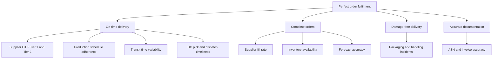
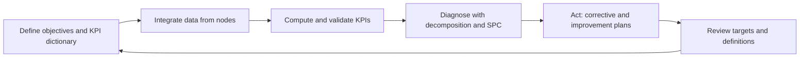

## Key Performance Indicators Across the Network


### Overview

Network KPIs measure how well the end-to-end supply network performs across tiers, echelons, and owners, not just how one plant, warehouse, or supplier performs. In a multi-tier structure (Tier N → Tier 2 → Tier 1 → manufacturer → logistics and distribution → customer), each node reports its own local measures, but the customer experiences only the composed result. Network KPI design therefore has to solve four problems together:

- **Definition**: every node calculates the same KPI the same way.
- **Composition**: local results roll up into end-to-end results.
- **Alignment**: targets cascade without creating local optimisation.
- **Data**: multi-owner data arrives on time, with known quality.

**Key Points**

- Use a small, balanced set that covers service, speed, resilience, cost, cash, profit, and sustainability.
- Define each KPI in a data dictionary with formula, grain, time basis, exclusions, owner, and source.
- Track leading indicators (drivers) alongside lagging outcomes.
- End-to-end reliability is usually lower than any single node's reliability because stage results multiply.
- Tie KPIs to decisions and governance (S&OP or IBP, supplier reviews, sourcing decisions), otherwise they become reports.

### Design Foundations

| Concept | Meaning | Example |
| --- | --- | --- |
| Measure | A raw quantity | Number of late shipments |
| Metric | A calculated ratio or value | Late shipments ÷ total shipments |
| KPI | A metric tied to a strategic objective with a target and owner | On-time-in-full rate against a 95% target |
| Lagging indicator | Reports an outcome after it happens | Perfect order rate |
| Leading indicator | Signals likely future performance | Supplier lead-time variability, forecast bias |
| Node KPI | Controlled by one party | Pick accuracy at a distribution centre |
| Network KPI | Depends on several parties | End-to-end order cycle time |

**Design principles**

1. **Strategic alignment**: choose KPIs from the supply chain strategy (for example, responsiveness-led vs cost-led).
2. **Balance**: pair opposing metrics (service with inventory, cost with quality) so no one dimension is optimised alone.
3. **Controllability**: the owner should be able to influence the KPI.
4. **Comparability**: identical definitions, calendars, units, and tolerance windows across nodes.
5. **Timeliness**: refresh at the speed of the decision (daily for exceptions, monthly for strategy).
6. **Parsimony**: focus on the vital few at each level and keep diagnostics below.
7. **Auditability**: every number can be traced to source transactions.

Goodhart's law is a standard warning here: once a measure becomes a target, people tend to optimise the measure rather than the outcome. Counter it with paired KPIs, audits of data, and periodic definition reviews.

### Reference Frameworks

#### SCOR Digital Standard

The SCOR Digital Standard (SCOR DS) organises performance measurement into attributes, with metrics at three levels.

- The 2025 edition codes eight performance attributes: Reliability (RL), Responsiveness (RS), Agility (AG), Profit (PR), Cost (CO), Assets (AM), Environmental (EV), and Social (SC). [Ascm](https://www.ascm.org/globalassets/ascm_website_assets/docs/scor/intro-and-front-matter-scor-digital-standard-2025.pdf)
- Reliability, responsiveness, and agility are treated as customer-focused (resilience) attributes, cost, profit, and assets as internally focused (economic) attributes, and environmental and social as outward-focused (sustainability) attributes. [Ascm](https://www.ascm.org/globalassets/ascm_website_assets/docs/scor/intro-and-front-matter-scor-digital-standard-2025.pdf)
- SCOR DS extended the attributes from five in SCOR 12 to eight, adding Profit, Environmental, and Social. [ResearchGate](https://www.researchgate.net/publication/400983464_A_critical_review_of_the_SCOR_Digital_Standard_SCOR-DS_conceptual_implications_for_supply_chain_performance_measurement)
- Level-1 metrics are strategic, and level-2 and level-3 metrics act as diagnostics that explain gaps or improvements in the level above, a practice called metric decomposition. [Ascm](https://www.ascm.org/globalassets/ascm_website_assets/docs/scor/intro-and-front-matter-scor-digital-standard-2025.pdf)
- There are more than 250 SCOR DS metrics across three levels. [shopify](https://www.shopify.com/blog/scor-model-supply-chain)
- The 2022 release added an Orchestrate process alongside resilience, economic, and sustainability metrics. [PR Newswire](https://www.prnewswire.com/news-releases/ascm-releases-new-scor-digital-standard-301626710.html)
- ASCM offers a SCORmark benchmark evaluation to compare performance against industry standards for higher-tier corporate members. [Ascm](https://www.ascm.org/corporate-solutions/standards-tools/scor-ds/)
- Example codes from the SCOR DS front matter: Cost of Goods Sold (CO.1.2), Inventory Days of Supply (AM.2.2), and Capacity Utilization (AM.3.9), with agility metrics such as Adaptability and Overall Value at Risk. Verify identifiers against the current release before hard-coding them. [Ascm](https://www.ascm.org/globalassets/ascm_website_assets/docs/intro-and-front-matter-scor-digital-standard.pdf)

#### Perfect Order

APQC calculates perfect order performance as the product of on-time delivery, complete orders, damage-free delivery, and accurate documentation percentages, multiplied by 100. This multiplicative form is why one weak component drags the overall rate down. [APQC](https://www.apqc.org/resources/benchmarking/open-standards-benchmarking/measures/perfect-order-performance)

#### Other Frameworks

- **Balanced scorecard**: financial, customer, internal process, and learning perspectives, adapted to supply chain by adding service, cost, and risk views.
- **Process classification and benchmarking frameworks** such as APQC's Open Standards Benchmarking, which collects data using standard survey instruments tied to a Process Classification Framework. [APQC](https://www.apqc.org/resources/benchmarking/assessment-survey/supply-chain-planning-benchmarking-assessment)
- **Sector or customer programs** (for example automotive supplier ratings). [Inference: these tend to define their own formulas, so mapping to SCOR-style definitions is usually needed.]

### KPI Taxonomy

The following catalogue groups KPIs by SCOR-style attribute. Formulas are simplified reference definitions and should be adapted in a data dictionary.

#### Reliability

| KPI | Definition | Type |
| --- | --- | --- |
| Perfect order fulfilment | On-time % × complete % × damage-free % × accurate documentation % | Lagging, network |
| OTIF | Orders (or lines) delivered in full within the agreed delivery window ÷ total orders (or lines) | Lagging |
| Fill rate | Quantity shipped from stock ÷ quantity ordered | Lagging |
| Supplier OTIF | Receipts on time and in full ÷ scheduled receipts | Lagging, tier-level |
| Forecast accuracy (WMAPE) | Sum of absolute errors ÷ sum of actuals | Leading |
| Forecast bias | Sum of (forecast − actual) ÷ sum of actuals | Leading |
| Quality | Defects per million, first-pass yield, return rate | Lagging |
| Data accuracy | Advance ship notice and invoice match rate | Leading |

#### Responsiveness

| KPI | Definition | Type |
| --- | --- | --- |
| Order fulfilment cycle time | Order placement to customer receipt | Lagging, network |
| Supplier lead time and variability | Mean and standard deviation of order-to-receipt time | Leading |
| Source, make, deliver cycle time | Stage-level elapsed time | Diagnostic |
| Order confirmation time | Order receipt to supplier confirmation | Leading |
| Schedule adherence | Produced or shipped to plan ÷ planned | Leading |

#### Agility and Resilience

| KPI | Definition | Type |
| --- | --- | --- |
| Upside flexibility | Time or ratio to raise output by a set percentage | Capability |
| Time-to-recover (TTR) and time-to-survive (TTS) | Recovery time of a node vs time demand can be served without it | Capability |
| Single-source share | Spend or items with only one qualified source ÷ total | Structural |
| Supplier concentration | $HHI = \sum_i s_i^2$, with $s_i$ the supplier share | Structural |
| Value at risk | Estimated loss exposure from disruption scenarios | Risk |
| Mean time to detect disruption | Event occurrence to internal awareness | Leading |

#### Cost

| KPI | Definition |
| --- | --- |
| Total supply chain cost | Planning, sourcing, making, delivery, returns, and management costs ÷ revenue |
| Cost to serve | Fully loaded cost of serving a customer, channel, or product |
| Landed cost | Purchase price plus freight, duty, insurance, handling |
| Cost of goods sold | Direct material, labour, and production overhead |
| Freight cost per unit | Transport cost ÷ units (or tonne-km) |
| Cost of poor quality | Scrap, rework, returns, warranty |

#### Assets and Cash

| KPI | Definition |
| --- | --- |
| Cash-to-cash cycle time | DIO + DSO − DPO |
| Inventory days of supply | Inventory ÷ average daily demand or COGS |
| Inventory turns | COGS ÷ average inventory |
| Capacity utilisation | Actual output ÷ available capacity |
| Return on working capital / fixed assets | Contribution ÷ capital employed |
| Excess and obsolete stock | Stock beyond demand horizon ÷ total stock |

#### Profit

Gross margin, contribution margin, and EBITDA effect of supply chain decisions, viewed by product, channel, or customer.

#### Sustainability and Compliance

| KPI | Definition |
| --- | --- |
| Scope 3 supplier emissions intensity | tCO2e per unit of revenue or product |
| Supplier data coverage | Share of spend with primary emissions data |
| Risk-weighted audit or assurance coverage | Share of high-risk suppliers with valid, in-scope assurance |
| Findings closure rate | Corrective actions closed on time ÷ opened |
| Traceability coverage | Volume traced to Tier N or origin ÷ total volume |
| Water, waste, recycled content | Intensity per unit |

#### Network Visibility and Data

| KPI | Definition |
| --- | --- |
| Tier-N visibility | Share of critical spend or parts mapped to Tier N |
| Data completeness | Required fields populated ÷ required fields |
| Data latency | Event time to availability in the shared platform |
| Integration rate | Partners connected by EDI or API ÷ total partners |

### Core Formulas

**End-to-end reliability**

If stage $k$ delivers reliably with probability $r_k$, and stages are independent, end-to-end reliability is:

$$R_{e2e} = \prod_{k=1}^{K} r_k$$

[Inference: real stages are rarely independent, so this is a first-order estimate.]

**Cash-to-cash**

$$C2C = DIO + DSO - DPO$$


$$DIO = \frac{Inventory}{COGS} \times 365, \quad DSO = \frac{Receivables}{Revenue} \times 365, \quad DPO = \frac{Payables}{COGS} \times 365$$

**Forecast error and bias**

$$WMAPE = \frac{\sum_t |A_t - F_t|}{\sum_t A_t}, \qquad Bias = \frac{\sum_t (F_t - A_t)}{\sum_t A_t}$$

**Bullwhip effect**

For a stage, the order-variance amplification ratio is:

$$BWE = \frac{Var(Orders)}{Var(Demand)}$$

A value above 1 indicates amplification. Compute it stage by stage to see where variability grows.

**Safety stock with demand and lead-time variability**

$$SS = z\sqrt{L\,\sigma_d^2 + d^2\,\sigma_L^2}$$

where $z$ is the service-level factor, $L$ the mean lead time, $\sigma_d$ the daily demand standard deviation, $d$ the mean daily demand, and $\sigma_L$ the lead-time standard deviation.

**Example**

With $z = 1.65$, $L = 9$ days, $d = 100$ units per day, $\sigma_d = 12$, and $\sigma_L = 2$ days:

$$SS = 1.65\sqrt{9 \times 144 + 10000 \times 4} = 1.65\sqrt{41296} \approx 335 \text{ units}$$

If the supplier cuts lead-time variability to $\sigma_L = 1$ day:

$$SS = 1.65\sqrt{1296 + 10000} = 1.65\sqrt{11296} \approx 175 \text{ units}$$

Safety stock falls by about 48%, which shows why supplier lead-time variability is a high-leverage network KPI.

**Control limits for a proportion KPI (p-chart)**

For an on-time rate with average $\bar{p}$ and subgroup size $n$:

$$UCL, LCL = \bar{p} \pm 3\sqrt{\frac{\bar{p}(1-\bar{p})}{n}}$$

**Example**

With $\bar{p} = 0.94$ and $n = 400$ shipments per week, the limits are $0.94 \pm 0.0356$, so roughly 90.4% to 97.6%. A week at 90.0% signals a special cause worth investigating rather than normal variation.

### Cascading KPIs Across Tiers

(svg_diagram) KPI Cascade Across Tiers

<svg xmlns="http://www.w3.org/2000/svg" viewBox="0 0 760 410" width="760" height="410" font-family="sans-serif" font-size="12">
<title>KPI Cascade Across Tiers (svg_diagram)</title>
<rect width="760" height="410" fill="#ffffff" />
<text x="380" y="24" text-anchor="middle" font-weight="bold" font-size="15">KPI Cascade Across Tiers (svg_diagram)</text>
<rect x="40" y="44" width="680" height="44" rx="6" fill="#dbeafe" stroke="#1e40af" />
<text x="380" y="71" text-anchor="middle">Network KPIs: perfect order, cash-to-cash, cost to serve, resilience, emissions intensity</text>
<line x1="110" y1="88" x2="110" y2="140" stroke="#64748b" stroke-dasharray="4 3" marker-end="url(#arr3)" />
<line x1="290" y1="88" x2="290" y2="140" stroke="#64748b" stroke-dasharray="4 3" marker-end="url(#arr3)" />
<line x1="470" y1="88" x2="470" y2="140" stroke="#64748b" stroke-dasharray="4 3" marker-end="url(#arr3)" />
<line x1="650" y1="88" x2="650" y2="140" stroke="#64748b" stroke-dasharray="4 3" marker-end="url(#arr3)" />
<rect x="40" y="140" width="140" height="44" rx="6" fill="#fee2e2" stroke="#991b1b" />
<text x="110" y="167" text-anchor="middle">Tier 2 suppliers</text>
<rect x="220" y="140" width="140" height="44" rx="6" fill="#ffedd5" stroke="#9a3412" />
<text x="290" y="167" text-anchor="middle">Tier 1 suppliers</text>
<rect x="400" y="140" width="140" height="44" rx="6" fill="#dcfce7" stroke="#166534" />
<text x="470" y="167" text-anchor="middle">Logistics and DC</text>
<rect x="580" y="140" width="140" height="44" rx="6" fill="#fef9c3" stroke="#854d0e" />
<text x="650" y="167" text-anchor="middle">Customers</text>
<line x1="180" y1="162" x2="220" y2="162" stroke="#334155" stroke-width="2" marker-end="url(#arr3)" />
<line x1="360" y1="162" x2="400" y2="162" stroke="#334155" stroke-width="2" marker-end="url(#arr3)" />
<line x1="540" y1="162" x2="580" y2="162" stroke="#334155" stroke-width="2" marker-end="url(#arr3)" />
<text x="110" y="214" text-anchor="middle" font-size="11">OTIF to Tier 1</text>
<text x="110" y="232" text-anchor="middle" font-size="11">Defect ppm</text>
<text x="110" y="250" text-anchor="middle" font-size="11">Lead-time variability</text>
<text x="110" y="268" text-anchor="middle" font-size="11">Capacity utilization</text>
<text x="290" y="214" text-anchor="middle" font-size="11">Supplier OTIF</text>
<text x="290" y="232" text-anchor="middle" font-size="11">Schedule adherence</text>
<text x="290" y="250" text-anchor="middle" font-size="11">Cost per unit</text>
<text x="290" y="268" text-anchor="middle" font-size="11">Sub-tier visibility %</text>
<text x="470" y="214" text-anchor="middle" font-size="11">Dock-to-stock time</text>
<text x="470" y="232" text-anchor="middle" font-size="11">Pick accuracy</text>
<text x="470" y="250" text-anchor="middle" font-size="11">Damage-free rate</text>
<text x="470" y="268" text-anchor="middle" font-size="11">Transit time variance</text>
<text x="650" y="214" text-anchor="middle" font-size="11">Fill rate</text>
<text x="650" y="232" text-anchor="middle" font-size="11">Order cycle time</text>
<text x="650" y="250" text-anchor="middle" font-size="11">Forecast bias</text>
<text x="650" y="268" text-anchor="middle" font-size="11">Return rate</text>
<rect x="40" y="304" width="680" height="44" rx="6" fill="#ede9fe" stroke="#5b21b6" />
<text x="380" y="331" text-anchor="middle">Data layer: shared definitions, EDI/API feeds, control tower, data quality rules</text>
<text x="380" y="378" text-anchor="middle" fill="#475569">Node KPIs roll up into network KPIs; network targets cascade back down [Inference]</text>
</svg>

**Decomposition of a network KPI**



This mirrors SCOR-style diagnostics: strategic metrics decompose into lower-level metrics that explain where performance is won or lost.

### Tier-Specific KPI Sets

| Node | Primary KPIs | Typical purpose |
| --- | --- | --- |
| Brand owner / OEM | Perfect order, cash-to-cash, cost to serve, forecast accuracy, resilience index, Scope 3 intensity | Network outcomes and strategy |
| Tier 1 supplier | OTIF, schedule adherence, quality ppm, lead-time variability, price and cost trends, sub-tier visibility | Supplier performance and collaboration |
| Tier 2 and deeper | Capacity utilisation, defect rate, lead-time variability, single-site dependency, compliance evidence | Early-warning and risk |
| Logistics and 3PL | Transit time and variance, damage-free rate, dock-to-stock time, freight cost per unit, carbon per tonne-km | Delivery and cost |
| Distribution and retail | Fill rate, on-shelf availability, inventory days of supply, shrinkage, returns rate | Demand-side service |
| Reverse logistics | Return cycle time, recovery value, refurbish yield, landfill diversion | Circularity and cost recovery |

[Inference: exact KPI choices depend on industry, product, and channel, so treat this as a starting set.]

### Cross-Tier Effects and Trade-offs

- **Reliability compounds downwards**: 95%, 97%, 98%, and 99% at four stages yields about 89.4% end to end, lower than any single stage.
- **Bullwhip amplification**: order variability tends to grow moving upstream, so upstream tiers can see far more volatility than end demand. Track the amplification ratio per tier.
- **Working capital shifting**: raising the buyer's DPO improves its cash-to-cash but pushes financing cost and risk onto suppliers. Track supplier financial health and payment terms alongside C2C.
- **Service versus inventory**: higher fill rates typically raise inventory. Report them together, as SCOR's balanced attribute structure suggests.
- **Cost versus resilience**: lowest landed cost sourcing can raise concentration and long-lead-time exposure. Pair cost KPIs with concentration and TTR/TTS measures.
- **Speed versus quality**: cycle-time targets can encourage cutting inspection. Pair them with quality and returns.
- **Local optimisation**: a node improving its own KPI (for example, a lower per-unit freight cost by full-truck consolidation) can lengthen network lead time. Evaluate network effects before setting local targets.

### Worked Calculation

**Example**

```python
import statistics as st

def perfect_order(otd, complete, damage_free, docs):
    return otd * complete * damage_free * docs * 100

def end_to_end(rates):
    p = 1.0
    for r in rates.values():
        p *= r
    return p

def cash_to_cash(inv, cogs, ar, rev, ap):
    dio = inv / cogs * 365
    dso = ar / rev * 365
    dpo = ap / cogs * 365
    return dio + dso - dpo

def bullwhip(orders, demand):
    return st.variance(orders) / st.variance(demand)

def wmape_bias(actual, forecast):
    total = sum(actual)
    wmape = sum(abs(a - f) for a, f in zip(actual, forecast)) / total
    bias = sum(f - a for a, f in zip(actual, forecast)) / total
    return wmape, bias

po = perfect_order(0.96, 0.98, 0.995, 0.97)
e2e = end_to_end({"Tier 2": 0.95, "Tier 1": 0.97, "Logistics": 0.98, "DC": 0.99})
c2c = cash_to_cash(inv=150, cogs=900, ar=140, rev=1200, ap=130)
bwe = bullwhip([98, 105, 97, 103, 96, 106, 98, 104],
               [100, 104, 98, 101, 97, 103, 99, 102])
wmape, bias = wmape_bias([100, 120, 80, 110], [110, 100, 90, 115])

print(f"Perfect order: {po:.2f}%")
print(f"End-to-end OTIF: {e2e:.2%}")
print(f"Cash-to-cash: {c2c:.1f} days")
print(f"Bullwhip ratio: {bwe:.2f}")
print(f"WMAPE={wmape:.2%} bias={bias:+.2%}")
```

**Output** (illustrative; exact formatting depends on the runtime)

```plaintext
Perfect order: 90.80%
End-to-end OTIF: 89.40%
Cash-to-cash: 50.7 days
Bullwhip ratio: 2.69
WMAPE=10.98% bias=+1.22%
```

**Key Points**

- The perfect order rate (90.80%) is lower than each of its components because they multiply.
- Four healthy-looking stages still deliver only 89.40% end to end.
- The bullwhip ratio of 2.69 means orders vary about 2.7 times as much as demand at this stage.
- A small positive forecast bias (+1.22%) coexists with a 10.98% weighted error, so accuracy and bias tell different stories.

### KPI Definition and Data Governance

Inconsistent definitions are a leading cause of network KPI disputes. Common ambiguities include:

- Measuring OTIF against the customer's requested date vs the supplier's confirmed date.
- Counting a line as on time if it arrives early.
- Treating partial deliveries and split shipments.
- Time zones, working calendars, and cut-off times.
- Excluding force majeure or customer-caused delays.

A data dictionary entry removes ambiguity:

```yaml
kpi_id: REL-OTIF-01
name: Supplier On-Time-In-Full
definition: Purchase order lines received within the delivery window and at or above ordered quantity
formula: lines_otif / lines_scheduled
grain: purchase_order_line
time_basis: requested_delivery_date, local calendar of receiving site
window: -1 day early, 0 days late
quantity_tolerance: -0%, +5%
exclusions:
  - lines cancelled by buyer
  - lines delayed by buyer-approved change
source_systems: [ERP_PO, WMS_RECEIPTS, SUPPLIER_PORTAL]
owner: Head of Procurement Operations
refresh: daily
disaggregation: [supplier, tier, site, material_group, country]
targets: {green: ">= 95%", amber: "90-95%", red: "< 90%"}
data_quality_rules: [receipt_date_not_null, uom_converted_to_base_unit]
version: 3
```

**Governance essentials**

- One accountable owner per KPI and per data source.
- Version control on definitions, with change logs and restatement rules.
- Data-sharing agreements with partners covering fields, frequency, and permitted use.
- Validation checks (completeness, timeliness, plausibility) with data quality scores.
- Independent testing for KPIs used in incentives or external reporting.

### Analytics on Network KPIs

- **Decomposition**: move from a network KPI to its drivers using the hierarchy above. SCOR treats lower-level metrics as diagnostics for higher-level ones. [Ascm](https://www.ascm.org/globalassets/ascm_website_assets/docs/scor/intro-and-front-matter-scor-digital-standard-2025.pdf)
- **Segmentation**: analyse by product class (ABC by value, XYZ by demand variability), supplier tier, lane, region, and customer.
- **Statistical process control**: use control charts to separate noise from real change, as in the p-chart above.
- **Pareto analysis**: identify the few suppliers, lanes, or SKUs that cause most failures.
- **Lead-lag analysis**: test whether leading indicators (lead-time variability, forecast bias) predict later service failures.
- **Network heat maps**: show KPI values by node and tier to reveal hotspots and hidden dependencies.
- **Benchmarking**: compare against peers and top performers. An older APQC publication reported top-performing organisations at a cash-to-cash cycle time of 30 days versus 80 days for bottom performers. [Unverified: figures are from a 2020 article and vary by industry and year, so use current benchmark data.] APQC's Open Standards Benchmarking covers areas such as cash-to-cash cycle time, procurement cost, and inventory accuracy. [APQC](https://www.apqc.org/blog/4-key-measures-and-tips-improve-your-supply-chain-planning)[APQC](https://www.apqc.org/resource-library/resource-collection/supply-chain-management-key-benchmarks)
- **Targets**: use percentile-based targets from benchmarks, glide paths for multi-year goals, and stretch and floor thresholds.

### Example Network Scorecard

| KPI | Target | Actual | Status |
| --- | --- | --- | --- |
| Perfect order fulfilment | 92.0% | 90.8% | Amber |
| End-to-end OTIF (Tier 2 to customer) | 90.0% | 89.4% | Amber |
| Order fulfilment cycle time | 6.0 days | 6.4 days | Red |
| Cash-to-cash cycle time | 55 days | 50.7 days | Green |
| Forecast bias | within ±2% | +1.2% | Green |
| Tier 1 lead-time standard deviation | ≤ 2.0 days | 2.6 days | Red |
| Critical-spend visibility to Tier 2 | 80% | 62% | Red |
| Supplier emissions data coverage | 70% | 68% | Amber |

Status rule used here: Green means the target is met or beaten. Amber means up to 5% worse than target (relative). Red means more than 5% worse.

### Implementation Roadmap



1. **Clarify strategy and segments**: decide which products and customers need speed, cost, or resilience emphasis.
2. **Select the KPI set**: a vital few per level, balanced across attributes.
3. **Write definitions**: data dictionary with owners, formulas, and exclusions.
4. **Map data sources**: ERP, WMS, TMS, supplier portals, EDI and API feeds, control tower.
5. **Baseline and benchmark**: measure current performance and compare with peers.
6. **Set and cascade targets**: network targets first, then node targets that add up.
7. **Embed in governance**: S&OP or IBP reviews, supplier business reviews, sourcing decisions.
8. **Automate alerts**: thresholds and exception routing to owners.
9. **Improve and refresh**: root-cause projects, annual KPI and definition review.

### Pitfalls and Best Practices

**Pitfalls**

- Too many KPIs, so nothing gets managed.
- Different OTIF definitions across nodes, causing disputes and mistrust.
- Incentives on single KPIs that encourage gaming or local optimisation.
- Measuring only Tier 1 and assuming deeper tiers behave similarly.
- Treating averages as sufficient and ignoring variability.
- Reporting lagging KPIs only, so problems appear after customers are affected.
- No data quality controls, so scorecards reflect data errors.
- Setting supplier targets without agreeing on data access, support, or fair terms.

**Best practices**

- Pair opposing KPIs (service with inventory, cost with quality and risk).
- Monitor variability (standard deviation, percentiles) as well as means.
- Report composed end-to-end KPIs alongside node KPIs.
- Share KPI definitions and dashboards with suppliers to enable joint improvement.
- Include resilience and sustainability KPIs in the standard scorecard rather than as side reports.
- Review KPI relevance and definitions at least annually.
- Use KPI results to trigger actions such as supplier development, network redesign, or sourcing changes.

**Conclusion**

Network KPIs work when definitions are consistent, data is trustworthy, and results are composed from node to end-to-end levels. SCOR DS gives a widely used structure of eight attributes, hierarchical metrics, and diagnostic decomposition. Perfect order, cash-to-cash, cost to serve, resilience, and sustainability KPIs together give a balanced view. The main analytical insights are that reliability multiplies across tiers, that variability drives inventory, and that variability amplifies upstream. Framework details, benchmark values, and metric identifiers change over time, so confirm them against current standards and datasets before adopting them.

**Related Topics**

- Supplier scorecards and performance management programs
- SCOR DS process model and metric decomposition
- Sales and operations planning (S&OP, IBP) governance
- Bullwhip effect measurement and mitigation
- Working capital, supply chain finance, and payment terms
- Supply chain control towers and real-time visibility analytics
- Inventory optimisation and service-level segmentation
- Resilience metrics (time-to-recover, time-to-survive, value at risk)
- Scope 3 emissions accounting and supplier data collection
- Benchmarking methodologies and maturity models