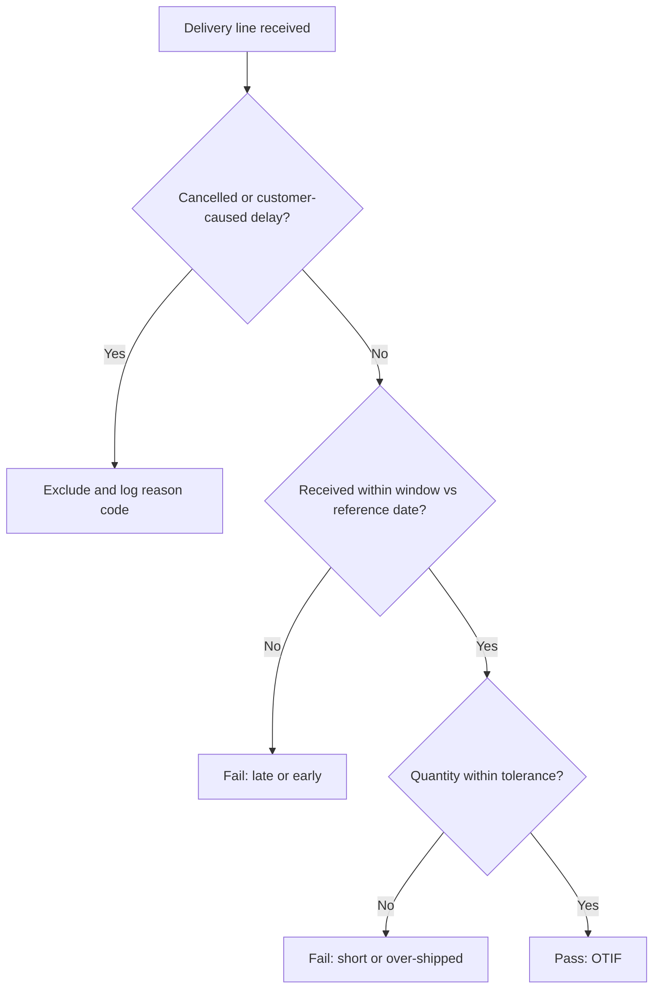
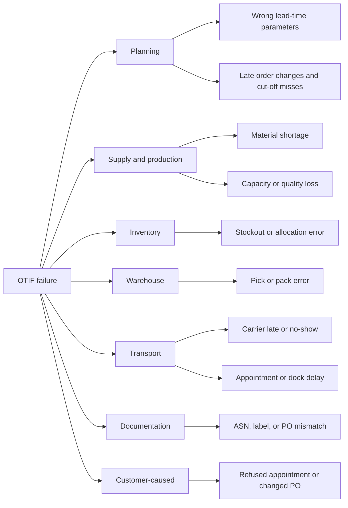

## On-Time-In-Full (OTIF) and Service Level Metrics


### Overview

On-Time-In-Full (OTIF) measures the share of orders, lines, or cases that arrive within the agreed delivery window and in the agreed quantity. Service level metrics are the wider family that includes fill rate, cycle service level, backorder rate, and perfect order. Together they describe how reliably a supplier, warehouse, or network keeps its delivery promise. They are the most visible reliability KPIs in a tiered supply chain: each tier's performance affects the tier above it, and the customer experiences the composed result.

OTIF looks simple, but its value depends almost entirely on how "on time" and "in full" are defined. Two organisations can report very different OTIF figures for identical shipments.

**Key Points**

- OTIF is a joint measure: a delivery fails if it is late, early beyond tolerance, short, or over-shipped.
- The reference date (customer request, supplier promise, or appointment), measurement point, tolerance, and aggregation level must be specified in a data dictionary.
- OTIF, fill rate, and cycle service level answer different questions and are not interchangeable.
- Small samples produce wide confidence intervals, so small OTIF differences are often noise.
- Retailer OTIF programs are commercial contracts with their own definitions and penalties, which change over time.
- Improving OTIF means fixing promise-date accuracy, inventory, capacity, transport, and documentation, not only "shipping faster".

### Metric Family and Terminology

| Metric | Definition | Question it answers |
| --- | --- | --- |
| OTIF | Deliveries that are both on time and in full ÷ total deliveries | Did the customer get what it asked for, when it asked? |
| On-time delivery (OTD) | Deliveries within the delivery window ÷ total deliveries | Was timing met? |
| In-full rate | Deliveries within the quantity tolerance ÷ total deliveries | Was quantity met? |
| DIFOT | Delivery in full, on time; a regional name for OTIF | Same as OTIF |
| Fill rate (unit) | Units shipped (capped at ordered) ÷ units ordered | How much demand was met? |
| Line fill rate | Lines fully shipped ÷ lines ordered | How many lines were complete? |
| Order fill rate | Orders fully shipped ÷ orders | How many orders were complete? |
| Perfect order | On time × complete × damage-free × accurate documentation | Was the whole order experience flawless? |
| Cycle service level (Type 1) | Probability of no stockout during a replenishment cycle | How often will a cycle end without a stockout? |
| Fill rate (Type 2) | Fraction of demand satisfied from stock | How much demand is served from stock? |
| Backorder / stockout rate | Orders or units not served from stock ÷ total | How often is service interrupted? |
| Request-to-promise gap | Promised date minus customer requested date | How well does the promise match the need? |

APQC calculates perfect order performance as the product of on-time delivery, complete orders, damage-free delivery, and accurate documentation rates, multiplied by 100.

Names vary by industry and region (OTIF, DIFOT, OTD, OTIF error-free), so always confirm the formula behind a label.

### Defining "On Time" and "In Full"

Most disputes about OTIF come from unstated definitional choices.

| Design choice | Options | Effect on the reported number |
| --- | --- | --- |
| Reference date | Customer requested date, supplier's original promise, revised promise, retailer appointment | Measuring against the requested date is stricter than against a promise that was moved later |
| Delivery window | Exact day, or early and late tolerances (for example 1 day early, 0 days late) | Wider windows raise OTIF; early deliveries may still count as failures |
| Time basis | Ship date, dock arrival, check-in, unload complete, system receipt | Later timestamps add dwell and receiving delays |
| Responsibility point | Ready for pickup (collect) vs delivered to the site (prepaid) | Changes who owns transit risk |
| Quantity tolerance | Exact match, or a band such as −2% to +5% | Tolerance decides whether small shorts and overs count |
| Aggregation level | Case, unit, line, order, shipment | Order-level is far stricter than unit-level |
| Exclusions | Customer-caused delays, force majeure, cancelled lines, agreed partials | Exclusions can raise or mask OTIF, so need rules and reason codes |
| Substitutions | Approved substitute counts as in full or not | Affects retail and e-commerce flows |
| Calendar and time zone | Working calendars, cut-offs, local time zone | Cross-border data gets misaligned without rules |

**Line classification flow**



(svg_diagram) OTIF Evaluation Bands

<svg xmlns="http://www.w3.org/2000/svg" viewBox="0 0 720 330" width="720" height="330" font-family="sans-serif" font-size="12">
<title>OTIF Evaluation Bands (svg_diagram)</title>
<rect width="720" height="330" fill="#ffffff" />
<text x="360" y="24" text-anchor="middle" font-weight="bold" font-size="15">OTIF Evaluation Bands (svg_diagram)</text>
<text x="40" y="54" font-weight="bold">On time: delivery date vs promised date (example window: 1 day early to on the day)</text>
<rect x="60" y="70" width="210" height="40" fill="#fee2e2" stroke="#991b1b" />
<rect x="270" y="70" width="90" height="40" fill="#dcfce7" stroke="#166534" />
<rect x="360" y="70" width="300" height="40" fill="#fee2e2" stroke="#991b1b" />
<text x="165" y="95" text-anchor="middle">Too early</text>
<text x="315" y="95" text-anchor="middle">On time</text>
<text x="510" y="95" text-anchor="middle">Late</text>
<line x1="90" y1="110" x2="90" y2="118" stroke="#334155" />
<line x1="180" y1="110" x2="180" y2="118" stroke="#334155" />
<line x1="270" y1="110" x2="270" y2="118" stroke="#334155" />
<line x1="360" y1="110" x2="360" y2="118" stroke="#334155" />
<line x1="450" y1="110" x2="450" y2="118" stroke="#334155" />
<line x1="540" y1="110" x2="540" y2="118" stroke="#334155" />
<line x1="630" y1="110" x2="630" y2="118" stroke="#334155" />
<text x="90" y="134" text-anchor="middle">-3</text>
<text x="180" y="134" text-anchor="middle">-2</text>
<text x="270" y="134" text-anchor="middle">-1</text>
<text x="360" y="134" text-anchor="middle">0</text>
<text x="450" y="134" text-anchor="middle">+1</text>
<text x="540" y="134" text-anchor="middle">+2</text>
<text x="630" y="134" text-anchor="middle">+3</text>
<circle cx="450" cy="90" r="6" fill="#1e40af" />
<text x="450" y="156" text-anchor="middle" fill="#1e40af">Delivered +1 day: late</text>
<text x="40" y="190" font-weight="bold">In full: shipped quantity as % of ordered (example band 98% to 105%)</text>
<rect x="60" y="206" width="246" height="40" fill="#fee2e2" stroke="#991b1b" />
<rect x="306" y="206" width="189" height="40" fill="#dcfce7" stroke="#166534" />
<rect x="495" y="206" width="165" height="40" fill="#fee2e2" stroke="#991b1b" />
<text x="183" y="231" text-anchor="middle">Short</text>
<text x="400" y="231" text-anchor="middle">In full</text>
<text x="577" y="231" text-anchor="middle">Over</text>
<text x="90" y="266" text-anchor="middle">90%</text>
<text x="225" y="266" text-anchor="middle">95%</text>
<text x="360" y="266" text-anchor="middle">100%</text>
<text x="495" y="266" text-anchor="middle">105%</text>
<text x="630" y="266" text-anchor="middle">110%</text>
<circle cx="252" cy="226" r="6" fill="#1e40af" />
<text x="252" y="288" text-anchor="middle" fill="#1e40af">96% shipped: short</text>
<text x="360" y="316" text-anchor="middle" fill="#475569">Both conditions must hold for a line to count as OTIF; bands are contract-specific [Inference]</text>
</svg>

### Calculation Methods

**Joint measure**

With $OT$ the on-time rate and $IF$ the in-full rate, OTIF is the probability that both hold on the same delivery:

$$OTIF = P(\text{on time} \cap \text{in full})$$

You cannot recover OTIF from the two rates alone. Fréchet bounds give the possible range:

$$\max(0,\ OT + IF - 1) \le OTIF \le \min(OT,\ IF)$$

**Example**

With $OT = 95\%$ and $IF = 96\%$, OTIF lies between 91% and 95%. If the two failures were independent, OTIF would be about $0.95 \times 0.96 = 91.2\%$. In practice late and short deliveries often occur together (for example when production runs late and ships partial), so real OTIF is often above the independent estimate. [Inference]

**Aggregation**

- **Unit of count**: case, unit, line, order, or shipment. Coarser units are stricter.
- **Weighting**: simple average of orders vs value-weighted or volume-weighted averages give different answers.
- **Roll-ups**: combine numerators and denominators across nodes, rather than averaging percentages, to avoid distortions when volumes differ.
- **Time window**: report both period results and a rolling window, and state the date basis (ship date or promise date).

**Confidence in the number**

OTIF is a proportion measured on a sample of deliveries. A Wilson score interval for observed proportion $\hat{p}$ on $n$ deliveries at confidence multiplier $z$ is:

$$\frac{\hat{p} + \frac{z^2}{2n} \pm z\sqrt{\frac{\hat{p}(1-\hat{p})}{n} + \frac{z^2}{4n^2}}}{1 + \frac{z^2}{n}}$$

**Example**

For 184 OTIF orders out of 200 ($\hat{p} = 92\%$, $z = 1.96$), the 95% interval is roughly 87.4% to 95.0%. With that sample, a 92% result cannot be statistically distinguished from a 95% target.

### Worked Calculation: Definition Sensitivity

**Example**

```python
from dataclasses import dataclass

@dataclass
class Line:
    order: str
    ordered: int
    shipped: int
    requested: int   # day number
    promised: int
    delivered: int

lines = [
    Line("O1", 100, 100, 10, 10, 10),
    Line("O1",  50,  50, 10, 10, 10),
    Line("O2", 200, 197, 12, 12, 12),
    Line("O2",  80,  80, 12, 12, 13),
    Line("O3", 120, 120, 14, 15, 15),
    Line("O3",  60,  66, 14, 15, 15),
    Line("O4",  90,  90, 16, 16, 15),
    Line("O4",  40,  30, 16, 16, 16),
]

def on_time(l, ref="promised", early=0, late=0):
    delta = l.delivered - getattr(l, ref)
    return -early <= delta <= late

def in_full(l, under=0.0, over=0.0):
    return (1 - under) * l.ordered <= l.shipped <= (1 + over) * l.ordered

def line_otif(ls, ref, early, late, under, over):
    ok = [on_time(l, ref, early, late) and in_full(l, under, over) for l in ls]
    return sum(ok) / len(ls)

def order_otif(ls, ref, early, late, under, over):
    orders = {}
    for l in ls:
        ok = on_time(l, ref, early, late) and in_full(l, under, over)
        orders[l.order] = orders.get(l.order, True) and ok
    return sum(orders.values()) / len(orders)

def fill_rate(ls):
    return sum(min(l.shipped, l.ordered) for l in ls) / sum(l.ordered for l in ls)

rows = [
    ("Line OTIF, strict", line_otif(lines, "promised", 0, 0, 0.0, 0.0)),
    ("Line OTIF, tolerant (promised)", line_otif(lines, "promised", 1, 0, 0.02, 0.05)),
    ("Line OTIF, tolerant (requested)", line_otif(lines, "requested", 1, 0, 0.02, 0.05)),
    ("Order OTIF, tolerant (promised)", order_otif(lines, "promised", 1, 0, 0.02, 0.05)),
    ("Unit fill rate", fill_rate(lines)),
]
for label, value in rows:
    print(f"{label}: {value:.1%}")
```

**Output** (illustrative; exact formatting depends on the runtime)

```plaintext
Line OTIF, strict: 37.5%
Line OTIF, tolerant (promised): 62.5%
Line OTIF, tolerant (requested): 50.0%
Order OTIF, tolerant (promised): 25.0%
Unit fill rate: 98.2%
```

**Key Points**

- The same eight lines yield anything from 25% to 98% depending on definition.
- Tolerances lift OTIF from 37.5% to 62.5%.
- Measuring against the customer's requested date rather than the supplier's promise lowers the result to 50.0%, because promises can hide a gap between what the customer wanted and what was agreed.
- Order-level OTIF (25.0%) is much stricter than line-level because one bad line fails the whole order.
- A high unit fill rate (98.2%) can coexist with poor OTIF, so never treat them as substitutes.

### Inventory Service Levels: Cycle Service Level vs Fill Rate

Inventory planning uses two service level concepts that behave very differently.

**Cycle service level (Type 1)** is the probability of no stockout in a replenishment cycle:

$$CSL = P(D_L \le ROP) = \Phi(z), \qquad ROP = \mu_L + z\,\sigma_L$$

where $D_L$ is demand over the lead time, $\mu_L$ its mean, $\sigma_L$ its standard deviation, and $\Phi$ the standard normal cumulative distribution.

**Fill rate (Type 2)** is the fraction of demand served from stock. With order quantity $Q$ and standard normal loss function $\mathcal{L}(z) = \varphi(z) - z\,(1 - \Phi(z))$:

$$ESC = \sigma_L\,\mathcal{L}(z), \qquad FR = 1 - \frac{ESC}{Q}$$

where $ESC$ is expected shortage per cycle.

**Example**

```python
import math

def phi(z):
    return math.exp(-z * z / 2) / math.sqrt(2 * math.pi)

def Phi(z):
    return 0.5 * (1 + math.erf(z / math.sqrt(2)))

def loss(z):
    return phi(z) - z * (1 - Phi(z))

z, sigma_L, Q = 1.65, 60, 500
csl = Phi(z)
esc = sigma_L * loss(z)
fr = 1 - esc / Q
print(f"Cycle service level: {csl:.2%}")
print(f"Expected shortage per cycle: {esc:.2f} units")
print(f"Fill rate: {fr:.2%}")
```

**Output** (illustrative)

```plaintext
Cycle service level: 95.05%
Expected shortage per cycle: 1.24 units
Fill rate: 99.75%
```

A 95% cycle service level corresponds to a fill rate of about 99.75% here. Quoting a single "service level" without saying which type it is can lead to large planning errors.

### Setting Service Level Targets

- **Segment by value and behaviour**: differentiate targets by product class (ABC by value, XYZ by demand variability), customer tier, and channel, rather than one target for everyone.
- **Use marginal economics**: the newsvendor critical ratio gives the cost-optimal cycle service level:

$$CR = \frac{C_u}{C_u + C_o}$$

where $C_u$ is the cost of a unit of underage (lost margin, penalties) and $C_o$ the cost of a unit of overage (holding, obsolescence).

**Example**

With $C_u = 8$ and $C_o = 2$, $CR = 0.8$, so the target cycle service level is 80% (about $z = 0.84$) for that item.

- **Expect diminishing returns**: safety stock scales with $z$. Moving from a 95% cycle service level ($z = 1.645$) to 99% ($z = 2.326$) raises safety stock by about 41%, so the last percentage points are expensive.
- **Contract targets**: customer and retailer thresholds are commercial terms, so set internal targets with a buffer above the contractual threshold. [Inference]

### Retailer OTIF Programs and Commercial Context

Retailer OTIF programs are supplier compliance schemes with their own definitions, thresholds, and penalties. The following reflects third-party summaries. Confirm current terms with each retailer's published guide, since they change and sources differ.

- Walmart tracks results at the case level. Published thresholds are cited as 98% collect ready, 90% on-time for prepaid suppliers, and 95% in-full, and missing them can trigger a 3% penalty on the cost of goods for non-compliant cases. Some summaries quote a single 98% overall figure instead, so definitions should be confirmed. [Inymbus](https://blog.inymbus.com/walmart-otif-performance-metrics)
- Must Arrive By Date windows are reported as one day for perishables and two days for general goods, and early deliveries are treated as non-compliant because distribution centres plan dock capacity tightly. [Daserv](https://www.daserv.com/walmart-vendor-compliance-guide/)
- First-time suppliers reportedly receive a three-month grace period. [Daserv](https://www.daserv.com/walmart-vendor-compliance-guide/)
- OTIF data reportedly lags real activity by one to two weeks, with fines posting weeks after month end. Another summary says fines are assessed quarterly, so timing is reported inconsistently. [ShipCalm](https://www.shipcalm.com/blog/walmart-vendor-compliance-guide/)
- Walmart usually does not charge both on-time and in-full fines for the same cases. [RetailPath](https://retailpath.xyz/articles/walmart-otif-fines)
- Target is reported to use On Time Fill Rate, and Kroger uses Original Requested Arrival Date. This shows how the reference date differs between retailers. [Vendormint](https://vendormint.com/blog/walmart-on-time-in-full-otif-compliance)
- Invalid fines can be disputed through the retailer's dispute portal. [Vendormint](https://vendormint.com/blog/walmart-on-time-in-full-otif-compliance)
- In EU agri-food, the Unfair Trading Practices Directive bans 16 trading practices and has applied since 2022, and adoption of a revised directive is scheduled for the fourth quarter of 2026. [Inference: how penalty clauses interact with such rules depends on national law and contract terms, so check the jurisdiction.] [Agrinfo](https://agrinfo.eu/book-of-reports/unfair-trading-practices-utp-directive/pdf/)[Agrinfo](https://agrinfo.eu/book-of-reports/review-of-unfair-trading-practices-utp-directive/pdf/)

**Financial exposure**

$$Penalty = r \times \sum COGS_{non\text{-}compliant}$$

**Example**

A supplier ships USD 20 million of COGS per year to a retailer with a 3% rate, and 8% of the value is non-compliant: $0.08 \times 20{,}000{,}000 = 1{,}600{,}000$ of affected cost, giving $0.03 \times 1{,}600{,}000 = 48{,}000$ USD in penalties, before the indirect costs of scorecard damage, reduced orders, and dispute handling.

### Root Causes and Improvement Levers



**Illustrative reason-code Pareto**

| Reason | Share of failures | Cumulative |
| --- | --- | --- |
| Late production or supply | 28% | 28% |
| Carrier late or no-show | 22% | 50% |
| Short pick or stockout | 20% | 70% |
| Order change or cut-off miss | 12% | 82% |
| Documentation or ASN error | 10% | 92% |
| Customer-caused | 8% | 100% |

**Improvement levers**

1. **Promise-date accuracy**: calibrate lead-time parameters using actual performance (for example a high percentile rather than the mean), and use available-to-promise or capable-to-promise logic.
2. **Inventory and safety stock**: size buffers to demand and lead-time variability, and allocate scarce stock by priority rules.
3. **Capacity and scheduling**: protect capacity for committed orders and use frozen windows to limit late changes.
4. **Warehouse execution**: cut-off discipline, pick accuracy controls, and load verification.
5. **Transport management**: carrier scorecards, appointment scheduling, and dock and yard management.
6. **Data and documentation**: ASN, label, and PO matching checks before shipping.
7. **Exception management**: control tower alerts for at-risk orders so they can be expedited or renegotiated before failing.
8. **Collaboration**: agree windows, forecast sharing, and change rules with customers and suppliers.
9. **Predictive OTIF**: model failure risk from supplier history, order changes, and lead-time variance to flag orders early. [Inference: model quality depends on data and must be monitored.]

### Measurement Architecture

**Minimum data elements**

| Field | Purpose |
| --- | --- |
| Order and line identifiers | Grain of measurement |
| Ordered quantity and unit of measure | In-full test, with unit conversion |
| Requested date, original promise, revised promise history | Reference date choices and promise-gap analysis |
| Ship date, ASN reference, carrier | Transit and documentation checks |
| Appointment window and check-in and receipt timestamps | On-time test at the agreed measurement point |
| Received quantity | In-full test |
| Site time zone and calendar | Date alignment |
| Reason codes and exclusion flags | Root-cause analysis and auditable exclusions |
| Incoterm or responsibility point | Collect vs delivered measurement |

**Example query (PostgreSQL-style; syntax varies by database)**

```sql
SELECT
    supplier_id,
    COUNT(*) AS lines,
    SUM(CASE
          WHEN receipt_date BETWEEN promised_date - INTERVAL '1 day' AND promised_date
           AND received_qty BETWEEN 0.98 * ordered_qty AND 1.05 * ordered_qty
          THEN 1 ELSE 0 END) * 1.0 / COUNT(*) AS otif_rate
FROM po_line_receipts
WHERE promised_date >= DATE '2026-07-01'
  AND promised_date <  DATE '2026-08-01'
  AND line_status <> 'CANCELLED'
GROUP BY supplier_id;
```

**Data quality controls**

- Reject or flag receipts with missing timestamps or unit-of-measure mismatches.
- Freeze the promised date at order confirmation and store changes as history, so revisions cannot rewrite performance.
- Reconcile with carrier and warehouse events, and audit exclusions regularly.
- Version the definition and restate history when it changes.

### Network and Tier Considerations

- **Three OTIF layers**: inbound (supplier to plant or DC), internal (plant to DC), and outbound (DC to customer). Each needs its own measurement, and they should be linked by order.
- **Composition across tiers**: if stage OTIF rates are $r_k$ and roughly independent, end-to-end OTIF is about $\prod r_k$, so four stages at 95%, 97%, 98%, and 99% give about 89.4%. [Inference: independence is a first-order assumption.]
- **Upstream visibility**: Tier 1 OTIF hides Tier 2 and Tier 3 problems, so track supplier lead-time variability and sub-tier risk as leading indicators.
- **Promise vs request**: track the request-to-promise gap alongside OTIF, so suppliers cannot achieve high OTIF simply by promising later dates.
- **Shared definitions**: publish definitions to suppliers and customers, and align windows and reference dates in contracts.
- **Balanced targets**: pair OTIF with inventory and cost KPIs so improvements do not come only from excess stock. [Inference]

### Reporting and Governance

- **Cadence**: daily exception views for at-risk orders, weekly operational reviews, monthly business reviews with suppliers and customers.
- **Cuts**: by supplier, tier, customer, lane, site, product class, and reason code.
- **Status thresholds**: define green, amber, and red rules, and use control charts to separate noise from real change.
- **Uncertainty**: show sample sizes and confidence intervals, especially for small suppliers or low-volume lanes.
- **Ownership**: one accountable owner per KPI and per data source, with a documented dispute process for penalties and scorecards.
- **Incentives**: check that OTIF-linked incentives cannot be met by gaming (for example padding promise dates or splitting shipments).

### Pitfalls and Best Practices

**Pitfalls**

- Comparing OTIF figures across companies without checking definitions.
- Measuring against a promise that was revised repeatedly, which hides poor planning.
- Treating fill rate or a high unit-level number as evidence of good OTIF.
- Ignoring early deliveries when the customer penalises them.
- Reporting a single average with no sample size or interval.
- Setting a target of near 100% without weighing marginal cost.
- Excluding too many orders as "customer-caused" without audit.
- Fixing one symptom (for example transport) when the root cause is planning or inventory.

**Best practices**

- Write the definition down: reference date, window, tolerance, unit of count, exclusions, and measurement point.
- Track OTIF, fill rate, promise gap, and lead-time variability together.
- Use reason codes and Pareto analysis to direct improvement effort.
- Calibrate lead times and safety stock to actual variability.
- Align internal targets with contractual thresholds and retailer program rules, and review those rules regularly.
- Share data and definitions with partners, and agree on a dispute process before penalties arise.
- Test proposed targets with economics (critical ratio, safety stock cost) rather than only benchmarks.

**Conclusion**

OTIF and service level metrics turn a delivery promise into a measurable commitment, but the result is only as meaningful as its definition. Precise choices on reference date, window, tolerance, and aggregation can move the reported figure from the mid-20s to the high-90s on identical shipments. Service levels for inventory (cycle service level and fill rate) answer different questions again. Effective programs define metrics explicitly, measure them from trusted event data, present them with statistical honesty, and connect them to root-cause analysis and economic targets. Retailer program terms, thresholds, and penalties change and vary by source, so verify them against each retailer's current published guidance.

**Related Topics**

- Perfect order and SCOR-based reliability metrics
- Forecast accuracy, bias, and demand planning KPIs
- Safety stock and reorder point optimisation
- Available-to-promise and capable-to-promise logic
- Supplier scorecards and performance management
- Dock and yard management, appointment scheduling
- Collaborative planning, forecasting, and replenishment
- Control towers and predictive exception management
- Statistical process control for service KPIs
- Retailer compliance programs, chargebacks, and dispute management