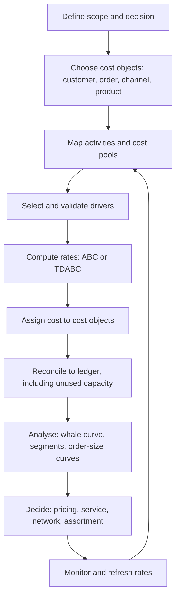
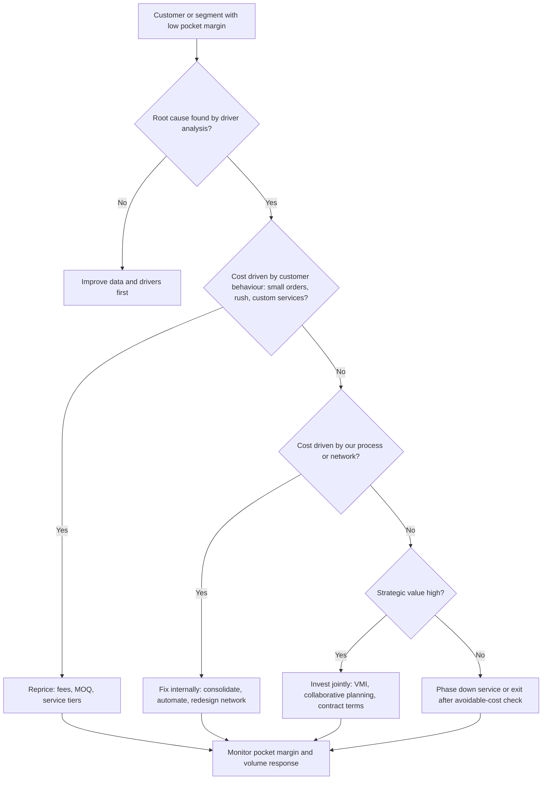

## Cost-to-Serve Analysis


### Overview

Cost-to-serve (CTS) analysis measures the full cost of serving a specific customer, channel, order, product, or route, and compares it with the revenue and margin that relationship generates. It extends product costing (which stops at cost of goods sold) into the activities that follow: order handling, warehousing, transport, inventory held for service, returns, sales and service effort, administration, and financing of receivables. The result is a profitability view that shows where reported gross margin hides loss-making orders, customers, or lanes.

Two orders of the same value can differ sharply in profitability depending on order size, urgency, delivery window, location density, returns, and service intensity. CTS analysis makes those differences visible so pricing, service levels, and network design can be set on facts rather than averages.

**Key Points**

- CTS complements COGS. It does not replace product costing.
- The core output is **pocket margin** (or customer profit after cost-to-serve): net revenue minus COGS minus attributable serving costs.
- Methods range from simple driver-based models to activity-based costing (ABC) and time-driven ABC (TDABC), and choice depends on data and decision needs.
- Only avoidable costs vanish when a customer is dropped, so fully allocated results must be paired with avoidable-cost analysis.
- CTS informs pricing, minimum order rules, service tiers, channel mix, assortment, and network design, and it requires cross-functional ownership (supply chain, sales, finance).

### Concepts and Terminology

| Term | Meaning |
| --- | --- |
| Cost-to-serve | Total cost of serving a customer, order, channel, or product beyond product cost |
| Pocket price / pocket margin | Price and margin after all discounts, rebates, and allowances, and (for pocket margin) after CTS |
| Landed cost | Product cost plus freight, duty, insurance, and handling up to receipt |
| Customer profitability analysis | Matching revenue and costs at customer level to reveal profit differences |
| Activity-based costing (ABC) | Assigns resource costs to activities, and activity costs to cost objects through drivers |
| Time-driven ABC (TDABC) | Costs activities with a capacity cost rate and time equations |
| Cost driver | A quantity that causes cost to vary (orders, lines, pallets, drops, kg, distance) |
| Cost pool | A group of costs assigned together (for example, order processing) |
| Resource driver | Assigns resource cost to an activity (for example, headcount share) |
| Activity driver | Assigns activity cost to a cost object (for example, orders per customer) |
| Avoidable cost | Cost that disappears if the activity or customer is removed |
| Stranded cost | Allocated cost that remains after a customer or activity is removed |
| Whale curve | Cumulative profit curve of customers ranked from most to least profitable |

### The Cost Stack: From Revenue to Pocket Margin

(svg_diagram) Cost-to-Serve Margin Cascade

<svg xmlns="http://www.w3.org/2000/svg" viewBox="0 0 760 440" width="760" height="440" font-family="sans-serif" font-size="12">
<title>Cost-to-Serve Margin Cascade (svg_diagram)</title>
<rect width="760" height="440" fill="#ffffff" />
<text x="380" y="24" text-anchor="middle" font-weight="bold" font-size="15">Cost-to-Serve Margin Cascade (svg_diagram)</text>
<rect x="40" y="42" width="270" height="34" rx="6" fill="#dbeafe" stroke="#1e40af" />
<text x="175" y="64" text-anchor="middle">Gross revenue</text>
<rect x="40" y="90" width="270" height="34" rx="6" fill="#dbeafe" stroke="#1e40af" />
<text x="175" y="112" text-anchor="middle">Net revenue (after discounts, rebates)</text>
<rect x="40" y="138" width="270" height="34" rx="6" fill="#dcfce7" stroke="#166534" />
<text x="175" y="160" text-anchor="middle">Gross margin (net revenue - COGS)</text>
<rect x="40" y="186" width="270" height="34" rx="6" fill="#fef9c3" stroke="#854d0e" />
<text x="175" y="208" text-anchor="middle">Fulfilment CTS</text>
<rect x="40" y="234" width="270" height="34" rx="6" fill="#fef9c3" stroke="#854d0e" />
<text x="175" y="256" text-anchor="middle">Inventory and service CTS</text>
<rect x="40" y="282" width="270" height="34" rx="6" fill="#fef9c3" stroke="#854d0e" />
<text x="175" y="304" text-anchor="middle">Commercial and admin CTS</text>
<rect x="40" y="330" width="270" height="34" rx="6" fill="#fef9c3" stroke="#854d0e" />
<text x="175" y="352" text-anchor="middle">Capital CTS (receivables, financing)</text>
<rect x="40" y="378" width="270" height="34" rx="6" fill="#ede9fe" stroke="#5b21b6" />
<text x="175" y="400" text-anchor="middle">Pocket margin (customer profit)</text>
<line x1="175" y1="76" x2="175" y2="90" stroke="#334155" stroke-width="2" marker-end="url(#arr4)" />
<line x1="175" y1="124" x2="175" y2="138" stroke="#334155" stroke-width="2" marker-end="url(#arr4)" />
<line x1="175" y1="172" x2="175" y2="186" stroke="#334155" stroke-width="2" marker-end="url(#arr4)" />
<line x1="175" y1="220" x2="175" y2="234" stroke="#334155" stroke-width="2" marker-end="url(#arr4)" />
<line x1="175" y1="268" x2="175" y2="282" stroke="#334155" stroke-width="2" marker-end="url(#arr4)" />
<line x1="175" y1="316" x2="175" y2="330" stroke="#334155" stroke-width="2" marker-end="url(#arr4)" />
<line x1="175" y1="364" x2="175" y2="378" stroke="#334155" stroke-width="2" marker-end="url(#arr4)" />
<text x="340" y="112">Price waterfall: on- and off-invoice terms, promotions</text>
<text x="340" y="160">Standard product cost and yield</text>
<text x="340" y="208">Orders, lines, pallets, drops, kg, distance, returns</text>
<text x="340" y="256">Days of supply, service level, expedite share</text>
<text x="340" y="304">Visits, contacts, claims, chargebacks, EDI effort</text>
<text x="340" y="352">Days sales outstanding x revenue x cost of capital</text>
<text x="340" y="400">Basis for pricing, service, and portfolio decisions</text>
</svg>

**Typical cost categories and drivers**

| Category | Example activities | Typical drivers |
| --- | --- | --- |
| Order management | Order entry, changes, confirmations, EDI and ASN, invoicing, dispute handling | Orders, lines, order changes, share of manual orders |
| Warehousing | Receiving, put-away, storage, picking, packing, labelling, kitting, loading | Lines picked, cases, pallet-days, value-added tasks |
| Transport | Outbound freight, expedites, last mile, failed deliveries, accessorials | Weight, volume, distance, drops, drop size, delivery windows, expedite share |
| Inventory and working capital | Dedicated stock, safety stock for service level, obsolescence, financing of receivables | Inventory value × holding rate, days of supply, DSO × revenue × cost of capital |
| Returns and warranty | Return handling, inspection, disposition, refunds, fraud | Return rate, units returned, handling time per unit |
| Sales and marketing | Sales calls, promotions, merchandising, samples | Visits, account tier, promotion depth |
| Customer service and admin | Inquiries, complaints, credit control, master data | Contacts, claims, credit reviews |
| Compliance and penalties | Retailer fines, chargebacks, deductions | Fine rate × non-compliant cost of goods |
| Sustainability and regulatory | Packaging fees, carbon costs, compliance evidence | Packaging weight, emissions, audits [Inference: applicability varies by jurisdiction] |

A vendor source suggests fulfilment and service expenses can represent 30–40% of total customer costs. [Unverified: this is a vendor claim, so measure it in your own network.]

### Methodologies

#### Traditional Allocation

Spreading supply chain cost as a percentage of revenue or of volume assumes every customer consumes cost in proportion to sales. It hides cross-subsidies, because small, urgent, or complex orders consume disproportionate effort.

#### Activity-Based Costing

ABC works in two stages:

1. Assign resource cost (labour, space, equipment, systems) to activities using resource drivers.
2. Assign activity cost to cost objects (customers, orders, products) using activity drivers.

The activity rate for activity $a$ with cost pool $C_a$ and driver volume $V_a$ is:

$$r_a = \frac{C_a}{V_a}$$

The serving cost of customer $c$ is then:

$$CTS_c = \sum_{a} r_a \, V_{a,c} + D_c$$

where $V_{a,c}$ is the driver volume consumed by customer $c$ and $D_c$ is directly attributable cost.

**Example**

An order-processing pool of €270,000 over 15,000 orders gives $r = €18$ per order.

#### Time-Driven ABC

TDABC replaces surveys of activity time with two parameters:

$$CCR = \frac{C_{cap}}{T_{practical}}, \qquad t = \beta_0 + \sum_i \beta_i x_i, \qquad Cost = CCR \times t$$

where $C_{cap}$ is the cost of capacity supplied, $T_{practical}$ is practical capacity in time units, and $x_i$ are order characteristics (lines, cases, special handling). Unused capacity cost is:

$$Cost_{unused} = CCR \times (T_{practical} - T_{used})$$

**Example**

A picking team costs €816,000 per year and offers $10 \times 1{,}700 \times 60 = 1{,}020{,}000$ practical minutes, so $CCR = €0.80$ per minute. The time equation is $t = 3.0 + 0.9 \times lines + 0.15 \times cases$.

- Order X, 12 lines and 40 cases: $t = 19.8$ min, cost €15.84 (€1.32 per line).
- Order Y, 60 lines and 300 cases: $t = 102$ min, cost €81.60 (€1.36 per line).
- If the team uses 780,000 minutes (76.5% utilisation), unused capacity costs $0.80 \times 240{,}000 = €192{,}000$.

Practitioner sources describe TDABC as estimating a capacity cost rate and time equations per activity, and describe hybrid models that use TDABC where time is measurable (such as picking or call handling) and ABC where volumes drive cost (such as freight).

#### Cost-to-Serve Models

CTS models are commonly described as less resource-intensive than full ABC because they analyse aggregates around a blend of cost drivers. They give an integrated view of costs at each supply chain stage and can support both long-term decisions and quick process fixes. [Inference: the trade-off is lower precision at individual-activity level.]

#### Regression-Based Driver Estimation

When time data is thin, estimate driver rates statistically from historical facility or lane data:

$$Cost_t = \alpha + \beta_1 Orders_t + \beta_2 Lines_t + \beta_3 Pallets_t + \varepsilon_t$$

Check for collinearity among drivers (orders and lines usually move together) and validate rates against operational reality before using them for pricing.

#### Method Comparison

| Method | Strengths | Weaknesses | Best for |
| --- | --- | --- | --- |
| Percentage allocation | Easy | Hides cross-subsidies | Rough first pass |
| Blended-driver CTS | Fast, understandable | Less granular | Pilot, portfolio view |
| ABC | Traceable to activities | Data and maintenance heavy | Stable, well-defined activities |
| TDABC | Scales with variety, captures capacity | Needs time equations and data | Labour-intensive, variable processes |
| Regression | Uses existing data | Statistical pitfalls | Cost-driver validation |

### Modelling Process



**Data sources**

| Data | Source | Typical issue |
| --- | --- | --- |
| Orders, lines, invoices, terms | ERP | Ship-to and sold-to mismatch, credit note handling |
| Pick, pack, pallet activity and time | WMS, labour management | Task times missing or estimated |
| Freight bills, routes, drops, accessorials | TMS, carrier invoices | Matching bills to shipments |
| Service contacts, claims | CRM, ticketing | Coding quality |
| Returns | Returns system | Reason and disposition codes |
| Promotion and rebate accruals | Trade systems | Timing and allocation |
| Payment and days sales outstanding | Finance | Customer hierarchy differences |
| Product dimensions, case pack | Master data | Gaps in weight and cube |

**Reconciliation rule**

$$\sum_{c} CTS_c + Cost_{unused} = GL\ cost\ pool$$

Allocated cost plus unused capacity should tie back to the general ledger within an agreed tolerance. [Inference: a tolerance of a few percent is a common working target, but set it locally.]

### Worked Example

**Example**

Four customers are modelled with driver rates: €18 per order, €1.30 per line, €70 per drop plus €0.04 per kg, €25 per return, €55 per service hour, and 8% cost of capital applied to receivables.

```python
from dataclasses import dataclass

@dataclass
class Customer:
    name: str
    revenue: float
    cogs: float
    deductions: float
    orders: int
    lines: int
    drops: int
    kg: float
    returns: int
    service_hours: float
    dso: float

RATES = dict(order=18.0, line=1.30, drop=70.0, kg=0.04,
             ret=25.0, service_hr=55.0, capital=0.08)

def cts(c):
    parts = {
        "order":    c.orders * RATES["order"],
        "pick":     c.lines * RATES["line"],
        "delivery": c.drops * RATES["drop"] + c.kg * RATES["kg"],
        "returns":  c.returns * RATES["ret"],
        "service":  c.service_hours * RATES["service_hr"],
        "capital":  c.dso / 365 * c.revenue * RATES["capital"],
    }
    return sum(parts.values())

customers = [
    Customer("A", 2_000_000, 1_450_000, 60_000, 300, 9000, 150, 400_000, 90, 400, 60),
    Customer("B", 1_200_000,   840_000, 12_000, 120, 2400,  60, 300_000, 12,  80, 45),
    Customer("C",   500_000,   340_000,  5_000, 2500, 5000, 2500, 60_000, 400, 600, 30),
    Customer("D",   800_000,   520_000,      0,   40,  400,   40, 200_000,   2,  30, 75),
]

rows = []
for c in customers:
    cost = cts(c)
    pm = c.revenue - c.deductions - c.cogs - cost
    rows.append((c, (c.revenue - c.cogs) / c.revenue, cost / c.revenue, pm))

total = sum(r[3] for r in rows)
cum = 0.0
for c, gm, cts_pct, pm in sorted(rows, key=lambda r: r[3], reverse=True):
    cum += pm
    print(f"{c.name}: GM={gm:.1%} CTS={cts_pct:.1%} PM={pm:,.0f} ({pm / c.revenue:.1%}) cum={cum / total:.1%}")
print(f"Total pocket margin: {total:,.0f}")
```

**Output** (illustrative; exact formatting depends on the runtime)

```plaintext
A: GM=27.5% CTS=4.7% PM=395,849 (19.8%) cum=47.2%
B: GM=30.0% CTS=3.2% PM=309,984 (25.8%) cum=84.2%
D: GM=35.0% CTS=3.4% PM=253,109 (31.6%) cum=114.3%
C: GM=32.0% CTS=55.0% PM=-120,188 (-24.0%) cum=100.0%
Total pocket margin: 838,755
```

**Key Points**

- Customer C ranks second on gross margin (32.0%) but is the only loss-maker after CTS (−24.0% of revenue), because it places 2,500 small orders, each with its own delivery.
- The cumulative column rises to 114.3% before falling to 100%, the classic whale curve shape.
- Customer A has the largest revenue and profit but the lowest gross margin percentage, so margin rankings and pocket-margin rankings differ.

**Per-order economics for Customer C**

Its cost per order is $275{,}188 / 2{,}500 \approx €110.08$, against an average order revenue of €200 and net margin of about 31% after deductions, giving a margin of about €62 per order. That is a loss of about €48 per order. If per-order costs are treated as fixed, the break-even order value is:

$$V^* = \frac{c_{order}}{m} = \frac{110.08}{0.31} \approx €355$$

so a minimum order value near €355, or a small-order fee near €48, would close the gap. [Inference: some costs, such as returns and financing, scale with value, so treat this as a first estimate.]

**Avoidable versus allocated cost**

If 40% of Customer C's CTS is fixed and would remain after exiting (for example shared warehouse and fleet cost), avoidable CTS is $0.6 \times 275{,}188 = 165{,}113$. Contribution after avoidable CTS is $155{,}000 - 165{,}113 = -10{,}113$. Exiting would improve profit by only about €10,000, not €120,000, so repricing or changing service terms is often a better first step. [Inference: the 40% is an assumption for illustration.]

### Whale Curve and Segmentation

The whale curve ranks customers by profit and plots cumulative profit as a share of the total:

$$W_k = \frac{\sum_{i=1}^{k} \pi_i}{\sum_{i=1}^{n} \pi_i}$$

Published observations describe a typical shape:

- Kaplan and Narayanan report that the most profitable 20% of customers usually generate 150% to 300% of total profit, the middle 60–70% break even, and the least profitable 10–20% lose 50% to 200% of total profit.
- A case reported by a logistics consultancy describes a Swedish heating-systems manufacturer where 20% of customers generated 225% of profits, 70% broke even, and 10% caused losses equal to 125% of profits. Its two largest-volume customers were also the least profitable, and CTS analysis led to pricing and volume adjustments without ending the relationships.

**Segmentation matrix**

|  | Low CTS | High CTS |
| --- | --- | --- |
| **High strategic value** | Grow: protect service and extend the relationship | Fix jointly: redesign terms, consolidate orders, share forecasts |
| **Low strategic value** | Maintain: standard service | Reprice or reduce service; consider exit after avoidable-cost check |

**Other analytical cuts**

- **Order-size curve**: cost per order and per line against order size, to find the small-order tipping point.
- **Channel and route**: drop density, distance, and time windows.
- **SKU × customer**: which items are expensive to hold, pick, or return for which accounts.
- **Service option costing**: cost difference between delivery frequencies, windows, and lead times.
- **Scenario simulation**: change a fee, MOQ, or network node, and re-run the model to test profit and volume response.

### Decision Levers

| Lever | Cost driver addressed | Watch-outs |
| --- | --- | --- |
| Small-order fees and minimum order value | Orders and drops | Customer response, competitive position |
| Order multiples and case-pack rules | Lines, cases, picking | May raise customer inventory |
| Delivery frequency and consolidation | Drops, freight | Service expectations |
| Delivery-window and lead-time pricing | Expedites, transport | Complexity in price lists |
| Service tiers (gold, silver, bronze) | Service and inventory | Clear entitlements needed |
| Self-service ordering, EDI, portals | Order handling, contacts | Adoption and integration effort |
| Channel migration | Drops, last mile | Channel conflict |
| Assortment rationalisation | Complexity, inventory | Customer loss on tail items |
| Custom packaging and labelling charges | Value-added services | Contract terms |
| Payment terms | Working capital | Supplier and customer relationships |
| Returns policy changes | Returns handling, fraud | Customer experience |
| Network redesign | Distance, handling steps | Capital and transition cost |
| Collaborative planning, VMI | Safety stock, expedites | Data sharing trust |
| Retailer compliance fixes | Fines and deductions | Root causes across the supply chain |

**Decision flow for a low-margin customer or segment**



### Context: E-Commerce and Returns

Returns are a large and growing CTS component in retail:

- The NRF and Happy Returns 2025 report estimated that retailers expect 15.8% of annual sales to be returned in 2025, totalling USD 849.9 billion, compared with 16.9% and USD 890 billion in 2024.
- The report estimated that 19.3% of online sales would be returned, that 82% of consumers say free returns are an important consideration when shopping online, and that 9% of returns are fraudulent.
- Retailers surveyed cited increasing online sales and reducing return rates among their top priorities for 2026.

For CTS, this means return rate, handling time, disposition value, and fraud exposure should be modelled as drivers by channel and product, and free-return promises should be priced or offset rather than treated as overhead. [Inference]

### Cost-to-Serve Across the Network

- **Downstream tiers**: CTS varies by customer type (retailer, wholesaler, marketplace, direct-to-consumer), so run models by channel as well as by customer.
- **Upstream tiers**: apply the same logic to suppliers as cost-to-source, including audit, traceability, quality, expedite, and compliance effort in supplier total cost.
- **Shared assets**: allocate shared warehouse and transport costs by usage drivers, and track unused capacity separately so it is not spread invisibly.
- **Transfer prices and internal charges**: inter-company charges should reflect real activity costs, or network CTS results will mislead.
- **Compliance and trade policy**: duties, compliance evidence, and penalty programs change cost by lane and customer. Keep rates parameterised so they can be updated when rules change. [Inference]
- **Service-level linkage**: higher fill rate and OTIF targets raise safety stock and expediting cost, so tie service level commitments to their cost in the model.

### KPIs from a Cost-to-Serve Model

| KPI | Definition |
| --- | --- |
| CTS as % of revenue | Total CTS ÷ revenue, by customer, channel, or segment |
| Cost per order, per line, per drop, per unit | Total serving cost ÷ driver volume |
| Pocket margin and pocket margin % | Revenue after deductions − COGS − CTS |
| Share of customers below break-even | Customers with negative pocket margin ÷ customers |
| Small-order share | Orders below the break-even value ÷ total orders |
| Stranded cost | Allocated cost that persists after exit or reduction |
| Model reconciliation gap | Ledger cost pool − (allocated + unused capacity) |
| Price-realisation | Net revenue ÷ list revenue |
| Return cost per € sold | Returns handling, disposition, and losses ÷ sales |

### Implementation Roadmap

1. **Frame the decision**: pricing, service redesign, network change, or portfolio review, and choose the level (customer, order, channel).
2. **Assemble a cross-functional team**: supply chain, finance, sales, customer service, and IT.
3. **Start with a pilot**: one region or customer group, using a blended-driver or ABC model.
4. **Validate drivers and rates**: compare with time studies, carrier invoices, and ledger totals.
5. **Reconcile** allocated costs to the general ledger, including unused capacity.
6. **Share results carefully**: explain method and limits, and test insights with sales before acting.
7. **Act**: reprice, restructure service, or fix processes, and record the expected effect.
8. **Refresh**: update rates at least annually or when costs, contracts, or networks change, and automate data feeds where possible.
9. **Embed** in pricing reviews, account planning, and S&OP or IBP cycles.

Commercial software in this area is reported to support ABC, TDABC, and multi-dimensional costing, but tooling does not remove the need for validated drivers and governance.

### Pitfalls and Best Practices

**Pitfalls**

- Data and modelling effort: noisy or missing driver data undermines trust in results.
- Static models: rates and flows change, so stale models mislead.
- Partial view: focusing only on current-period profitability can ignore customer lifetime value, strategic accounts, and volume effects.
- Behavioural pushback: sales and customer service teams may resist fee changes without clear evidence and change management.
- Treating fully allocated cost as avoidable cost, which overstates savings from exits.
- Over-precision: false accuracy from splitting costs finer than the data supports.
- Ignoring customer response: fees and MOQs may shift volume to competitors or to other channels.
- Excluding return, compliance, or financing costs because they sit in other budgets.

**Best practices**

- Start simple, then add depth where decisions justify it.
- Pair fully allocated and avoidable-cost views.
- Track unused capacity explicitly.
- Keep driver definitions in a data dictionary with owners and refresh dates.
- Combine CTS with service metrics (OTIF, fill rate) so cost cuts do not silently degrade service.
- Involve sales in designing offers and fees, and pilot before rolling out.
- Revisit models after major network, contract, or regulatory changes.

**Conclusion**

Cost-to-serve analysis reveals that revenue and gross margin are poor guides to profit once order behaviour, service demands, returns, and financing are counted. Well-built models (blended-driver, ABC, TDABC, or a hybrid) tie cost to drivers, reconcile to the ledger, and present pocket margin by customer, channel, and order. They are most useful when paired with avoidable-cost analysis, segmentation, and disciplined follow-through in pricing, service, and network design. Cost rates, return statistics, and vendor claims vary by industry and change over time, so validate assumptions with your own data before acting.

**Related Topics**

- Activity-based costing and time-driven ABC design
- Customer profitability and price waterfall analysis
- Total cost of ownership and landed cost modelling
- Service level segmentation and OTIF cost trade-offs
- Inventory carrying cost and working capital analytics
- Network design and transport optimisation
- Returns management and reverse logistics economics
- Pricing strategy, minimum order rules, and service tiers
- Supplier cost-to-source and open-book costing
- Scenario modelling and digital twins for supply chain cost