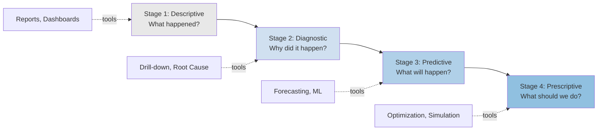
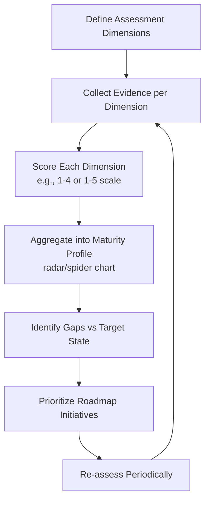

## Supply Chain Analytics Maturity Models

### Definition and Purpose

A supply chain analytics maturity model is a structured framework that assesses an organization's current analytical capabilities across dimensions such as data infrastructure, technical capability, organizational culture, and decision-making processes, and maps a progression path toward more advanced, value-generating analytics practices. These models provide a common vocabulary for benchmarking, prioritizing investment, and sequencing capability-building efforts rather than pursuing advanced techniques (e.g., prescriptive optimization) before foundational prerequisites (clean, integrated data) are in place.

**Key Points**

- Maturity models are diagnostic and prescriptive: they identify "where you are" and suggest "what comes next."
- Most frameworks are stage-based (typically 4–5 stages) and multi-dimensional (technology, people, process, data, governance).
- [Inference] Organizations often exhibit uneven maturity across dimensions (e.g., strong BI tooling but weak data governance), so a single "overall stage" label can mask important gaps — practitioners commonly recommend assessing each dimension separately before summarizing.

### The Canonical Four-Stage Analytics Continuum

The most widely referenced maturity structure in supply chain analytics literature (originating from broader business analytics maturity work by Gartner and others, and adapted specifically to supply chain contexts by researchers such as Sanders, and consulting frameworks from APICS/ASCM, Deloitte, and Accenture) organizes capability into four ascending stages, distinguished by the questions each stage answers.

#### Stage 1 — Descriptive Analytics ("What happened?")

- Focus: historical reporting, dashboards, KPI tracking (e.g., OTIF, inventory turns, fill rate).
- Typical tools: spreadsheets, static BI reports, ERP-native reporting modules.
- Data characteristics: siloed, often manually reconciled, batch-updated (daily/weekly).
- Organizational trait: reactive; analytics functions as record-keeping rather than decision support.

#### Stage 2 — Diagnostic Analytics ("Why did it happen?")

- Focus: root-cause analysis, drill-down reporting, variance analysis against plan/budget.
- Typical tools: OLAP cubes, interactive BI dashboards (Power BI, Tableau), basic statistical correlation.
- Data characteristics: partially integrated across functions (e.g., procurement + logistics), higher refresh frequency.
- Organizational trait: cross-functional teams begin collaborating on exception investigation.

#### Stage 3 — Predictive Analytics ("What will happen?")

- Focus: demand forecasting, predictive maintenance, risk scoring, lead-time variability modeling.
- Typical tools: statistical forecasting (ARIMA, exponential smoothing), machine learning models (gradient boosting, regression), demand-sensing platforms.
- Data characteristics: integrated data lake/warehouse, near-real-time or event-driven feeds, external data incorporation (weather, market indices).
- Organizational trait: data science function exists; forecasts feed into S&OP (Sales & Operations Planning) processes.

#### Stage 4 — Prescriptive Analytics ("What should we do about it?")

- Focus: optimization (network design, inventory policy, routing), simulation, autonomous or semi-autonomous decisioning.
- Typical tools: linear/mixed-integer programming solvers, digital twins, reinforcement learning, control-tower platforms.
- Data characteristics: fully integrated real-time data fabric across the extended supply chain (suppliers, logistics providers, customers).
- Organizational trait: analytics embedded directly into operational workflows and decision rights (e.g., automated replenishment triggers).

[Unverified] Some frameworks insert a fifth "Cognitive" or "Autonomous" stage beyond prescriptive analytics, characterized by self-learning systems that adapt decision logic without human recalibration; this extension is less universally standardized across the literature than the four-stage core.

### Multi-Dimensional Maturity Frameworks

Beyond the single "value axis" of the four-stage model, several published frameworks assess maturity across multiple independent dimensions simultaneously. This is important because a company can be advanced in one axis and immature in another.

#### Common Dimensions Assessed

| Dimension | Low Maturity Indicators | High Maturity Indicators |
| --- | --- | --- |
| Data Infrastructure | Siloed spreadsheets, manual entry, disparate systems | Integrated data warehouse/lakehouse, API-driven real-time feeds |
| Technology & Tools | Basic ERP reporting only | Cloud-native analytics platforms, ML pipelines, digital twins |
| Organizational Culture | Analytics seen as IT/reporting function | Data-driven decision-making embedded at all levels |
| Talent & Skills | Ad hoc analysis by generalists | Dedicated data scientists/analysts, citizen-analyst enablement |
| Governance | No data ownership, inconsistent definitions | Formal data governance, master data management, defined KPIs |
| Process Integration | Analytics disconnected from planning cycles | Analytics embedded in S&OP/IBP, closed-loop decision processes |

**Example**

A mid-sized 3PL might score Stage 3 (Predictive) on Technology & Tools due to a modern TMS with built-in demand-sensing, but Stage 1 (Descriptive) on Governance because there is no single source of truth for on-time delivery definitions across regional offices — illustrating why dimension-level scoring is more actionable than a single composite score.

### Notable Named Frameworks

- **Gartner's Analytics Maturity Model**: The general-purpose descriptive/diagnostic/predictive/prescriptive structure that most supply-chain-specific models adapt directly.
- **APICS/ASCM Supply Chain Analytics Framework**: Extends the four stages with supply-chain-specific competency areas (demand planning, inventory optimization, network design).
- **Gartner Supply Chain Planning Maturity Model**: Focuses specifically on planning maturity, often paired with their broader Supply Chain Top 25 methodology; stages typically range from "reactive/functional silos" to "orchestrated, self-adapting networks."
- **MIT CTL (Center for Transportation & Logistics) frameworks**: Academic treatments emphasizing the link between data integration maturity and forecast accuracy/service-level outcomes. [Unverified] Specific stage-naming conventions vary across MIT CTL publications and working papers rather than following one fixed taxonomy.

[Inference] Because maturity models are proprietary intellectual property for many consulting firms (Deloitte, Accenture, Gartner), exact stage definitions, naming, and scoring rubrics differ by publisher even though the underlying descriptive→prescriptive logic is broadly convergent; practitioners should treat the four-stage structure above as the common denominator rather than a single canonical standard.

### Assessment Methodology

Typical maturity assessment follows a structured audit process:

**Key Points**

- Evidence collection typically combines: system audits (what tools/data exist), process interviews (how decisions are actually made), and outcome metrics (forecast accuracy, inventory turns, on-time performance) as a triangulation check against self-reported capability.
- Scoring is often visualized as a radar/spider chart across dimensions, making gaps visually immediate for stakeholders.
- [Inference] Because self-assessment is prone to optimism bias, more rigorous programs pair the interview-based scoring with objective outcome metrics (e.g., a company claiming "predictive" maturity should show measurable forecast accuracy improvement, not just tool ownership).

### Radar Chart Representation (SVG)

<svg viewBox="0 0 500 500" xmlns="http://www.w3.org/2000/svg" font-family="sans-serif">
<text x="250" y="25" text-anchor="middle" font-size="16" font-weight="bold">Supply Chain Analytics Maturity Radar (svg_diagram)</text>
<!-- Grid rings -->
<polygon points="250,80 385,165 385,335 250,420 115,335 115,165" fill="none" stroke="#ccc" stroke-width="1"/>
<polygon points="250,120 351,182 351,318 250,380 149,318 149,182" fill="none" stroke="#ddd" stroke-width="1"/>
<polygon points="250,160 317,200 317,300 250,340 183,300 183,200" fill="none" stroke="#ddd" stroke-width="1"/>
<polygon points="250,200 284,220 284,280 250,300 216,280 216,220" fill="none" stroke="#ddd" stroke-width="1"/>
<!-- Axes -->
<line x1="250" y1="250" x2="250" y2="80" stroke="#999" stroke-width="1"/>
<line x1="250" y1="250" x2="385" y2="165" stroke="#999" stroke-width="1"/>
<line x1="250" y1="250" x2="385" y2="335" stroke="#999" stroke-width="1"/>
<line x1="250" y1="250" x2="250" y2="420" stroke="#999" stroke-width="1"/>
<line x1="250" y1="250" x2="115" y2="335" stroke="#999" stroke-width="1"/>
<line x1="250" y1="250" x2="115" y2="165" stroke="#999" stroke-width="1"/>
<!-- Example maturity profile polygon -->

<polygon points="250,160 340,195 351,318 250,300 175,270 149,182"
fill="`#4a90d9`" fill-opacity="0.35" stroke="`#2166ac`" stroke-width="2"/>

<!-- Axis labels -->

<text x="250" y="65" text-anchor="middle" font-size="12">Data Infrastructure</text>

<text x="400" y="160" text-anchor="start" font-size="12">Technology & Tools</text>

<text x="400" y="340" text-anchor="start" font-size="12">Process Integration</text>

<text x="250" y="440" text-anchor="middle" font-size="12">Governance</text>

<text x="100" y="340" text-anchor="end" font-size="12">Talent & Skills</text>

<text x="100" y="160" text-anchor="end" font-size="12">Culture</text>

</svg>

### Progression Barriers Between Stages

**Descriptive → Diagnostic**: Requires cross-functional data integration; common blocker is departmental data ownership silos preventing unified drill-down.

**Diagnostic → Predictive**: Requires statistical/ML skill acquisition and sufficient historical data volume/quality; common blocker is data scientist talent scarcity and untrusted or incomplete historical records.

**Predictive → Prescriptive**: Requires organizational willingness to cede decision authority to model-driven recommendations; common blocker is cultural resistance ("black box" distrust) and lack of change management for automated decisioning.

[Inference] Empirically, the jump from Predictive to Prescriptive is frequently cited as the hardest transition — not primarily for technical reasons, but because it requires operational trust in automated recommendations, which typically only builds after a track record of accurate, explainable predictive output.

### Practical Application Example

**Example**

A regional food distributor conducting a maturity assessment might find:

- Data Infrastructure: Stage 2 (some integration via ERP, but warehouse and transportation data remain siloed)
- Technology: Stage 1 (Excel-based demand planning)
- Talent: Stage 1 (no dedicated analytics staff)
- Governance: Stage 2 (KPI definitions exist but are inconsistently applied)

Roadmap prioritization would then target the lowest-scoring, highest-leverage dimension first — typically **Talent** and **Data Infrastructure** — since Predictive/Prescriptive capability (Stage 3–4) is unreachable without a foundational data layer and the skills to build models on it, regardless of how advanced the organization's ambitions are.

### Conclusion

Supply chain analytics maturity models provide a staged, multi-dimensional lens for evaluating and sequencing analytics capability development. While published frameworks vary in naming and granularity, they converge on the descriptive → diagnostic → predictive → prescriptive progression, and on the principle that technology adoption alone is insufficient — data governance, organizational culture, and process integration must mature in parallel for advanced analytics investments to generate measurable operational value.

**Next Steps / Related Topics**

- Supply Chain Control Towers and Real-Time Visibility Platforms
- Sales & Operations Planning (S&OP) and Integrated Business Planning (IBP)
- Demand Forecasting Techniques (statistical vs. machine learning methods)
- Data Governance and Master Data Management in Supply Chains
- Digital Twin Applications in Supply Chain Simulation
- Key Performance Indicator (KPI) Frameworks: SCOR Model Metrics
- Change Management for AI/ML Adoption in Operations