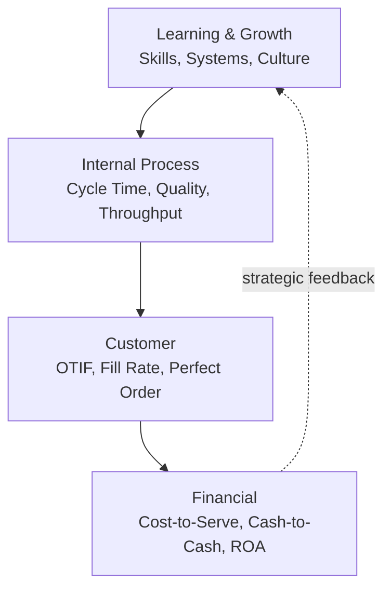
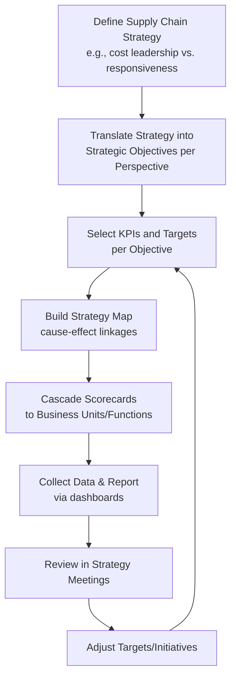

## Balanced Scorecard Approaches for Supply Chains

### Definition and Origin

The Balanced Scorecard (BSC) is a strategic performance management framework originally developed by Robert Kaplan and David Norton in the early 1990s, designed to counter the limitations of purely financial performance measurement by evaluating an organization across four interrelated perspectives. When applied to supply chains, the BSC translates supply chain strategy into a coherent set of leading and lagging metrics that link day-to-day operational execution (e.g., warehouse throughput, supplier lead time) to enterprise-level strategic objectives (e.g., market share, shareholder value).

**Key Points**

- The core innovation of BSC is balancing *financial* (lagging) indicators with *operational/non-financial* (leading) indicators.
- Applied to supply chains, BSC is typically used to align cross-functional metrics (procurement, manufacturing, logistics, customer service) under one strategic narrative rather than allowing each function to optimize locally.
- BSC is a *management system*, not merely a dashboard — it explicitly links measurement to strategy execution via cause-and-effect relationships between perspectives.

### The Four Classic Perspectives (Adapted to Supply Chain)

#### 1. Financial Perspective

- Focus: How does the supply chain contribute to shareholder value and profitability?
- Typical metrics: total supply chain cost as % of revenue, cash-to-cash cycle time, inventory carrying cost, cost per order fulfilled, return on supply chain assets.

#### 2. Customer Perspective

- Focus: How do customers perceive the supply chain's performance?
- Typical metrics: On-Time-In-Full (OTIF), order fill rate, perfect order rate, customer complaint rate, average order lead time.

#### 3. Internal Process Perspective

- Focus: Which internal supply chain processes must excel to satisfy customers and financial goals?
- Typical metrics: manufacturing cycle time, forecast accuracy (MAPE), warehouse throughput, supplier defect rate, transportation utilization.

#### 4. Learning and Growth Perspective

- Focus: What capabilities (people, systems, culture) must be developed to sustain future improvement?
- Typical metrics: employee training hours in supply chain systems, ERP/analytics adoption rate, process improvement suggestions implemented, employee retention in key logistics roles.

**Key Points**

- The four perspectives are connected by an assumed causal chain: investment in people/systems (Learning & Growth) improves internal processes, which improves customer outcomes, which ultimately drives financial results.
- [Inference] This causal chain is a strategic hypothesis embedded in the scorecard design rather than a guaranteed mechanical relationship; the validity of the linkage depends on correctly identified strategic drivers for the specific organization, and mis-specified linkages are a commonly cited reason BSC implementations underperform expectations.

### Supply-Chain-Specific Adaptations of BSC

Because the original BSC was designed for whole-enterprise strategy rather than supply chain operations specifically, several adapted variants exist in the literature and practice:

#### SCOR-Integrated Scorecard

The Supply Chain Operations Reference (SCOR) model's five performance attributes (Reliability, Responsiveness, Agility, Cost, Asset Management Efficiency) are frequently mapped onto BSC perspectives, with Reliability/Responsiveness feeding the Customer perspective, Cost/Asset Management feeding the Financial perspective, and Agility spanning Internal Process and Learning & Growth.

#### Supply Chain-Specific Fifth Perspective

Some practitioner frameworks add a fifth perspective — **Supplier/Partner Perspective** — to explicitly capture upstream relationship quality (supplier scorecards, collaboration maturity, supplier risk) separately from internal process metrics, reflecting the extended, multi-echelon nature of supply chains versus a single firm's internal operations.

[Unverified] The prevalence of a formal fifth "Supplier" perspective versus folding supplier metrics into the existing Internal Process perspective varies significantly by industry and consulting methodology; there is no single standardized fifth-perspective naming convention across the literature.

#### Balanced Scorecard vs. SCOR vs. APICS/ASCM Metrics — Comparison

| Framework | Primary Orientation | Strength | Limitation |
| --- | --- | --- | --- |
| Balanced Scorecard | Strategy-to-execution linkage across 4 perspectives | Strong strategic alignment and communication tool | Not supply-chain-native; requires adaptation |
| SCOR Model | Process reference model with standardized metrics | Cross-industry benchmarking comparability | Less emphasis on strategic causality/narrative |
| APICS/ASCM Metrics | Domain-specific KPI libraries (inventory, demand, etc.) | Deep operational specificity | Less structured for executive strategic communication |

### Building a Supply Chain Balanced Scorecard: Process

**Key Points**

- The **Strategy Map** is a critical artifact distinct from the scorecard itself: it visually documents the hypothesized cause-and-effect chain across perspectives (e.g., "reducing supplier lead time variability" → "improves internal schedule adherence" → "improves OTIF" → "reduces stockout-driven lost sales").
- Metric selection should follow the principle of a small number of high-leverage KPIs per perspective (commonly cited guidance is 3–5 per perspective) rather than exhaustive metric lists, to preserve strategic focus.
- Cascading means each functional level (e.g., regional distribution center) gets its own scorecard whose metrics ladder up into the enterprise-level supply chain scorecard, maintaining line-of-sight from operational activity to strategic objective.

### Example Supply Chain Balanced Scorecard

**Example**

For a manufacturer pursuing a "responsiveness and reliability" strategy:

| Perspective | Strategic Objective | KPI | Target |
| --- | --- | --- | --- |
| Financial | Reduce total logistics cost | Logistics cost as % of revenue | ≤ 8% |
| Customer | Improve delivery reliability | OTIF | ≥ 96% |
| Internal Process | Reduce production variability | Schedule adherence | ≥ 92% |
| Internal Process | Improve supplier quality | Supplier defect rate (PPM) | ≤ 500 PPM |
| Learning & Growth | Build planning capability | % planners certified in S&OP/IBP | ≥ 80% |

The strategy map would document: planner certification → improved forecast accuracy and schedule adherence → improved OTIF → reduced expedited-freight cost → improved logistics cost ratio — illustrating the leading-to-lagging indicator chain from Learning & Growth through to Financial.

### Strengths and Limitations

**Key Points**

Strengths:

- Forces explicit articulation of strategic cause-effect assumptions rather than tracking metrics in isolation.
- Balances short-term financial pressure against longer-term capability investment (Learning & Growth), reducing the risk of metrics-driven short-termism.
- Provides a common communication structure across functions and up to executive leadership.

Limitations:

- [Inference] Because BSC requires consensus on strategic causal linkages across perspectives, implementations in organizations with fragmented or contested strategic priorities (e.g., cost leadership disputed against service leadership) tend to produce scorecards with internally conflicting targets, since the model does not itself resolve strategic trade-offs.
- Risk of "scorecard proliferation" — too many cascaded metrics diluting focus, which is a widely cited practical failure mode though its frequency is not something that can be quantified as a general fact.
- Static targets can lag fast-moving supply chain disruptions (e.g., a scorecard built pre-disruption may retain targets that are no longer strategically relevant), requiring periodic re-validation of the strategy map itself, not just target updates.

### Digital/Real-Time Scorecard Implementation Considerations

Modern supply chain BSC implementations are typically operationalized through BI/analytics platforms rather than static annual reports:

- **Data sourcing**: ERP (SAP, Oracle), TMS/WMS systems, and supplier portals feed a central data warehouse.
- **Visualization layer**: BI tools (Power BI, Tableau, Qlik) render perspective-level dashboards with drill-down from strategic KPI to operational root cause.
- **Cadence**: Strategic-level scorecard review is typically monthly/quarterly (aligned to S&OP cycles), while underlying operational metrics may refresh daily or in near-real-time.
- [Inference] The shift from static/annual BSC reporting to real-time dashboarding changes the *tooling* but does not eliminate the need for periodic strategic review meetings, since the strategic interpretation of metric movement (why a KPI moved, and whether the causal hypothesis in the strategy map still holds) remains a human/organizational process rather than something dashboards resolve automatically.

### Conclusion

The Balanced Scorecard, when adapted to supply chain contexts, provides a structured mechanism for linking day-to-day operational metrics to overarching business strategy across financial, customer, internal process, and learning & growth perspectives. Its principal value lies not in the metrics themselves but in the explicit strategy map connecting them — making it a strategic alignment tool as much as a measurement system, distinct from purely operational frameworks like SCOR.

**Next Steps / Related Topics**

- SCOR Model (Supply Chain Operations Reference) Metrics and Levels
- Strategy Maps and Cause-Effect Linkage Modeling
- Sales & Operations Planning (S&OP) / Integrated Business Planning (IBP)
- Key Performance Indicators (KPIs): OTIF, Cash-to-Cash Cycle, Perfect Order Rate
- Supplier Scorecards and Vendor Performance Management
- Supply Chain Analytics Maturity Models
- Cascading Performance Management Across Organizational Tiers