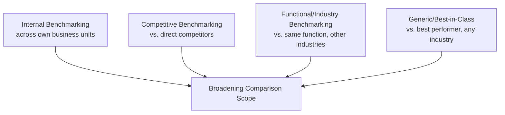
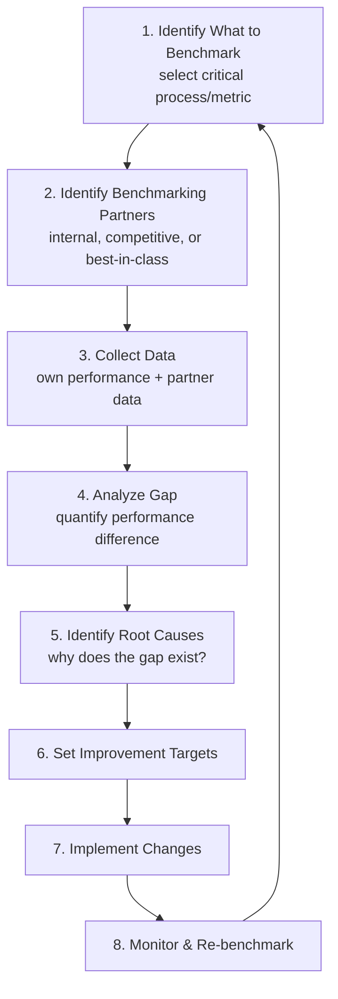
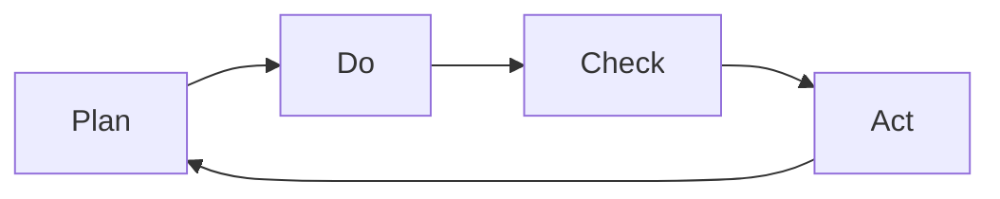
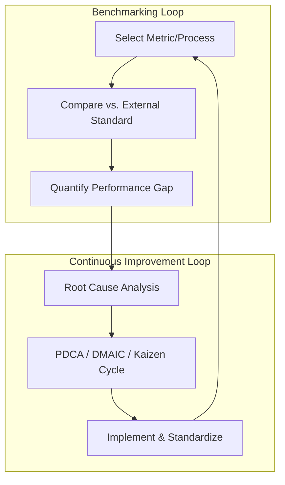

## Benchmarking and Continuous Improvement

### Definition and Purpose

Benchmarking is the systematic process of comparing an organization's supply chain processes, practices, and performance metrics against internal baselines, direct competitors, industry standards, or best-in-class organizations (regardless of industry) in order to identify performance gaps and improvement opportunities. Continuous improvement (CI) is the complementary, ongoing organizational discipline of incrementally refining processes based on the gaps benchmarking identifies, typically operationalized through structured methodologies such as PDCA (Plan-Do-Check-Act), Kaizen, Six Sigma, or Lean.

**Key Points**

- Benchmarking answers "how far are we from best practice, and on what dimension?" — it is diagnostic, not corrective on its own.
- Continuous improvement answers "how do we systematically close that gap and keep closing new gaps over time?" — it is the operational engine.
- The two are typically run as a closed loop: benchmark → identify gap → improve → re-benchmark, rather than as one-time, isolated exercises.

### Types of Benchmarking

#### Internal Benchmarking

Comparing performance across similar units within the same organization (e.g., comparing on-time delivery rates across regional distribution centers).

- Strength: high data accessibility and comparability; low legal/competitive sensitivity.
- Limitation: ceiling effect — internal best performers may still lag external best-in-class.

#### Competitive Benchmarking

Comparing directly against known industry competitors, typically using publicly available data, industry reports, or third-party benchmarking consortia.

- Strength: directly relevant to competitive positioning.
- Limitation: data access is often limited to published/aggregated figures; direct competitors are usually unwilling to share granular process data.

#### Functional/Industry Benchmarking

Comparing a specific function (e.g., warehousing, transportation) against organizations in the same function across different industries.

- Strength: broader comparison pool than direct competitors; still domain-relevant.

#### Generic/Best-in-Class Benchmarking

Comparing a process against the best-performing organization for that process *regardless of industry* (e.g., a hospital supply chain studying Amazon's fulfillment logistics for inventory replenishment practices).

- Strength: exposes genuinely novel process innovations not visible within one's own industry.
- Limitation: [Inference] cross-industry process transfer often requires significant adaptation, since underlying constraints (regulatory, product characteristics, demand volatility) frequently differ enough that direct practice replication is not feasible without modification.

### The Benchmarking Process (Structured Methodology)

The most widely cited structured benchmarking methodology (originating from Xerox's pioneering benchmarking work in the 1980s, later formalized in APICS/ASCM and Supply Chain Council materials) follows a repeatable cycle:

**Key Points**

- Step 1 (selecting *what* to benchmark) is a common point of failure: benchmarking too many metrics dilutes focus, so best practice is to prioritize processes with the highest strategic leverage or largest suspected performance gap.
- Step 5 (root-cause analysis) is essential and frequently skipped in practice — knowing a competitor achieves a better fill rate is not actionable without understanding *why* (e.g., different inventory policy, different network design, different supplier terms).
- The cycle is explicitly iterative: re-benchmarking after implementation both validates improvement and resets the baseline for the next cycle.

### Common Supply Chain Benchmarking Sources and Standards

| Source/Framework | Type | Typical Use |
| --- | --- | --- |
| SCOR Model (ASCM) | Standardized process reference model with defined metrics | Cross-industry process and metric benchmarking |
| Gartner Supply Chain Top 25 | Industry ranking/methodology | Competitive/reputational benchmarking |
| APQC Open Standards Benchmarking | Cross-industry process benchmarking database | Functional/generic benchmarking |
| Industry associations (e.g., CSCMP) | Member surveys, cost/service studies | Industry-specific benchmarking |

[Unverified] Exact methodology weightings and data-collection protocols for proprietary ranking systems such as Gartner's Supply Chain Top 25 are not fully public, so the ranking should be treated as a competitive-positioning signal rather than a fully transparent, independently reproducible benchmark.

### Continuous Improvement Methodologies

#### PDCA (Plan-Do-Check-Act)

The foundational CI cycle (attributed to Walter Shewhart, popularized by W. Edwards Deming):

- **Plan**: Define the problem/gap (often sourced directly from benchmarking output) and design a change.
- **Do**: Implement the change on a small/pilot scale.
- **Check**: Measure results against the plan's target.
- **Act**: Standardize the change if successful, or adjust and re-cycle if not.

#### Kaizen

A Japanese-origin philosophy of continuous, incremental improvement driven by frontline employee involvement, often executed via short, focused "Kaizen events" (typically 3–5 days) targeting a specific process.

#### Six Sigma (DMAIC)

A statistically rigorous CI methodology using the DMAIC cycle: Define, Measure, Analyze, Improve, Control — emphasizing quantitative defect reduction (targeting 3.4 defects per million opportunities as the namesake "six sigma" quality level).

- Commonly applied to supply chain quality issues: supplier defect rates, order accuracy, transportation damage rates.

#### Lean

Focused on the systematic elimination of the seven (or eight) forms of waste (*muda*) — overproduction, waiting, transport, over-processing, inventory, motion, defects, and (in extended frameworks) unused employee talent/skill.

- In supply chain contexts, Lean principles are applied to inventory reduction, warehouse layout optimization, and transportation route efficiency.

**Key Points**

- These methodologies are not mutually exclusive; many organizations run hybrid "Lean Six Sigma" programs, using Lean's waste-elimination lens alongside Six Sigma's statistical rigor.
- Benchmarking typically supplies the *target* (what "good" looks like, based on external comparison), while PDCA/Kaizen/DMAIC/Lean supply the *method* for closing the gap toward that target.

### Integrating Benchmarking with Continuous Improvement: Closed-Loop Model

**Example**

A distribution company benchmarks its order-picking productivity against APQC's cross-industry warehousing dataset and finds it operates at the 40th percentile for picks-per-labor-hour. Root-cause analysis (via a Kaizen event) reveals inefficient warehouse slotting (fast-moving SKUs stored far from packing stations) as the primary driver. A DMAIC project redesigns slotting based on pick-frequency data; after implementation, the company re-benchmarks and finds it has moved to the 65th percentile — closing roughly half the identified gap, with the remaining gap attributed to technology differences (manual picking vs. competitors' voice-picking systems) identified as the next improvement target.

### Common Pitfalls

**Key Points**

- **Benchmarking without action**: Collecting comparative data but failing to translate gaps into improvement initiatives — a frequently cited failure mode that renders the benchmarking exercise purely reportorial.
- **Comparing incomparable processes**: Benchmarking metrics without normalizing for structural differences (e.g., comparing warehouse labor productivity between a fully automated facility and a manual one without adjusting for automation level) produces misleading gap estimates.
- **One-time benchmarking**: Treating benchmarking as a single project rather than a recurring cycle, causing targets to become stale as both the organization and its comparison set evolve.
- **Metric gaming**: [Inference] When continuous improvement targets are tied too tightly to a single benchmarked metric without safeguards, there is a documented general risk in performance management literature of local optimization on that metric at the expense of unmeasured dimensions (e.g., improving fill rate by holding excess safety stock, worsening the inventory-cost metric) — this is a structural risk of single-metric incentive design rather than a claim about any specific benchmarking program's outcome.

### Conclusion

Benchmarking and continuous improvement function as a complementary, closed-loop discipline in supply chain performance management: benchmarking provides the external reference point and quantified performance gap, while structured CI methodologies (PDCA, Kaizen, Six Sigma, Lean) provide the systematic mechanism for closing that gap. Sustainable performance improvement depends on treating this as an iterative cycle — repeated benchmarking, root-cause-driven improvement, and re-benchmarking — rather than as isolated, one-time initiatives.

**Next Steps / Related Topics**

- SCOR Model (Supply Chain Operations Reference) Metrics and Levels
- Six Sigma DMAIC Methodology in Supply Chain Quality
- Lean Warehouse and Inventory Management Principles
- Supply Chain Analytics Maturity Models
- Balanced Scorecard Approaches for Supply Chains
- Root Cause Analysis Techniques (Fishbone/Ishikawa, 5 Whys)
- Supplier Performance Scorecards and Vendor Benchmarking