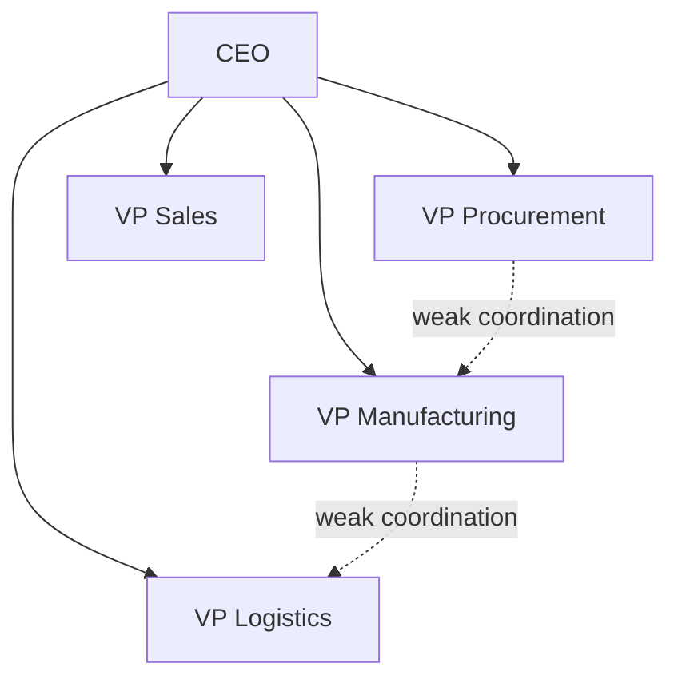
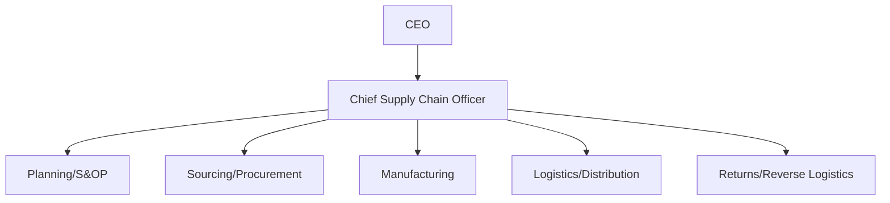
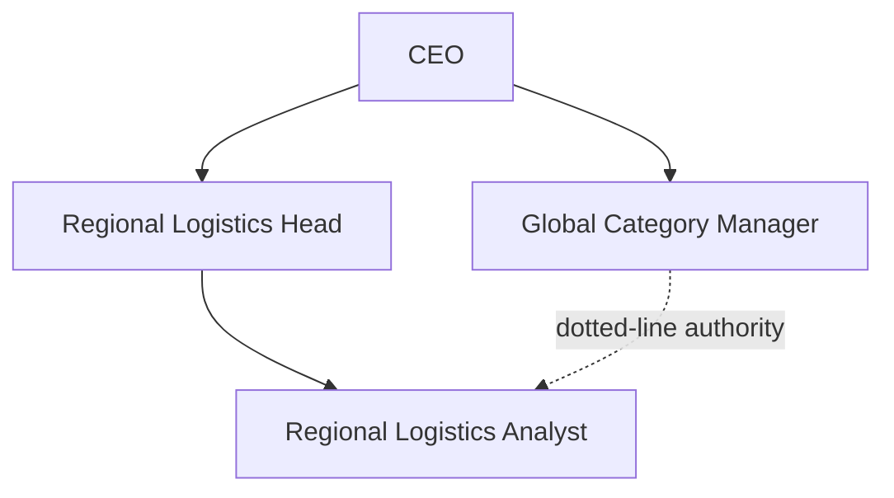
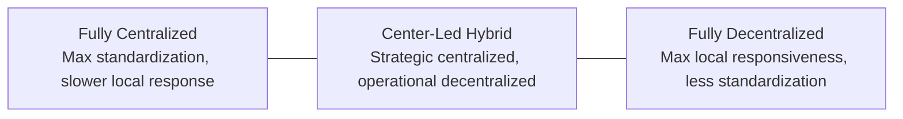
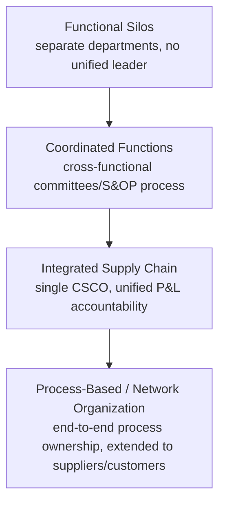

## Organizational Structures for Supply Chain Functions

### Definition and Purpose

Organizational structure for supply chain functions refers to how an enterprise arranges reporting lines, decision authority, and coordination mechanisms across the activities that plan, source, make, deliver, and return goods and services. The choice of structure directly shapes how effectively the organization can balance competing objectives — functional efficiency versus end-to-end coordination, local responsiveness versus global standardization, and control versus agility — and is widely treated in the literature as a strategic decision rather than a purely administrative one.

**Key Points**

- Structure determines where decision rights sit (centralized vs. decentralized), how functions coordinate (via hierarchy, process, or matrix), and how performance accountability is assigned.
- There is no universally "best" structure; the appropriate design depends on factors such as company size, product complexity, geographic footprint, and supply chain strategy (cost leadership vs. responsiveness).
- Organizational structure and supply chain strategy are generally treated as needing to be mutually reinforcing — a structure misaligned with strategy (e.g., a highly decentralized structure paired with a strategy requiring tight global coordination) tends to undermine execution.

### Core Structural Archetypes

#### Functional (Siloed) Structure

Supply chain activities (procurement, manufacturing, logistics, planning) are organized as separate departments, each reporting up through its own functional hierarchy (e.g., VP of Procurement, VP of Logistics), often without a single unifying supply chain leader.

- Strength: deep functional expertise; clear specialization.
- Limitation: cross-functional coordination (e.g., aligning procurement lead times with production schedules) depends on informal collaboration or senior-executive arbitration, which can be slow and prone to local sub-optimization.

#### Integrated/Unified Supply Chain Structure

All major supply chain functions (planning, sourcing, manufacturing, logistics, and sometimes customer service) report to a single senior executive, typically a Chief Supply Chain Officer (CSCO) or SVP of Supply Chain.

- Strength: unified accountability for end-to-end performance; easier trade-off resolution (e.g., balancing inventory cost against service level) within one reporting line.
- Limitation: [Inference] concentrating this much cross-functional scope under one executive role generally requires that role to have both broad operational credibility and strong internal coordination capability, since the structure removes the natural checks that come from separate functional leadership.

#### Matrix Structure

Supply chain professionals report both to a functional lead (e.g., a regional logistics manager) and to a process/product lead (e.g., a global category manager or product line manager), creating dual reporting relationships.

- Strength: balances functional expertise with cross-cutting process or product accountability; useful for multi-region or multi-product-line organizations.
- Limitation: dual reporting lines can create role ambiguity and conflicting priorities, requiring well-defined RACI (Responsible, Accountable, Consulted, Informed) governance to function effectively.

#### Process-Based (Horizontal) Structure

Organization is designed around end-to-end supply chain *processes* (e.g., order-to-cash, plan-to-produce, procure-to-pay) rather than functional departments, often used in conjunction with frameworks like SCOR to define process ownership explicitly.

- Strength: naturally reduces functional silos since accountability follows the process flow rather than departmental boundaries.
- Limitation: requires significant organizational redesign effort and strong process-governance discipline to implement and sustain; [Unverified] the degree of difficulty varies considerably by starting organizational maturity and is not consistently quantified across sources.

### Comparison of Structural Archetypes

| Structure | Coordination Mechanism | Decision Speed | Best Suited For |
| --- | --- | --- | --- |
| Functional (Siloed) | Hierarchy/executive arbitration | Slower for cross-functional decisions | Small organizations, low product/geographic complexity |
| Integrated (Unified CSCO) | Single accountable executive | Faster end-to-end trade-off resolution | Mid-to-large organizations pursuing end-to-end optimization |
| Matrix | Dual reporting + governance (RACI) | Moderate; dependent on governance clarity | Multi-region or multi-product-line organizations |
| Process-Based | Process ownership across functions | Fast within defined process, requires redesign effort | Organizations pursuing SCOR-style process maturity |

### Centralization vs. Decentralization

A cross-cutting design dimension independent of the archetypes above is the degree to which supply chain decision authority is centralized (concentrated at corporate/global level) versus decentralized (distributed to regional or business-unit level).

**Key Points**

- **Centralized**: procurement, planning, or logistics decisions made by a single corporate group for the whole enterprise — enables economies of scale (e.g., consolidated purchasing volume) and standardized processes/technology.
- **Decentralized**: decisions made at the regional/business-unit level — enables faster responsiveness to local market conditions, regulatory differences, and customer requirements.
- **Hybrid/"Center-led" model**: strategic decisions (e.g., supplier selection, network design, technology standards) are centralized, while operational/execution decisions (e.g., daily replenishment, local carrier selection) remain decentralized — this hybrid is widely cited in supply chain organizational design literature as a common resolution to the centralization trade-off, particularly for global, multi-business-unit enterprises.

### Governance Roles Commonly Associated with Structure

| Role | Typical Scope |
| --- | --- |
| Chief Supply Chain Officer (CSCO) | End-to-end accountability across plan/source/make/deliver/return |
| VP/Director of Supply Chain Planning | S&OP/IBP process ownership, demand-supply balancing |
| Category Manager | Procurement strategy for a defined spend category, often cross-regional |
| Regional Logistics/Distribution Manager | Execution-level logistics within a defined geography |
| Process Owner (SCOR-aligned) | End-to-end accountability for a specific horizontal process (e.g., order-to-cash) |

[Inference] The presence of a formal CSCO role specifically (versus supply chain functions reporting to a COO or split across multiple functional VPs) is generally associated in practitioner literature with organizations that have elevated supply chain to a top-tier strategic priority, though the causal direction (whether creating the role drives strategic elevation, or strategic elevation drives creation of the role) is not something that can be established as a settled fact from the framework alone.

### Structural Evolution Pathway

Organizations often evolve their supply chain structure as they mature, broadly following this pattern documented in supply chain organizational design literature:

**Key Points**

- This progression mirrors, and is often discussed alongside, supply chain analytics and process maturity models — structural maturity and analytical/process maturity tend to be treated as related but distinct dimensions of overall supply chain maturity.
- [Inference] Movement along this pathway is not strictly linear or universal; some organizations remain functionally structured indefinitely if their scale or complexity does not justify the coordination overhead of integration, so this pathway should be read as a common pattern rather than a prescriptive requirement for all organizations.

### Practical Example

**Example**

A global consumer goods company initially operates with separate regional VPs for procurement, manufacturing, and logistics reporting directly to regional country managers (a functional/decentralized structure). As the company scales internationally and duplicated regional processes drive up cost, it consolidates into a hybrid center-led model: a global CSCO now owns network design, supplier strategy, and technology standards (centralized), while regional distribution managers retain authority over daily carrier selection and local delivery scheduling (decentralized) — reducing procurement cost through consolidated global sourcing while preserving the regional responsiveness needed for last-mile delivery variability across markets.

### Conclusion

Organizational structure for supply chain functions is a foundational architectural decision that shapes coordination speed, accountability, and strategic alignment across plan/source/make/deliver/return activities. The choice among functional, integrated, matrix, and process-based archetypes — combined with the centralization/decentralization dimension — should be driven by the organization's specific supply chain strategy, scale, and complexity, with the hybrid "center-led" model frequently serving as a practical middle ground for large, multi-region enterprises.

**Next Steps / Related Topics**

- Chief Supply Chain Officer (CSCO) Role and Responsibilities
- RACI Matrices for Cross-Functional Supply Chain Governance
- SCOR Model Process Ownership and Horizontal Process Design
- Sales & Operations Planning (S&OP) as a Cross-Functional Coordination Mechanism
- Category Management Structures in Procurement
- Supply Chain Talent Strategy and Competency Frameworks
- Center-Led Operating Models in Global Enterprises