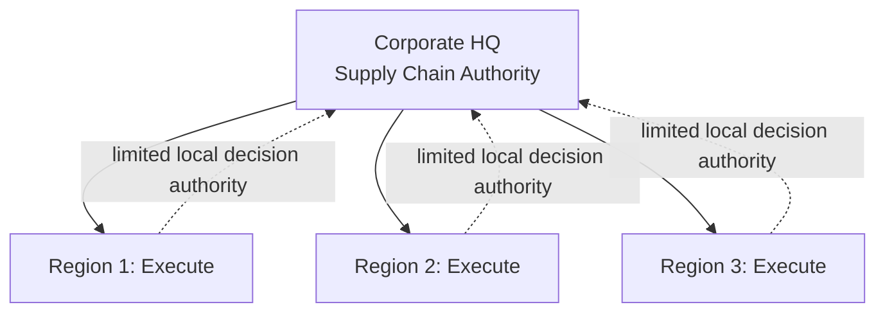
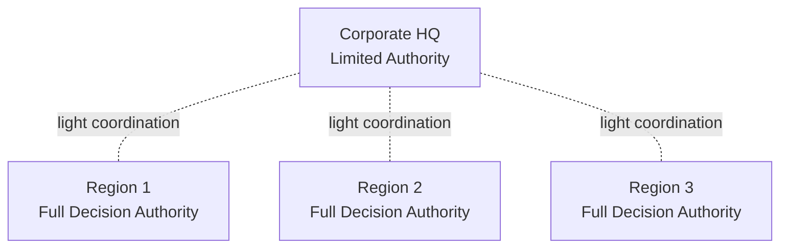
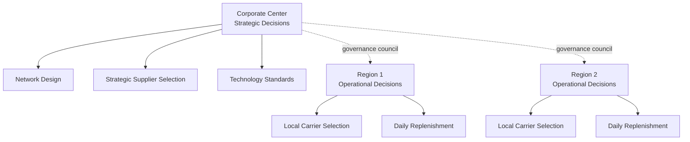

## Centralized, Decentralized, and Center-Led Governance Models

### Definition and Purpose

Governance models in supply chain architecture describe how decision-making authority for supply chain activities — procurement, planning, logistics, technology standards, supplier relationships — is distributed across corporate, regional, and business-unit levels. This is distinct from, though closely related to, *organizational structure* (reporting lines): governance concerns *where decisions get made and by whom*, while structure concerns *who reports to whom*. Three archetypal models — centralized, decentralized, and center-led (hybrid) — represent points along a single authority-distribution spectrum rather than fully discrete categories.

**Key Points**

- Governance model choice determines the trade-off between standardization/scale economies and local responsiveness/speed.
- The same organizational structure (e.g., a matrix) can operate under different governance models depending on where formal decision authority is assigned.
- Governance models are typically decided per *decision type* (e.g., supplier selection vs. daily replenishment) rather than uniformly across all supply chain decisions — this is the foundational logic behind the center-led model.

### Centralized Governance Model

In a centralized model, supply chain decisions across most or all categories are made by a single corporate group with authority over regional and business-unit execution.

#### Characteristics

- Decision authority: concentrated at corporate/global headquarters.
- Standardization: high — common processes, systems (e.g., single global ERP instance), and supplier contracts across the enterprise.
- Typical decisions centralized: strategic sourcing/supplier selection, network design, technology platform standards, global category strategy.

#### Strengths

- Economies of scale in procurement (consolidated purchasing volume negotiating leverage).
- Consistent processes and data standards, simplifying cross-enterprise reporting and benchmarking.
- Reduced duplication of effort (e.g., single negotiation team versus multiple regional teams negotiating with the same supplier).

#### Limitations

- Slower response to local market conditions, regulatory changes, or customer-specific requirements.
- [Inference] Because centralized decision-makers are structurally removed from front-line regional context, centralized models are generally considered less suited to businesses operating in highly heterogeneous markets (differing regulations, consumer preferences, or supplier bases by region), since the corporate group typically lacks the granular local information needed to make consistently good local trade-offs at speed.

### Decentralized Governance Model

In a decentralized model, supply chain decision authority is distributed to regional, country, or business-unit leaders, each operating with significant autonomy.

#### Characteristics

- Decision authority: distributed to regional/BU level.
- Standardization: low to moderate — each region/BU may run its own processes, supplier relationships, and often its own systems.
- Typical decisions decentralized: local supplier selection, regional inventory policy, local transportation carrier selection, region-specific promotions/demand response.

#### Strengths

- Fast local responsiveness to market-specific conditions and customer needs.
- Regional accountability is clear — a single regional leader owns both decision and outcome.
- Better suited to businesses with highly differentiated regional product lines, regulations, or customer bases.

#### Limitations

- Loss of scale economies — duplicated negotiations, systems, and processes across regions.
- Inconsistent data and metrics definitions across regions complicate enterprise-wide performance visibility and benchmarking.
- [Inference] Absent explicit coordination mechanisms, fully decentralized models are generally associated with a higher risk of regions independently selecting overlapping or conflicting suppliers/systems, since no single actor has visibility or authority across the full enterprise supplier base — this is a structural risk inherent to distributed decision authority rather than an outcome specific to any particular company.

### Center-Led (Hybrid) Governance Model

The center-led model explicitly splits decision authority by *decision type*: strategic and enterprise-wide decisions are centralized, while operational and execution decisions remain decentralized to regions/BUs. This model is widely presented in supply chain organizational design literature as the practical resolution to the centralization/decentralization trade-off for large, multi-region enterprises.

#### Characteristics

- Decision authority: split explicitly by category, typically documented via a RACI (Responsible, Accountable, Consulted, Informed) matrix or similar decision-rights framework.
- Center (corporate) typically owns: supplier strategy/selection for high-spend categories, network design, technology platform standards, enterprise risk policy.
- Regions/BUs typically own: daily execution, local carrier/supplier selection for low-spend/local categories, regional demand planning inputs, customer-facing service decisions.

#### Strengths

- Captures most scale economies (via centralized strategic sourcing and standards) while preserving local execution speed.
- [Inference] Because decision rights are explicit rather than implicit, center-led models generally reduce — though do not eliminate — the ambiguity and conflict risk associated with matrix reporting structures, provided the RACI or equivalent decision-rights documentation is actively maintained and enforced rather than merely defined once.

#### Limitations

- Requires ongoing governance discipline: decision-rights boundaries can blur over time without active maintenance, re-creating either de facto centralization (center overreach into operational decisions) or de facto decentralization (regions bypassing center on strategic decisions).
- Implementation complexity: requires clear documentation, communication, and enforcement mechanisms (governance councils, decision-rights matrices) that pure centralized or decentralized models do not need.

### Comparative Summary

| Dimension | Centralized | Decentralized | Center-Led (Hybrid) |
| --- | --- | --- | --- |
| Decision speed (local) | Slow | Fast | Fast for operational, slower for strategic |
| Scale economies | High | Low | High (for centralized categories) |
| Local responsiveness | Low | High | Moderate-to-high |
| Standardization | High | Low | High for strategic, low-moderate for operational |
| Governance complexity | Low | Low | High (requires active decision-rights management) |
| Best suited for | Homogeneous product/market, high-spend consolidation priority | Highly differentiated regional markets | Large, multi-region enterprises balancing both needs |

### Decision-Rights Allocation: Illustrative RACI Approach

**Key Points**

A commonly used mechanism for operationalizing center-led governance is a decision-rights matrix that classifies each supply chain decision category and assigns it explicitly:

| Decision Category | Corporate Center | Region/BU |
| --- | --- | --- |
| Global network/DC location strategy | Accountable | Consulted |
| Strategic supplier selection (top-spend categories) | Accountable | Consulted |
| Local/tail-spend supplier selection | Informed | Accountable |
| ERP/technology platform selection | Accountable | Informed |
| Daily inventory replenishment | Informed | Accountable |
| Regional demand forecasting inputs | Consulted | Accountable |
| Enterprise risk/compliance policy | Accountable | Responsible (execution) |

[Unverified] The specific category-to-authority mapping shown above is illustrative and reflects common practitioner conventions; actual decision-rights allocation varies significantly by company, industry, and the specific strategic priorities driving the governance design, so this table should be treated as a template pattern rather than a universal standard.

### Governance Model Selection Factors

**Key Points**

Organizations typically weigh several factors when selecting a governance model, though no single formula determines the "correct" choice:

- **Market/product homogeneity**: Highly standardized products/markets favor centralization; highly differentiated regional markets favor decentralization.
- **Spend concentration**: Categories with high spend and few global suppliers favor centralized negotiation leverage; low-spend, fragmented-supplier categories often remain decentralized regardless of overall governance philosophy.
- **Regulatory complexity**: Heavily regulated, region-specific industries (e.g., pharmaceuticals, food safety) often require decentralized compliance decision authority even within an otherwise centralized model.
- **Organizational maturity**: [Inference] Organizations with less mature cross-regional data/process standardization are generally considered less prepared to sustain a center-led model immediately, since center-led governance depends on the center having reliable enterprise-wide visibility to make informed strategic decisions — this typically implies centralization or decentralization as a more stable starting point, with migration toward center-led governance as data/process maturity develops.

### Practical Example

**Example**

A global industrial equipment manufacturer initially runs a decentralized model, with each regional business unit independently negotiating steel and electronic component contracts. As enterprise spend analysis reveals significant supplier overlap and lost volume-discount opportunities across regions, the company shifts to a center-led model: a global category management team now owns strategic sourcing for steel and electronics (high-spend, common-supplier categories), consolidating negotiating leverage and achieving material cost reduction, while regional plants retain full authority over local MRO (maintenance, repair, operations) supplies and daily production scheduling, since those categories have low cross-region supplier overlap and require fast local responsiveness that centralization would slow down.

### Conclusion

Centralized, decentralized, and center-led governance models represent points on a spectrum of supply chain decision-authority distribution, each with distinct trade-offs between standardization/scale economies and local responsiveness. The center-led hybrid model — splitting authority explicitly by decision category via structured decision-rights frameworks — has become the widely referenced approach for large, multi-region enterprises, but requires sustained governance discipline to prevent decision-rights ambiguity from eroding its intended balance over time.

**Next Steps / Related Topics**

- Organizational Structures for Supply Chain Functions
- RACI Matrices and Decision-Rights Frameworks
- Category Management and Strategic Sourcing Structures
- Chief Supply Chain Officer (CSCO) Role and Governance Councils
- Global vs. Regional ERP and Technology Standardization
- Supply Chain Analytics Maturity Models
- Multi-Echelon Supplier Risk and Compliance Management