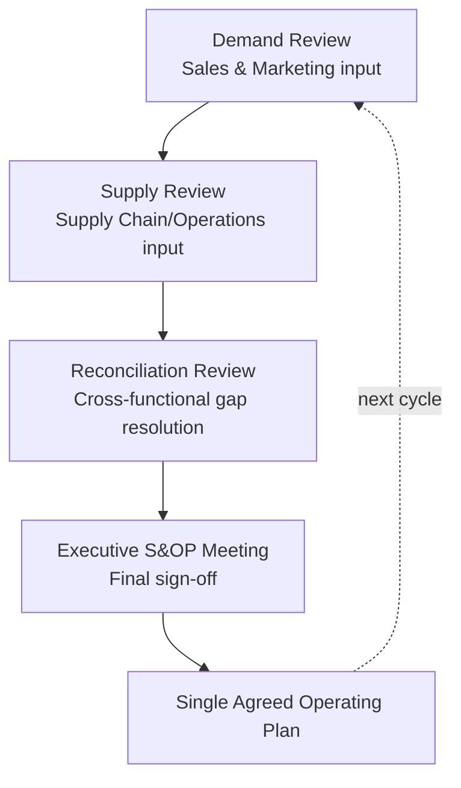
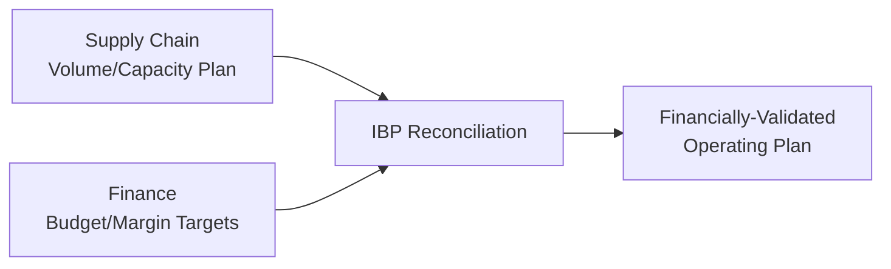
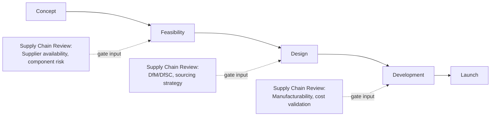

## Cross-Functional Integration with Sales, Finance, and Engineering

### Definition and Purpose

Cross-functional integration refers to the formal processes, governance mechanisms, and organizational practices that align supply chain decisions with the objectives and information of adjacent business functions — most centrally Sales (and Marketing), Finance, and Engineering (Product Development/R&D). Because supply chain outcomes (cost, service level, inventory) are jointly determined by decisions made in these other functions (demand commitments, budget constraints, product design choices), the literature treats integration not as optional collaboration but as a structural requirement for supply chain performance to be optimized at the enterprise level rather than sub-optimized within the supply chain function alone.

**Key Points**

- Poor cross-functional integration is widely cited as a root cause of the "bullwhip effect," inventory misalignment, and forecast inaccuracy, since supply chain planning depends on inputs (demand signals, financial constraints, product specifications) that originate outside the supply chain function itself.
- Integration mechanisms range from informal (ad hoc meetings) to highly formalized (structured processes like S&OP/IBP, stage-gate product development, with defined cadences, data inputs, and decision authority).
- Each functional relationship (Sales, Finance, Engineering) has a distinct integration challenge and a distinct set of established mechanisms, covered separately below.

### Integration with Sales (and Marketing)

#### The Core Tension

Sales/Marketing functions are typically incentivized toward revenue growth and customer service (e.g., maximizing product availability, supporting promotions), while supply chain functions are typically incentivized toward cost efficiency and asset utilization (e.g., minimizing inventory, maximizing production run efficiency) — creating a structural misalignment that integration mechanisms are designed to resolve.

#### Primary Integration Mechanism: Sales & Operations Planning (S&OP) / Integrated Business Planning (IBP)

S&OP is the most widely referenced formal process for Sales–Supply Chain integration: a recurring (typically monthly) cross-functional cycle that reconciles the demand plan (from Sales/Marketing) against the supply plan (from Supply Chain/Operations) and financial plan (from Finance), producing a single, agreed-upon operating plan.

**Key Points**

- The Demand Review consolidates the "unconstrained" demand forecast from Sales/Marketing (including promotions, new product launches, market intelligence).
- The Supply Review translates that demand into a supply/capacity plan and flags constraints (e.g., production capacity, supplier lead times) that may require demand-side adjustment.
- The Reconciliation Review is where genuine cross-functional trade-offs are surfaced and negotiated (e.g., "we cannot fully supply the promotional demand spike Sales is forecasting without expedited freight cost") before escalation to executives.
- IBP (Integrated Business Planning) is generally described in the literature as an evolution of S&OP that more tightly and explicitly incorporates the *financial* plan into the same cycle (see Finance integration below), rather than treating financial reconciliation as a separate downstream step.

#### Other Sales Integration Mechanisms

- Collaborative Planning, Forecasting, and Replenishment (CPFR): extends demand collaboration beyond internal Sales to external retail/customer partners, sharing point-of-sale data to jointly refine forecasts.
- Shared KPIs: aligning Sales and Supply Chain incentives on common metrics (e.g., perfect order rate, forecast accuracy) rather than purely functional metrics (Sales: revenue; Supply Chain: cost) to reduce goal conflict.

### Integration with Finance

#### The Core Tension

Finance functions are typically oriented toward capital efficiency, working capital optimization, and budget discipline, which can conflict with supply chain decisions that trade higher inventory or capacity investment for improved service levels or risk mitigation.

#### Primary Integration Points

- **Integrated Business Planning (IBP)**: As noted above, IBP explicitly folds financial plan reconciliation into the S&OP cycle — translating the agreed volume plan into revenue, cost, and margin projections within the same planning cadence, so financial implications of supply chain trade-offs are visible before final sign-off rather than discovered afterward.
- **Working Capital Metrics**: Cash-to-cash cycle time, inventory carrying cost, and days payable/receivable outstanding are jointly owned metrics requiring supply chain and finance collaboration — inventory policy decisions (safety stock levels, order quantities) directly drive working capital, making finance a required stakeholder in inventory strategy.
- **Total Cost of Ownership (TCO) Analysis**: Sourcing and network design decisions (e.g., near-shoring vs. offshoring, supplier selection) require joint supply chain/finance modeling to capture full cost impact beyond unit price (logistics cost, duty/tariff exposure, inventory carrying cost, risk-adjusted cost of disruption).
- **Capital Investment Governance**: Major supply chain infrastructure decisions (new distribution centers, automation investment, network redesign) typically require formal Finance-led capital approval processes (ROI/NPV analysis, capital committee review).

**Key Points**

- [Inference] Because inventory and capacity decisions have direct working-capital and P&L consequences, organizations that treat Finance as a downstream reporting recipient of supply chain plans rather than a co-owning stakeholder in the planning process are generally more prone to plans that are operationally feasible but financially unsustainable, or vice versa — this is a structural risk of sequential (non-integrated) planning rather than a claim about any specific organization.
- Standard practice in mature IBP processes is for Finance to validate the financial plan *within* the same monthly cycle as the volume plan, rather than as a separate, later budget review.

### Integration with Engineering (Product Development / R&D)

#### The Core Tension

Engineering/Product Development functions are typically oriented toward product performance, innovation speed, and feature differentiation, which can conflict with supply chain objectives around component standardization, supplier base simplification, and manufacturability — decisions made early in product design (often before supply chain has visibility) can lock in significant downstream cost and complexity.

#### Primary Integration Mechanism: Design for Supply Chain (DfSC) / Design for Manufacturability (DfM)

A structured practice embedding supply chain and manufacturing considerations directly into the product development process, typically via **stage-gate** (phase-gate) development processes with formal supply chain review checkpoints.

**Key Points**

- Early involvement is the central principle: supply chain input on component sourceability, lead time, and cost is most valuable at the Concept/Feasibility stages, since design decisions become progressively more costly to change as development proceeds — a widely cited principle in product development and DfM literature (often summarized as the majority of a product's lifecycle cost being effectively "locked in" by early design decisions, even though the exact percentage figures cited vary by source and should be treated as illustrative rather than a precise universal statistic).
- Common formal roles bridging this integration include Supply Chain/Sourcing Engineers embedded in product development teams, and formal Bill of Materials (BOM) review processes involving both Engineering and Procurement before design freeze.
- Component/platform standardization initiatives (reducing the number of unique parts across product lines) require joint Engineering-Supply Chain governance, since Engineering controls specification while Supply Chain holds visibility into supplier cost/risk implications of part proliferation.

#### Other Engineering Integration Mechanisms

- **Should-cost modeling**: Supply chain/procurement builds independent cost models for components to inform Engineering's design trade-off decisions (e.g., material substitution) with quantified cost impact.
- **Supplier involvement in design**: Early Supplier Involvement (ESI) programs bring key suppliers into the design process directly, requiring supply chain to broker the Engineering-supplier relationship.

### Comparative Summary of Integration Mechanisms

| Function | Core Tension | Primary Formal Mechanism | Typical Cadence |
| --- | --- | --- | --- |
| Sales/Marketing | Service/growth vs. cost efficiency | S&OP / IBP Demand-Supply Reconciliation | Monthly |
| Finance | Capital discipline vs. service/risk investment | IBP financial reconciliation, TCO analysis, capital governance | Monthly (IBP) / Project-based (capital) |
| Engineering | Innovation/differentiation vs. manufacturability/standardization | Stage-gate DfSC/DfM reviews, BOM governance | Per product development milestone |

### Governance Structures Supporting Integration

**Key Points**

- **Executive S&OP/IBP forum**: Cross-functional leadership (Sales, Finance, Supply Chain, and often Engineering for new product introduction cycles) meets on a fixed cadence with formal decision authority to resolve cross-functional trade-offs, rather than leaving resolution to informal escalation.
- **Embedded liaison roles**: Some organizations place supply chain planners or sourcing engineers organizationally within Sales or Engineering teams (or vice versa) to maintain continuous informal information flow between formal planning cycles.
- **Shared/aligned metrics and incentive design**: [Inference] Structural incentive misalignment (e.g., Sales measured purely on revenue, Finance purely on cost reduction, Supply Chain purely on service level) is generally understood in cross-functional integration literature to undermine even well-designed formal processes like S&OP, since individuals will tend to optimize for what they are measured on regardless of process design — this is presented as a reason shared or jointly-weighted KPIs are commonly recommended alongside formal integration processes, not as a guarantee that shared metrics alone resolve all coordination challenges.

### Practical Example

**Example**

A consumer electronics company is developing a new product line. Engineering initially specifies a proprietary connector component to enable a differentiated feature. During the Feasibility gate review, an embedded sourcing engineer flags that the component has only one qualified global supplier with 16-week lead times and volatile pricing. Supply chain proposes an alternative connector already used in two other product lines (enabling shared supplier volume and existing qualified inventory). Engineering and Supply Chain jointly evaluate the trade-off: the standardized component slightly reduces the differentiating feature's performance but eliminates single-source supply risk and reduces landed cost. Finance's TCO model confirms the standardized option improves margin once total supply risk exposure is factored in. The decision is finalized at the Design gate review — well before tooling investment, when the change would have been substantially more costly to make.

### Conclusion

Cross-functional integration with Sales, Finance, and Engineering is a structural requirement for effective supply chain architecture, since supply chain performance is jointly determined by demand commitments (Sales), capital and cost constraints (Finance), and product design decisions (Engineering) made outside the supply chain function itself. Mature organizations formalize this integration through recurring structured processes — S&OP/IBP for Sales and Finance, and stage-gate DfSC/DfM reviews for Engineering — supported by shared metrics and, in some cases, embedded liaison roles, rather than relying on informal, ad hoc coordination.

**Next Steps / Related Topics**

- Sales & Operations Planning (S&OP) and Integrated Business Planning (IBP) Processes
- Design for Manufacturability (DfM) and Design for Supply Chain (DfSC)
- Total Cost of Ownership (TCO) Analysis in Sourcing Decisions
- Stage-Gate Product Development Processes
- Balanced Scorecard Approaches for Supply Chains
- Organizational Structures for Supply Chain Functions
- Bullwhip Effect Causes and Mitigation