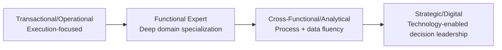
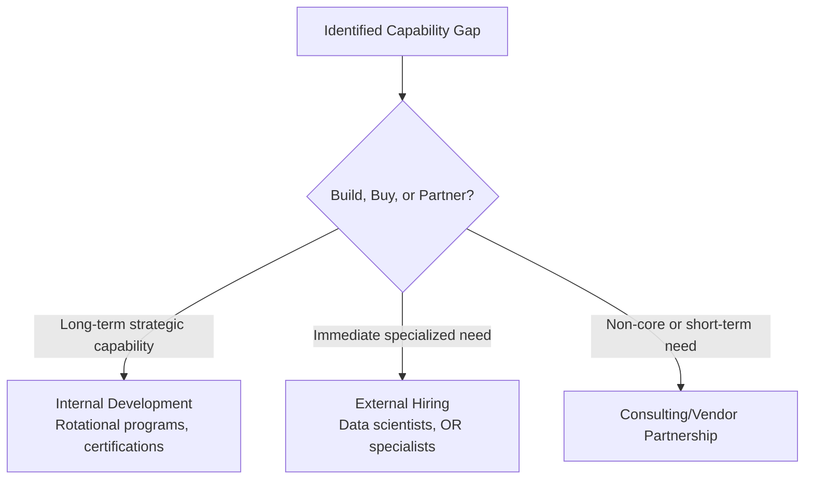

## Talent, Skills, and Workforce Evolution

### Definition and Purpose

Talent, skills, and workforce evolution in supply chain architecture refers to how organizations identify, develop, and structure the human capabilities required to design, operate, and continuously improve increasingly complex, technology-enabled, and globally distributed supply chains. As supply chains have shifted from largely transactional, execution-focused functions toward strategic, analytics-driven, and digitally integrated capabilities, the required workforce competency profile has shifted correspondingly — a trend widely documented across supply chain workforce and talent-strategy literature (APICS/ASCM, Gartner, and academic supply chain management research).

**Key Points**

- Talent strategy is treated as a structural enabler of supply chain architecture, not a separate HR concern — the sophistication of an organization's supply chain design (e.g., pursuing prescriptive analytics or center-led governance) is generally constrained by whether it has the talent to operate that design.
- Workforce evolution in this domain is typically described along two intersecting axes: (1) a shift from purely operational/transactional skills toward strategic and analytical skills, and (2) a shift from siloed functional expertise toward cross-functional and digitally fluent competency.
- [Inference] Because supply chain talent requirements are evolving faster than traditional academic curricula in some assessments, many organizations report a persistent skills gap in specific technical competencies (particularly data science/analytics), though the precise magnitude of this gap is difficult to state as a stable, universally agreed-upon fact and is better treated as a widely reported directional trend than a fixed statistic.

### Evolution of Required Competencies

#### From Traditional to Digital/Analytical Skill Profiles

| Traditional Supply Chain Competency | Emerging/Evolved Competency |
| --- | --- |
| Transactional procurement/order processing | Strategic sourcing and category management |
| Manual demand forecasting (spreadsheet-based) | Statistical/ML-based demand planning |
| Reactive expediting and firefighting | Predictive/prescriptive risk management |
| Siloed functional execution | Cross-functional process ownership (S&OP/IBP) |
| ERP data entry and basic reporting | Data analytics, visualization, and data storytelling |
| Manual route/inventory planning | Optimization modeling and digital twin simulation |

**Key Points**

- This progression broadly mirrors the descriptive→diagnostic→predictive→prescriptive analytics maturity continuum: as organizations climb the analytics maturity curve, the workforce operating within that environment requires correspondingly higher-order analytical and technical skills to interpret and act on more sophisticated outputs.
- The shift is not a wholesale replacement of traditional skills but an *addition* of new competency layers on top of continued need for domain expertise (e.g., understanding physical logistics constraints remains necessary even as analytics sophistication increases).

### Core Competency Categories for Modern Supply Chain Talent

#### 1. Technical/Analytical Competencies

- Data analysis and statistical literacy (interpreting forecast accuracy metrics, variance analysis).
- Proficiency with analytics/BI tools (Power BI, Tableau, SQL) and, increasingly, familiarity with machine learning concepts even for non-data-scientist roles.
- Systems fluency: ERP (SAP, Oracle), planning systems (APS/IBP platforms), TMS/WMS.

#### 2. Process and Domain Competencies

- Deep functional knowledge (procurement, logistics, manufacturing planning) remains foundational — analytics without domain context risks producing technically valid but operationally meaningless recommendations.
- Process design and improvement methodology fluency (Lean, Six Sigma, PDCA) to translate insight into operational change.

#### 3. Cross-Functional and Strategic Competencies

- Ability to operate within cross-functional governance structures (S&OP/IBP participation, stakeholder negotiation across Sales/Finance/Engineering).
- Commercial and financial literacy — understanding cost/margin/working-capital implications of supply chain decisions, not just operational metrics in isolation.

#### 4. Change Management and Digital Adoption Competencies

- Ability to lead or support technology adoption (new planning systems, automation, control towers) including managing organizational resistance.
- [Inference] As supply chain decisions increasingly involve AI/ML-driven recommendations (e.g., prescriptive analytics), the ability to critically evaluate and appropriately trust or challenge model outputs — sometimes referred to in workforce literature as "algorithmic literacy" — is an emerging competency need, though as an emerging area, specific skill definitions and assessment standards for it are less standardized across sources than for more established competencies like process improvement methodology.

### Organizational Approaches to Building Talent

#### Build (Internal Development)

- Structured career pathing and rotational programs moving talent across functions (procurement → planning → logistics) to build the cross-functional fluency increasingly required for senior supply chain roles.
- Internal upskilling programs, often centered on analytics/digital tool certification, partnered with professional bodies (APICS/ASCM certifications such as CPIM, CSCP, CLTD).
- Mentorship and communities of practice connecting experienced functional experts with newer analytically-trained staff to transfer domain knowledge alongside technical skill development.

#### Buy (External Hiring)

- Direct hiring of data scientists/analysts into supply chain functions (rather than solely relying on IT/central analytics teams) to embed analytical capability close to operational decision-making.
- Hiring from adjacent industries or disciplines (e.g., operations research, industrial engineering) to bring in specialized optimization/modeling expertise not traditionally present in supply chain functions.

#### Partner/Augment

- Outsourcing or co-sourcing specialized analytical work (e.g., network optimization modeling) to consulting firms or specialized analytics vendors where building deep internal capability is not cost-justified for the organization's scale.
- Technology-vendor-provided training and managed services as a bridge while internal capability develops.

### Professional Certification and Credentialing Landscape

| Certification | Issuing Body | Primary Focus |
| --- | --- | --- |
| CPIM (Certified in Planning and Inventory Management) | ASCM (formerly APICS) | Production and inventory management fundamentals |
| CSCP (Certified Supply Chain Professional) | ASCM | End-to-end supply chain management |
| CLTD (Certified in Logistics, Transportation and Distribution) | ASCM | Logistics and distribution specialization |
| SCPro | CSCMP | Applied supply chain strategy and project-based competency |

[Unverified] The relative market value or employer preference among these certifications varies by industry, region, and specific role, and is not something that can be stated as a single universal ranking from the certification frameworks themselves.

### Organizational Structures Supporting Talent Evolution

**Key Points**

- **Rotational leadership development programs**: Common in large organizations to deliberately build the cross-functional breadth (procurement, planning, logistics, and increasingly analytics) that senior integrated supply chain roles (see Organizational Structures topic) require.
- **Centers of Excellence (CoE)**: Specialized analytics/digital talent is often organized into a central CoE that provides modeling/analytics capability as a shared service to multiple business units or functions, balancing scarce specialized talent against distributed organizational need — this mirrors the "center-led" governance logic applied specifically to talent deployment rather than decision authority.
- **Embedded analyst roles**: Alternative or complementary to a CoE model, some organizations embed data analysts directly within functional teams (e.g., a dedicated planning analyst within the demand planning team) to maintain close domain-context connection, trading some scale efficiency for tighter integration.

### Workforce Evolution Challenges

**Key Points**

- **Skills gap and talent scarcity**: Widely reported difficulty sourcing talent with the combined profile of supply chain domain knowledge *and* data/analytics fluency, since these skill sets have traditionally been developed in separate academic and career tracks.
- **Legacy workforce transition**: Organizations with large incumbent workforces built around traditional/transactional skill profiles face genuine reskilling and change-management challenges — this is a documented organizational challenge distinct from simply hiring new talent, and involves considerations of workforce morale, role redesign, and retention that are not addressed by hiring strategy alone.
- **Retention in high-demand technical roles**: [Inference] Because analytics and data science talent is in demand across many industries beyond supply chain specifically, organizations building supply-chain-embedded analytics capability often report retention as a distinct challenge from initial hiring, since specialized technical staff may have more externally competitive alternatives than traditional supply chain career tracks have historically had to compete against.
- **Aligning talent strategy with organizational structure**: Building advanced analytical talent without corresponding structural changes (see Organizational Structures and Governance Models topics) — e.g., hiring data scientists but leaving decision authority fully siloed in traditional functional roles — risks underutilizing the new capability, since organizational structure determines whether analytical insight actually reaches decision-makers with authority to act on it.

### Practical Example

**Example**

A mid-sized manufacturer recognizes that its demand planning process, run entirely on spreadsheets by planners without statistical training, is producing poor forecast accuracy. Rather than a single hiring decision, the company pursues a blended talent strategy: it hires two data scientists into a small central analytics Center of Excellence to build and maintain statistical forecasting models (buy), enrolls existing planners in CPIM certification and internal data-literacy training so they can interpret and act on model outputs rather than being bypassed by them (build), and engages a consulting partner for the initial six-month model-building and change-management effort (partner). Critically, the company also restructures planner roles and KPIs to explicitly include forecast-model oversight and exception management, ensuring the new analytical capability is embedded into actual decision authority rather than existing as a parallel, disconnected function.

### Conclusion

Talent, skills, and workforce evolution is a foundational enabler of supply chain architecture, since the sophistication of analytics maturity, governance models, and organizational structures an enterprise can effectively operate is bounded by its workforce's capability to execute within them. Organizations increasingly pursue blended build/buy/partner talent strategies to bridge the gap between traditional operational/functional skill profiles and emerging analytical, cross-functional, and digital competencies — but sustainable capability building requires pairing talent development with corresponding structural and governance changes, since new skills without corresponding decision authority tend to be underutilized.

**Next Steps / Related Topics**

- Supply Chain Analytics Maturity Models
- Organizational Structures for Supply Chain Functions
- Centralized, Decentralized, and Center-Led Governance Models
- Professional Certification Pathways (CPIM, CSCP, CLTD, SCPro)
- Change Management for Digital/AI Adoption in Operations
- Centers of Excellence (CoE) Operating Models
- Sales & Operations Planning (S&OP) Cross-Functional Skill Requirements