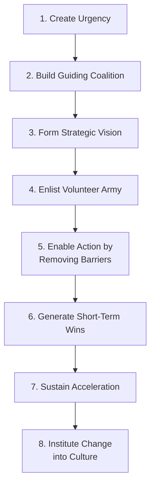
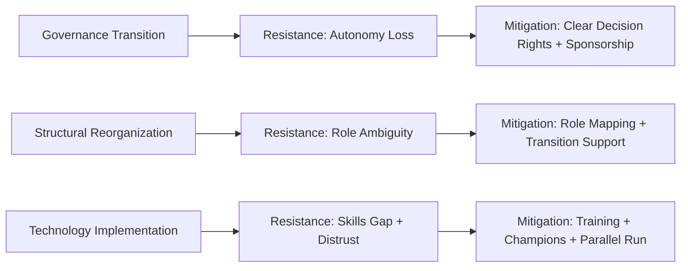

## Change Management for Architecture Transformation

### Definition and Purpose

Change management for architecture transformation refers to the structured discipline of planning, executing, and sustaining the human and organizational side of major supply chain architecture initiatives — restructuring governance models, redesigning organizational structures, implementing new digital/analytics platforms, or shifting operating models (e.g., decentralized to center-led). While architecture transformation projects are often specified in technical or structural terms (new reporting lines, new systems, new processes), their success is widely documented in change management literature as depending substantially on how well the affected workforce adopts, sustains, and does not silently revert the intended changes.

**Key Points**

- Change management is distinct from *project management*: project management governs scope, timeline, and technical deliverables, while change management governs stakeholder adoption, communication, and behavioral sustainment of those deliverables.
- Supply chain architecture transformations are typically high-complexity change efforts because they simultaneously affect structure (reporting lines), process (how work gets done), technology (systems used), and sometimes governance (who decides what) — compounding the change management challenge relative to a single-dimension change.
- A commonly cited finding across general organizational change literature is that a substantial proportion of large-scale transformation initiatives fail to achieve their intended objectives, with insufficient attention to the people/adoption dimension frequently cited as a contributing factor; however, specific failure-rate statistics vary across studies and sources, so such figures should be treated as illustrative of a widely-discussed risk rather than a single precise, universally agreed benchmark.

### Common Change Management Frameworks Applied to Supply Chain Transformation

#### Kotter's 8-Step Change Model

A widely referenced sequential framework (John Kotter) frequently applied to large organizational transformations, including supply chain restructuring:

**Key Points**

- Step 1 (Create Urgency) in supply chain contexts typically involves quantifying the cost of the current-state gap — e.g., demonstrating via benchmarking (see Benchmarking and Continuous Improvement topic) that current performance materially lags best-in-class, to build the case for structural change.
- Step 6 (Short-Term Wins) is particularly emphasized in multi-year architecture transformations (e.g., a multi-phase center-led governance rollout), since delivering visible, credible early results in a pilot region or function helps sustain organizational buy-in for later phases.
- Step 8 (Institute Change into Culture) is the step most directly tied to preventing reversion — without embedding the new structure/process into performance management, hiring, and promotion criteria, organizations risk drifting back toward prior informal practices once initial change-management attention fades.

#### ADKAR Model

A goal-oriented, individual-level change model (Prosci) frequently used to diagnose *where* in the adoption process resistance or failure is occurring, complementing Kotter's more organization-level sequencing:

- **Awareness** — of the need for change.
- **Desire** — to participate and support the change.
- **Knowledge** — of how to change (new processes, systems, roles).
- **Ability** — to implement required skills and behaviors.
- **Reinforcement** — to sustain the change over time.

**Key Points**

- ADKAR is frequently used as a diagnostic checklist: if a transformation (e.g., moving to a center-led governance model) stalls, ADKAR helps identify *which* element is missing — e.g., regional managers may have Awareness and Desire but lack the Knowledge (unclear new decision-rights) or Ability (no training on new systems) needed to actually change behavior.
- [Inference] Because the five ADKAR elements are described as sequential and individually necessary, a common diagnostic implication drawn in change management practice is that a transformation with strong communication (Awareness/Desire) but insufficient training or tooling (Ability) is unlikely to reach sustained behavioral change through greater vision-selling alone — the gap is more accurately described as capability rather than motivation, and closing it typically requires different interventions.

### Applying Change Management to Specific Architecture Transformation Types

#### Governance Model Transitions (e.g., Decentralized → Center-Led)

- Primary resistance source: regional/BU leaders perceiving loss of autonomy and decision authority.
- Typical mitigation: clear, documented decision-rights frameworks (RACI matrices, see Centralized/Decentralized/Center-Led Governance topic) communicated *before* implementation, plus visible executive sponsorship reinforcing the new authority boundaries when tested.

#### Organizational Restructuring (e.g., Functional Silos → Integrated CSCO Structure)

- Primary resistance source: role ambiguity and career-path uncertainty among mid-level managers whose reporting lines or scope change.
- Typical mitigation: transparent role-mapping communication early in the process, transition support (redeployment, retraining) for affected staff, and phased rather than "big bang" restructuring where feasible to allow adjustment.

#### Technology/Digital Platform Implementation (e.g., New ERP, Analytics Platform, Control Tower)

- Primary resistance source: skills gap (see Talent, Skills, and Workforce Evolution topic) and workflow disruption during transition, plus distrust of new analytical outputs ("black box" resistance) among staff accustomed to manual/experience-based decision-making.
- Typical mitigation: structured training programs aligned to specific new-system workflows, parallel-run periods where feasible, and visible "champion" users who model successful adoption to peers.

### Stakeholder Analysis and Communication Planning

**Key Points**

A structured stakeholder analysis is a standard early step in change management practice, typically mapping affected groups by their level of influence and their current disposition toward the change:

| Stakeholder Group | Influence Level | Typical Disposition in Governance/Structure Change | Engagement Priority |
| --- | --- | --- | --- |
| Executive sponsors | High | Generally supportive (initiators) | Maintain visible sponsorship throughout |
| Regional/functional leaders (losing autonomy) | High | Often resistant initially | High-touch, early, individualized engagement |
| Mid-level managers (role change) | Medium | Mixed; often anxious about role clarity | Structured communication + transition support |
| Frontline staff (process/tool change) | Lower individual influence, high collective impact | Mixed; concerned about workflow disruption | Training-focused, peer-champion engagement |
| Adjacent functions (Sales, Finance, Engineering) | Medium-High | Depends on how transformation affects their interface points | Cross-functional briefing, integration touchpoints |

- A commonly used communication cadence principle in change management practice is that messaging must be repeated through multiple channels and by multiple messengers (not just a single announcement) — this reflects general findings in organizational communication research that single-exposure communication is generally insufficient to drive sustained behavioral change, though this specific communication-frequency principle is a general change-management convention rather than a claim about a specific empirical study.

### Governance Structures for Managing the Transformation Itself

- **Transformation Steering Committee**: Senior cross-functional leadership (mirroring the S&OP/IBP governance logic) with formal authority to resolve transformation-related conflicts and approve phase transitions.
- **Change Champion Network**: Distributed representatives embedded within affected functions/regions who provide two-way communication — surfacing frontline concerns upward and reinforcing messaging downward — complementing top-down executive communication.
- **Transition/Program Management Office (PMO)**: Coordinates the technical/project management workstream (timeline, resourcing, milestones) in parallel with the change management workstream, since the two must be sequenced together (e.g., training must complete before go-live, not after).

### Measuring Change Adoption

**Key Points**

Unlike project delivery metrics (on-time, on-budget), change adoption requires distinct measurement approaches:

- **Leading indicators**: training completion rates, system login/usage rates, stakeholder survey sentiment (pre/post).
- **Lagging indicators**: sustained process compliance (e.g., percentage of decisions actually routed through the new decision-rights framework rather than informally bypassed), performance metric improvement attributable to the new architecture (re-benchmarking, see Benchmarking and Continuous Improvement topic).
- [Inference] Because early enthusiasm often exceeds sustained behavioral change, change management practice generally treats adoption measurement taken only immediately post-implementation as insufficient on its own — sustained measurement at multiple intervals (e.g., 30/60/90 days and beyond) is commonly recommended specifically to detect reversion to prior practices before it becomes entrenched, though the exact measurement cadence varies by organization and initiative.

### Practical Example

**Example**

A global manufacturer transitions from a decentralized procurement model to a center-led model, centralizing strategic sourcing for top-spend categories under a new global category management team. Using Kotter's framework, the transformation team first builds urgency by presenting benchmarking data showing the company's raw material costs run meaningfully above industry median due to fragmented regional purchasing (Step 1), forms a guiding coalition of regional VPs and the incoming Chief Procurement Officer (Step 2), and pilots the new model in one region before global rollout to generate an early, quantifiable cost-savings win (Step 6) that is then used as evidence in communicating to remaining regions. In parallel, an ADKAR-based diagnostic identifies that while regional buyers have Awareness and Desire for the change (having seen the pilot's results), they lack Knowledge of the new RACI-defined decision boundaries — prompting a targeted training and documentation effort rather than additional vision-communication, since the diagnosed gap was capability-related, not motivational.

### Conclusion

Change management for architecture transformation addresses the human-adoption dimension of supply chain restructuring, governance redesign, and technology implementation — a dimension widely treated in the literature as at least as consequential to transformation success as the technical design itself. Structured frameworks such as Kotter's 8-Step Model (organizational sequencing) and ADKAR (individual-level diagnosis) provide complementary lenses, but sustained success generally depends on embedding the change into ongoing performance management, governance, and measurement systems — preventing the common failure mode of initial adoption followed by gradual reversion to prior practices once explicit change-management attention subsides.

**Next Steps / Related Topics**

- Organizational Structures for Supply Chain Functions
- Centralized, Decentralized, and Center-Led Governance Models
- Talent, Skills, and Workforce Evolution
- Benchmarking and Continuous Improvement
- RACI Matrices and Decision-Rights Frameworks
- Kotter's 8-Step Change Model and ADKAR in Digital Transformation
- Stakeholder Analysis and Communication Planning Methodologies