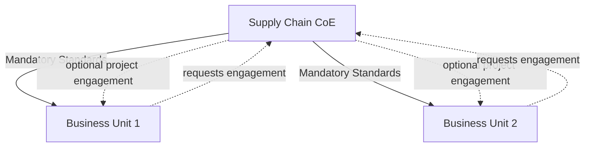
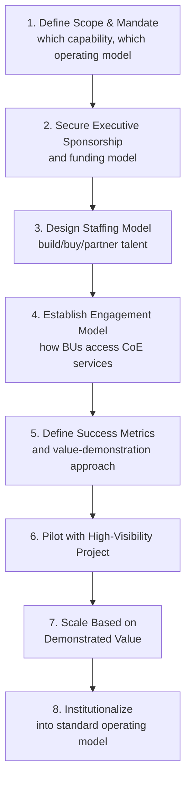

## Building a Supply Chain Center of Excellence

### Definition and Purpose

A Supply Chain Center of Excellence (CoE) is a dedicated, centrally organized unit that develops deep specialized capability — typically in areas such as analytics, network design, process standardization, or specific technology platforms — and provides that capability as a shared service to multiple business units, regions, or functions across the enterprise. The CoE model is a specific organizational design pattern that addresses a common tension already introduced in earlier topics: how to build scarce, high-value specialized talent and capability once, centrally, while still making it accessible to a distributed, potentially decentralized or center-led organization.

**Key Points**

- A CoE is distinct from a purely centralized functional department: a CoE's defining characteristic is that it operates as an internal *service provider* to other parts of the organization (with defined engagement models) rather than holding direct line authority over regional/BU operations.
- CoEs are commonly established for capability areas that are (a) strategically important, (b) require scarce/specialized expertise not economical to replicate in every business unit, and (c) benefit from standardized methodology across the enterprise — network design and advanced analytics are frequently cited examples in supply chain contexts.
- The CoE model directly extends the "center-led" governance logic (see Centralized/Decentralized/Center-Led Governance topic) applied specifically to *talent and capability deployment* rather than decision authority, though the two are often implemented together.

### Common Types of Supply Chain CoEs

| CoE Type | Typical Scope | Representative Deliverables |
| --- | --- | --- |
| Analytics/Data Science CoE | Statistical forecasting, ML model development, prescriptive optimization | Demand forecasting models, network optimization studies |
| Network Design CoE | Distribution network modeling, facility location, capacity planning | Network redesign scenarios, footprint optimization studies |
| Procurement/Category Management CoE | Strategic sourcing methodology, spend analytics, supplier risk frameworks | Category strategies, supplier scorecards, should-cost models |
| Process Excellence/Lean-Six Sigma CoE | Continuous improvement methodology, process standardization | Kaizen facilitation, DMAIC project support, SCOR process documentation |
| Digital/Technology CoE | ERP/APS platform standards, RPA, control tower technology | System configuration standards, digital tool rollout support |

[Unverified] Organizations vary considerably in how many of these CoE types they consolidate into a single "Supply Chain CoE" versus maintaining as separate specialized centers; there is no single standard taxonomy across the literature for exactly which capabilities belong together in one CoE versus multiple.

### CoE Operating Models

CoEs are generally described in organizational design literature as operating under one of a few engagement models, each with different resourcing and authority implications:

#### Consulting/Service Model

The CoE operates as an internal consultancy: business units request engagements (e.g., "help us redesign our regional distribution network"), and the CoE allocates specialized resources on a project basis, typically without any ongoing authority over the requesting unit's operations.

#### Governance/Standard-Setting Model

The CoE defines mandatory standards, methodologies, or tools that business units must adopt (e.g., a single approved demand-forecasting methodology or platform), functioning closer to a centralized authority for that specific capability domain even if it lacks broader line authority.

#### Hybrid Model

The CoE combines both: it sets certain mandatory standards (e.g., required data definitions for cross-enterprise comparability) while offering consulting-style engagement for discretionary, business-unit-initiated project work.

**Key Points**

- [Inference] The choice between consulting and governance/standard-setting models generally involves a trade-off between business-unit adoption willingness and enterprise-wide consistency: a pure consulting model preserves business-unit autonomy (higher likely willingness to engage) but risks inconsistent adoption of best practices across units, while a governance model ensures consistency but requires stronger executive mandate to enforce compliance, particularly in organizations with a historically decentralized culture.
- The hybrid model is frequently presented in practitioner literature as a practical middle path, mirroring the same logic used in center-led governance design (mandate what requires enterprise consistency; offer as a service what does not).

### Building the CoE: Structured Development Process

**Key Points**

- **Step 1 (Scope & Mandate)**: A common early failure mode noted in CoE design literature is launching with an ambiguous or overly broad mandate ("improve supply chain analytics enterprise-wide") rather than a specific, demonstrable capability focus — clear scoping is generally considered necessary to allow the CoE to build credible early wins.
- **Step 2 (Executive Sponsorship)**: Because a CoE typically lacks direct line authority over the business units it serves, [Inference] its influence is generally understood to depend substantially on visible senior sponsorship and a clear funding mandate (whether centrally funded, or funded via chargeback to engaging business units), since without either mechanism business units have limited structural incentive to engage a unit that has no authority over them.
- **Step 6 (Pilot with High-Visibility Project)**: Mirrors the "short-term wins" principle from change management frameworks (see Change Management for Architecture Transformation topic) — CoEs commonly launch with a single high-value, high-visibility engagement to build credibility before broader rollout, rather than attempting enterprise-wide simultaneous engagement.

### Staffing and Talent Considerations

**Key Points**

- CoE staffing typically blends deep technical/analytical specialists (data scientists, optimization modelers, Lean Six Sigma black belts) with staff who retain strong domain/business context, since purely technical staff without supply chain domain grounding risk producing analytically sound but operationally impractical recommendations — a recurring theme connecting back to the Talent, Skills, and Workforce Evolution topic's emphasis on combined domain-plus-analytical competency.
- Rotational assignments (staff spending time in a CoE before returning to a business-unit role, or vice versa) are a commonly cited mechanism for building the cross-functional talent pipeline while also embedding CoE-developed standards and methodology into business-unit teams via personnel that have worked in both environments.
- CoE leadership roles generally require both technical credibility (to earn trust from specialist staff) and internal consulting/influencing skill (to earn engagement from business units that have no obligation to use the CoE's services under a pure consulting model).

### Measuring CoE Value and Success

Because a CoE typically does not directly own P&L or operational metrics (those remain with the business units it serves), demonstrating value requires a different measurement approach than a standard operating function:

| Metric Category | Example Metrics |
| --- | --- |
| Engagement/Utilization | Number of projects/engagements per period, business-unit adoption rate of standards |
| Attributed Value | Quantified cost savings, service-level improvement, or risk reduction attributed to CoE-led projects |
| Capability Building | Number of staff trained/certified in CoE-developed methodologies, internal satisfaction/NPS from engaging business units |
| Standardization Progress | Percentage of business units using common data definitions, tools, or processes set by the CoE |

[Unverified] Precisely attributing business outcomes (e.g., cost savings) to a CoE's specific contribution versus other concurrent operational changes is a general measurement challenge noted in CoE and shared-services literature, and there is no single standardized attribution methodology universally used across organizations.

### Common Challenges in CoE Implementation

**Key Points**

- **Relevance/credibility gap**: A CoE perceived by business units as disconnected from operational reality (too academic/theoretical) risks low engagement under a consulting model, reinforcing the importance of staffing with domain-experienced personnel, not purely technical specialists.
- **Capacity constraints**: Because CoEs are intentionally centralized and typically smaller than the aggregate demand across all business units, prioritization and queueing of engagement requests is a common operational challenge, requiring clear intake/prioritization governance (often tied back to the same executive steering mechanisms used in transformation governance).
- **Mandate erosion or overreach**: Over time, a CoE's scope can drift — either shrinking (business units routing around it if perceived as slow or low-value) or overreaching into operational decision authority it was not designed to hold, echoing the same "decision-rights boundary maintenance" challenge noted for center-led governance models generally.
- **Funding model tension**: [Inference] Centrally-funded CoEs face less direct pressure to demonstrate per-engagement ROI but may have less business-unit-perceived accountability, while chargeback-funded CoEs face the opposite trade-off — this is a structural funding-model trade-off commonly discussed in shared-services and CoE design literature rather than an indication that one funding approach is universally superior.

### Practical Example

**Example**

A multinational retailer establishes a Network Design and Analytics CoE, staffed with six optimization modelers and data scientists reporting to a central VP of Supply Chain Analytics, operating under a hybrid model: the CoE mandates a single standard data taxonomy for inventory and transportation data across all regions (governance model), while offering discretionary network-optimization project engagements to regional business units on a first-come, prioritized basis (consulting model). The CoE pilots with its highest-visibility engagement — a network redesign study for the largest region — quantifying a material reduction in transportation cost through consolidated distribution center footprint. This documented result is then used to build a queue of engagement requests from other regions, and the CoE's central funding is subsequently supplemented with a partial chargeback model as demand outstrips centrally-funded capacity, formalizing a prioritization governance process to manage the resulting engagement backlog.

### Conclusion

A Supply Chain Center of Excellence provides a structural mechanism for concentrating scarce, specialized capability — analytics, network design, category management, process excellence — and deploying it across a distributed organization without requiring every business unit to replicate that expertise independently. Successful CoE implementation depends on clear scope definition, appropriate operating-model selection (consulting, governance, or hybrid), sustained executive sponsorship, and staffing that combines technical depth with operational domain credibility, with common failure modes centering on ambiguous mandate, insufficient sponsorship, or gradual erosion of the CoE's defined decision-rights boundary.

**Next Steps / Related Topics**

- Centralized, Decentralized, and Center-Led Governance Models
- Talent, Skills, and Workforce Evolution
- Supply Chain Analytics Maturity Models
- Change Management for Architecture Transformation
- Organizational Structures for Supply Chain Functions
- Network Design and Distribution Footprint Optimization
- Shared Services and Chargeback Funding Models