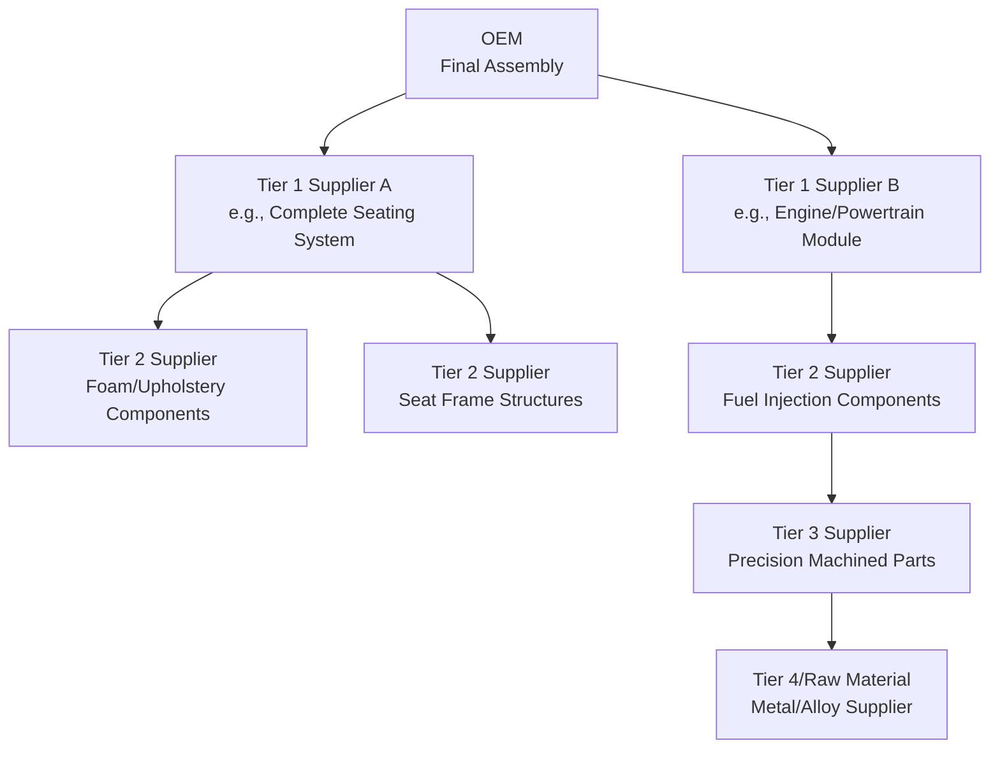
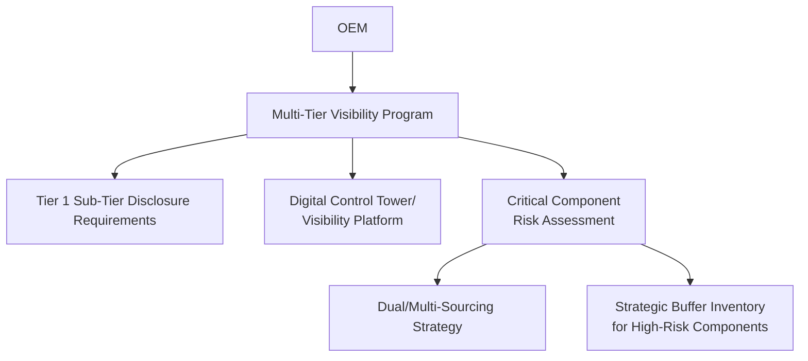

## Automotive and Aerospace Tiered Supplier Networks

### Definition and Purpose

Tiered supplier networks are a structural approach to organizing supply base complexity in which an Original Equipment Manufacturer (OEM) manages a relatively small number of direct, high-capability suppliers (Tier 1), who in turn manage their own supplier networks (Tier 2, Tier 3, and beyond) for sub-components and raw materials. This architecture is most extensively developed and documented in the automotive and aerospace industries, where product complexity, safety-criticality, and long product lifecycles make flat, direct-to-OEM sourcing of every component structurally impractical.

**Key Points**

- The tiering structure exists primarily to manage complexity: an OEM assembling a vehicle or aircraft from tens of thousands of discrete parts cannot efficiently manage direct commercial and technical relationships with every part supplier, so responsibility is delegated downward through tiers, each managing the tier below it.
- Tier assignment reflects both the *level of assembly integration* a supplier provides (a Tier 1 typically delivers a complete subsystem or module, not a single component) and the *directness of the commercial relationship with the OEM* (Tier 1 contracts directly with the OEM; lower tiers do not).
- Automotive and aerospace share the tiered structural pattern but differ significantly in the intensity of regulatory/certification requirements, product lifecycle length, and risk tolerance — covered in the industry-specific sections below.

### The Tier Structure

#### Tier 1 Suppliers

- Contract directly with the OEM and typically deliver complete, integrated subsystems or modules (e.g., an entire seating system, a complete engine module, an avionics suite) rather than individual parts.
- Generally hold significant design/engineering responsibility, often participating in the OEM's product development process from early design stages (see Early Supplier Involvement concept, related to the Cross-Functional Integration with Engineering topic).
- Typically large, well-capitalized organizations capable of bearing significant financial, quality, and technical risk on the OEM's behalf.

#### Tier 2 Suppliers

- Supply components or sub-assemblies to Tier 1 suppliers (not directly to the OEM), typically with narrower scope than Tier 1 (a specific component rather than a full subsystem).
- May have limited or no direct visibility into the OEM's overall program, working instead against specifications passed down from Tier 1.

#### Tier 3 and Beyond

- Supply raw materials, basic components, or specialized processes (e.g., precision machining, coatings, castings) further down the value chain.
- Generally smaller, more specialized organizations with the least direct visibility into end-product requirements or OEM strategic plans.

**Key Points**

- [Inference] Because visibility into end-customer demand and OEM strategic plans generally diminishes with each tier moving downward, lower-tier suppliers are structurally more exposed to demand-signal distortion (a specific manifestation of the bullwhip effect across the tiered network) unless explicit information-sharing mechanisms are established to counteract this — this is a structural characteristic of the tiering pattern itself rather than a claim about any specific supply chain's actual demand-signal accuracy.

### Automotive Industry-Specific Characteristics

#### Structural Features

- Tier 1 automotive suppliers (e.g., module/system suppliers for braking, seating, electronics, powertrain components) are frequently involved in co-design with the OEM years before vehicle launch, reflecting the automotive industry's long lead-time product development cycles.
- Just-in-Time (JIT) and Just-in-Sequence (JIS) delivery models are extensively used, particularly for bulky or highly variant subsystems (e.g., seats, wiring harnesses) delivered to the OEM's final assembly line in the exact sequence and timing required by the production schedule, minimizing OEM-side inventory and floor space.
- Platform sharing and component standardization across multiple vehicle models/brands within an OEM group is common, driving significant sourcing volume concentration at the Tier 1 level for shared components.

#### Quality and Compliance Standards

- **IATF 16949**: The automotive industry's globally recognized quality management system standard (built on ISO 9001), commonly required of Tier 1 and often Tier 2 suppliers as a condition of doing business with major OEMs.
- **Advanced Product Quality Planning (APQP)** and **Production Part Approval Process (PPAP)**: Structured, widely used automotive-industry frameworks governing how new parts are qualified and approved for production, requiring documented evidence of process capability before a supplier's part enters serial production.

#### Automotive Supply Chain Risk Characteristics

- High sensitivity to single-source or sole-source component disruptions given JIT inventory models — a well-documented industry vulnerability, most visibly demonstrated during the semiconductor shortage that significantly disrupted global automotive production in 2021–2022.
- [Inference] The combination of deep multi-tier dependency and low-inventory JIT/JIS practices generally means that disruption at even a lower-tier (Tier 3+) supplier can propagate upward to halt OEM final assembly with limited buffer time, which is a widely cited structural rationale (rather than an OEM-specific claim) for the industry's increased post-2020 attention to multi-tier supply chain visibility programs.

### Aerospace Industry-Specific Characteristics

#### Structural Features

- Aerospace Tier 1 suppliers typically deliver major structural or systems packages (e.g., complete wing assemblies, engine systems, avionics suites) under long-term program-specific contracts tied to a specific aircraft platform, often spanning decades given aircraft program lifecycles.
- Risk-sharing partnership models are more prevalent in aerospace than typical automotive sourcing arrangements: Tier 1 aerospace suppliers frequently co-invest in program development costs in exchange for long-term production and aftermarket (spare parts/MRO) revenue share, rather than operating under a purely transactional build-to-spec commercial model.
- Aircraft programs generally have extremely long service lives (often multiple decades), requiring aerospace supply chains to sustain spare-parts and MRO (Maintenance, Repair, Overhaul) supply capability far longer than typical automotive aftermarket support periods.

#### Quality and Compliance Standards

- **AS9100**: The aerospace industry's quality management standard (built on ISO 9001, analogous in structural role to automotive's IATF 16949), required extensively throughout the aerospace supply chain including lower tiers given the safety-criticality of aerospace components.
- **Traceability requirements**: Aerospace components, particularly flight-critical parts, generally require full material and process traceability back through the supply chain (e.g., material heat/lot certification, documented process history) to a degree more extensive than typical automotive component traceability, driven by airworthiness certification and safety regulatory requirements (e.g., FAA/EASA oversight).
- **AS9145 (APQP/PPAP for Aerospace)**: An aerospace-industry adaptation of the automotive APQP/PPAP methodology, reflecting how quality frameworks have cross-pollinated between the two industries even as specific certification bodies and regulatory regimes differ.

#### Aerospace Supply Chain Risk Characteristics

- Long qualification lead times for new suppliers (given rigorous certification requirements) mean aerospace supply chains generally have less flexibility to rapidly re-source a disrupted supplier compared to industries with faster qualification cycles — a structural characteristic driven directly by the regulatory certification burden.
- High component/material specialization (e.g., specific aerospace-grade alloys, certified forgings) at lower tiers can create effective single-source dependency even when multiple suppliers nominally exist, since not all suppliers of a given material type hold the specific certifications required for a given aircraft program.

### Comparative Summary: Automotive vs. Aerospace Tiered Networks

| Dimension | Automotive | Aerospace |
| --- | --- | --- |
| Primary quality standard | IATF 16949 | AS9100 |
| Product lifecycle | Years (typical model cycle) | Decades (typical aircraft program) |
| Inventory model | JIT/JIS, low buffer inventory | Generally higher buffer given qualification lead times, though program-specific |
| Supplier relationship model | Largely transactional/contractual, though long-term for platform components | Frequently risk-sharing/co-investment partnerships |
| New supplier qualification speed | Faster relative to aerospace | Slower, given certification/traceability rigor |
| Traceability requirements | Present, particularly for safety-critical parts | Generally more extensive, full material/process genealogy |
| Disruption propagation risk | High given low-inventory JIT models | High given qualification lead-time inflexibility |

### Multi-Tier Visibility and Risk Management Approaches

**Key Points**

Both industries have increasingly invested in extending supply chain visibility beyond Tier 1, a structural response to the demand-signal and disruption-propagation risks described above:

- **Sub-tier mapping programs**: OEMs and Tier 1 suppliers increasingly require disclosure of Tier 2/3 sourcing for critical components, rather than treating sub-tier sourcing as opaque to the OEM — a direct response to disruption events where OEMs discovered critical dependency several tiers removed from their direct contractual relationships.
- **Digital supply chain visibility platforms**: Control-tower-style technology platforms (see broader Supply Chain Analytics topics) are increasingly used to aggregate multi-tier supplier data, particularly for critical or single-source components identified through risk assessment.
- **Dual/multi-sourcing strategies for critical components**: Particularly emphasized in automotive post-2020 in response to semiconductor and other critical-component shortages, though [Unverified] the pace and extent of multi-sourcing adoption varies considerably by OEM and component category, and cannot be stated as a uniform industry-wide practice from the general framework alone.

### Practical Example

**Example**

An automotive OEM sources its complete seat systems from a Tier 1 supplier under a JIS arrangement, with seats delivered to the assembly line in build sequence within a defined delivery window. The Tier 1 seat supplier sources foam components from a Tier 2 supplier and specialized recline mechanisms from another Tier 2 supplier, who in turn sources precision-machined steel components from a Tier 3 supplier dependent on a single Tier 4 steel alloy producer. When the Tier 4 alloy producer experiences a production disruption, the OEM initially has no direct visibility into the issue, since its contractual relationship exists only with the Tier 1 supplier. Under a multi-tier visibility program implemented after a prior disruption event, however, the Tier 1 supplier is contractually required to disclose critical sub-tier dependencies, allowing the OEM's risk management team to identify the exposure and work with the Tier 1 supplier on contingency sourcing before the disruption reaches the point of halting final assembly — illustrating the practical rationale for extending visibility programs beyond the directly-contracted Tier 1 relationship.

### Conclusion

Tiered supplier networks in automotive and aerospace provide a structural mechanism for managing the extreme part-count and technical complexity of these products by delegating supplier management responsibility downward through successive tiers, with Tier 1 suppliers bearing significant integration and often co-design responsibility on the OEM's behalf. While both industries share this tiering pattern, aerospace's certification rigor, longer program lifecycles, and traceability requirements generally impose greater qualification lead-time and lower re-sourcing flexibility than automotive, whereas automotive's JIT/JIS inventory practices create acute sensitivity to disruption propagation despite generally faster supplier qualification cycles — both structural characteristics that have driven increased industry investment in multi-tier supply chain visibility programs.

**Next Steps / Related Topics**

- Just-in-Time (JIT) and Just-in-Sequence (JIS) Manufacturing Models
- IATF 16949 and AS9100 Quality Management Systems
- Multi-Tier Supply Chain Visibility and Digital Control Towers
- Early Supplier Involvement (ESI) in Product Development
- Dual-Sourcing and Supply Risk Mitigation Strategies
- Bullwhip Effect Causes and Mitigation Across Multi-Tier Networks
- Semiconductor Supply Chain Case Study (2021–2022 Disruption)