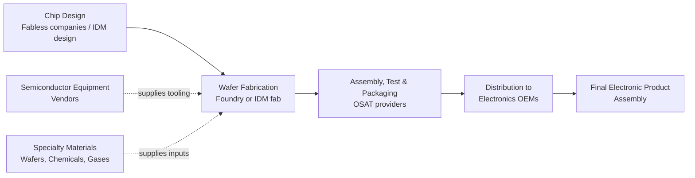
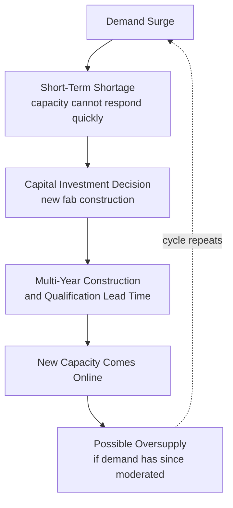

## Electronics and Semiconductor Supply Chains

### Definition and Purpose

Electronics and semiconductor supply chains encompass the highly specialized, capital-intensive, and globally concentrated network of design, fabrication, assembly, and distribution activities required to produce integrated circuits (ICs) and the downstream electronic products that depend on them. This supply chain architecture is distinguished from most other industries by extreme geographic concentration at critical process nodes, exceptionally long and capital-intensive lead times for capacity expansion, and a multi-stage, highly specialized production process in which few, if any, single companies control the entire value chain end-to-end.

**Key Points**

- Unlike automotive or aerospace tiered networks (where a single OEM integrates a physical product from supplied components), semiconductor supply chains are structured around a *horizontal specialization* model — different companies specialize in different stages of chip production (design, fabrication, packaging/testing) rather than one integrator sourcing components from tiered suppliers.
- Geographic concentration, particularly in advanced-node fabrication, is a defining structural risk characteristic of this industry, distinguishing it from more geographically distributed supply chains in other sectors.
- The industry's extremely high capital intensity (leading-edge fabrication facilities cost billions of dollars and take years to construct) creates fundamentally different capacity-response dynamics than most other manufacturing supply chains, where capacity can typically be added more quickly and at lower cost.

### The Semiconductor Value Chain Structure

#### Business Model Segmentation

- **IDM (Integrated Device Manufacturer)**: A company that both designs and manufactures its own chips in its own fabrication facilities, controlling the value chain from design through fabrication internally.
- **Fabless**: A company that designs chips but outsources fabrication entirely to a third-party foundry, retaining intellectual property and design capability without capital-intensive fab ownership.
- **Foundry**: A company that manufactures chips designed by other (fabless) companies, without producing its own chip designs — providing fabrication capacity as a specialized service.
- **OSAT (Outsourced Semiconductor Assembly and Test)**: Specialized providers handling the post-fabrication packaging and testing stage, often used by both IDMs and fabless/foundry supply chains rather than being performed in-house.

**Key Points**

- The fabless-foundry split (as opposed to the vertically integrated IDM model) has become an increasingly prominent industry structure, allowing design-focused companies to access leading-edge fabrication capability without the capital investment required to build and operate advanced fabs themselves.
- [Inference] This horizontal specialization generally increases the number of distinct organizations and handoff points a chip passes through between design and finished product (design house → foundry → OSAT → OEM), which structurally increases the number of potential disruption points relative to a more vertically integrated production model, even though each individual specialized provider may achieve higher process efficiency within their specific stage.

### Geographic Concentration: A Defining Structural Risk

**Key Points**

- Advanced-node wafer fabrication capacity is concentrated in a small number of geographic regions, most notably Taiwan and, to lesser extents, South Korea and other East Asian manufacturing hubs, reflecting decades of accumulated capital investment, specialized talent clusters, and supply-ecosystem co-location that are not easily or quickly replicated elsewhere.
- Semiconductor equipment manufacturing (the highly specialized machinery used to fabricate chips, particularly extreme ultraviolet lithography equipment) is itself concentrated among a very small number of global suppliers, creating an additional upstream concentration point beyond fabrication capacity itself.
- [Inference] This dual concentration (fabrication capacity geographically concentrated, and fabrication *equipment* supplier-concentrated) means that disruption risk in this industry is structurally different from most manufacturing supply chains: it is not primarily a multi-tier propagation risk (as in automotive/aerospace) but a *chokepoint concentration* risk, where a small number of facilities or suppliers represent a disproportionate share of global capacity for specific process nodes.
- Given the strategic and economic significance of this concentration, semiconductor supply chain geography has become an area of significant government policy attention in multiple countries (domestic manufacturing incentive programs, export control regimes), which is a current and evolving policy area; specific current legislative and regulatory details should be verified against up-to-date sources given how frequently this policy landscape changes.

### Lead Time and Capacity Expansion Dynamics

**Key Points**

- New fabrication facility construction and qualification is an extremely long lead-time undertaking — typically measured in years rather than months — reflecting the extraordinary capital investment, cleanroom construction complexity, and process qualification requirements involved, in contrast to capacity expansion timelines common in most other manufacturing sectors.
- This long capacity-response lead time means semiconductor supply and demand imbalances (shortages or gluts) tend to persist longer and be more severe than in industries where capacity can be added or reduced more quickly, since fabrication capacity cannot flex rapidly in response to short-term demand signals.
- The industry has historically exhibited a pronounced cyclicality (often referred to descriptively in industry discussion as the "silicon cycle") linked to this capacity-response lag: demand surges outpace the multi-year lead time to add capacity, leading to periods of shortage, followed eventually by capacity coming online potentially after demand has moderated, contributing to oversupply periods — this boom-bust pattern is a widely discussed structural characteristic of the industry, though the precise timing and severity of any given cycle depends on many contemporaneous factors and should not be treated as a strictly predictable mechanical pattern.

### Downstream Electronics Supply Chain Structure

Beyond the semiconductor-specific value chain, the broader electronics supply chain integrates chips into finished products through additional structural layers:

- **EMS (Electronics Manufacturing Services) providers**: Contract manufacturers that assemble finished or semi-finished electronic products on behalf of brand-owning OEMs, often at very large scale, representing a distinct specialization layer analogous in structural role to the OSAT stage but positioned further downstream.
- **ODM (Original Design Manufacturer)**: Companies that both design and manufacture products which are then sold under another company's brand, representing an even deeper level of outsourced integration than EMS (which typically manufactures to a brand owner's design) — the ODM model is common in categories such as laptops and consumer electronics.
- **Component distributors**: Specialized distribution intermediaries connecting semiconductor and electronic component manufacturers with smaller electronics OEMs who lack the purchasing volume for direct manufacturer relationships.

| Business Model | Design Ownership | Manufacturing Ownership | Common Use Case |
| --- | --- | --- | --- |
| IDM | In-house | In-house | Companies with proprietary process technology advantage |
| Fabless + Foundry | In-house (fabless) | Outsourced (foundry) | Design-focused companies avoiding fab capital investment |
| EMS | Brand owner's design | Outsourced (EMS provider) | Brand owners outsourcing assembly at scale |
| ODM | Outsourced (ODM's design) | Outsourced (ODM's manufacturing) | Brand owners outsourcing both design and manufacturing |

### Demand Planning Challenges Specific to This Industry

**Key Points**

- Long fabrication lead times (see above) mean semiconductor demand planning must forecast substantially further into the future than typical manufacturing demand planning, increasing forecast uncertainty and the consequences of forecast error in either direction (shortage or excess inventory).
- The presence of multiple demand-aggregation layers (component distributors serving many downstream OEMs, EMS providers serving multiple brand-owner customers) creates conditions structurally conducive to bullwhip-effect demand distortion, since each layer's individual forecasting/ordering behavior can amplify variance passed upstream toward fabrication capacity planning.
- **Allocation dynamics during shortage periods**: [Inference] During periods of fabrication capacity shortage, since foundries generally cannot rapidly expand output, capacity is typically allocated across competing customer demand through prioritization mechanisms (contractual capacity commitments, customer prioritization, or price mechanisms) rather than through simple first-come-first-served fulfillment — this allocation dynamic is a commonly discussed structural feature of shortage periods in this industry, though specific allocation practices vary by supplier and are generally not fully transparent to external parties, making detailed mechanics difficult to state as settled fact.

### Risk Management Approaches Specific to This Industry

**Key Points**

Given the structural characteristics above (geographic concentration, long capacity lead times, multi-stage specialization), risk management approaches in electronics/semiconductor supply chains commonly include:

- **Long-term capacity commitments/take-or-pay agreements**: OEMs and large chip buyers increasingly enter multi-year capacity reservation agreements with foundries to secure priority access to constrained fabrication capacity, a direct structural response to the long capacity-response lead time.
- **Dual/multi-sourcing at the design level**: Designing products to use components available from multiple qualified suppliers or process nodes where feasible, reducing exposure to any single fabrication source — though [Inference] this is generally more difficult to implement in semiconductors than in less specialized component categories, since advanced chip designs are often process-node-specific and cannot simply be re-sourced to an alternate foundry without significant re-engineering and re-qualification effort.
- **Extended safety stock/buffer strategies for critical components**: Particularly for components identified as having concentrated or sole-source exposure, though this must be balanced against the working-capital cost of holding inventory for often expensive components.
- **Geographic diversification initiatives**: Industry and policy-level efforts (see geographic concentration discussion above) to develop fabrication capacity in additional geographic regions, representing a longer-term structural risk mitigation approach given the multi-year timelines involved.

### Practical Example

**Example**

A consumer electronics OEM designs a new product relying on an advanced-node microcontroller sourced from a fabless design company, whose chip is fabricated by a single leading-edge foundry and packaged by a third-party OSAT provider. During a period of industry-wide fabrication capacity shortage, the OEM discovers that its EMS manufacturing partner — who also sources the same microcontroller on behalf of several other brand-owner customers — has aggregated demand forecasts across all its customers without full visibility into each customer's actual end-demand, resulting in an inflated combined order signal reaching the foundry. Because the OEM lacks a direct capacity commitment with the foundry (having historically relied on distributor allocation), it receives lower fulfillment priority than another customer with an existing multi-year capacity reservation agreement. In response, the OEM begins pursuing a direct long-term capacity agreement with the foundry for future product generations and initiates a parallel design effort to qualify a second-source component on an alternate process node — illustrating both the demand-signal distortion risk inherent in multi-layer distribution and the practical value of direct capacity commitments given the industry's structural capacity-response lag.

### Conclusion

Electronics and semiconductor supply chains represent a structurally distinct architecture from tiered manufacturing supply chains such as automotive or aerospace: rather than a single integrator managing successive supplier tiers, the industry is organized around horizontal specialization (design, fabrication, assembly/test) across companies, compounded by extreme geographic concentration in advanced fabrication capacity and exceptionally long, capital-intensive lead times for capacity expansion. These structural characteristics create distinctive chokepoint-concentration and capacity-response-lag risks that differ meaningfully from the multi-tier propagation risks more characteristic of physically-assembled product supply chains, driving industry risk management approaches centered on long-term capacity commitments, design-level multi-sourcing where feasible, and geographic diversification initiatives.

**Next Steps / Related Topics**

- Automotive and Aerospace Tiered Supplier Networks (structural comparison)
- Bullwhip Effect Causes and Mitigation Across Multi-Layer Distribution
- Capacity Planning and Long Lead-Time Investment Decisions
- Dual-Sourcing and Design-Level Supply Risk Mitigation
- Geopolitical Risk in Global Semiconductor Manufacturing
- Multi-Tier Supply Chain Visibility and Digital Control Towers
- Demand Forecasting Under Extended Lead-Time Uncertainty