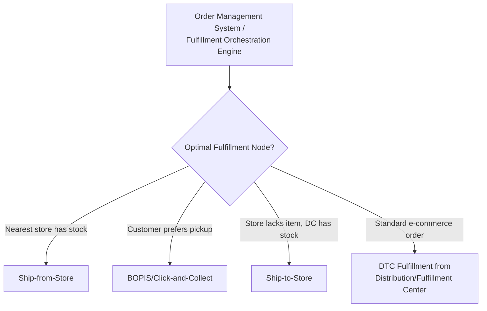
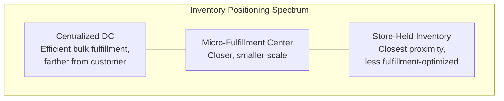

## Retail and Omnichannel Supply Chain Architecture

### Definition and Purpose

Retail and omnichannel supply chain architecture refers to the network design, inventory strategy, and fulfillment infrastructure required to serve customers consistently across multiple, integrated shopping channels — physical stores, e-commerce, mobile, and marketplace platforms — treating inventory and fulfillment capability as a shared, unified resource rather than as separate channel-specific silos. This architecture has evolved substantially from earlier "multichannel" models, where each channel (store, online) operated with largely independent inventory pools and fulfillment infrastructure, toward integrated omnichannel models designed to present a single, consistent view of product availability and enable flexible fulfillment regardless of where a customer initiates a purchase.

**Key Points**

- The core architectural distinction between multichannel and omnichannel is *inventory and process integration*: multichannel treats each channel as a separate operation with its own inventory and fulfillment logic; omnichannel treats inventory as a shared enterprise asset visible and allocable across all channels.
- Omnichannel architecture is generally understood in retail supply chain literature as driven by evolving customer expectations for fulfillment flexibility (e.g., buy online, pick up in store) and delivery speed, requiring supply chain infrastructure explicitly designed to support these fulfillment patterns rather than treating them as after-the-fact additions to a store-centric network.
- Unlike the automotive/aerospace tiered-supplier model (structured around upstream component sourcing complexity) or semiconductor supply chains (structured around specialized fabrication stages), retail/omnichannel architecture is primarily structured around *downstream* fulfillment network design and inventory positioning to serve end-consumer demand across multiple access points.

### Evolution from Multichannel to Omnichannel

| Model | Inventory Visibility | Fulfillment Flexibility | Typical Infrastructure |
| --- | --- | --- | --- |
| Single Channel | Channel-specific only | None (single path) | Store network or dedicated DC, not both integrated |
| Multichannel | Siloed per channel | Low — online orders fulfilled only from e-commerce DC, store orders only from store stock | Separate e-commerce fulfillment center and store replenishment network |
| Omnichannel | Unified, real-time across channels | High — orders fulfilled from whichever node (store or DC) is optimal | Integrated inventory management system, order orchestration/routing engine |

### Core Fulfillment Models in Omnichannel Architecture

#### Ship-from-Store

Store locations serve as fulfillment nodes for online orders, leveraging existing store inventory and the store's proximity to customers to reduce delivery distance/time versus shipping exclusively from centralized distribution centers.

#### Buy Online, Pick Up in Store (BOPIS) / Click-and-Collect

Customers order online and collect from a physical store, requiring real-time inventory visibility at the store level and in-store order-staging processes.

#### Ship-to-Store

Online orders are shipped to a store location (rather than the customer's address) for customer pickup, useful when store-level inventory doesn't have the specific item but distribution center inventory does.

#### Buy Online, Return In-Store (BORIS)

Enables returns of online purchases at physical store locations, requiring reverse logistics processes integrated across channels rather than channel-specific return handling.

#### Direct-to-Consumer (DTC) Fulfillment

Traditional e-commerce fulfillment from dedicated distribution/fulfillment centers directly to the customer's address, without store involvement.

**Key Points**

- The **Order Management System (OMS)** or fulfillment orchestration engine is the architectural centerpiece enabling omnichannel flexibility: it must maintain real-time (or near-real-time) inventory visibility across all nodes (stores, DCs, sometimes supplier/drop-ship inventory) and apply routing logic to determine the optimal fulfillment source for each order based on factors such as proximity, inventory availability, cost, and delivery speed commitment.
- [Inference] Because ship-from-store and BOPIS models repurpose existing store infrastructure and inventory for fulfillment functions it was not originally designed for, retailers adopting these models generally need to address store-level operational changes (picking/packing processes, staff training, in-store space allocation for order staging) that are distinct from, and in addition to, the inventory-visibility technology investment — omnichannel capability is not purely a software/IT implementation but also a store-operations change management effort.

### Inventory Strategy in Omnichannel Architecture

#### Unified/Pooled Inventory

Treating inventory across all locations (stores and DCs) as a single visible pool that any channel's demand can draw against, as opposed to allocating fixed inventory quantities to specific channels in advance.

- Strength: reduces overall safety stock requirements compared to siloed channel-specific inventory (a form of risk pooling — see inventory management principles), since demand variability across channels can offset rather than requiring independent buffers per channel.
- Requirement: depends on accurate, frequently updated (ideally real-time) inventory data at every node, since inventory visibility errors directly translate into fulfillment failures (promising inventory that is not actually available, or failing to utilize inventory that is).

#### Inventory Positioning Trade-offs

- Store-held inventory enables ship-from-store/BOPIS proximity advantages but is generally less efficiently managed for pure fulfillment-center-style throughput (stores are designed primarily for browsing/purchase, not high-volume picking).
- Centralized DC inventory enables efficient bulk fulfillment-center operations but is positioned farther from most customers, generally implying longer delivery times/higher shipping cost for standard DTC fulfillment relative to a nearby store-fulfilled order.
- **Micro-fulfillment centers**: Smaller-format, often automation-enabled fulfillment nodes positioned closer to dense customer populations than traditional large-scale DCs, representing an intermediate positioning strategy between full-scale centralized DCs and store-based fulfillment — an increasingly discussed but [Unverified] not universally adopted architecture pattern, with adoption varying by retailer scale, product category, and urban density of the target market.

### Reverse Logistics in Omnichannel Architecture

**Key Points**

- Returns processing is a structurally significant component of retail/omnichannel architecture given generally higher return rates associated with e-commerce purchases compared to in-store purchases (since customers cannot physically inspect items before purchase), making reverse logistics capacity planning a more prominent architectural consideration than in many other industries covered in this chapter.
- BORIS (Buy Online, Return In-Store) requires integrated systems connecting online order records with in-store point-of-sale/return-processing systems, plus a defined process for what happens to store-returned online inventory (restocked locally, consolidated to a returns processing center, or liquidated), each with different cost and inventory-availability implications.
- [Inference] Because returned inventory often requires inspection, repackaging, or refurbishment before it can be resold, integrating returns handling into the unified inventory pool described above generally requires additional process steps (quality grading, disposition decisions) before returned stock becomes available inventory again — meaning reverse logistics cycle time directly affects how quickly returned inventory becomes usable for future omnichannel fulfillment.

### Technology Architecture Supporting Omnichannel Operations

| System Layer | Function |
| --- | --- |
| Order Management System (OMS) | Order orchestration, fulfillment routing logic, cross-channel order visibility |
| Inventory Management System (IMS) | Real-time inventory tracking across stores, DCs, and other nodes |
| Warehouse/Distribution Management System (WMS) | DC-level pick/pack/ship execution |
| Point of Sale (POS) / Store Systems | In-store transaction processing, integrated with inventory visibility for BOPIS/ship-from-store |
| Transportation Management System (TMS) | Last-mile and DC-to-store/DC-to-customer shipment optimization |

**Key Points**

- These systems must be integrated (via APIs or middleware) rather than operating as isolated point solutions, since the core omnichannel value proposition (unified inventory visibility, flexible fulfillment routing) depends on real-time or near-real-time data flow across all of them — a fragmented technology architecture with delayed or batch-only data synchronization generally undermines the fulfillment-flexibility premise the omnichannel model is built on.
- [Inference] Given the number of integrated systems involved, omnichannel technology architecture implementation is generally understood in retail supply chain literature as a substantial systems-integration undertaking rather than a single software purchase, which connects to the Change Management for Architecture Transformation topic's broader point about technology implementation requiring parallel organizational and process change, not purely a technical rollout.

### Network Design Considerations

**Key Points**

- Omnichannel network design must jointly optimize store locations (which also serve a retail/browsing function, not purely fulfillment) and DC/fulfillment center locations, rather than optimizing fulfillment network location purely on logistics-cost criteria as might be done for a pure e-commerce or B2B distribution network.
- Delivery speed commitments to customers (e.g., same-day or next-day delivery promises) directly constrain network design, generally requiring fulfillment nodes (stores, micro-fulfillment centers, or DCs) positioned within a delivery-time-feasible radius of target customer populations — this is a structural driver behind increased store-as-fulfillment-node and micro-fulfillment-center adoption, since a small number of large, centralized DCs alone often cannot meet aggressive delivery-speed commitments across a broad geography cost-effectively.

### Practical Example

**Example**

A mid-sized apparel retailer initially operates a multichannel model: e-commerce orders are fulfilled exclusively from a single centralized distribution center, while stores maintain entirely separate inventory with no visibility into e-commerce stock levels or vice versa. Customers frequently encounter items shown as "in stock" online that are actually reserved for store-only inventory pools, and stores cannot fulfill online orders even when local inventory exists. The retailer implements an omnichannel transformation: a new Order Management System provides unified, real-time inventory visibility across all 200 stores and the central DC, with fulfillment-routing logic that defaults to ship-from-store when a customer's order can be fulfilled from a nearby store faster or cheaper than from the DC, and defaults to DC fulfillment for orders where no nearby store carries sufficient stock. The retailer also introduces BOPIS and BORIS capability, requiring store staff process changes for order staging and in-store online-return handling. Following implementation, the retailer must also address a new reverse-logistics question: whether in-store returns of online purchases are restocked immediately as store inventory (fast return-to-availability but bypassing quality inspection) or routed to a central returns-processing hub (slower but ensures consistent quality grading) — illustrating how omnichannel architecture decisions cascade into operational process design well beyond the initial technology implementation.

### Conclusion

Retail and omnichannel supply chain architecture is structured around unifying inventory visibility and fulfillment flexibility across physical and digital shopping channels, representing a downstream-fulfillment-focused counterpart to the upstream-sourcing-focused architectures characteristic of tiered manufacturing supply chains. Its defining architectural elements — unified inventory pooling, flexible fulfillment routing (ship-from-store, BOPIS, ship-to-store), integrated reverse logistics, and network designs balancing centralized efficiency against delivery-speed proximity requirements — depend on deep systems integration across order management, inventory, warehouse, and store technology layers, making omnichannel transformation as much an organizational and process change effort as a technology implementation.

**Next Steps / Related Topics**

- Order Management Systems (OMS) and Fulfillment Orchestration
- Inventory Risk Pooling and Safety Stock Optimization
- Micro-Fulfillment Centers and Urban Logistics Network Design
- Reverse Logistics and Returns Management Architecture
- Last-Mile Delivery Strategy and Network Design
- Change Management for Architecture Transformation
- Supply Chain Analytics Maturity Models (applied to fulfillment routing optimization)