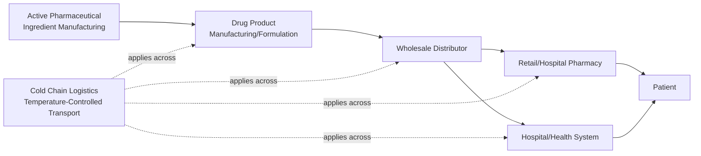
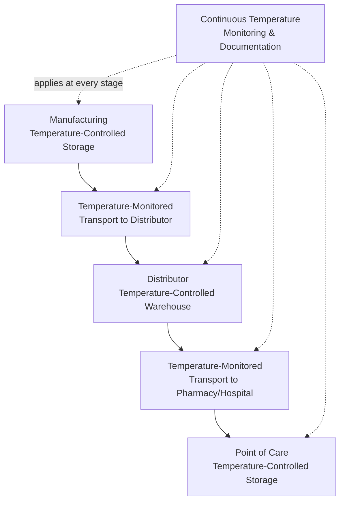

## Pharmaceutical and Healthcare Supply Chain Architecture

### Definition and Purpose

Pharmaceutical and healthcare supply chain architecture refers to the network design, distribution infrastructure, and regulatory compliance systems required to move drugs, biologics, medical devices, and clinical supplies from manufacturing through to patient point-of-care, under conditions where product integrity, chain-of-custody documentation, and regulatory compliance carry consequences (patient safety, legal liability) more severe than in most other industries covered in this chapter. This architecture is distinguished by its dual imperative: achieving standard supply chain objectives (cost, availability, responsiveness) while simultaneously satisfying stringent, legally mandated product-safety and traceability requirements that constrain network design choices other industries do not face to the same degree.

**Key Points**

- Unlike retail/omnichannel architecture (structured around fulfillment flexibility) or semiconductor supply chains (structured around fabrication chokepoints), pharmaceutical/healthcare architecture is structured substantially around *regulatory compliance and chain-of-custody requirements* that apply at every network node and transportation leg, not merely at final production.
- Product characteristics vary widely within this industry — from small-molecule generic drugs with relatively stable shelf lives to biologics and cell/gene therapies requiring continuous temperature control — meaning "pharmaceutical supply chain" architecture is not a single uniform pattern but spans a spectrum of complexity depending on product type.
- Given the direct patient-safety stakes, regulatory requirements in this industry are extensive, jurisdiction-specific, and subject to ongoing change; the general architectural patterns described here should be understood as a structural overview, with specific current regulatory requirements (e.g., particular serialization deadlines or regional regulations) verified against up-to-date regulatory sources rather than relied upon from general knowledge alone.

### Core Structural Components

#### Upstream: API and Drug Manufacturing

- Active Pharmaceutical Ingredient (API) manufacturing is frequently geographically separated from final drug product formulation/manufacturing, with API sourcing often concentrated among a relatively limited number of specialized global manufacturers for certain drug categories — creating supply concentration risk considerations somewhat analogous in structural pattern (though different in specific drivers) to the geographic concentration risk discussed in semiconductor supply chains.
- Drug manufacturing occurs under Good Manufacturing Practice (GMP) regulatory frameworks, which govern not only the manufacturing process itself but also require extensive documentation and quality-control processes that extend into supply chain handling and storage.

#### Midstream: Distribution

- **Wholesale distributors** serve as the primary intermediary layer between manufacturers and the point-of-care/point-of-sale layer (pharmacies, hospitals), aggregating products from many manufacturers and distributing to many downstream healthcare providers — a structural role that provides significant supply chain efficiency (avoiding the need for every pharmacy/hospital to hold direct relationships with every manufacturer) but also creates a concentration point through which a large share of pharmaceutical distribution volume flows.
- Direct-to-pharmacy or direct-to-hospital distribution models exist for certain products (particularly specialty/high-value biologics) bypassing traditional wholesale distribution, generally used when tighter chain-of-custody control or specialized handling (e.g., cold chain, controlled substance security) makes the additional distribution layer undesirable.

#### Downstream: Point of Care

- Retail pharmacy, hospital pharmacy, and specialty pharmacy channels each have distinct inventory, dispensing, and regulatory requirements (e.g., hospital pharmacies must integrate with clinical care processes and often maintain automated dispensing cabinets with their own inventory/security requirements).

### Cold Chain and Temperature-Controlled Logistics

**Key Points**

- A substantial and growing segment of pharmaceutical products — particularly biologics, vaccines, and cell/gene therapies — require continuous temperature control throughout the entire supply chain (manufacturing, storage, transportation, point-of-care handling), commonly referred to as "cold chain" logistics, though required temperature ranges vary by product (standard refrigerated ranges through ultra-low/frozen ranges for certain advanced therapies).
- Cold chain architecture requires temperature-monitoring and documentation at every handoff point (manufacturer to distributor, distributor to pharmacy/hospital, and often final mile to patient), since a temperature excursion at any point in the chain can compromise product efficacy or safety — this end-to-end monitoring requirement is a defining architectural characteristic distinguishing cold-chain pharmaceutical logistics from standard ambient-temperature distribution.
- [Inference] Because temperature excursions can render product unusable and because many temperature-sensitive biologics are high per-unit-value products, cold chain logistics architecture generally involves a different risk/cost calculus than standard distribution — the cost of temperature-monitoring technology and specialized packaging/transport is weighed against the cost of potential product loss, rather than purely against standard transportation cost-minimization criteria used for non-temperature-sensitive goods.

### Traceability and Serialization

**Key Points**

- Pharmaceutical supply chains in many jurisdictions are subject to serialization requirements — unique identifiers applied to individual drug packages (often via barcodes such as GS1 standards) enabling unit-level tracking through the supply chain, intended to combat counterfeit drug infiltration and enable rapid, precise recall capability.
- Chain-of-custody documentation requirements (recording each transfer of custody as product moves from manufacturer through distributor to point of care) are generally more extensive in pharmaceutical distribution than in most other industries, reflecting the direct patient-safety consequences of counterfeit or diverted product entering the legitimate supply chain.
- [Unverified] Specific serialization regulatory frameworks (e.g., particular national or regional track-and-trace mandates, implementation deadlines, and technical standards) vary by jurisdiction and are subject to ongoing regulatory evolution; current, jurisdiction-specific requirements should be verified against current regulatory sources rather than treated as fixed, universally applicable facts.
- This traceability infrastructure connects conceptually to the multi-tier visibility programs discussed in the Automotive/Aerospace topic, but with a critical structural difference: pharmaceutical traceability requirements are generally legally mandated rather than voluntary risk-management initiatives, changing the compliance calculus from a business-driven risk decision to a regulatory requirement.

### Controlled Substances and Security Requirements

**Key Points**

- Products classified as controlled substances (due to abuse/diversion potential) are subject to additional, more stringent security, storage, and chain-of-custody requirements throughout the supply chain compared to standard pharmaceutical products, generally including specific licensing requirements for handlers at each supply chain stage and additional reporting/documentation obligations.
- Diversion risk (product being redirected from the legitimate supply chain into illicit channels) is a specific risk category in this industry with limited direct analog in most other industries covered in this chapter, driving specialized security architecture (secured storage, transportation security, access controls) beyond standard product-loss/theft prevention measures used for non-controlled goods.

### Regulatory Compliance as an Architectural Constraint

Unlike most other industries in this chapter, where regulatory compliance is one input among several supply chain design considerations, pharmaceutical/healthcare supply chain architecture treats regulatory compliance as a binding constraint shaping network design choices directly:

| Architectural Decision | Standard Industry Consideration | Additional Pharma/Healthcare Consideration |
| --- | --- | --- |
| Distribution center location | Cost, proximity to demand | Licensing requirements per jurisdiction for pharmaceutical storage/handling |
| Transportation mode/carrier selection | Cost, speed, reliability | Temperature control capability, chain-of-custody documentation capability |
| Inventory location/positioning | Service level, carrying cost | Shelf-life/expiration management, cold-chain storage capacity constraints |
| Supplier qualification | Quality, cost, capacity | GMP compliance verification, regulatory audit requirements |
| Network redesign timeline | Business-driven timeline | Regulatory approval/re-licensing timelines for new facilities |

### Expiration and Shelf-Life Management

**Key Points**

- Pharmaceutical products have defined expiration dates tied to stability data submitted as part of regulatory approval, making shelf-life management a more architecturally significant inventory consideration than in many other industries, since expired product generally cannot be sold or used regardless of physical condition (unlike many non-pharmaceutical products where "expiration" may be a quality/freshness consideration rather than an absolute usability cutoff).
- Inventory management approaches (e.g., First-Expired-First-Out, FEFO, rather than simple First-In-First-Out, FIFO) are commonly used specifically to minimize expiration-driven waste, reflecting an inventory rotation logic distinct from standard FIFO approaches used in many other industries.
- [Inference] Given both the cost of temperature-controlled/specialized products and expiration constraints, inventory positioning decisions in this industry generally involve a more complex trade-off than typical retail or manufacturing inventory strategy — balancing service-level/availability requirements (particularly critical for essential medicines) against both carrying cost and expiration-driven waste risk, in a way that pure cost-minimization inventory models used in other industries may not adequately capture without pharma-specific adaptation.

### Supply Disruption and Shortage Management

**Key Points**

- Drug shortages are a recognized and recurring supply chain challenge in this industry, with contributing factors commonly cited in the literature including manufacturing concentration (relatively few manufacturers for certain generic drugs, particularly older, lower-margin products), quality/regulatory manufacturing issues triggering production shutdowns, and raw material/API sourcing concentration.
- [Inference] Because drug shortages have direct patient-care consequences (unlike shortages of most other product categories), healthcare supply chain risk management generally places materially higher emphasis on shortage anticipation and mitigation planning than typical commercial supply chain risk management, including practices such as regulatory-mandated shortage notification requirements in some jurisdictions and healthcare-system-level buffer stock strategies for critical/life-sustaining medications — though the specific mitigation practices and their effectiveness are actively discussed areas in healthcare supply chain policy rather than settled, uniformly implemented solutions.
- Hospital and health-system supply chain functions increasingly maintain dedicated shortage-monitoring and contingency-sourcing capability, reflecting the elevated operational and patient-safety stakes of stockouts in this sector compared to typical commercial supply chain stockout consequences.

### Practical Example

**Example**

A biologic manufacturer produces a temperature-sensitive drug requiring continuous refrigeration from production through patient administration. The product moves from the manufacturing facility (temperature-controlled storage, GMP-compliant) through temperature-monitored transport to a specialty distributor licensed to handle cold-chain biologics, then to hospital pharmacies via a second temperature-monitored transport leg, with continuous temperature logging at each handoff creating a documented chain-of-custody record. When a hospital pharmacy reports a delayed shipment with a temperature-monitoring device showing a brief excursion above the required range during transport, the product batch is quarantined and cannot be dispensed to patients pending investigation — illustrating how, unlike most other industries, a logistics delay in this sector can trigger a product-disposition decision (rather than merely a delivery-timing inconvenience) due to the strict temperature-integrity requirements tied to patient safety. The manufacturer's supply chain team simultaneously coordinates with the distributor to expedite a replacement shipment given the hospital's limited on-hand buffer stock for this specific critical medication.

### Conclusion

Pharmaceutical and healthcare supply chain architecture is fundamentally shaped by the dual imperative of standard supply chain performance objectives and stringent, legally mandated product-safety, traceability, and chain-of-custody requirements that constrain network design, transportation, and inventory decisions more extensively than in most other industries covered in this chapter. Defining architectural elements — cold chain temperature-monitoring infrastructure, serialization/traceability systems, controlled-substance security requirements, and expiration-driven (FEFO) inventory management — reflect an industry where the consequences of supply chain failure extend directly to patient safety, making regulatory compliance an architectural constraint rather than merely one design input among several.

**Next Steps / Related Topics**

- Cold Chain Logistics and Temperature-Monitoring Technology
- Serialization and Track-and-Trace Regulatory Frameworks
- Good Manufacturing Practice (GMP) Compliance in Supply Chain Operations
- Drug Shortage Risk Management and Contingency Sourcing
- FEFO (First-Expired-First-Out) Inventory Management
- Multi-Tier Supply Chain Visibility and Digital Control Towers
- Controlled Substance Security and Diversion Risk Management