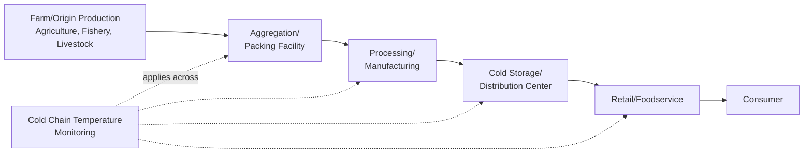
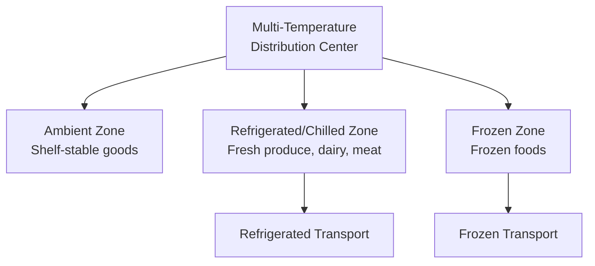

## Food and Perishable Goods Supply Chains

### Definition and Purpose

Food and perishable goods supply chain architecture refers to the network design, cold chain infrastructure, and safety/traceability systems required to move agricultural products, fresh foods, and processed food products from origin (farm, fishery, processing facility) through to end consumer, under conditions where product quality and safety degrade continuously with time and are highly sensitive to environmental conditions (temperature, humidity, handling). This architecture shares some structural characteristics with pharmaceutical cold chain logistics (covered in the prior topic) but differs in scale, regulatory framework, and the specific nature of perishability, warranting distinct architectural treatment.

**Key Points**

- Perishability is the defining architectural constraint distinguishing this supply chain category: unlike most manufactured or electronic goods, food products have a continuously degrading shelf life from the moment of harvest/production, making time-to-market and environmental control (rather than primarily cost or lead-time optimization) central architectural drivers.
- Food supply chains span an unusually wide product spectrum — from highly perishable fresh produce (days of shelf life) to shelf-stable processed foods (months to years) — meaning, similarly to pharmaceuticals, "food supply chain" architecture is not a single uniform pattern but a spectrum of designs matched to specific product perishability characteristics.
- Food safety regulation, traceability requirements, and specific standards vary considerably by jurisdiction and product category and are subject to ongoing regulatory evolution; general architectural patterns are described here, with current jurisdiction-specific regulatory requirements best verified against up-to-date regulatory sources.

### The Perishability Spectrum and Its Architectural Implications

| Product Category | Typical Shelf Life | Primary Architectural Driver |
| --- | --- | --- |
| Fresh produce (leafy greens, berries) | Days | Speed-to-market, cold chain integrity, minimal handling |
| Fresh meat, seafood, dairy | Days to weeks | Cold chain integrity, strict temperature control, traceability |
| Frozen foods | Months | Continuous frozen-chain integrity (less time-sensitive than fresh, but temperature-excursion-sensitive) |
| Shelf-stable processed/packaged foods | Months to years | Standard distribution economics closer to general consumer goods |

**Key Points**

- [Inference] Because architectural priorities shift substantially across this spectrum — from speed/cold-chain-dominated design for fresh produce to more conventional distribution-economics-dominated design for shelf-stable goods — a food company handling products across this full spectrum (e.g., a grocery retailer or diversified food distributor) generally requires materially different supply chain architecture and inventory strategy for different product categories within the same overall business, rather than a single uniform supply chain design serving all food product types equally well.

### Farm-to-Fork Value Chain Structure

#### Origin/Production Stage

- Agricultural production is subject to significant supply variability from factors outside traditional supply chain control — weather, seasonality, growing cycles, and biological yield variability — creating a distinctive upstream uncertainty profile compared to manufactured-goods supply chains, where upstream supply is generally more directly controllable by the producing organization.
- Geographic and seasonal specialization means many food supply chains rely on sourcing shifts across growing regions/seasons (e.g., sourcing a given produce item from different countries/regions depending on time of year) to maintain year-round availability, a structural pattern less common in manufactured-goods supply chains.

#### Aggregation and Processing

- Aggregation facilities (packing houses, cooperatives) consolidate output from many individual farms/producers, playing a structural role somewhat analogous to Tier 1 suppliers in manufacturing contexts, but aggregating agricultural output rather than manufactured components.
- Processing converts raw agricultural output into shelf-stable or extended-shelf-life products (canning, freezing, packaging), fundamentally shifting a product's position on the perishability spectrum and correspondingly changing its downstream architectural requirements (a raw product with days of shelf life may become a processed product with months of shelf life).

#### Cold Storage and Distribution

- Distribution centers for perishable food products require temperature-zoned storage (ambient, refrigerated, frozen) within the same facility to handle the full range of product types typically carried by grocery/food distributors, a structural difference from single-temperature-zone facilities common in non-perishable distribution.
- **Cross-docking** (minimizing storage dwell time by transferring product directly from inbound to outbound transport with minimal or no intermediate storage) is particularly emphasized for highly perishable categories, since every day of dwell time directly consumes available shelf life before the product reaches the consumer.

### Cold Chain Requirements Specific to Food

**Key Points**

- Similar in structural principle to pharmaceutical cold chain (continuous temperature control with monitoring at every handoff), but food cold chain requirements are generally organized around a smaller number of standard temperature zones (ambient, refrigerated/chilled, frozen) compared to the more granular, product-specific temperature ranges sometimes required for biologics and advanced pharmaceutical therapies.
- Food safety regulatory frameworks in many jurisdictions require documented temperature control and monitoring at each stage of the cold chain, reflecting food-safety risk (bacterial growth, spoilage) rather than the efficacy-preservation rationale that drives pharmaceutical cold chain requirements — the underlying regulatory motivation differs even where the operational cold-chain architecture looks structurally similar.
- [Inference] Because bacterial growth and spoilage risk generally accelerate with temperature and time exposure in ways that can create acute, near-term food safety hazards (rather than the more gradual efficacy degradation more typical of many pharmaceutical products), the operational tolerance for temperature excursions or delays in fresh food cold chains is generally narrower than in many pharmaceutical cold chain contexts — though exact risk profiles vary by specific product and pathogen concern, making this a general structural distinction rather than a precise quantified comparison.

### Traceability and Food Safety Systems

**Key Points**

- Food traceability systems are designed to enable rapid identification of a product's origin and distribution path in the event of a contamination or safety issue, supporting targeted recalls rather than broad, imprecise recall actions — a rationale structurally similar to pharmaceutical serialization, though implemented through different specific technical standards and regulatory frameworks appropriate to food products.
- **One-up, one-back traceability** (a commonly referenced minimum traceability principle in food supply chains) refers to each supply chain participant being able to identify the immediate supplier they received a product from and the immediate customer they shipped it to, enabling trace-back and trace-forward investigation across the full chain when links are connected sequentially, even without any single participant having full end-to-end visibility.
- HACCP (Hazard Analysis and Critical Control Points) is a widely used, internationally recognized food safety management framework identifying specific points in the production/handling process where hazards must be controlled, applied throughout food manufacturing and, increasingly, extended into supply chain handling and transportation considerations.
- [Unverified] Specific current food traceability regulatory requirements (e.g., particular electronic recordkeeping mandates or digital traceability deadlines for specific food categories) vary by jurisdiction and are an actively evolving regulatory area; current specific requirements should be verified against up-to-date regulatory sources.

### Demand Volatility and Waste Management

**Key Points**

- Food supply chains face demand volatility from factors including promotional activity, seasonality, and weather-driven consumption pattern shifts, compounded by the perishability constraint that limits the ability to absorb demand forecast error through extended inventory buffers (unlike non-perishable goods, where excess inventory can simply be held longer).
- **Food waste** is a structurally significant supply chain performance consideration in this industry given both the direct cost of spoiled/unsold perishable inventory and, increasingly, broader sustainability and regulatory attention to food waste reduction — making waste reduction a more prominent architectural objective in food supply chains than in most other industries covered in this chapter, where "waste" is typically a smaller, less central performance dimension.
- **Dynamic pricing/markdown strategies** (reducing price as a perishable product approaches its sell-by date to accelerate sale before spoilage) represent a demand-side lever specific to managing perishability-driven waste risk, complementing supply-side architectural approaches (accurate demand forecasting, efficient distribution to minimize dwell time).
- [Inference] Because both understocking (stockouts, particularly problematic for essential food categories) and overstocking (spoilage waste) carry meaningful costs in perishable food supply chains, demand forecasting accuracy generally carries higher direct consequence in this industry than in categories where excess inventory can simply be carried forward to a future period — this asymmetric and time-bound cost structure is a defining reason forecasting and inventory positioning receive particular architectural emphasis in food supply chain design.

### Network Design Considerations Specific to Perishables

**Key Points**

- Distribution network design for highly perishable categories generally favors proximity-optimized network configurations (more numerous, smaller, regionally-positioned distribution centers) over the fewer, larger, centralized DC models sometimes favored for non-perishable goods, since minimizing transit time directly preserves shelf life available to the downstream retailer/consumer.
- Last-mile delivery for perishable e-commerce/direct-to-consumer models (an increasingly relevant channel per the omnichannel retail architecture discussed previously) introduces additional cold-chain complexity, since maintaining temperature control through final-mile residential delivery (often via insulated packaging with limited duration temperature protection, since residential delivery cannot guarantee the continuous refrigerated infrastructure available at commercial distribution nodes) is architecturally more challenging than maintaining cold chain integrity between commercial-grade facilities.

### Practical Example

**Example**

A fresh produce distributor sources strawberries from growing regions that shift seasonally to maintain year-round supply. Harvested berries move through a packing facility (minimal processing, primarily sorting/packaging) directly into refrigerated transport to a regional distribution center operating on a cross-docking model — berries typically spend hours, not days, in the DC before continuing to retail stores, since each day of dwell time directly reduces the shelf life remaining for the retailer and consumer. The distributor maintains one-up, one-back traceability records linking each shipment to its originating farm and packing lot, enabling rapid, narrowly-scoped recall action when a food safety concern is identified at one specific farm source, rather than requiring a broad recall across all product from that time period. During a period of unexpectedly high demand from a retail promotion, the distributor faces a direct trade-off unavailable to non-perishable goods suppliers: it cannot simply hold excess buffer inventory in anticipation of demand spikes, since unsold berries would spoil within days regardless of whether they were held in anticipation of future demand — illustrating how the perishability constraint fundamentally shapes inventory strategy differently than in shelf-stable product categories.

### Conclusion

Food and perishable goods supply chain architecture is fundamentally shaped by continuous, time-bound product degradation, requiring network design, cold chain infrastructure, and inventory strategy oriented around minimizing time-to-market and environmental exposure rather than primarily around cost or lead-time optimization alone. While sharing structural similarities with pharmaceutical cold chain logistics — temperature monitoring, traceability systems, regulatory compliance — food supply chains operate across a wider perishability spectrum (from days-of-shelf-life fresh produce to shelf-stable processed goods), face distinct upstream agricultural supply variability, and center architectural attention on waste reduction and demand-volatility management to a degree not matched by the industries previously covered in this chapter.

**Next Steps / Related Topics**

- Pharmaceutical and Healthcare Supply Chain Architecture (structural comparison)
- Cold Chain Logistics and Temperature-Monitoring Technology
- HACCP and Food Safety Management Systems
- One-Up, One-Back Traceability and Recall Management
- Demand Forecasting for Perishable and Seasonal Products
- Cross-Docking and Dwell-Time Minimization Strategies
- Last-Mile Cold Chain Delivery for Perishable E-Commerce