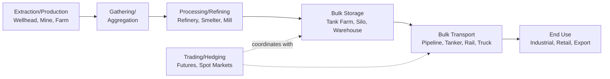
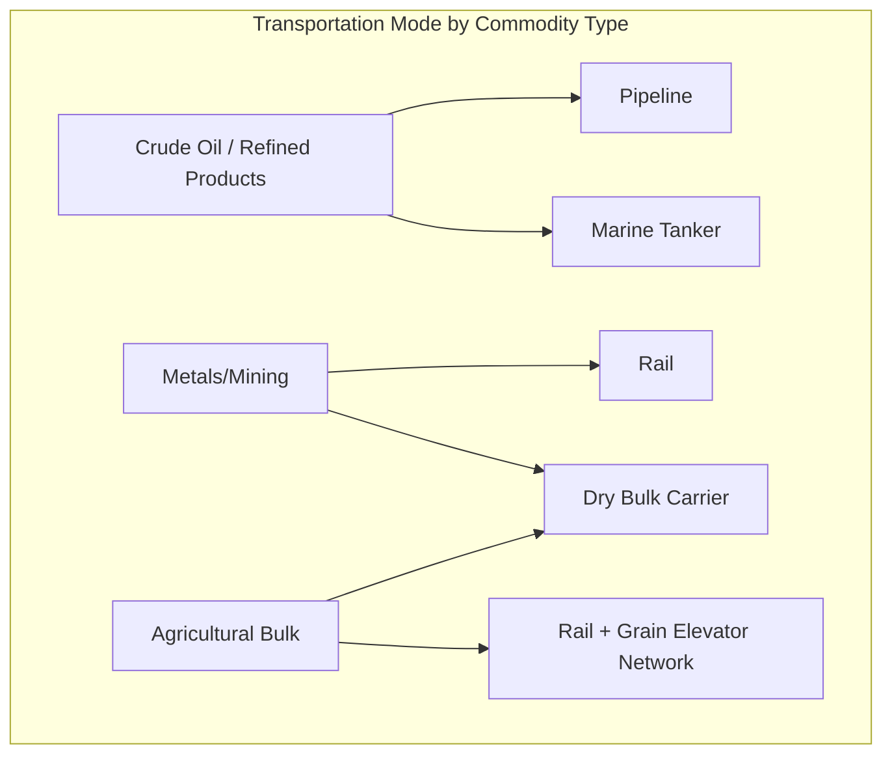

## Energy and Commodity Supply Chain Architecture

### Definition and Purpose

Energy and commodity supply chain architecture refers to the network design, logistics infrastructure, and market-integration systems required to move fungible, standardized-grade raw materials — crude oil, natural gas, refined fuels, metals, agricultural bulk commodities, and similar bulk goods — from extraction/production through processing to end use. This architecture is structurally distinguished from the product-specific supply chains covered elsewhere in this chapter by two defining characteristics: product fungibility (commodities of a given grade are generally interchangeable regardless of specific source) and deep integration with financial/trading markets, meaning supply chain and commercial/trading decisions are often inseparable in ways not typical of manufactured-goods or perishable-goods supply chains.

**Key Points**

- Fungibility fundamentally changes supply chain logic: unlike a specific automotive part or a specific pharmaceutical batch (which must be traced to its exact source for quality/safety reasons), a barrel of a given crude oil grade or a bushel of a given commodity grade is generally treated as interchangeable with any other unit of the same grade, enabling logistics and inventory strategies (e.g., commingled storage, exchange-based delivery) not available in industries requiring source-specific traceability.
- Commodity supply chains are structurally integrated with financial markets (futures/derivatives exchanges, spot markets) to a degree not seen in the other industries covered in this chapter — physical logistics decisions (storage, transportation, timing) are frequently made in direct coordination with trading/hedging strategy, since price risk management is often as architecturally significant as physical movement efficiency.
- This category spans multiple distinct commodity types (energy/petroleum, metals/mining, agricultural bulk commodities) that share the fungibility and market-integration characteristics described here but differ in specific infrastructure (pipelines vs. bulk shipping vs. rail/grain elevators); the architectural patterns below are presented at a level general enough to span this variation, with commodity-specific infrastructure noted where materially different.

### Core Value Chain Structure

#### Extraction and Gathering

- Production origination (wellheads, mines, farms) is typically geographically dispersed and connects to gathering systems (pipelines, initial collection points) that aggregate output from many individual production sites into the broader logistics network — structurally analogous in aggregation function to farm cooperatives in food supply chains or Tier 1 aggregation in manufacturing, but for raw, unprocessed commodity volume.
- Production volumes are subject to significant supply variability driven by geological, agricultural, or resource-availability factors substantially outside conventional supply chain control, similar in structural pattern to the upstream agricultural variability discussed in food supply chains, though the specific drivers (geological/extraction yield versus weather/growing conditions) differ by commodity type.

#### Processing and Refining

- Raw commodities are frequently transformed at this stage into more standardized, market-tradeable forms (crude oil into refined fuel products, raw ore into refined metal, raw agricultural output into processed/graded commodity form) — this standardization/grading process is what enables the fungibility that distinguishes commodity supply chains, since consistent grading allows output from different original sources to be treated as interchangeable once processed to a common standard.
- Processing facilities (refineries, smelters, mills) are typically large-scale, capital-intensive, and geographically fixed, creating a network of relatively few, high-throughput processing nodes compared to the more geographically distributed production/extraction layer feeding into them.

#### Bulk Storage and Transportation Infrastructure

- **Pipelines**: The dominant transportation mode for crude oil, refined petroleum products, and natural gas over land routes where infrastructure exists, offering continuous, high-volume, relatively low-cost movement of fungible product, but requiring substantial fixed capital investment and offering limited routing flexibility once built (a pipeline connects specific fixed points, unlike more flexible transportation modes).
- **Marine/bulk shipping**: Tanker vessels (crude oil, refined products) and dry bulk carriers (metals ore, agricultural commodities) serve long-distance, particularly intercontinental, commodity movement, representing a capital-intensive but highly scalable mode for large-volume transport.
- **Rail and grain elevators**: Particularly significant for agricultural bulk commodities and certain mining/metals movement, with grain elevator networks serving an aggregation and interim-storage function analogous to bulk storage tank farms in the petroleum sector.
- **Bulk storage terminals**: Tank farms (liquid commodities), silos (agricultural), and stockpile yards (metals/mining) provide buffer capacity that decouples the timing of production/import from the timing of downstream demand/export, functioning as a critical architectural element given that production and consumption of commodities are frequently geographically and temporally misaligned.

### Market Integration: Trading, Hedging, and Physical Logistics

**Key Points**

- Commodity supply chain decisions (when to store, when to transport, when to sell) are frequently made in direct coordination with financial market positions (futures contracts, hedging strategies), since commodity prices are volatile and market-traded, meaning the *timing* of physical movement and storage decisions has direct financial consequence beyond pure logistics cost — a structural characteristic largely absent in industries where product pricing is set independently of physical logistics timing.
- **Contango and backwardation** (futures market conditions where future delivery prices are respectively higher or lower than current spot prices) directly influence storage economics: [Inference] a contango market structure (future prices higher than current spot prices) generally creates a financial incentive to store commodity inventory now for future sale, since the price differential can exceed storage cost, while a backwardation market structure generally reduces or eliminates this storage incentive — meaning commodity storage/inventory decisions in this industry are influenced by market price-curve dynamics in a way not applicable to most other supply chains, where inventory decisions are driven primarily by demand-service-level and carrying-cost considerations alone.
- **Exchange-based delivery mechanisms**: Certain commodity exchanges (e.g., futures contracts with physical delivery provisions) specify approved storage locations and delivery mechanisms, meaning physical supply chain infrastructure (specific storage terminals, specific grades/quality standards) must sometimes conform to exchange requirements to participate in exchange-based trading and delivery — an architectural constraint connecting physical infrastructure design directly to financial market participation requirements.

### Fungibility and Blending Operations

**Key Points**

- Because commodities of a given standardized grade are treated as interchangeable, storage infrastructure frequently commingles product from multiple sources (e.g., crude oil from different wells/fields blended together in a common pipeline or storage tank once meeting the same grade specification), a practice generally not available or appropriate in industries requiring source-specific traceability (contrast directly with the source-specific traceability requirements discussed in pharmaceutical and food supply chains).
- **Blending operations** (combining different commodity batches to achieve a target specification, such as blending different crude oil qualities to match a refinery's required feedstock specification, or blending grain lots to meet a target quality grade) represent a supply chain function largely unique to commodity architecture, since it depends on the fungibility principle — blending is generally not a meaningful supply chain function in industries where individual product units must retain distinct identity and traceability.
- [Inference] The ability to commingle and blend fungible commodities generally provides commodity supply chains with inventory and sourcing flexibility not available to industries with source-specific traceability requirements — a shortfall from one production source can typically be substituted with output from another source of the same grade without the qualification/requalification burden that would apply to, for example, substituting an alternate supplier's component in an aerospace application.

### Geopolitical and Strategic Risk Considerations

**Key Points**

- Energy commodities in particular (crude oil, natural gas) carry significant geopolitical risk dimensions given the concentration of production in specific geographic regions and the strategic national-security significance many governments attach to energy supply security, driving policy-level considerations (strategic petroleum reserves, energy security policy) that go beyond typical private-sector supply chain risk management scope.
- Trade policy, tariffs, and export/import restrictions can materially affect commodity supply chain routing and economics, and — similar to the semiconductor industry's policy-sensitive geographic concentration — this is an area subject to ongoing political and regulatory change; current, specific policy details should be verified against up-to-date sources rather than treated as static facts.
- [Unverified] The relative prominence of geopolitical risk considerations varies considerably across different commodity types (energy commodities generally carry more pronounced geopolitical/strategic dimensions than many agricultural or industrial metal commodities, though agricultural commodities have their own trade-policy sensitivities), and a general statement cannot precisely characterize risk exposure across the full breadth of commodities this architecture category encompasses.

### Comparative Structural Summary vs. Other Industries in This Chapter

| Characteristic | Commodity/Energy | Contrast With |
| --- | --- | --- |
| Product identity | Fungible, grade-based | Pharma/food/automotive: source-specific traceability required |
| Price determination | Market/exchange-traded, volatile | Most other industries: negotiated or catalog-based pricing |
| Storage rationale | Includes financial/market-timing motivation (contango/backwardation) | Other industries: primarily service-level/demand-driven |
| Transportation infrastructure | Highly specialized, fixed (pipelines) or highly scaled (bulk vessels) | Manufacturing: more flexible general-purpose freight modes |
| Traceability requirement | Generally grade/quality-level, not unit-specific | Pharma/food: unit or batch-level required |

### Practical Example

**Example**

A crude oil trading and logistics company purchases crude oil from multiple producing fields, all meeting the same benchmark grade specification, and stores the commingled volume in a shared tank farm — since all sources meet the same grade standard, the company does not need to track which specific well produced which specific barrels once blended in storage. Observing that the futures market is currently in contango (future delivery prices trading above current spot prices), the company's trading desk determines that storing additional volume now for future delivery is financially favorable, since the price differential exceeds the tank farm's storage cost — a decision that directly couples a physical logistics choice (how much to store, for how long) with a financial market position. When a blending requirement arises to meet a specific refinery customer's feedstock specification, the company blends volume from two different original crude sources to achieve the target quality parameters, a routine commodity supply chain operation that would have no direct analog in, for example, a pharmaceutical supply chain, where batches from different manufacturing runs generally cannot be combined without triggering separate regulatory and quality considerations.

### Conclusion

Energy and commodity supply chain architecture is structurally distinguished from the other industry architectures in this chapter by two defining characteristics: product fungibility (enabling commingled storage, blending operations, and substitutable sourcing not available where source-specific traceability is required) and deep integration with financial/trading markets (where physical storage and transportation decisions are frequently made in direct coordination with hedging strategy and market price-curve dynamics such as contango and backwardation). Specialized, capital-intensive, largely fixed transportation infrastructure (pipelines, bulk marine shipping, rail/grain elevator networks) combined with significant upstream production variability and geopolitical risk exposure — particularly pronounced for energy commodities — further differentiate this architecture from the source-traceable, service-level-driven supply chains characteristic of pharmaceutical, food, and manufactured-goods industries.

**Next Steps / Related Topics**

- Pharmaceutical and Healthcare Supply Chain Architecture (traceability contrast)
- Food and Perishable Goods Supply Chains (upstream production variability comparison)
- Futures Markets, Hedging, and Contango/Backwardation Dynamics
- Pipeline and Bulk Terminal Network Design
- Geopolitical Risk in Global Energy and Commodity Markets
- Strategic Reserves and Energy Security Policy
- Blending Operations and Commodity Grading Standards