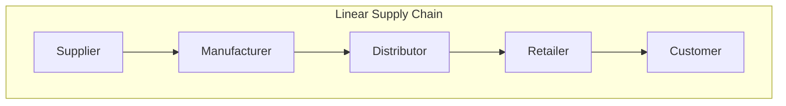
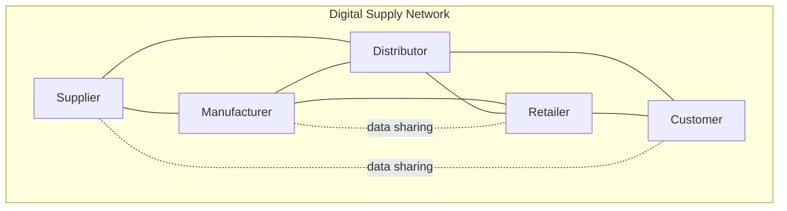
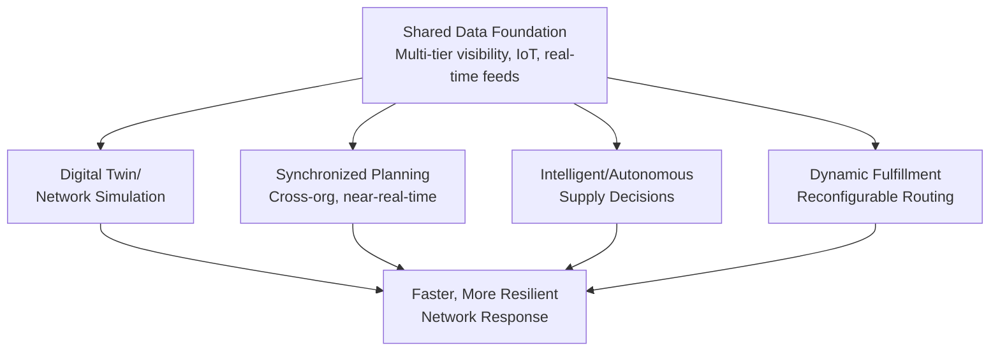
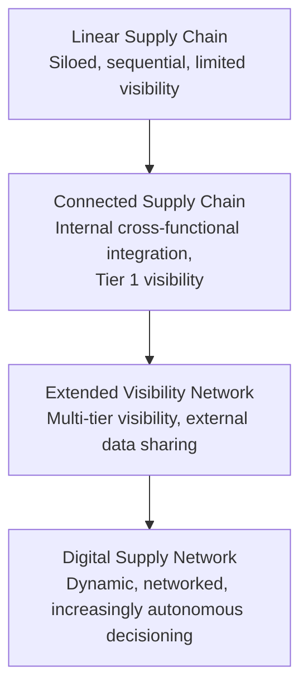

## From Linear Supply Chains to Digital Supply Networks

### Definition and Purpose

A Digital Supply Network (DSN) is an organizational and technological model in which traditional linear, sequential supply chain structures (a fixed sequence of supplier → manufacturer → distributor → retailer → customer) are reconceived as an interconnected, multi-directional network of nodes that share data continuously and can dynamically reconfigure relationships and flows in response to changing conditions. This concept, popularized substantially by Deloitte and other supply chain consulting/research bodies in the mid-to-late 2010s, represents a structural and technological evolution rather than a single discrete technology, building on and connecting many of the analytics, governance, and integration concepts covered elsewhere in this course.

**Key Points**

- The core distinction is topological: a linear supply chain has a fixed, largely sequential structure with information generally flowing in one direction (orders flow downstream to upstream, information flows upstream to downstream) with limited real-time cross-node visibility, while a DSN is conceived as a networked structure where any node can potentially exchange information directly with any other relevant node, not just its immediate upstream/downstream neighbor.
- DSN is fundamentally an information-architecture concept: the physical movement of goods still generally follows logistics constraints (a product still must physically travel from factory to warehouse to store), but the *information* enabling decisions about that movement is architected to flow networked rather than sequentially, enabling faster, more coordinated response to disruption or demand change.
- [Inference] Because DSN concepts depend heavily on data connectivity and real-time information sharing across traditionally separate organizations, DSN maturity is closely related to, and generally builds upon, the analytics maturity and multi-tier visibility concepts discussed earlier in this course (see Supply Chain Analytics Maturity Models and Automotive/Aerospace multi-tier visibility topics) — a DSN cannot function with only descriptive-analytics-level data integration, since dynamic network reconfiguration requires at minimum predictive, and often prescriptive, analytical capability operating on that shared data.

### Linear Supply Chain vs. Digital Supply Network: Structural Comparison

| Dimension | Linear Supply Chain | Digital Supply Network |
| --- | --- | --- |
| Structure | Sequential, fixed node order | Interconnected, multi-directional |
| Information flow | Primarily bilateral (adjacent nodes only) | Multi-node, shared data platforms |
| Visibility | Limited beyond immediate tier (Tier 1) | Extended multi-tier visibility (see Automotive/Aerospace topic) |
| Response to disruption | Sequential reaction, delayed propagation | Networked, faster reconfiguration potential |
| Planning approach | Siloed, function-by-function | Integrated, often simulation/digital-twin supported |
| Decision-making | Reactive, often manual escalation | Increasingly data-driven, potentially algorithmic/automated |

### Core Architectural Components of a DSN

#### Digital Twin / Network Simulation Capability

A virtual, data-driven representation of the physical supply network enabling scenario modeling and simulation of disruption impacts or reconfiguration options before committing to real-world action.

- [Inference] Because a digital twin's usefulness depends directly on the accuracy and timeliness of the underlying data feeding it, digital twin capability is generally understood to require the same real-time, multi-node data integration prerequisite discussed for prescriptive analytics maturity (see Supply Chain Analytics Maturity Models topic) — a digital twin built on stale or siloed data will generally produce simulation results that do not reflect actual current network conditions, undermining its decision-support value.

#### Synchronized Planning

Cross-functional and cross-organizational planning processes (extending the internal S&OP/IBP concept discussed in the Cross-Functional Integration topic) where planning inputs and outputs are shared across network participants — potentially including external suppliers and customers, not just internal functions — in near-real-time rather than periodic batch cycles.

#### Intelligent/Autonomous Supply

Increasing use of automated or semi-automated decision-making for routine supply chain decisions (e.g., automated replenishment triggers, algorithmic supplier selection for standard orders), freeing human planners to focus on exception management and strategic decisions — this connects directly to the prescriptive analytics stage discussed in the Supply Chain Analytics Maturity Models topic.

#### Dynamic Fulfillment

The ability to dynamically reconfigure fulfillment sourcing and routing based on real-time conditions (inventory availability, capacity, disruption status) rather than fixed, predetermined fulfillment paths — conceptually extending the flexible fulfillment-routing logic discussed in the Retail/Omnichannel Architecture topic beyond a single retailer's network to a broader multi-organization network context.

### Enabling Technologies

**Key Points**

- **IoT sensors and real-time tracking**: Providing the continuous data feeds (location, temperature, condition) necessary for real-time network visibility, extending concepts like the cold-chain temperature monitoring discussed in Pharmaceutical and Food topics to broader supply chain condition and location monitoring.
- **Cloud-based data platforms and APIs**: Providing the technical integration layer enabling different organizations' systems to exchange data, since a DSN by definition spans multiple organizations that do not share a single unified IT system, unlike internal cross-functional integration within one enterprise.
- **Advanced analytics and AI/ML**: Underpinning the predictive and prescriptive capabilities (demand sensing, disruption prediction, optimization) that make networked, dynamic decision-making possible at the speed and scale a DSN model requires.
- **Blockchain** (in specific use cases): [Unverified] Blockchain technology has been discussed and piloted in some supply chain traceability and multi-party trust contexts as a mechanism for maintaining a shared, tamper-resistant record across organizations without requiring a single trusted central intermediary; however, the extent of production-scale (versus pilot-stage) adoption specifically for DSN applications varies considerably by source and industry, and should not be treated as a universally adopted, mature technology component of DSN architecture at this time.

### Organizational Prerequisites for DSN Adoption

**Key Points**

- **Data sharing agreements and trust**: Because a DSN inherently requires data sharing across organizational boundaries (supplier to manufacturer to retailer, potentially competitors sharing certain data through industry consortia), establishing the commercial and legal trust frameworks for this sharing is a prerequisite organizational challenge distinct from the pure technology implementation — echoing the general Change Management for Architecture Transformation topic's point that technology alone does not guarantee adoption, particularly complicated here by the fact that adoption must span multiple independent organizations, not just one enterprise's internal functions.
- **Governance across organizational boundaries**: Unlike internal governance models (center-led, centralized/decentralized — see earlier topic) which operate within a single enterprise's authority, DSN governance must address decision rights and data ownership across legally separate organizations, generally requiring negotiated multi-party agreements rather than a single organization's internal governance mandate.
- **Talent and capability**: [Inference] The talent requirements discussed in the Talent, Skills, and Workforce Evolution topic (analytics fluency, cross-functional competency) are generally considered a prerequisite for DSN adoption as well, since operating within a networked, data-intensive, increasingly algorithmic decision environment requires the same evolved skill profile discussed there, extended to a multi-organizational context that adds further complexity to the change management and capability-building challenge.

### Maturity Progression Toward DSN

**Key Points**

- This progression connects directly to several earlier topics in the course: the shift from siloed to connected reflects the internal cross-functional integration and organizational structure themes; the shift from connected to extended-visibility reflects the multi-tier visibility programs discussed in the Automotive/Aerospace topic; and the shift to full DSN reflects the analytics maturity progression (descriptive through prescriptive) applied at a networked, multi-organizational scale.
- [Inference] Given the substantial organizational, data-sharing, and technological prerequisites involved, full DSN maturity is generally presented in the literature as a long-term, incremental transformation objective rather than something most organizations achieve through a single implementation effort — this connects to the broader Change Management for Architecture Transformation topic's point about phased transformation with demonstrated short-term wins building toward larger structural change, applied here at a multi-year, potentially multi-organizational scale.

### Comparative Note: DSN Relevance Across Industries Covered in This Course

**Key Points**

- [Inference] The specific value proposition of DSN concepts likely varies by industry architecture already discussed: industries with severe multi-tier disruption propagation risk and JIT sensitivity (automotive, per the earlier topic) may see particular relevance in DSN's faster networked disruption response; industries with chokepoint concentration risk (semiconductor) may see relevance in DSN's extended visibility enabling earlier bottleneck detection; and industries with stringent traceability requirements (pharmaceutical, food) may see relevance in DSN's data-sharing infrastructure supporting traceability objectives — though the specific business case and adoption maturity for DSN concepts differs by industry and individual organization, and general statements about DSN's value should be understood as directional/structural reasoning rather than claims about actual adoption rates or realized value in any specific industry or company.

### Practical Example

**Example**

A consumer electronics manufacturer historically operated a linear supply chain: component suppliers shipped to the manufacturer's factories based on periodic purchase orders, with limited real-time visibility into supplier production status or the manufacturer's actual current demand signal beyond the next order cycle. Following a significant multi-tier component shortage disruption (echoing the semiconductor supply chain dynamics discussed earlier), the manufacturer invests in a DSN-oriented transformation: it establishes real-time data-sharing agreements with key Tier 1 and Tier 2 suppliers, implements a digital twin of its supply network to simulate disruption scenarios, and builds synchronized planning processes where suppliers receive near-real-time demand signal updates rather than periodic batch orders. When a subsequent regional disruption affects one supplier's production, the extended visibility allows the manufacturer to identify the impact and begin qualifying an alternate source days earlier than would have been possible under its prior linear, limited-visibility model — illustrating the practical disruption-response value proposition of the DSN model, while also requiring the manufacturer to navigate new data-sharing trust agreements with its supplier network as an organizational prerequisite distinct from the technology implementation itself.

### Conclusion

The evolution from linear supply chains to Digital Supply Networks represents a structural and technological shift from sequential, siloed information flow toward interconnected, multi-directional data sharing and dynamic reconfiguration capability across organizational boundaries. This evolution builds directly on concepts covered throughout this course — analytics maturity, multi-tier visibility, cross-functional integration, and organizational change management — extended to a multi-organizational, networked context, with core enabling components (digital twins, synchronized planning, intelligent/autonomous supply decisions, dynamic fulfillment) depending on substantial data-sharing infrastructure and organizational trust prerequisites that generally make full DSN maturity a long-term, incremental transformation objective rather than a discrete, quickly achievable implementation.

**Next Steps / Related Topics**

- Digital Twins and Supply Chain Simulation
- Multi-Tier Supply Chain Visibility and Digital Control Towers
- Supply Chain Analytics Maturity Models
- Autonomous and AI-Driven Supply Chain Decisioning
- Blockchain Applications in Multi-Party Supply Chain Trust
- Data Sharing Governance Across Organizational Boundaries
- Change Management for Architecture Transformation (multi-organizational context)