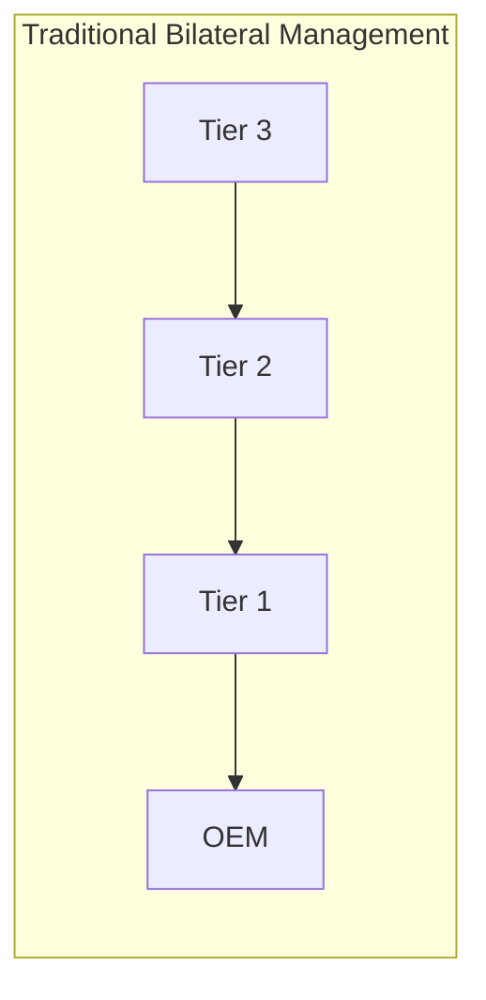
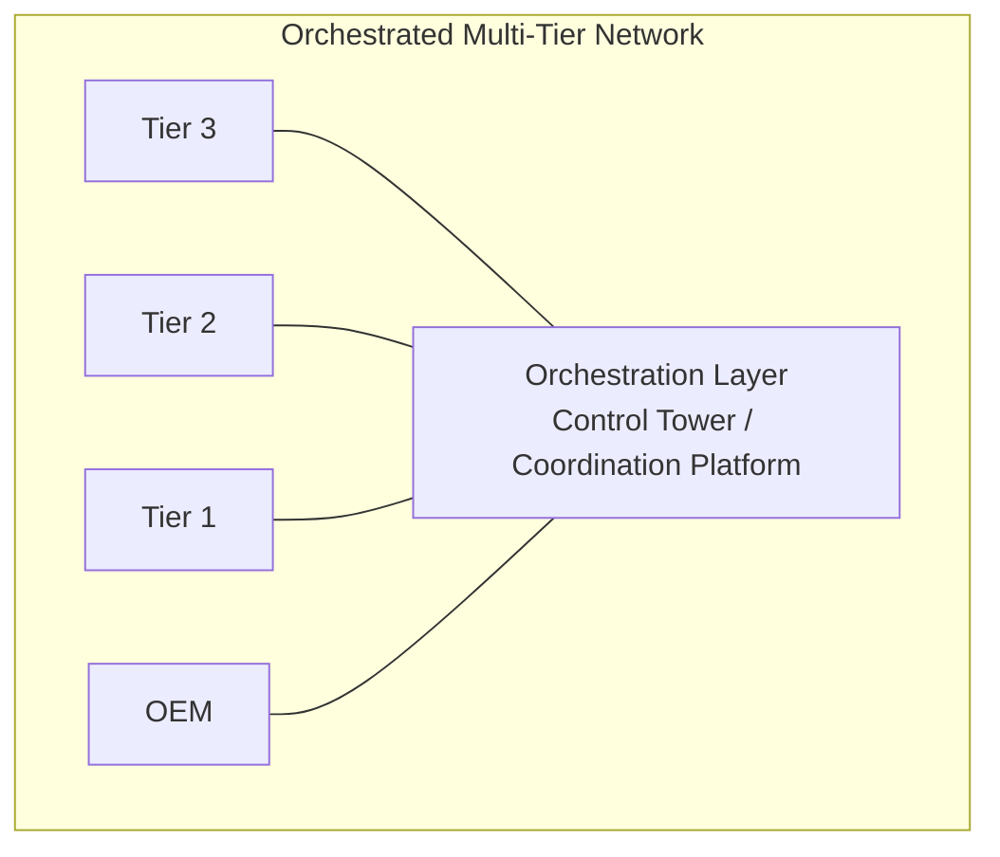
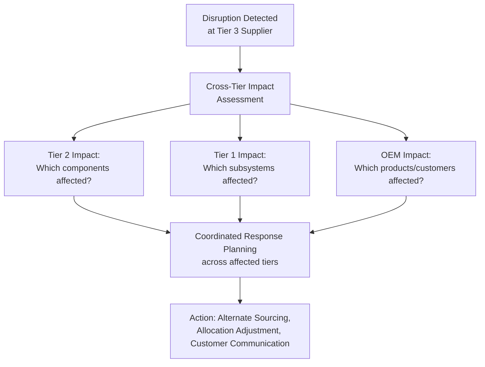

## End-to-End Orchestration Across Tiers

### Definition and Purpose

End-to-end orchestration across tiers refers to the coordinated, systems-enabled management of planning, execution, and exception-handling decisions across the full multi-tier supply network — from raw material/Tier N suppliers through to end customer — treating the network as a single coordinated system rather than a series of independently managed bilateral relationships (OEM-to-Tier-1, Tier-1-to-Tier-2, and so on, each managed in isolation). Orchestration builds directly on the Digital Supply Network concept discussed previously, but focuses specifically on the *control and coordination layer* — the systems, governance, and decision logic that actively manage flows and responses across tiers — rather than the broader network topology and data-sharing infrastructure concept DSN describes.

**Key Points**

- Orchestration is distinguished from simple multi-tier *visibility* (discussed in the Automotive/Aerospace topic): visibility means being able to *see* conditions across tiers, while orchestration means actively *coordinating and directing* responses across tiers based on that visibility — visibility is a prerequisite for orchestration but does not by itself constitute orchestration.
- The core architectural challenge orchestration addresses is that traditional multi-tier supply networks are managed through a series of bilateral relationships (each tier managing only its immediate upstream and downstream neighbors), meaning a disruption or opportunity identified at a lower tier must traditionally propagate upward through multiple sequential bilateral handoffs before reaching a decision-maker with authority to act — orchestration architecture aims to compress or bypass this sequential propagation delay.
- [Inference] Because orchestration requires coordinating decisions and actions across organizationally separate entities (an OEM does not have direct management authority over its Tier 2 or Tier 3 suppliers, who are formally managed by Tier 1), orchestration is generally understood in the literature as depending on influence, contractual mechanisms, and shared-platform participation rather than direct hierarchical command authority — this is a structurally different coordination challenge than internal cross-functional integration (see earlier topic) within a single enterprise, where formal reporting-line authority is at least available as a coordination mechanism.

### Orchestration vs. Traditional Bilateral Tier Management

**Key Points**

- In bilateral management, information and decisions must pass sequentially through each tier boundary, with each tier potentially adding delay, information loss, or independent (and possibly conflicting) local decision-making before the issue or opportunity reaches a point of coordinated resolution.
- In an orchestrated model, a shared coordination layer (often technology-enabled, such as a control tower platform) provides a common reference point that multiple tiers can access more directly, reducing — though not necessarily eliminating — the sequential propagation delay characteristic of purely bilateral management.

### Core Functional Components of Orchestration

#### Control Towers

A control tower is the most commonly referenced technology/organizational construct for implementing orchestration — a centralized (or federated) monitoring and decision-support capability that aggregates data across multiple tiers and provides visibility, alerting, and often decision-support or automated-response capability to a designated orchestration function.

- [Unverified] The term "control tower" is used somewhat inconsistently across vendors and organizations to describe capabilities ranging from pure visibility dashboards to more advanced orchestration platforms with embedded decision-automation capability; the specific functional scope implied by "control tower" should be verified against the specific implementation being discussed rather than assumed to imply a single standard capability set.

#### Exception-Based Management

Orchestration architecture typically emphasizes exception-based (rather than continuous manual monitoring) decision processes: the system continuously monitors conditions across tiers against defined thresholds/rules and surfaces only genuine exceptions (disruptions, deviations from plan) requiring human or automated intervention, rather than requiring constant manual review of routine, on-plan conditions across every tier.

#### Cross-Tier Scenario Planning and Response Coordination

When an exception is identified (e.g., a Tier 3 supplier disruption), orchestration capability ideally enables rapid impact assessment across affected downstream tiers (which Tier 2 suppliers depend on this Tier 3 source, which Tier 1 products depend on those Tier 2 components, and ultimately which OEM products/customers are affected) and coordinated response planning across the affected tiers, rather than each tier independently discovering and reacting to the disruption's impact on their own operations in isolation.

### Governance Models for Cross-Organizational Orchestration

**Key Points**

Because orchestration spans organizationally separate entities, several governance patterns are commonly discussed for how orchestration authority and participation are structured:

- **OEM-led orchestration**: The OEM (as the entity with ultimate accountability for end-product delivery to customers) sponsors and often funds the orchestration platform, requiring or incentivizing Tier 1 (and sometimes lower-tier) participation as a condition of the business relationship — this mirrors the multi-tier sub-tier disclosure requirements discussed in the Automotive/Aerospace topic, extended from pure visibility disclosure to active platform participation.
- **Tier 1-led orchestration**: Given that Tier 1 suppliers often have the most direct relationship with and influence over lower tiers, some orchestration models position Tier 1 as the coordinating layer between the OEM and lower tiers, rather than the OEM attempting to orchestrate lower tiers directly — [Inference] this model likely aligns more naturally with existing contractual authority structures (since Tier 1 already formally manages Tier 2 relationships) but may create orchestration silos if different Tier 1 suppliers within the same OEM's network use different, non-interoperable orchestration approaches, a coordination trade-off not present in a single OEM-led platform used consistently across all Tier 1 relationships.
- **Industry consortium/shared platform models**: In some industries, multiple OEMs or a broader industry group participate in shared orchestration or visibility infrastructure, potentially achieving greater lower-tier participation (since a given Tier 2/3 supplier may serve multiple OEMs and would otherwise need to participate in multiple separate, non-interoperable OEM-specific platforms) — though [Unverified] the prevalence and specific structure of such consortium models varies significantly by industry and is not a universal pattern across all sectors covered in this course.

### Technology Architecture Supporting Orchestration

| Layer | Function |
| --- | --- |
| Data integration layer | Aggregates data feeds from multiple tiers' systems (ERP, MES, logistics systems) into a common data model |
| Visibility/monitoring layer | Real-time or near-real-time dashboards and alerting against defined thresholds |
| Analytics/decision-support layer | Predictive risk scoring, scenario simulation, impact assessment (connects to Supply Chain Analytics Maturity Models topic) |
| Action/response layer | Workflow tools for coordinating response actions across affected tiers; in more advanced implementations, automated or semi-automated response triggering |

**Key Points**

- [Inference] The maturity of the analytics/decision-support layer generally determines how much of the orchestration response process can be automated versus requiring human coordination — an orchestration platform with only descriptive/monitoring capability (visibility layer only) generally still requires substantial human judgment to interpret cross-tier implications and coordinate response, while a platform with mature predictive/prescriptive analytics can increasingly automate impact assessment and even suggest or execute response actions directly, connecting orchestration maturity to the broader analytics maturity progression discussed earlier in the course.

### Organizational and Talent Implications

**Key Points**

- Orchestration roles (sometimes formalized as "control tower analysts" or similar titles) require a blend of the cross-functional, analytical, and domain competencies discussed in the Talent, Skills, and Workforce Evolution topic, applied specifically to a multi-organizational, cross-tier context — requiring not just internal cross-functional fluency but also the relationship-management skill to influence and coordinate with formally separate organizations (Tier 1, Tier 2 suppliers) who do not report through the orchestrating organization's own management hierarchy.
- Because orchestration depends on multi-organizational participation and data-sharing (echoing the DSN topic's discussion of data-sharing trust prerequisites), building and sustaining orchestration capability generally requires the same change-management attention discussed for architecture transformation generally, extended across organizational boundaries where the orchestrating entity has more limited direct authority to mandate adoption than it would have for an internal transformation.

### Common Implementation Challenges

**Key Points**

- **Data standardization across tiers**: Different tiers, particularly lower tiers (Tier 3+), often operate with less sophisticated or standardized data systems than Tier 1 suppliers or the OEM itself, creating data-quality and integration challenges that can undermine the orchestration platform's effectiveness if lower-tier data feeds are inconsistent, delayed, or incomplete.
- **Incentive alignment**: [Inference] Because orchestration platforms typically provide the greatest direct visibility/coordination benefit to the OEM (who has ultimate accountability for end-customer delivery) while requiring data-sharing effort and potential transparency cost from lower tiers (who may be reluctant to expose operational details to an entity they do not have a direct contractual relationship with, in the case of Tier 2/3 suppliers relative to the OEM), orchestration implementation often requires explicit incentive design (cost-sharing, preferential business terms, or contractual requirements) to secure genuine lower-tier participation rather than assuming participation will occur simply because the platform exists.
- **Scope and boundary definition**: Determining which tiers, which product categories, and which specific data elements are in scope for an orchestration initiative is a common early design challenge — attempting comprehensive full-network orchestration across all tiers and all products simultaneously is generally considered a higher-risk, harder-to-execute approach than phased implementation starting with critical/high-risk components or a pilot product line, echoing the phased, pilot-first approach discussed in the Change Management for Architecture Transformation and Building a Supply Chain Center of Excellence topics.

### Practical Example

**Example**

An automotive OEM (extending the tiered supplier network structure discussed earlier in this course) implements an orchestration control tower initially scoped to its highest-risk component category — semiconductor-dependent electronic modules — rather than attempting full-network orchestration across all components simultaneously. The platform integrates data feeds from the OEM's own production planning system, its Tier 1 electronics module suppliers, and, where obtainable through contractual data-sharing requirements, key Tier 2 semiconductor suppliers identified through the OEM's sub-tier mapping program. When a Tier 2 semiconductor supplier reports a capacity constraint, the orchestration platform's impact-assessment capability identifies which Tier 1 electronics modules depend on that specific semiconductor, and in turn which OEM vehicle programs depend on those modules — surfacing this as a prioritized exception to the OEM's supply chain risk team days earlier than would have been possible under the prior bilateral model, where the Tier 2 disruption would have needed to propagate through the Tier 1 supplier's own internal escalation process before reaching OEM visibility. The OEM uses this lead time to work with the Tier 1 supplier on allocation prioritization across affected vehicle programs, illustrating orchestration's core value proposition: compressing the sequential propagation delay inherent in purely bilateral tier management.

### Conclusion

End-to-end orchestration across tiers extends multi-tier visibility into active, coordinated response capability, using technology platforms (commonly termed control towers) and cross-organizational governance models to compress the sequential propagation delay characteristic of traditional bilateral tier-to-tier management. Because orchestration inherently spans organizationally separate entities without unified command authority, its success depends substantially on governance model design (OEM-led, Tier 1-led, or consortium models), explicit incentive alignment for lower-tier participation, and phased implementation scoped to critical risk areas — connecting directly to the data-sharing trust prerequisites and incremental maturity themes discussed in the Digital Supply Network topic, applied specifically to the control-and-coordination dimension of multi-tier network management.

**Next Steps / Related Topics**

- From Linear Supply Chains to Digital Supply Networks
- Multi-Tier Supply Chain Visibility and Digital Control Towers
- Automotive and Aerospace Tiered Supplier Networks (structural foundation)
- Supply Chain Analytics Maturity Models (decision-automation maturity)
- Change Management for Architecture Transformation (multi-organizational context)
- Building a Supply Chain Center of Excellence (phased/pilot implementation parallel)
- Data Sharing Governance and Incentive Design Across Organizational Boundaries