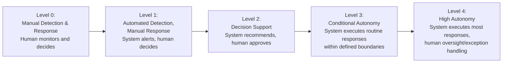
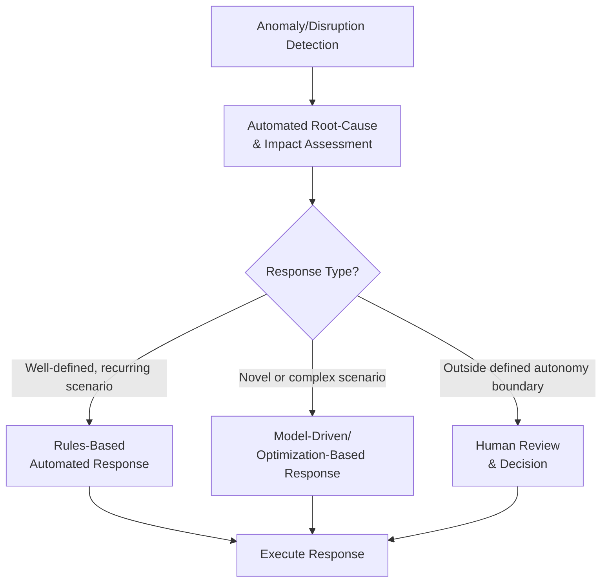

## Self-Healing and Autonomous Supply Chains

### Definition and Purpose

Self-healing and autonomous supply chains describe an advanced conceptual endpoint in supply chain digital maturity in which systems can detect disruptions, evaluate response options, and execute corrective actions with progressively less human intervention — ranging from decision-support systems that recommend actions for human approval, through to systems capable of autonomously executing certain categories of response within predefined boundaries. This concept represents a further extension of the orchestration and Digital Supply Network concepts discussed previously, specifically focused on the *degree of decision-execution autonomy* embedded in the response layer, building most directly on the prescriptive-analytics stage discussed in the Supply Chain Analytics Maturity Models topic.

**Key Points**

- "Self-healing" and "autonomous" are related but distinct emphases: self-healing generally emphasizes automatic detection-and-recovery from a defined disruption (returning the network to a planned or acceptable state), while autonomous more broadly emphasizes systems making and executing decisions (not necessarily only recovery-oriented) with reduced human involvement — the two concepts overlap substantially in practice but are not strictly synonymous.
- [Inference] Because full autonomy in disruption response requires both accurate real-time detection (orchestration/visibility layer) and reliable predictive/prescriptive modeling of response options (analytics maturity), self-healing/autonomous capability is generally presented in the literature as the most advanced point on a maturity continuum — requiring the DSN, orchestration, and prescriptive analytics capabilities discussed in prior topics as prerequisites, rather than being achievable as a standalone technology implementation independent of those foundations.
- This is presented in current industry and academic discussion as a largely emerging and aspirational concept rather than a widely and uniformly implemented operational reality; the maturity spectrum described below should be understood as a conceptual framework for discussing degrees of autonomy, not as a claim that fully autonomous, human-independent supply chains are a common current operational state.

### The Autonomy Spectrum

A commonly referenced way of framing this progression (conceptually analogous to autonomy-level frameworks used in other domains, such as vehicle automation) describes a spectrum from fully manual decision-making to full autonomy:

**Key Points**

- **Level 0-1 (Manual/Automated Detection)**: Corresponds closely to the descriptive/diagnostic analytics maturity stages discussed earlier — systems can detect and alert on conditions, but response decisions remain fully human-driven.
- **Level 2 (Decision Support)**: Corresponds to predictive analytics maturity applied to response planning — the system models response options and recommends a course of action, but a human retains decision authority and must approve before execution; this is presented in much current practitioner discussion as the most common level of AI/automation involvement in current supply chain exception-response processes.
- **Level 3 (Conditional Autonomy)**: The system is authorized to execute certain categories of response autonomously — typically routine, lower-risk, well-defined decisions (e.g., automated reallocation of inventory between two pre-approved locations within a defined threshold) — while more complex or higher-consequence decisions still route to human review.
- **Level 4 (High Autonomy)**: The system handles most response decisions autonomously, with human involvement focused on setting boundaries/policies in advance and handling genuine exceptions/edge cases that fall outside the system's defined decision scope, rather than reviewing routine responses individually.
- [Unverified] Unlike vehicle automation levels, which have relatively standardized industry-body definitions (e.g., SAE levels), there is no single universally standardized numbering or definition scheme for supply chain autonomy levels across the literature; the framework above is illustrative of the general conceptual progression commonly discussed rather than a citation to one specific standardized taxonomy.

### Core Technical Components

#### Anomaly Detection and Predictive Disruption Sensing

Machine learning models trained to identify deviations from expected patterns (demand, supplier performance, transportation conditions) that may indicate an emerging disruption, often before the disruption fully materializes into a visible operational impact — extending the predictive analytics concepts from the Supply Chain Analytics Maturity Models topic specifically to early-warning/anomaly-detection use cases.

#### Automated Root-Cause and Impact Assessment

Building on the cross-tier impact assessment capability discussed in the Orchestration topic, self-healing systems aim to automate not just detection of an anomaly but also the assessment of its likely root cause and downstream impact, reducing the time between detection and actionable understanding of the problem.

#### Rules-Based and Model-Driven Response Execution

- **Rules-based automation**: Predefined "if-then" response logic for well-understood, recurring scenarios (e.g., "if inventory at location A falls below threshold X and location B has surplus above threshold Y, automatically trigger inter-location transfer") — simpler to implement and audit but limited to scenarios explicitly anticipated in advance.
- **Model-driven/optimization-based response**: More sophisticated systems use optimization or reinforcement-learning-based models to evaluate response options dynamically, potentially handling novel scenario combinations not explicitly pre-programmed as rules — [Unverified] the maturity and reliability of reinforcement-learning-based autonomous response specifically in production supply chain contexts (as opposed to research/pilot contexts) varies considerably and is an actively developing area rather than a settled, mature technology category.

### Governance and Guardrails for Autonomous Response

**Key Points**

- **Defined decision boundaries**: A central design principle for any conditional-to-high autonomy implementation is explicit, predefined boundaries on what the system is authorized to decide/execute autonomously versus what must route to human review — this boundary-setting is analogous in governance logic to the decision-rights/RACI frameworks discussed in the Centralized/Decentralized/Center-Led Governance topic, applied here to human-versus-system decision authority rather than human-versus-human authority across organizational tiers.
- **Explainability and auditability**: [Inference] Because autonomous or semi-autonomous supply chain decisions can have material financial, operational, or (in industries like pharmaceutical/food, per earlier topics) safety consequences, systems generally require some degree of decision explainability (the ability to understand and audit why a given autonomous action was taken) — this is generally considered particularly important for model-driven/optimization-based response systems, where the decision logic may be less immediately transparent than explicit rules-based automation, though the specific explainability requirements and regulatory expectations in this area are an evolving topic that should be verified against current sources for any specific regulated industry application.
- **Human oversight and override capability**: Even at higher autonomy levels, maintaining human ability to review, override, or adjust the system's autonomous decision boundaries is generally presented in the literature as an important governance safeguard, rather than autonomy being conceived as fully replacing human oversight entirely.
- **Circuit breakers/fail-safes**: Analogous to safeguards used in automated financial trading systems, autonomous supply chain response systems are generally discussed as needing defined limits or "circuit breaker" mechanisms that pause autonomous execution and escalate to human review when conditions fall outside normal expected parameters, reducing the risk of an autonomous system taking a poorly-considered action at scale in a genuinely novel or extreme scenario it was not designed to handle.

### Relationship to Industry-Specific Considerations Covered Earlier

**Key Points**

- [Inference] The appropriate degree of autonomy is likely to vary considerably by industry and decision type based on the consequence-severity considerations discussed in earlier industry-specific topics: a rules-based automated inventory transfer decision in a retail/omnichannel context (see earlier topic) carries different consequence severity than an autonomous sourcing substitution decision in a pharmaceutical supply chain, where the earlier Pharmaceutical topic discussed how source-specific traceability and regulatory chain-of-custody requirements constrain sourcing flexibility — suggesting that industries with the highest regulatory/safety stakes discussed earlier in this course (pharmaceutical, aerospace) likely warrant more conservative autonomy boundaries and more extensive human-review requirements than industries with lower per-decision consequence severity, though this is a reasoned inference connecting concepts across topics rather than a claim describing actual current autonomy adoption levels by industry, which is not something this general framework can state as fact.

### Talent and Organizational Implications

**Key Points**

- As response-execution autonomy increases, the nature of human supply chain roles is generally discussed as shifting further toward exception management, boundary/policy setting, and system oversight, and away from routine transactional decision-making — extending the workforce evolution trajectory discussed in the Talent, Skills, and Workforce Evolution topic toward its most advanced described stage.
- [Inference] This shift plausibly intensifies the "algorithmic literacy" competency need discussed in the Talent topic — as more decisions are executed autonomously, the human role increasingly involves evaluating and calibrating trust in system-generated boundary policies and reviewing edge cases the system escalates, which is a qualitatively different skill than making the underlying operational decision manually, though as with the broader algorithmic literacy discussion, specific skill/competency standards for this role are not yet as established as more traditional supply chain competencies.
- Change management considerations (see earlier topic) are particularly significant for autonomy-increasing initiatives specifically because they involve a category of change — ceding decision execution authority to a system — that is generally understood to be one of the more difficult trust-building transitions discussed across this course's change management content, building directly on the "black box" distrust challenge noted in the predictive-to-prescriptive analytics transition discussion.

### Practical Example

**Example**

A retailer operating the omnichannel fulfillment architecture discussed earlier in this course initially relies entirely on manual planner review for inventory rebalancing decisions between stores and distribution centers (Level 0-1). The retailer implements a decision-support system (Level 2) that analyzes real-time inventory and demand signals and recommends rebalancing actions, which planners review and approve before execution. After a period of observing the system's recommendation accuracy and building organizational trust in its outputs, the retailer authorizes conditional autonomy (Level 3) for a narrowly defined, well-understood scenario: automatic inventory transfers between stores within the same regional cluster, below a defined dollar-value threshold, when demand-forecast confidence is above a set level — while any rebalancing involving higher-value inventory, cross-regional transfers, or lower-confidence forecast conditions continues to route to human planner review. A defined circuit-breaker halts autonomous execution and escalates to human review if the system detects conditions outside its normal operating parameters (e.g., an unusually large demand spike inconsistent with historical patterns, which might indicate a data error or a genuinely novel event the system was not designed to handle autonomously). This phased, boundary-limited approach illustrates the general pattern of incrementally expanding autonomy scope as trust and demonstrated reliability build, rather than moving directly from manual decision-making to broad autonomous authority.

### Conclusion

Self-healing and autonomous supply chains represent the most advanced conceptual point on the supply chain digital maturity progression discussed throughout this course's advanced topics — extending prescriptive analytics, orchestration, and Digital Supply Network capabilities toward progressively greater system autonomy in disruption detection and response execution. While framed here along a conceptual autonomy spectrum from manual response through high autonomy, current practice is generally understood to concentrate at the decision-support (human-approves) level for most organizations, with genuine conditional-to-high autonomy implementations typically scoped narrowly to well-defined, lower-consequence decision categories and governed by explicit boundaries, explainability requirements, and human-override safeguards — reflecting both the technical maturity prerequisites and the organizational trust-building challenges this represents as one of the more difficult transitions in the broader supply chain digital transformation trajectory covered across this course.

**Next Steps / Related Topics**

- Supply Chain Analytics Maturity Models (prescriptive analytics foundation)
- End-to-End Orchestration Across Tiers
- From Linear Supply Chains to Digital Supply Networks
- Change Management for Architecture Transformation (trust-building for autonomy adoption)
- Talent, Skills, and Workforce Evolution (algorithmic literacy)
- Explainable AI and Decision Auditability in Operations
- Circuit-Breaker and Fail-Safe Design for Automated Decision Systems