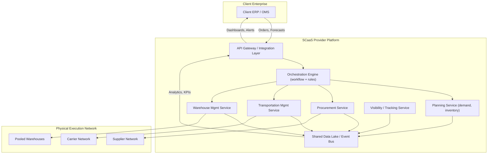

## Supply-Chain-as-a-Service Models

### Definition and Core Concept

Supply-Chain-as-a-Service (SCaaS) is a delivery and consumption model in which supply chain capabilities—planning, procurement, logistics orchestration, warehousing, fulfillment, visibility, and analytics—are provided as modular, subscription-based, cloud-hosted services rather than built and operated as in-house capital-intensive infrastructure. It applies the "as-a-Service" abstraction pattern (as seen in IaaS/PaaS/SaaS) to physical and digital supply chain operations, decoupling the *capability* from the *ownership* of the underlying assets, software, and specialized labor.

**Key Points**

- Shifts capital expenditure (CapEx) to operational expenditure (OpEx): companies pay for throughput, transactions, or subscription tiers instead of owning warehouses, fleets, or ERP licenses.
- Capabilities are exposed as composable services (often API-first) that can be integrated into a client's existing tech stack.
- Providers pool infrastructure, data, and expertise across multiple clients, achieving economies of scale that individual firms—especially SMEs—cannot replicate alone.
- Distinct from traditional 3PL (Third-Party Logistics) in that SCaaS typically includes software/data orchestration layers, not just physical execution.

### Service Taxonomy

SCaaS offerings are generally layered analogously to the cloud computing stack:

| Layer | Analogy | Examples of Capability |
| --- | --- | --- |
| Infrastructure-level | IaaS | Warehouse-as-a-Service, Fleet-as-a-Service, Fulfillment-network-as-a-Service |
| Platform-level | PaaS | Control-tower platforms, TMS/WMS-as-a-Service, EDI/API integration hubs |
| Application-level | SaaS | Demand planning SaaS, procurement SaaS, S&OP (Sales & Operations Planning) tools |
| Orchestration-level | Composed/Managed Service | End-to-end "Supply Chain Operating Partner" offerings that stitch multiple layers together with SLAs |

### Reference Architecture

**Architectural Notes**

- The **API Gateway / Integration Layer** is the primary interface for client systems—typically REST/JSON or EDI-to-API translation—handling authentication, rate limiting, and schema mapping between the client's ERP and the provider's internal event model.
- The **Orchestration Engine** encodes business rules (e.g., routing logic, reorder triggers, exception handling) and coordinates calls across the specialized services; this is frequently implemented as a workflow engine (state machines, saga pattern) given the long-running, multi-party nature of supply chain transactions.
- A shared **event bus / data lake** underlies most modern SCaaS platforms, since visibility promises (real-time tracking, predictive ETAs) require ingesting telemetry from carriers, IoT sensors, and partner systems into a common model.
- [Inference] Many commercial SCaaS platforms use event-driven architectures (Kafka-style pub/sub) internally to handle the asynchronous, multi-party nature of logistics events, though exact implementations are proprietary and vary by vendor.

### Multi-Tenancy and Data Isolation

Because SCaaS pools infrastructure across clients, multi-tenancy design is central:

- **Logical isolation**: Each client's data is segmented (via tenant IDs, row-level security, or separate schemas) while sharing compute/storage infrastructure.
- **Pooled physical assets**: Warehouse space, transportation capacity, or inventory buffers may be genuinely shared (e.g., co-located inventory from multiple brands in one fulfillment center), requiring careful allocation and billing logic tied to actual consumption.
- **Configurable business rules per tenant**: Since each client has different SLAs, carriers, and compliance needs, the orchestration layer must support tenant-specific rule sets without code forks—commonly achieved via a rules engine or configuration-as-data approach.

### Key Service Models in Practice

**Example**

- **Warehousing-as-a-Service (WaaS)**: On-demand access to distributed fulfillment nodes, billed per pallet/unit stored and processed, with WMS functionality delivered as a portal/API rather than software the client installs.
- **Freight/Transportation-as-a-Service**: Dynamic carrier sourcing and rate shopping across a marketplace of carriers, exposed to shippers as a single booking API, abstracting away individual carrier contracts.
- **Control-Tower-as-a-Service**: A visibility and exception-management layer aggregating data from multiple upstream systems (ERP, TMS, WMS, IoT) into a unified dashboard with predictive alerting (e.g., delay risk scoring).
- **Procurement-as-a-Service**: Outsourced sourcing, supplier management, and purchase-order automation, often bundled with supplier risk scoring.

### Integration Patterns

- **API-first onboarding**: Clients integrate via REST/GraphQL APIs or webhooks for order injection, inventory sync, and event notification.
- **EDI bridging**: Legacy trading partners still using EDI (X12, EDIFACT) are supported through translation layers that convert EDI transactions (850, 856, 810) into the provider's internal API schema.
- **iPaaS connectors**: Pre-built connectors for common ERPs (SAP, Oracle NetSuite, Microsoft Dynamics) reduce integration time from months to weeks.
- **Webhook/event subscriptions**: Clients subscribe to shipment status, exception, or inventory-threshold events pushed asynchronously rather than polling.

### Economic and Governance Considerations

- **Pricing models**: Typically consumption-based (per order, per shipment, per SKU stored) or tiered subscription with usage caps, sometimes hybrid (base platform fee + variable transaction fee).
- **SLA structuring**: SLAs must account for the multi-party nature of fulfillment (provider cannot fully guarantee carrier performance, so SLAs often distinguish "controllable" vs "uncontrollable" delay categories).
- **Vendor lock-in risk**: Because orchestration logic, historical data, and integration effort accumulate within the provider's platform, switching costs can be substantial. [Inference] This is analogous to lock-in dynamics seen in cloud IaaS/PaaS and is a commonly cited risk in industry commentary on outsourced supply chain models, though the magnitude varies by how standardized the provider's data export/API is.
- **Data ownership clauses**: Contracts typically need explicit terms on who owns transactional and analytical data generated on the platform, since this data has independent value (e.g., for the provider's cross-client benchmarking).

### Resilience and Failure Modes

- **Single point of failure risk**: Pooling multiple clients onto one provider platform concentrates risk—an outage or provider insolvency can simultaneously disrupt many downstream businesses.
- **Blast-radius containment**: Well-designed SCaaS platforms use tenant isolation and circuit-breaker patterns in the orchestration layer so that one client's abnormal load or faulty integration doesn't degrade service for others.
- **Exception handling design**: Given the high rate of real-world exceptions (customs delays, carrier failures, stockouts), the orchestration engine typically implements compensating transactions (saga pattern) rather than simple two-phase commit, since physical-world actions (a truck already left) cannot be "rolled back" in the database sense.

**Related Topics**

- Control Towers and Real-Time Visibility Platforms
- Digital Twins for Supply Chain Simulation
- API Economy and iPaaS in Logistics Integration
- Multi-Tenant SaaS Architecture Patterns
- Freight Marketplace and Dynamic Carrier Sourcing
- Supply Chain Risk Pooling and Insurance Models
- Event-Driven Architecture (Kafka, Event Sourcing) in Logistics Systems