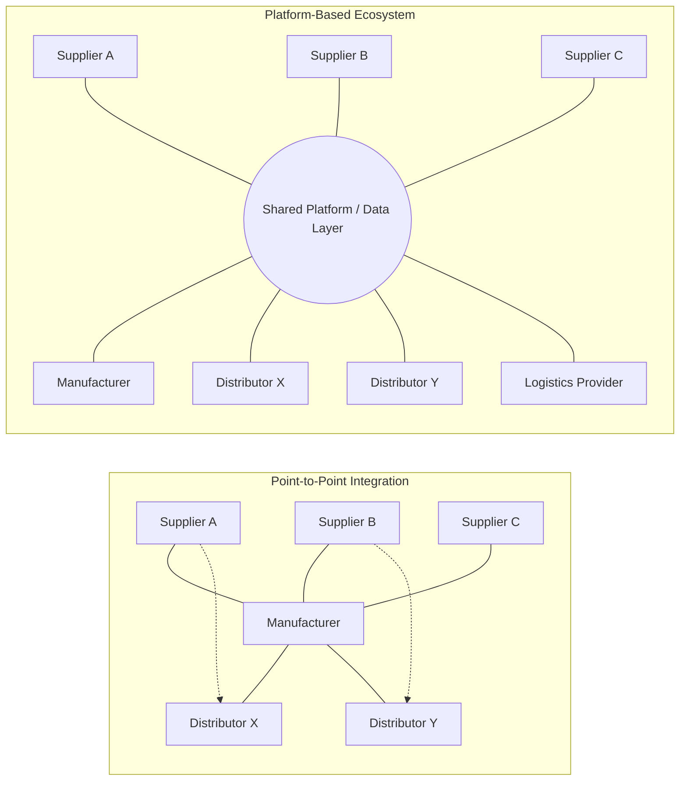
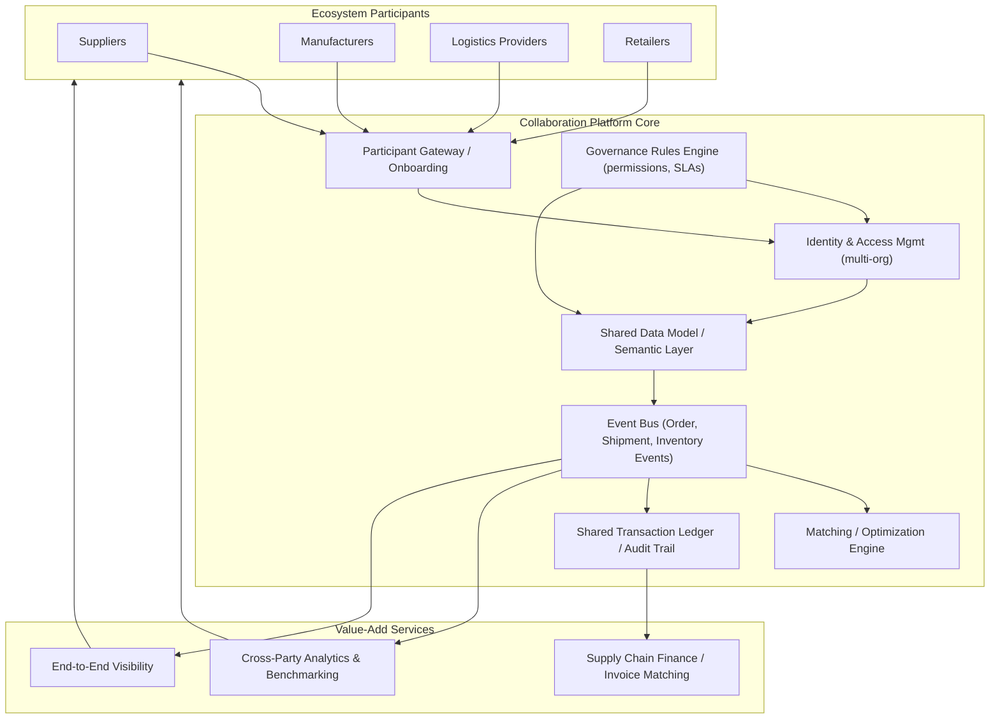

## Ecosystem Collaboration and Platform-Based Architectures

### Definition and Core Concept

Ecosystem Collaboration in supply chains refers to the coordinated, multi-party interaction of independent organizations—suppliers, manufacturers, logistics providers, distributors, retailers, and even competitors—who jointly participate in shared digital infrastructure to plan, execute, and optimize flows of goods, information, and finance. Platform-Based Architecture is the technical enabler of this collaboration: a shared digital substrate (data models, APIs, governance rules, and network effects) on which multiple independent parties transact and exchange information, replacing the traditional point-to-point (bilateral EDI/API) integration model with a many-to-many network topology.

**Key Points**

- Shifts integration topology from $O(n^2)$ point-to-point connections to $O(n)$ hub-and-spoke or mesh connections via a common platform.
- Platforms create value primarily through **network effects**: each new participant increases the value of the platform for all existing participants (more visibility, better matching, more liquidity in capacity/demand).
- Requires **shared semantics** (common data models, ontologies, master data standards) across otherwise heterogeneous internal systems (ERP, WMS, TMS) of each participant.
- Governance (who can see what, who sets the rules, how disputes are resolved) is as much a design concern as the technical architecture itself.

### Topology Comparison

As shown above, point-to-point integration produces a tangled, quadratically growing mesh of custom connections, while the platform model centralizes integration effort into a single shared interface each party connects to once.

### Reference Architecture of a Collaboration Platform

**Architectural Notes**

- **Identity & Access Management (multi-org)**: Unlike single-enterprise IAM, this layer must model *organization-to-organization* trust relationships—a supplier may be visible to one manufacturer but hidden from a competitor also on the platform. Attribute-based access control (ABAC) is commonly used over simple role-based control because visibility rules depend on the relationship context, not just the user's role.
- **Shared Data Model / Semantic Layer**: The hardest non-technical problem in ecosystem platforms is usually semantic alignment—e.g., agreeing on what "shipped" or "available inventory" means when each participant's ERP defines it slightly differently. Standards bodies (GS1, EPCIS for traceability events) are frequently adopted to avoid bespoke semantics.
- **Governance Rules Engine**: Encodes commercial and data-sharing agreements as executable policy (e.g., "Retailer X can see aggregated demand forecasts but not Supplier Y's individual capacity"). This is distinct from application logic and is typically externalized so agreements can change without redeploying core services.
- **Shared Transaction Ledger**: Provides an immutable, mutually-trusted record of events (orders, confirmations, shipments) that all parties can reference for reconciliation and dispute resolution. [Inference] Some platforms implement this with blockchain/DLT for scenarios requiring trust among parties with no central authority, though centralized append-only ledgers with cryptographic hashing achieve similar audit guarantees at lower operational complexity, and vendor choice between the two varies by trust model.

### Platform Governance Models

| Model | Description | Example Pattern |
| --- | --- | --- |
| Owner-Operator | Single dominant firm (e.g., large retailer) builds and controls the platform; suppliers must join on its terms | Retailer-led vendor portals |
| Neutral Third-Party | Independent platform provider serves as neutral intermediary, no single participant controls governance | Logistics marketplaces, freight exchanges |
| Consortium/Cooperative | Multiple industry peers jointly govern the platform via a shared body | Industry data-sharing consortia |
| Federated | No single platform; instead, interoperability standards allow independently-operated platforms to exchange data | Standards-based network federations (e.g., GS1-based traceability networks) |

### Interoperability Patterns

- **Canonical data model**: Internal formats (from each participant's ERP/WMS) are translated to/from a canonical schema at the platform boundary, isolating internal system changes from ecosystem-wide impact.
- **Event-driven publish/subscribe**: Participants publish state changes (order placed, goods shipped, inventory updated) as events; other participants subscribe to relevant event streams rather than polling or requesting data synchronously—critical for scaling to many participants with heterogeneous uptime.
- **API contracts and versioning**: Because breaking changes affect all connected parties simultaneously, platform APIs typically use strict semantic versioning and long deprecation windows.
- **Master data synchronization**: Shared identifiers (GTINs, GLNs, party IDs) are necessary so that "Supplier A's SKU 12345" and "Manufacturer B's part 12345" can be reliably matched.

### Collaboration Patterns Enabled

**Example**

- **Collaborative Planning, Forecasting, and Replenishment (CPFR)**: Retailer and supplier jointly share demand forecasts and POS data through the platform to align replenishment, reducing bullwhip effect.
- **Vendor-Managed Inventory (VMI)**: Supplier gains visibility into the buyer's inventory levels via the platform and proactively manages replenishment without individual purchase orders.
- **Control tower federation**: Multiple parties' control towers exchange exception events (e.g., a carrier's delay event automatically propagates to the manufacturer's and retailer's dashboards).
- **Capacity/demand matching marketplaces**: Freight or warehouse capacity from multiple providers is pooled and matched against demand from multiple shippers in real time.

### Resilience, Trust, and Failure Modes

- **Trust asymmetry**: Smaller participants (e.g., single suppliers) often have less negotiating power over governance terms than platform owners or large anchor participants—a recurring organizational (not purely technical) risk.
- **Data sovereignty and competitive sensitivity**: Participants are often reluctant to share granular operational data with a platform that competitors also use; tiered visibility and data anonymization/aggregation are common mitigations.
- **Platform concentration risk**: As with SCaaS, reliance on a single dominant platform creates systemic risk if that platform experiences outages, changes pricing terms, or shifts governance unfavorably.
- **Cold-start problem**: Platforms need a critical mass of participants before network effects generate value, which is a common reason ecosystem platform initiatives fail to gain traction in fragmented industries.

### Metrics for Ecosystem Health

- Participant onboarding rate and active-connection count (network density: actual connections divided by $\binom{n}{2}$ possible connections)
- Event latency (time from a state change at one participant to visibility at dependent participants)
- Forecast/plan alignment variance across participants (measuring reduction in bullwhip-type distortions)
- Dispute/exception resolution time via the shared ledger versus prior bilateral processes

**Related Topics**

- CPFR (Collaborative Planning, Forecasting, and Replenishment) Implementation
- GS1 Standards and EPCIS Traceability Events
- Multi-Party Identity and Access Management
- Freight and Capacity Marketplaces
- Blockchain/DLT for Supply Chain Trust Models
- Network Effects and Platform Economics
- Federated Data Sharing Architectures