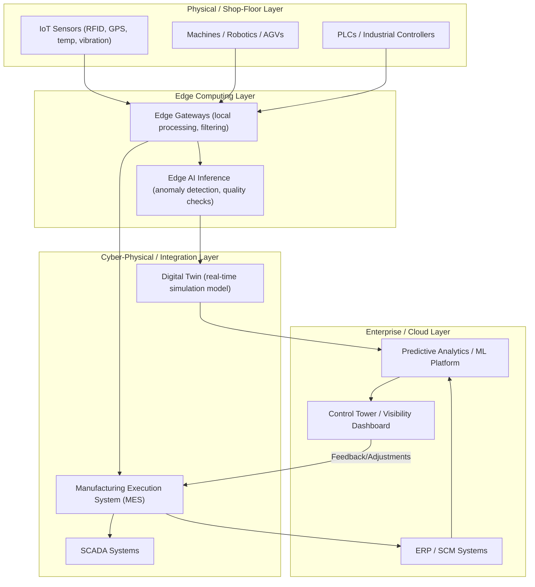
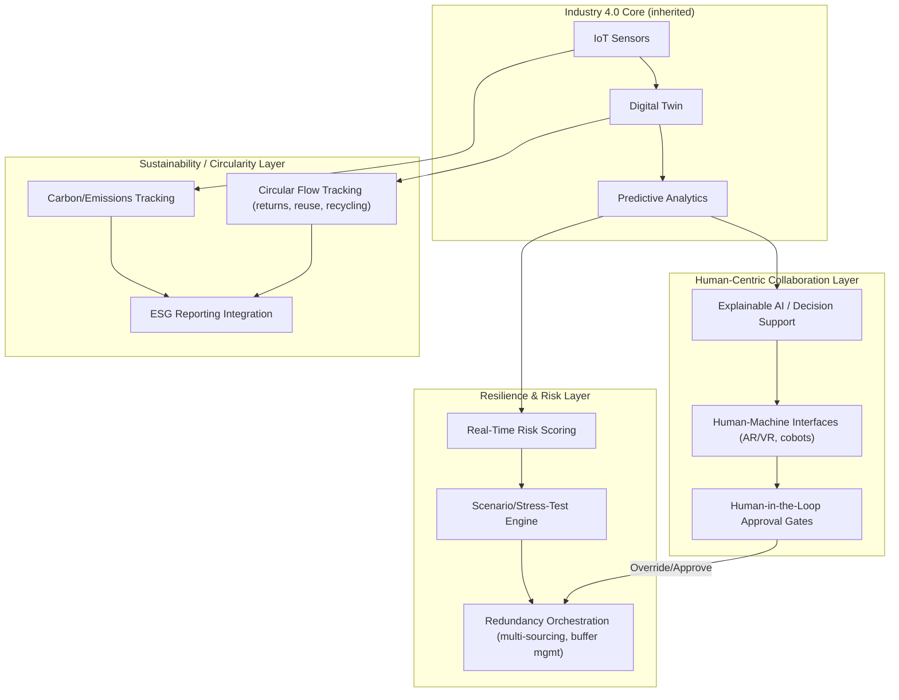

## Industry 4.0 and Industry 5.0 Impacts on Architecture

### Definition and Core Concept

Industry 4.0 and Industry 5.0 represent successive paradigm shifts in manufacturing and supply chain technology, each imposing distinct architectural demands on supply chain systems. **Industry 4.0** centers on cyber-physical systems, IoT-driven automation, and data-driven optimization aimed primarily at efficiency and autonomy. **Industry 5.0** extends this by re-centering human-machine collaboration, resilience, and sustainability as first-class architectural concerns rather than side effects of efficiency-driven automation. For supply chain architecture, this progression translates into concrete shifts: from siloed automation to interconnected cyber-physical supply networks (4.0), and from purely efficiency-optimized systems to resilient, human-centric, sustainability-aware systems (5.0).

**Key Points**

- Industry 4.0 architecture: IoT sensor networks, cyber-physical systems (CPS), edge computing, digital twins, and horizontal/vertical system integration.
- Industry 5.0 architecture: adds human-in-the-loop decision layers, resilience-by-design (not just efficiency-by-design), and circular-economy/sustainability data flows as core system inputs, not afterthoughts.
- Both paradigms push supply chain architecture away from centralized, batch-oriented ERP transactions toward real-time, distributed, event-driven systems.
- [Inference] Industry 5.0 is less a replacement of 4.0's technology stack and more a reorientation of its design priorities and success metrics; the underlying cyber-physical infrastructure largely persists, but resilience and human-centricity become explicit architectural requirements rather than implicit externalities.

### Comparative Architectural Shift

| Dimension | Industry 3.0 (Legacy) | Industry 4.0 | Industry 5.0 |
| --- | --- | --- | --- |
| Primary goal | Automation of discrete tasks | End-to-end efficiency via connectivity/data | Resilience, sustainability, human-centricity |
| Data flow | Batch, periodic (e.g., nightly ERP sync) | Real-time, continuous (IoT streams) | Real-time + contextual (human + machine sensemaking) |
| Decision locus | Centralized planning systems | Distributed, partly autonomous (edge AI) | Human-machine collaborative decision loops |
| Integration style | Point-to-point interfaces | Horizontal (partner-to-partner) & vertical (shop floor to ERP) integration | Ecosystem-wide + human-interpretable interfaces |
| Optimization target | Cost, throughput | Efficiency, speed, predictive accuracy | Efficiency balanced against resilience, wellbeing, environmental impact |

### Industry 4.0 Reference Architecture

**Architectural Notes (Industry 4.0)**

- **Edge computing layer**: Necessary because raw IoT sensor volumes (often thousands of readings/second across a facility) exceed what's practical or latency-acceptable to send directly to the cloud; edge gateways perform local filtering, aggregation, and time-critical inference before forwarding summarized data upstream.
- **Digital twin**: A continuously updated virtual model synchronized with physical asset state via IoT streams, used for simulation ("what if we reroute this shipment"), predictive maintenance, and scenario testing without disrupting physical operations.
- **Vertical integration**: Data flows from shop-floor sensors (OT—operational technology) up through MES to ERP (IT), a historically siloed boundary that 4.0 architecture explicitly bridges—often requiring OT/IT convergence gateways and protocol translation (e.g., OPC-UA to MQTT to REST).
- **Horizontal integration**: Data and processes flow across organizational boundaries (supplier to manufacturer to logistics provider), which is the architectural intersection with ecosystem/platform-based models.

### Industry 5.0 Architectural Extensions

**Architectural Notes (Industry 5.0)**

- **Explainable AI / Decision Support**: Where Industry 4.0 systems often optimized as opaque black-box models (pure throughput/cost minimization), Industry 5.0 architecture requires decision outputs to be interpretable to human operators—architecturally this means adding model-explanation layers (e.g., surfacing feature importance or rule traces) alongside prediction outputs, not just the prediction itself.
- **Human-in-the-loop approval gates**: Critical or high-impact autonomous decisions (e.g., large-scale rerouting, supplier switching) are architected with explicit checkpoints requiring human confirmation, rather than full end-to-end automation—a direct architectural response to over-automation risks observed in pure 4.0 systems.
- **Resilience layer as a first-class concern**: Rather than resilience being an emergent property of a well-optimized system, Industry 5.0 architectures explicitly model stress scenarios (demand shocks, supplier failure, geopolitical disruption) and maintain orchestration logic for redundancy (dynamic multi-sourcing, safety stock rebalancing) as standing system capabilities.
- **Sustainability/circularity data flows**: Carbon tracking, material-flow tracing for circular economy (returns, remanufacturing, recycling loops), and ESG reporting are integrated as core data pipelines feeding into planning decisions—e.g., a routing decision considers emissions cost alongside monetary cost, not as a separate downstream report.
- [Inference] The degree to which "Industry 5.0" constitutes a formally standardized architecture versus an evolving policy/research framing (notably promoted by the European Commission) varies by source; treat the layer names above as a synthesis of commonly cited design themes rather than a single canonical reference architecture, since no single dominant technical standard analogous to, say, RAMI 4.0 has achieved equivalent consensus status for 5.0 as of general industry discourse.

### Cross-Cutting Technical Enablers

| Enabler | Role in 4.0 | Extended Role in 5.0 |
| --- | --- | --- |
| Digital Twins | Simulate physical assets/processes for optimization | Extended to simulate resilience scenarios and human-machine interaction outcomes |
| AI/ML | Predictive analytics, demand forecasting, anomaly detection | Augmented with explainability, bias/fairness checks, human-override hooks |
| IoT/Sensors | Real-time data capture from physical assets | Extended to track sustainability metrics (emissions, energy use) alongside operational metrics |
| Cobots (collaborative robots) | Task automation | Designed explicitly for safe human-robot shared workspaces |
| Cloud/Edge Computing | Scalable processing, low-latency local inference | Same infrastructure, reallocated to prioritize resilience-critical workloads during disruption events |

### Data Model Implications

- Industry 4.0 systems typically model **asset state** (machine status, inventory level, shipment location) as the primary entity.
- Industry 5.0 architectures typically extend the data model to include **impact attributes**—each transaction or process step carries associated carbon footprint, resource consumption, and human workload/safety metadata—so these become queryable dimensions in planning and reporting systems, not just operational throughput metrics.

$$\text{Total Cost}_{5.0} = \text{Cost}_{\text{operational}} + w_1 \cdot \text{Cost}_{\text{carbon}} + w_2 \cdot \text{Risk}_{\text{resilience}}$$

where $w_1$ and $w_2$ are policy-defined weighting factors reflecting an organization's sustainability and resilience priorities, contrasted against pure Industry 4.0 objective functions that typically minimize only $\text{Cost}_{\text{operational}}$.

### Failure Modes and Design Risks

- **Over-automation without override paths (4.0 risk)**: Fully autonomous decision loops with no human checkpoint can propagate errors rapidly across a network before detection—a key motivation for 5.0's human-in-the-loop gates.
- **OT/IT integration brittleness**: Bridging shop-floor protocols (Modbus, OPC-UA, PROFINET) with enterprise IT systems introduces translation layers that are common sources of latency and failure if not designed with backpressure and buffering.
- **Sustainability data quality gaps**: Circularity/carbon tracking is only as reliable as the granularity of upstream sensor and supplier-reported data; architectures must account for incomplete or estimated data (uncertainty propagation) rather than treating these metrics as precise.
- **Behavior may vary**: The specific latency, throughput, and resilience characteristics of any given IoT/edge/digital-twin implementation depend heavily on vendor platform, network conditions, and deployment scale; the architecture described here is a generalized reference pattern, not a guarantee of performance for a specific deployment.

**Related Topics**

- Digital Twins for Supply Chain Simulation
- OT/IT Convergence and Protocol Translation (OPC-UA, MQTT)
- Explainable AI (XAI) in Decision Support Systems
- Circular Economy Data Architectures
- Resilience Engineering and Stress-Test Simulation Design
- RAMI 4.0 Reference Architecture Model
- Human-Robot Collaborative Workspace Design (Cobots)