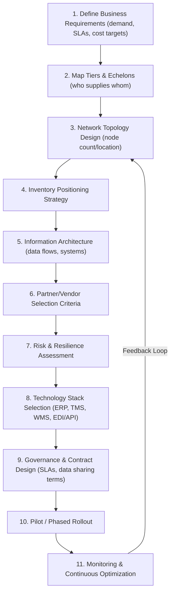
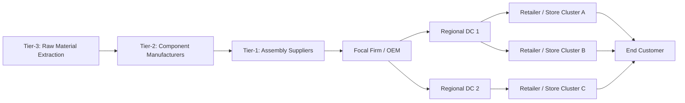
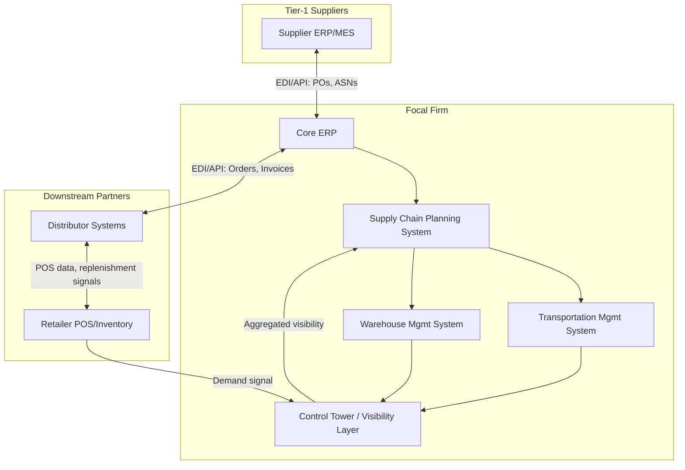

## Designing a Multi-Tier Supply Chain from Scratch

### Definition and Core Concept

Designing a multi-tier supply chain from scratch is the end-to-end architectural exercise of defining the network structure (nodes, tiers, and flows), selecting partners at each tier, and specifying the information and physical systems that connect them—starting from a business requirement (e.g., "deliver product X to market Y") rather than from an existing legacy network. This is a capstone-level synthesis task: it draws on tiered structure design (upstream/downstream echelons), network topology decisions (centralized vs. distributed), technology architecture (ERP, EDI/API integration, visibility layers), and increasingly the platform/ecosystem and Industry 4.0/5.0 patterns covered in prior chapters.

**Key Points**

- Design proceeds top-down from business requirements (demand profile, service level targets, cost constraints) and bottom-up from physical/operational constraints (supplier locations, lead times, capacity).
- A multi-tier chain is defined by its **echelons**—typically Tier-2/Raw Material Suppliers → Tier-1 Suppliers/Component Manufacturers → Manufacturer/OEM → Distribution Centers → Retailers/End Customers—though real networks are rarely strictly linear.
- Core design decisions: number of tiers, node locations, inventory positioning, information flow architecture, and make/buy/outsource boundaries.
- The exercise must reconcile physical network design (facilities, transportation) with information architecture (what data must flow, how fast, to whom).

### Design Process Overview

### Step 1–2: Requirements and Tier Mapping

**Key Points**

- Demand characterization: volume, variability (coefficient of variation), seasonality, and required service level (e.g., 98% fill rate) directly drive downstream design choices like safety stock and DC count.
- Tier mapping identifies, for each product, the full bill-of-materials (BOM) ancestry: which raw materials/components come from which suppliers, and how many tiers deep that traceability needs to extend (regulatory or risk requirements, e.g., conflict minerals or food safety, may force visibility into Tier-3+).

**Example**

### Step 3: Network Topology Design

Core trade-off: **centralization vs. distribution** of nodes (DCs, plants).

| Topology | Characteristics | When to Use |
| --- | --- | --- |
| Centralized (single DC) | Lower inventory holding cost (risk pooling), higher transportation cost/lead time | Low-velocity, high-value goods; predictable demand |
| Decentralized (regional DCs) | Higher inventory cost (duplicated safety stock), lower transportation cost/lead time | High-velocity goods, time-sensitive delivery SLAs |
| Hub-and-spoke | Central hub for consolidation, spokes for last-mile | Balances consolidation economies with local responsiveness |
| Direct-ship (drop-ship) | Supplier ships directly to end customer, bypassing DC | Low-volume SKUs, e-commerce long-tail |

The number of facilities is a classic **facility location problem**, often modeled as a variant of the weighted p-median or fixed-charge facility location formulation:

$$\min \sum_{i} \sum_{j} c_{ij} x_{ij} + \sum_{j} f_j y_j$$

subject to demand satisfaction and capacity constraints, where $c_{ij}$ is the transportation cost from facility $j$ to demand point $i$, $x_{ij}$ is the flow assigned, $f_j$ is the fixed cost of opening facility $j$, and $y_j \in \{0,1\}$ indicates whether facility $j$ is opened. [Unverified] Exact formulations vary by solver/toolkit and by which real-world constraints (capacity, multi-echelon flow, single- vs multi-sourcing) are incorporated; the above is a simplified canonical form used for illustration, not a specific vendor tool's implementation.

### Step 4: Inventory Positioning Strategy

**Key Points**

- Decouple point selection: where in the tier chain should inventory buffer against demand variability (raw material, WIP, finished goods, or DC level)—informed by the make-to-stock vs. make-to-order boundary.
- Multi-echelon inventory optimization (MEIO) computes safety stock jointly across tiers rather than independently per node, since independently-optimized per-node safety stock tends to over-provision system-wide inventory.
- Bullwhip effect mitigation is a direct design concern here: information-sharing architecture (Step 5) and inventory positioning jointly determine how much demand variability amplifies as orders propagate upstream.

### Step 5: Information Architecture

**Architectural Notes**

- Choose integration protocol per partner tier maturity: EDI (X12/EDIFACT transactions like 850/855/856) for legacy Tier-1/2 partners, REST/JSON APIs for digitally mature partners, and increasingly platform-based integration (per ecosystem/platform architecture patterns) as the network scales.
- The **control tower / visibility layer** aggregates signals across tiers so that a demand or supply shock (e.g., a Tier-2 component shortage) is detectable before it propagates into a finished-goods stockout—this is the architectural link between multi-tier design and resilience.
- Master data management (MDM) across tiers—consistent SKU/part identifiers, unit-of-measure conversions—is a prerequisite; without it, cross-tier visibility data is not reliably matchable.

### Step 6–7: Partner Selection and Risk Assessment

**Key Points**

- Selection criteria typically span cost, quality (defect rate), reliability (on-time delivery %), financial stability, geographic/geopolitical risk, and sustainability/compliance posture.
- Single- vs. multi-sourcing trade-off: single-sourcing lowers unit cost via volume leverage but raises supply risk; dual/multi-sourcing raises resilience at the cost of fragmented volume and duplicated qualification effort.
- Risk assessment should map risk concentration across tiers—e.g., multiple Tier-1 suppliers may share a common Tier-2 sub-supplier, creating a hidden single point of failure not visible without deeper tier mapping (Step 2 feeding back into Step 7).

### Step 8: Technology Stack Selection

| Layer | Typical System Category | Key Selection Criteria |
| --- | --- | --- |
| Planning | S&OP / Demand Planning / MEIO tools | Forecast accuracy support, multi-echelon optimization capability |
| Execution (Manufacturing) | MES, ERP | Integration with shop-floor OT systems |
| Execution (Logistics) | TMS, WMS | Carrier network breadth, warehouse automation compatibility |
| Visibility | Control tower platforms | Breadth of connector/API library across partner tiers |
| Integration | iPaaS, EDI VAN, API gateway | Protocol flexibility (EDI + API), partner onboarding speed |

### Step 9–11: Governance, Pilot, and Monitoring

**Key Points**

- SLA design must specify measurable terms per tier relationship (lead time, fill rate, quality defect thresholds, data-sharing latency) with clear accountability boundaries, especially where a platform/ecosystem model (Step 5) is used and responsibility for delays may span multiple parties.
- Phased rollout (pilot with a limited product line, region, or partner subset) allows validation of the topology, information flows, and partner performance before full-network commitment—reducing the cost of design errors discovered late.
- Continuous monitoring closes the loop: KPIs (fill rate, cash-to-cash cycle time, on-time-in-full, inventory turns) feed back into topology and inventory positioning decisions (Step 3–4), making the design process iterative rather than one-shot.

### Common Design Pitfalls

- **Ignoring hidden Tier-2+ concentration risk**: Designing visibility and resilience only at Tier-1 while deeper tiers share single-source dependencies.
- **Over-indexing on cost at design time**: Selecting the lowest-cost topology/partners without stress-testing against demand or supply shocks, producing a network that is efficient but brittle (directly related to the Industry 4.0-efficiency vs. Industry 5.0-resilience tension).
- **Information architecture as an afterthought**: Finalizing physical network design before defining what data must flow between tiers often forces costly retrofitting of integration systems.
- **Underestimating master data alignment effort**: Cross-tier visibility initiatives frequently stall not on technology but on reconciling inconsistent product/partner identifiers across each tier's legacy systems.
- **Behavior may vary**: Actual network performance (lead times, costs, resilience under disruption) depends heavily on real-world execution quality, partner reliability, and external factors (fuel prices, geopolitical events, weather) not fully captured in the design-stage models above; treat facility-location and MEIO formulas as planning aids, not guarantees of realized performance.

**Related Topics**

- Multi-Echelon Inventory Optimization (MEIO) Techniques
- Facility Location Modeling and Network Optimization
- Bullwhip Effect: Causes and Mitigation Strategies
- Control Tower Architecture and Cross-Tier Visibility
- Supplier Risk Assessment and Tier-N Mapping
- Master Data Management (MDM) in Multi-Tier Networks
- Ecosystem Collaboration and Platform-Based Architectures