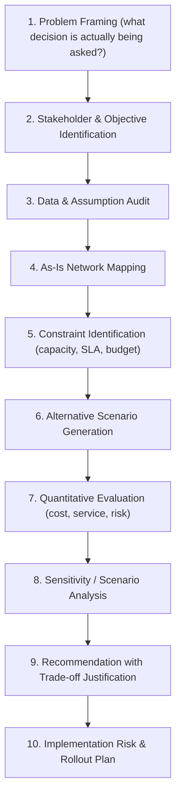
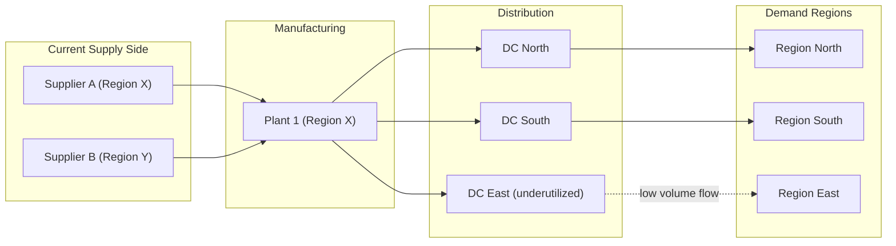

## Network Design Case Study Analysis

### Definition and Core Concept

Network Design Case Study Analysis is the applied practice of dissecting real or realistic supply chain network scenarios to evaluate design trade-offs, diagnose structural weaknesses, and recommend architectural changes. Unlike greenfield design (starting from scratch), case study analysis typically works from an **existing or proposed network configuration** with given constraints (facility locations, demand data, cost structures) and requires evaluating that configuration against alternatives using quantitative and qualitative frameworks. This is a core capstone skill: translating a narrative business scenario into a structured analytical model, identifying the binding constraints, and defending a design recommendation with evidence.

**Key Points**

- Case analysis differs from pure optimization: it requires interpreting ambiguous or incomplete data, making explicit assumptions, and defending trade-offs to stakeholders—not just solving a well-posed math problem.
- A rigorous case analysis follows a repeatable structure: problem framing → data/assumption audit → quantitative modeling → scenario comparison → recommendation → risk/sensitivity check.
- Case studies typically test a candidate's ability to apply prior concepts (tiered structures, MEIO, facility location, ecosystem/platform architecture, Industry 4.0/5.0 resilience patterns) to a messy, real-world-like context rather than a clean textbook formulation.

### Case Analysis Framework

### Step 1–2: Problem Framing and Objectives

**Key Points**

- Distinguish the *stated* problem (e.g., "reduce logistics cost by 15%") from the *underlying* decision (e.g., whether to consolidate DCs, change sourcing, or renegotiate carrier contracts)—case studies often bury the real decision point in surrounding narrative detail.
- Identify conflicting stakeholder objectives explicitly: e.g., finance wants lower inventory carrying cost, sales wants higher service levels, sustainability wants lower emissions—these translate into a multi-objective trade-off, not a single-metric optimization.
- Establish the decision scope and time horizon (tactical reconfiguration vs. strategic 5-year network redesign), since this determines which variables are fixed (existing facility leases, long-term contracts) versus free (new facility locations, sourcing mix).

### Step 3–4: Data Audit and As-Is Mapping

**Example**

A typical case data set includes: demand by region/SKU, current facility locations and capacities, transportation lane costs, lead times by lane, inventory holding cost rates, and service level history (fill rate, on-time delivery). The **as-is network map** should be built before any redesign discussion:

A common analytical finding at this stage: an underutilized node (e.g., "DC East" above) or an asymmetric flow pattern that signals a structural inefficiency worth investigating further—but conclusions should not be drawn from the map alone without the quantitative step.

### Step 5–6: Constraints and Scenario Generation

**Key Points**

- Hard constraints (regulatory limits, existing contractual lease terms, minimum service level commitments) must be separated from soft constraints/preferences (preferred carrier, desired lead time) which can be relaxed in alternative scenarios.
- Generate a bounded set of alternative scenarios rather than an unconstrained search space—typically 3–5 well-differentiated options (e.g., "consolidate to 2 DCs," "add a regional DC in Region East," "shift to 3PL-operated distribution," "dual-source Region Y supply").
- Each scenario should be a coherent, internally consistent redesign—not a partial tweak—so that comparison across scenarios is apples-to-apples.

### Step 7–8: Quantitative Evaluation and Sensitivity Analysis

**Key Points**

- Core comparison metrics: total landed cost (transportation + inventory holding + facility fixed cost), average/worst-case lead time, service level (fill rate) achievability, and capital investment required per scenario.
- A simplified total cost comparison across scenarios:

$$TC_k = \sum_{j \in J_k} f_j + \sum_{i,j} c_{ij} x_{ij}^{(k)} + h \cdot \bar{I}_k$$

where $TC_k$ is total cost for scenario $k$, $f_j$ is fixed facility cost, $c_{ij}$ is per-unit transportation cost on lane $i\text{-}j$, $x_{ij}^{(k)}$ is flow volume under scenario $k$, $h$ is holding cost rate, and $\bar{I}_k$ is average inventory level under scenario $k$.

- **Sensitivity analysis** is essential, not optional: test each scenario's ranking stability against plausible variation in key inputs (demand growth/decline, fuel cost changes, lead time variability)—a scenario that wins under base-case assumptions but is fragile to a 10% demand shift is a materially different recommendation than one that is robust across the plausible range.
- [Inference] Case studies that omit sensitivity analysis and present only a single-point-estimate recommendation are generally considered weaker analyses in supply chain design practice, since real network decisions carry multi-year capital commitments under genuine forecast uncertainty; this is a widely-taught principle in operations/supply chain analysis rather than a claim specific to any one methodology.

### Step 9–10: Recommendation and Risk Assessment

**Key Points**

- A defensible recommendation states the chosen scenario, the primary trade-offs accepted (e.g., "higher fixed cost, lower transportation cost and improved resilience"), and the conditions under which the recommendation would change (breakeven analysis).
- Implementation risk assessment should address transition costs and timeline (e.g., new facility ramp-up time, contract termination penalties on existing leases) as distinct from steady-state operating cost—case studies frequently reward candidates who account for transition/migration cost, which is often omitted in naive analyses.
- Explicitly connect the recommendation back to the resilience and ecosystem/platform considerations from prior chapters where relevant—e.g., does the recommended network concentrate risk in a single region, or does it enable better cross-tier visibility.

### Common Analytical Pitfalls in Case Studies

- **Treating the case's numbers as more precise than warranted**: Case data is often illustrative; over-engineering a solution to three decimal places of "optimality" on approximate input data signals poor judgment about model-data fit.
- **Single-scenario tunnel vision**: Jumping directly to one "obvious" fix (e.g., "just add a DC") without articulating and comparing genuine alternatives.
- **Ignoring non-cost objectives**: Presenting a cost-minimal answer while ignoring stated service-level or resilience requirements from the case narrative.
- **Static analysis only**: Failing to test how the recommended network performs under demand growth, disruption, or cost-input volatility (Step 8), producing a recommendation optimized only for the single base case presented.
- **Omitting implementation feasibility**: A theoretically optimal network that ignores realistic transition constraints (existing contracts, capital availability, organizational change capacity) is an incomplete recommendation.

### Evaluation Rubric Template

| Criterion | What Strong Analysis Demonstrates |
| --- | --- |
| Problem framing | Correctly identifies the real decision, not just the surface-level ask |
| Assumption transparency | States assumptions explicitly where data is ambiguous or missing |
| Scenario breadth | Compares genuinely distinct, well-justified alternatives |
| Quantitative rigor | Uses appropriate cost/service models, shows calculation logic |
| Sensitivity awareness | Tests recommendation robustness against key uncertain variables |
| Trade-off articulation | Clearly states what is gained and given up by the recommendation |
| Implementation realism | Accounts for transition cost, timeline, and organizational risk |

**Related Topics**

- Facility Location Modeling and Network Optimization
- Multi-Echelon Inventory Optimization (MEIO) Techniques
- Designing a Multi-Tier Supply Chain from Scratch
- Scenario Planning and Sensitivity Analysis Methods
- Total Landed Cost Modeling
- Supply Chain Risk Assessment and Resilience Metrics
- Breakeven and Trade-off Analysis in Network Redesign