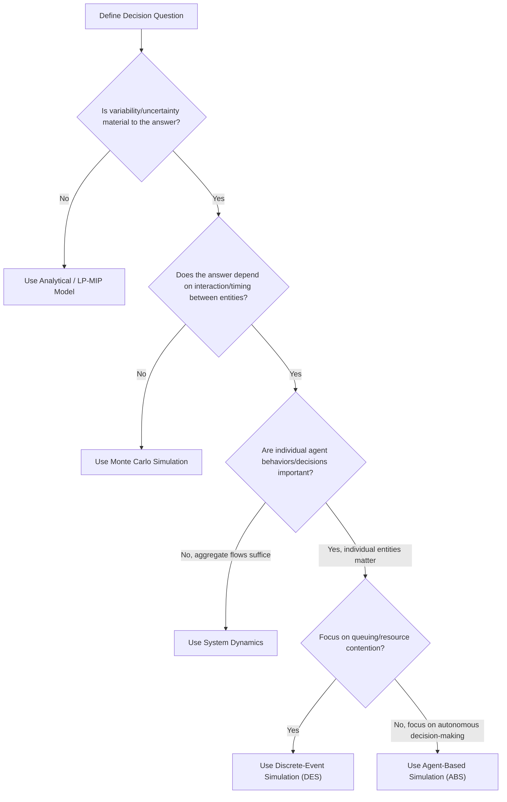
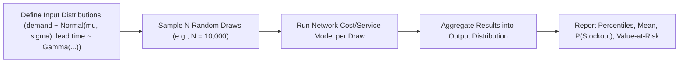
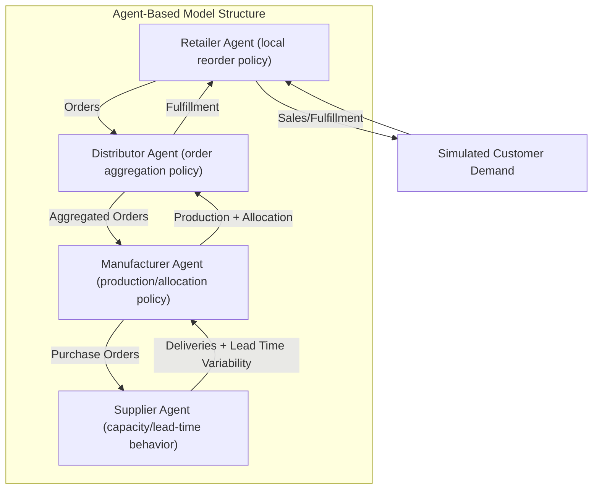

## Simulation and Modeling Exercises for Network Decisions

### Definition and Core Concept

Simulation and Modeling Exercises for Network Decisions comprise the quantitative toolkit used to test supply chain network designs against uncertainty *before* committing capital—complementing the static case-analysis methods (deterministic cost comparisons) with dynamic, stochastic, and computational techniques that capture variability, time-dependent behavior, and emergent system effects (e.g., bullwhip amplification, congestion, cascading disruption) that closed-form formulas cannot easily represent. Where a case study analysis typically asks "which scenario is cheapest at expected demand," simulation asks "how does each scenario actually behave across the full distribution of possible futures."

**Key Points**

- Modeling techniques range from analytical/closed-form (fast, approximate) to discrete-event and agent-based simulation (slower, higher-fidelity, captures dynamics and interaction effects).
- Simulation is essential wherever variability, time-dependency, or emergent multi-agent behavior materially affects the outcome—e.g., stockout cascades, congestion at shared facilities, disruption propagation across tiers.
- The choice of modeling technique should match the decision's stakes and the phenomena being tested; using full discrete-event simulation for a simple two-node cost comparison is often disproportionate effort, just as using a static formula to evaluate systemic disruption risk is usually insufficient.

### Modeling Technique Spectrum

| Technique | Captures | Speed | Typical Use Case |
| --- | --- | --- | --- |
| Analytical/Closed-form (EOQ, newsvendor, safety stock formulas) | Steady-state expected behavior | Very fast | Quick sizing, first-pass estimates |
| Linear/Mixed-Integer Programming (LP/MIP) | Optimal allocation under constraints, deterministic | Fast–moderate | Facility location, network flow optimization |
| Monte Carlo Simulation | Outcome distributions under input uncertainty | Moderate | Risk/sensitivity analysis on cost, service level |
| Discrete-Event Simulation (DES) | Time-dependent system dynamics, queuing, congestion | Slower | Warehouse operations, order fulfillment flow |
| Agent-Based Simulation (ABS) | Emergent behavior from autonomous, interacting agents | Slowest | Multi-tier bullwhip effects, disruption propagation, ecosystem/platform dynamics |
| System Dynamics | Feedback loops, aggregate stock-and-flow behavior over time | Moderate | Bullwhip effect modeling, policy-level "what-if" |

### Modeling Technique Selection Process

### Monte Carlo Simulation for Network Risk

**Key Points**

- Used to propagate input uncertainty (demand variability, lead time variability, supplier reliability) through a network cost/service model to produce an *outcome distribution* rather than a single point estimate.
- Core mechanic: repeatedly sample input variables from their assumed probability distributions, run the network model for each sample, and aggregate results (mean, percentiles, probability of stockout/cost overrun).

**Example**

A basic safety stock sizing under demand and lead-time uncertainty (a common closed-form starting point before moving to full simulation):

$$SS = z \cdot \sqrt{L \cdot \sigma_D^2 + D^2 \cdot \sigma_L^2}$$

where $z$ is the service-level factor (from the standard normal distribution), $L$ is mean lead time, $\sigma_D^2$ is demand variance, $D$ is mean demand, and $\sigma_L^2$ is lead-time variance. Monte Carlo simulation extends beyond this closed form when demand/lead-time distributions are non-normal, correlated across SKUs, or when the network has multiple interacting echelons where the closed-form formula's independence assumptions break down.

### Discrete-Event Simulation (DES) for Operational Dynamics

**Key Points**

- Models the system as a sequence of discrete events (order arrival, truck departure, dock unloading, pick-pack completion) changing system state over simulated time, rather than continuous equations.
- Well-suited for capturing **queuing and congestion effects**—e.g., how dock door capacity at a DC affects truck turnaround time and downstream delivery reliability under variable arrival patterns—phenomena that static average-based models systematically underestimate (queuing delay grows non-linearly as utilization approaches capacity).
- Common DES building blocks: entities (orders, shipments), resources (dock doors, forklifts, pickers), queues, and event schedulers advancing simulated clock time.

$$W_q = \frac{\rho}{1-\rho} \cdot \frac{1}{\mu}$$

A simplified M/M/1 queuing approximation illustrating why average wait time $W_q$ grows sharply as utilization $\rho$ (arrival rate divided by service rate) approaches 1—this non-linearity is precisely what DES captures explicitly through simulated event sequences, whereas a static average-flow model would miss it entirely. [Inference] Real warehouse/DC systems are rarely well-approximated by a simple M/M/1 queue given multiple resource types and non-Poisson arrival patterns; the formula above is included as an illustrative intuition-builder for why queuing matters, not as a directly applicable sizing tool for a specific facility.

### Agent-Based Simulation (ABS) for Multi-Tier Dynamics

**Key Points**

- Each supply chain participant (supplier, manufacturer, retailer) is modeled as an autonomous agent with its own decision rules (e.g., reorder point policy, order-up-to level), and system-level behavior *emerges* from the interaction of these independently-acting agents—making ABS well-suited to studying phenomena like the bullwhip effect, where amplified demand variability upstream results purely from local, individually-rational ordering decisions.
- Particularly relevant to testing ecosystem/platform architecture decisions (from prior chapters): ABS can model how information-sharing rules (e.g., shared POS data via a platform) change agent behavior and reduce variance amplification compared to isolated, non-shared decision-making.
- Also used for disruption propagation studies: simulating how a Tier-2 supplier failure cascades through agent-level reordering and allocation decisions across the network, surfacing risk concentration effects that static tier-mapping alone would not reveal.

### System Dynamics for Policy-Level Analysis

**Key Points**

- Models the network as interconnected stocks (inventory levels) and flows (order/shipment rates) governed by feedback loops, aggregating away individual-agent detail in favor of tractable, high-level "what if we change this policy" experimentation.
- The classic use case is illustrating the bullwhip effect at a conceptual/teaching level: showing how order-rate amplification emerges from feedback delays (lead time) and local optimization at each echelon, without needing full agent-level detail.
- Well-suited for strategic policy testing (e.g., "what if all tiers moved to weekly instead of monthly ordering cycles") where the goal is understanding directional system behavior rather than precise operational metrics.

### Practical Exercise Design Pattern

**Example**

A typical capstone simulation exercise follows this structure:

1. **Baseline replication**: Build a simulation of the *current* network and validate it reproduces known historical performance (cost, service level) within a reasonable tolerance—establishing credibility before testing changes.
2. **Scenario injection**: Introduce the proposed change (new DC, dual-sourcing policy, information-sharing agreement) into the validated model.
3. **Multiple-replication runs**: Run each scenario many times (varying random seeds) to characterize the *distribution* of outcomes, not just a single run's result—since stochastic simulations produce different outputs per run.
4. **Statistical comparison**: Compare scenario outcome distributions using appropriate statistical tests (e.g., confidence intervals on mean cost/service level) rather than comparing single-run point values, to ensure observed differences aren't just random noise.
5. **Stress testing**: Inject disruption events (demand spikes, supplier failures, lead-time shocks) into the validated model to test resilience, directly extending the sensitivity analysis practiced in case study work into a dynamic setting.

### Common Pitfalls in Simulation Exercises

- **Skipping baseline validation**: Building a simulation of a proposed network without first validating the model's fidelity against known current-state data risks drawing conclusions from a miscalibrated model.
- **Single-run conclusions**: Treating the result of one stochastic simulation run as definitive, rather than running multiple replications and reporting distributions/confidence intervals.
- **Over-fidelity for the decision at hand**: Building a full agent-based or discrete-event model when a simpler analytical or Monte Carlo approach would answer the question at lower cost and complexity.
- **Ignoring correlation structure**: Sampling input uncertainties (e.g., demand across multiple regions, or multiple suppliers' lead times) as fully independent when real-world correlations (regional economic shocks, shared upstream dependencies) exist, understating true tail risk.
- **Behavior may vary**: Simulation results are only as reliable as the input distributions and behavioral rules encoded into the model; real-world outcomes may diverge from simulated projections due to unmodeled factors, making simulation a decision-support aid rather than a predictive guarantee.

**Related Topics**

- Bullwhip Effect: Causes and Mitigation Strategies
- Multi-Echelon Inventory Optimization (MEIO) Techniques
- Queuing Theory Applications in Warehouse Design
- Network Design Case Study Analysis
- Monte Carlo Methods and Value-at-Risk in Supply Chain Risk
- Agent-Based Modeling Tools and Frameworks
- Disruption Propagation and Cascading Failure Analysis