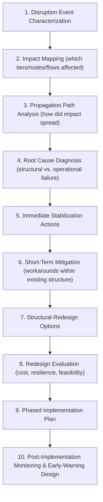
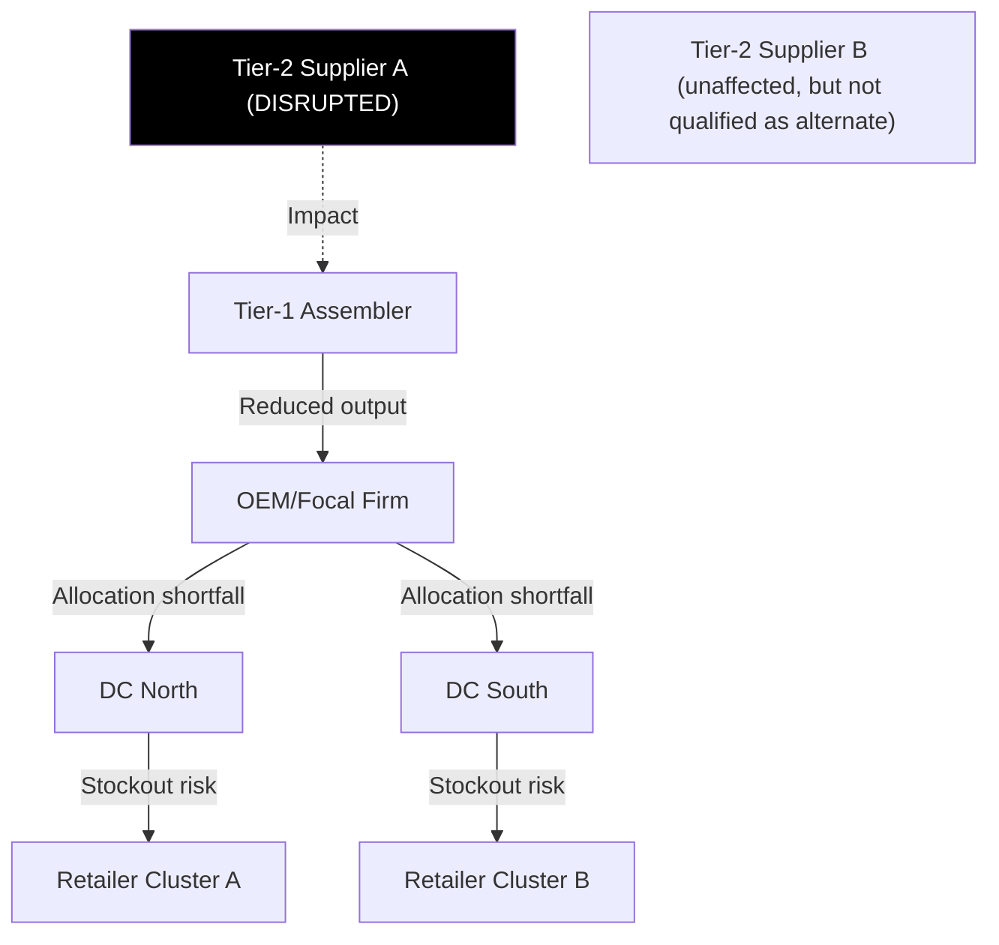

## Diagnosing and Redesigning a Disrupted Tiered Network

### Definition and Core Concept

Diagnosing and Redesigning a Disrupted Tiered Network is the applied capstone skill of analyzing a supply chain that has already experienced a disruption—supplier failure, facility loss, geopolitical shock, demand collapse or spike—and producing a structured redesign response. Unlike greenfield design (starting clean) or pre-emptive risk assessment (testing a healthy network against hypothetical shocks), this exercise starts from an *actual degraded state*: known impact, partial data, and time pressure. It combines root-cause diagnosis (why did the disruption propagate the way it did) with redesign (what structural changes prevent recurrence and restore performance), drawing directly on tiered structure mapping, resilience/Industry 5.0 principles, and simulation-based stress testing from prior chapters.

**Key Points**

- Diagnosis and redesign are sequential but iterative: redesign options are constrained by what the diagnosis reveals about *why* the disruption propagated, not just *that* it occurred.
- A disrupted network exercise differs from proactive resilience design in that real, observed data exists (which tier failed, how fast impact propagated, which mitigations worked or failed)—this is evidence-based diagnosis, not purely hypothetical scenario planning.
- The output is typically a phased response: immediate stabilization, short-term mitigation, and structural redesign, since a disrupted network cannot be redesigned instantaneously while still serving customers.

### Diagnosis-to-Redesign Process

### Step 1–2: Event Characterization and Impact Mapping

**Key Points**

- Characterize the disruption by type (supply-side: supplier failure, raw material shortage; demand-side: shock/spike; network-side: facility loss, transportation corridor closure; systemic: geopolitical, pandemic, financial) since each type has different propagation dynamics and redesign implications.
- Impact mapping overlays the disruption onto the existing tier map (built using the tier-mapping approach from network design) to identify: which specific nodes were directly hit, which nodes are downstream-dependent, and which alternate paths (if any) existed but were unused or insufficient.

**Example**

The critical diagnostic finding illustrated above is typically not just "Supplier A failed" but "Supplier B existed as unaffected capacity yet was not qualified/contracted as an alternate source"—a structural gap distinct from the triggering event itself.

### Step 3–4: Propagation Analysis and Root Cause Diagnosis

**Key Points**

- Propagation path analysis traces *how* the initial impact traveled through the network: Did it amplify (bullwhip-style order variance) as it moved through tiers? Did buffer inventory absorb it at some tier and fail to absorb it at another? Did information delay (the disrupted tier's status not being visible upstream/downstream in time) worsen the impact?
- Root cause diagnosis must separate **triggering cause** (the disruption event itself—often external and not preventable) from **structural vulnerability** (why the network had insufficient resilience to absorb it—which *is* addressable through redesign). This distinction is the crux of the exercise: redesign cannot prevent the next earthquake or geopolitical event, but it can address why a single-sourced Tier-2 dependency, absent buffer stock, or lack of cross-tier visibility turned a local event into a network-wide disruption.

| Structural Vulnerability Category | Diagnostic Question |
| --- | --- |
| Sourcing concentration | Was there effectively single-sourcing at the affected tier, even if nominally multi-sourced (e.g., multiple Tier-1s sharing one Tier-2)? |
| Inventory buffer adequacy | Was safety stock at the affected echelon sized for this class of disruption, or only for routine demand variability? |
| Information visibility | Was the disruption detected and communicated fast enough for downstream tiers to react before impact reached customers? |
| Network topology rigidity | Did the network have qualified alternate paths (pre-vetted alternate suppliers, flexible routing) or would establishing them require lead time the disruption didn't allow? |
| Governance/contract terms | Did existing contracts (with suppliers, logistics providers, platform partners) allow rapid reallocation, or did rigid terms delay response? |

### Step 5–6: Stabilization and Short-Term Mitigation

**Key Points**

- Immediate stabilization actions operate *within* the existing (disrupted) structure: emergency allocation rules (prioritizing highest-margin or highest-service-commitment customers), expedited freight to compress lead time elsewhere in the network, and temporary demand-shaping (e.g., substitution, rationing) to reduce pressure on the constrained tier.
- Short-term mitigation may include activating previously-identified but unused contingency options (e.g., a backup supplier that exists in the network but wasn't actively used)—this is where the value of resilience-by-design (Industry 5.0 redundancy orchestration, MEIO safety stock) is realized operationally, if it existed prior to the disruption.
- These actions are explicitly *not* structural redesign—they buy time and limit damage while Steps 7–9 develop a durable structural response.

### Step 7–8: Structural Redesign Options and Evaluation

**Key Points**

- Redesign options directly target the structural vulnerabilities identified in Step 4, not the disruption event itself. Common redesign levers:

**Example**

- **Sourcing diversification**: Qualify and contract genuine alternate suppliers at the vulnerable tier, potentially including geographically diverse options to decorrelate risk.
- **Buffer repositioning**: Shift safety stock to a different echelon (e.g., holding more buffer at Tier-1 rather than only finished goods) using MEIO re-optimization informed by the observed disruption's characteristics.
- **Visibility architecture upgrade**: Extend control-tower/platform visibility deeper into the tier structure (e.g., Tier-2 monitoring, not just Tier-1) so future disruptions of this type are detected earlier.
- **Network topology change**: Add or relocate facilities/nodes to reduce dependency concentration (connects back to facility location and multi-tier design methods).
- **Contractual/governance change**: Renegotiate terms for faster reallocation flexibility, or shift toward ecosystem/platform-based collaboration models that provide built-in multi-party visibility and matching (linking to platform-based architecture patterns).
- Each redesign option should be evaluated using the same rigor as a network design case study: quantified cost, resilience improvement (ideally stress-tested via simulation against this disruption type and plausible variants), and implementation feasibility/timeline.
- [Inference] A redesign that only addresses the *specific* disruption just experienced (e.g., re-sourcing exactly the one failed supplier) without addressing the general structural vulnerability class (e.g., concentration risk more broadly) is commonly considered a weaker response than one that generalizes the lesson, since the next disruption is unlikely to be identical to the last one.

### Step 9–10: Phased Implementation and Early-Warning Design

**Key Points**

- Redesign implementation must be phased against operational continuity constraints: e.g., qualifying a new supplier takes months, so short-term mitigation (Step 6) must bridge the gap until structural redesign (Step 7) is operational—these are not sequential-then-done but overlapping workstreams.
- Post-implementation monitoring should include **early-warning indicators** derived directly from the diagnosis: if the root cause involved delayed visibility into Tier-2 status, the redesign should include leading-indicator metrics (e.g., Tier-2 capacity utilization, financial health signals) monitored going forward, not just lagging outcome metrics (fill rate, cost).
- The redesigned network should itself be stress-tested (via the simulation/modeling techniques from prior sections) against the disruption just experienced *and* plausible related scenarios, closing the loop back into resilience validation before considering the redesign complete.

### Diagnostic Report Structure Template

| Section | Content |
| --- | --- |
| Event Summary | What happened, when, initial scope of impact |
| Impact Map | Affected nodes/tiers, propagation path, downstream consequences |
| Root Cause | Triggering cause vs. structural vulnerability, clearly separated |
| Stabilization Actions Taken | What was done immediately, effectiveness assessment |
| Structural Redesign Recommendation | Specific changes, with cost/resilience/feasibility trade-offs |
| Implementation Roadmap | Phased plan with realistic timelines |
| Early-Warning Indicators | Leading metrics to monitor post-redesign |

### Common Pitfalls

- **Conflating trigger and vulnerability**: Recommending fixes aimed at preventing the exact triggering event (often outside the firm's control) rather than addressing the structural weakness that allowed it to cascade.
- **Redesigning for the last disruption only**: Narrow fixes that don't generalize to the broader risk category, leaving the network vulnerable to a similar-but-not-identical future event.
- **Skipping stress-test validation**: Implementing a redesign without simulating it against the disruption scenario (and variants) to confirm it actually improves resilience, rather than assuming improvement.
- **Underestimating implementation lead time**: Presenting a structural redesign as immediately actionable when supplier qualification, facility changes, or system integration realistically require months, leaving a stabilization gap unaddressed.
- **Ignoring cost-resilience trade-offs**: Recommending maximal redundancy without acknowledging the cost premium, rather than right-sizing redundancy to the disruption's realistic likelihood and impact severity.

**Related Topics**

- Network Design Case Study Analysis
- Simulation and Modeling Exercises for Network Decisions
- Multi-Echelon Inventory Optimization (MEIO) Techniques
- Industry 4.0 and Industry 5.0 Impacts on Architecture (Resilience Layer)
- Supplier Risk Assessment and Tier-N Mapping
- Control Tower Architecture and Cross-Tier Visibility
- Ecosystem Collaboration and Platform-Based Architectures