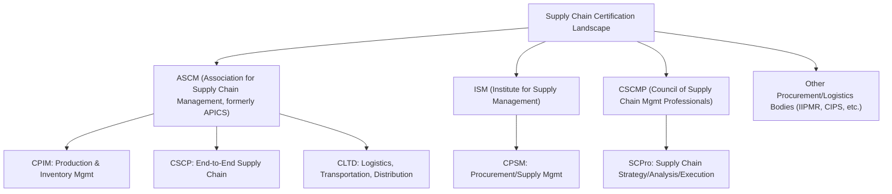
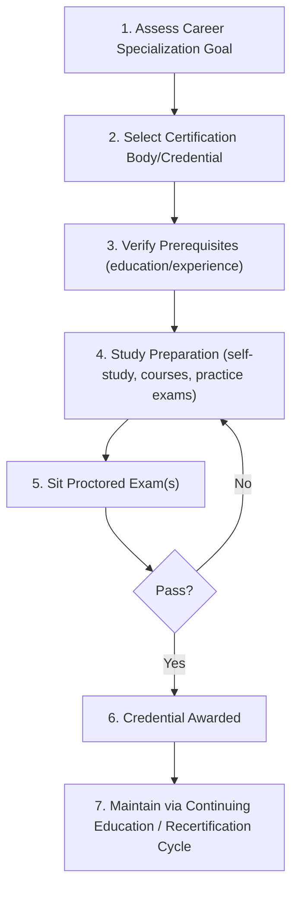

## Supply Chain Certification Pathways

### Definition and Core Concept

Supply Chain Certification Pathways are structured professional credentialing programs offered by industry bodies that validate practitioner knowledge across supply chain domains—procurement, logistics, planning, operations management, and increasingly digital/technology competencies. In the context of a capstone/applied-practice chapter, these pathways represent the formal knowledge-validation layer that complements hands-on design and case-study skills: they signal to employers that a practitioner's applied capabilities (network design, simulation, disruption diagnosis, as covered in this chapter) rest on a recognized body-of-knowledge foundation. Since certifying bodies periodically update exam content, requirements, and formats, current specifics should be verified against the issuing organization's official documentation rather than assumed static.

**Key Points**

- Certifications generally fall into breadth-oriented (broad supply chain management, e.g., APICS/ASCM CPIM, CSCP) versus depth-oriented (specialized domain, e.g., procurement-focused CPSM, logistics-focused CTL) categories.
- Most established programs require a combination of: passing one or more proctored exams, meeting experience/education prerequisites, and ongoing continuing education to maintain the credential.
- Pathway choice should generally follow career specialization intent—planning/operations-focused, procurement-focused, logistics-focused, or general management-focused—rather than treating certifications as interchangeable.

### Major Certification Bodies and Pathways

[Unverified] The certification landscape, specific exam structures, prerequisite requirements, and body names (e.g., APICS's rebranding history) are subject to periodic change by each issuing organization; treat the names and categories above as commonly recognized industry landmarks as of general knowledge, and verify current exam content, fees, and eligibility directly with each body's official site before acting on this information for career planning.

### Pathway Comparison

| Certification | Issuing Body | Primary Focus | Typical Structure |
| --- | --- | --- | --- |
| CPIM (Certified in Planning and Inventory Management) | ASCM | Production planning, inventory management, materials management | Multi-part exam sequence |
| CSCP (Certified Supply Chain Professional) | ASCM | End-to-end supply chain design and execution | Single comprehensive exam |
| CLTD (Certified in Logistics, Transportation and Distribution) | ASCM | Logistics, warehousing, transportation | Single exam |
| CPSM (Certified Professional in Supply Management) | ISM | Strategic procurement, supplier relationship management | Multi-part exam sequence |
| SCPro | CSCMP | Applied strategy, analysis, and execution competencies via case-based assessment | Tiered/case-based assessment series |

**Architectural relevance to this course**: CSCP-type credentials map most closely to the network design, tiered structure, and ecosystem-collaboration content covered across this course's chapters; CLTD-type credentials map more closely to the logistics/transportation and warehousing execution layer; CPIM-type credentials map most closely to inventory positioning, MEIO, and demand planning content.

### Typical Pathway Structure

**Key Points**

- Prerequisites commonly include a minimum of relevant work experience, a bachelor's degree, or a combination/substitution of the two (specific years and substitution rules vary by body and should be confirmed directly, as they are periodically revised).
- Exam preparation typically draws on the certifying body's official body-of-knowledge materials, third-party prep courses, and practice exams; content generally spans strategy, planning, sourcing/procurement, manufacturing/operations, logistics/distribution, and increasingly digital supply chain/technology topics reflecting industry shifts (e.g., growing emphasis on the Industry 4.0/5.0 and platform/ecosystem themes covered in this course).
- Maintenance/recertification typically requires accumulating continuing education credits or professional development units over a multi-year cycle, reflecting the field's evolving practice.

### Selecting a Pathway: Decision Framework

**Example**

| If your target role is... | Consider... |
| --- | --- |
| Supply chain network/strategy design, end-to-end planning | CSCP-type (broad, strategic, end-to-end) |
| Procurement, sourcing, supplier management | CPSM-type (procurement-depth) |
| Warehouse, transportation, distribution operations | CLTD-type (logistics-depth) |
| Production/inventory planning, MRP/demand planning | CPIM-type (planning-depth) |
| Applied strategy consulting, case-based competency demonstration | SCPro-type (case/competency-based) |

### How Certifications Relate to Applied Design Skills

**Key Points**

- Certification exams generally validate *conceptual and procedural knowledge* (terminology, formulas, standard frameworks) whereas the capstone-style exercises in this chapter (network design, case analysis, simulation, disruption diagnosis) validate *applied synthesis* of that knowledge against messy, real-world-like scenarios.
- The two are complementary rather than redundant: a strong grasp of, e.g., MEIO formulas or EOQ models (certification-testable) supports faster, more defensible quantitative work in a network redesign case exercise (applied-testable), but does not by itself demonstrate the judgment needed to frame an ambiguous business problem or weigh trade-offs under incomplete data.
- [Inference] Employers evaluating supply chain practitioners generally look for both credential validation and demonstrated applied project/case experience; the relative weighting between the two varies substantially by employer, role seniority, and industry, and no single universal ranking of "which matters more" holds across contexts.

### Practical Guidance for Pathway Planning

- **Map credential content to career target first**: Choose based on the domain (planning, procurement, logistics, general strategy) most aligned with target roles, not on perceived prestige alone.
- **Check current prerequisites directly with the issuing body**: Experience/education substitution rules, exam formats, and fees change periodically; treat any second-hand summary (including this one) as a starting orientation, not a final source.
- **Sequence relative to applied experience**: Some practitioners pursue certification early to build structured foundational knowledge before applied project work; others pursue it after gaining hands-on experience to contextualize the material—both sequences are common and the better choice is context-dependent (e.g., career stage, employer sponsorship availability).
- **Track continuing education requirements from day one**: Recertification lapses are a common avoidable pitfall; maintaining a running log of qualifying activities (courses, conference attendance, volunteer work) throughout the cycle is more reliable than assembling credits reactively near the deadline.

**Related Topics**

- Designing a Multi-Tier Supply Chain from Scratch
- Multi-Echelon Inventory Optimization (MEIO) Techniques
- Network Design Case Study Analysis
- Procurement Strategy and Supplier Relationship Management
- Continuing Professional Development Planning in Supply Chain Careers
- Digital Supply Chain Competency Frameworks