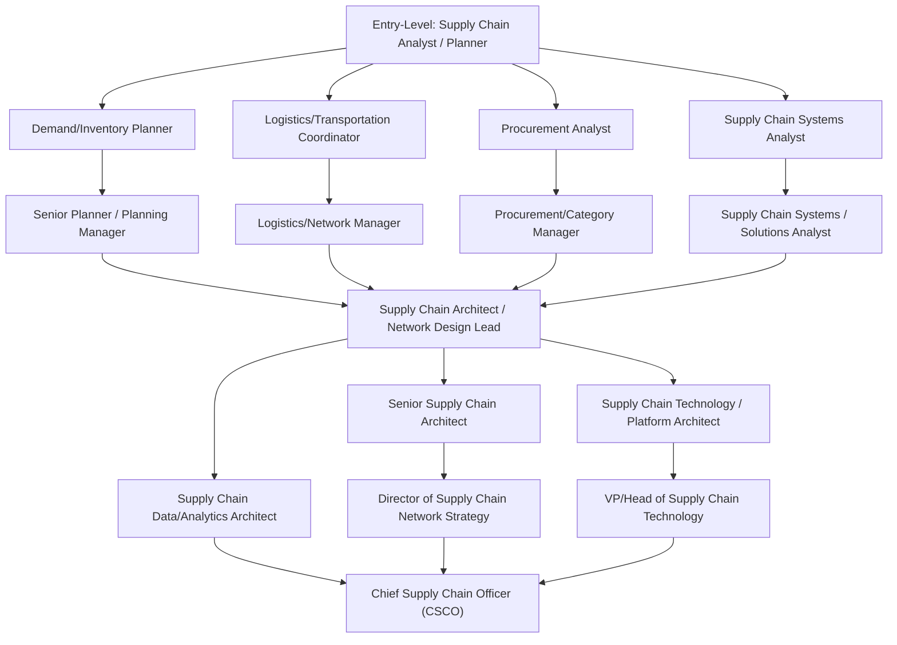
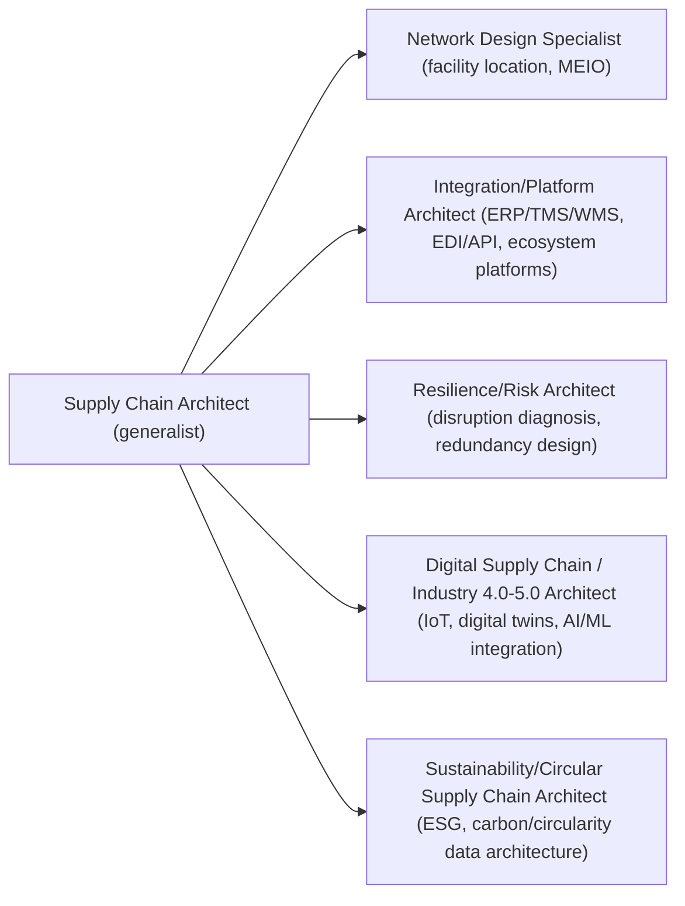

## Career Paths in Supply Chain Architecture

### Definition and Core Concept

Career Paths in Supply Chain Architecture map the professional trajectories available to practitioners who specialize in designing, integrating, and optimizing the structural and technological systems underlying supply chains—distinct from purely operational roles (day-to-day execution) or purely strategic roles (high-level sourcing/business strategy without systems design). This role sits at the intersection of supply chain domain knowledge (tiered structures, network design, inventory theory) and technical/systems capability (ERP/TMS/WMS architecture, integration patterns, data/analytics platforms, and increasingly Industry 4.0/5.0 and ecosystem/platform architectures covered throughout this course). As with certification pathways, specific job titles, market demand, and compensation benchmarks shift with the labor market and should be treated as illustrative rather than fixed.

**Key Points**

- Supply chain architecture careers generally branch along two axes: **depth of technical/systems specialization** (from generalist analyst to specialized platform/solutions architect) and **breadth of scope** (single-function vs. end-to-end network responsibility).
- The field sits between two traditionally separate career tracks—supply chain/operations management and enterprise IT/systems architecture—and increasingly rewards practitioners who can bridge both, reflecting the OT/IT convergence and platform-based collaboration trends discussed in earlier chapters.
- Career progression is rarely strictly linear; lateral moves between planning, logistics, procurement, and systems/architecture roles are common and often valuable for building the end-to-end perspective this specialization requires.

### Career Progression Map

### Core Role Archetypes

| Role | Primary Focus | Typical Technical Depth |
| --- | --- | --- |
| Supply Chain Analyst/Planner | Demand/inventory forecasting, S&OP support | Moderate (Excel, planning software, basic SQL) |
| Logistics/Network Manager | Transportation, warehousing, distribution network operations | Moderate (TMS/WMS platforms) |
| Supply Chain Systems Analyst | Requirements gathering, system configuration, integration support | High (ERP configuration, data mapping, EDI/API basics) |
| Supply Chain Architect | End-to-end network and systems design, cross-functional integration strategy | High (architecture patterns, facility location/MEIO modeling, integration design) |
| Supply Chain Technology/Platform Architect | Designing and governing the technology stack (ERP/TMS/WMS/control tower, platform integrations) | Very high (systems architecture, API/integration design, cloud infrastructure familiarity) |
| Supply Chain Data/Analytics Architect | Designing data models, pipelines, and analytics/ML infrastructure supporting planning and visibility | Very high (data engineering, analytics platforms, ML/AI familiarity) |
| Chief Supply Chain Officer (CSCO) | Enterprise-wide supply chain strategy, cross-functional leadership | Broad oversight, less hands-on technical depth |

### Skill Progression by Career Stage

**Key Points**

- **Entry-level**: Domain fundamentals (inventory theory, demand planning basics, logistics operations) plus foundational tool proficiency (spreadsheet modeling, basic ERP navigation, SQL/data literacy).
- **Mid-level**: Cross-functional systems fluency (how ERP, TMS, WMS interact), project/vendor management experience, and initial exposure to network design methods (facility location, MEIO) as covered in this course's design chapters.
- **Senior/Architect-level**: Ability to design multi-tier network structures end-to-end, evaluate and select technology stacks, lead cross-organizational integration initiatives (including ecosystem/platform partnerships), and communicate trade-offs to executive stakeholders—directly mirroring the capstone case-study and redesign skills practiced in this chapter.
- **Executive-level**: Enterprise strategy, organizational leadership, external partnership/governance negotiation, and increasingly sustainability/resilience mandate ownership (reflecting Industry 5.0 priorities).

### Specialization Branches

**Example**

- A **Network Design Specialist** career track deepens directly from this course's "Designing a Multi-Tier Supply Chain from Scratch" and "Network Design Case Study Analysis" material—strong fit for practitioners who enjoy quantitative modeling and facility/inventory optimization.
- An **Integration/Platform Architect** track deepens from the "Ecosystem Collaboration and Platform-Based Architectures" and "Supply-Chain-as-a-Service Models" material—strong fit for practitioners bridging supply chain domain knowledge with systems/software architecture.
- A **Resilience/Risk Architect** track deepens from "Diagnosing and Redesigning a Disrupted Tiered Network" and simulation/stress-testing material—strong fit for practitioners drawn to risk analysis and scenario planning.

### Cross-Functional Skill Requirements

| Skill Category | Why It Matters for This Career Path |
| --- | --- |
| Quantitative modeling (facility location, MEIO, simulation) | Core to defensible network design and redesign recommendations |
| Systems/integration literacy (ERP, EDI/API, cloud architecture) | Required to translate design intent into implementable technical architecture |
| Data analysis and visualization | Needed to synthesize cross-tier visibility data and support case-based recommendations |
| Stakeholder communication and trade-off framing | Architecture decisions involve competing objectives (cost, service, resilience, sustainability) requiring clear executive-level communication |
| Change management/project leadership | Structural redesigns (per the disruption-redesign chapter) require phased implementation and cross-organizational coordination |
| Emerging technology fluency (IoT, digital twins, AI/ML, platform ecosystems) | Increasingly differentiating given Industry 4.0/5.0 shifts covered earlier in this course |

### Credentialing and Career Path Alignment

**Key Points**

- Certification pathways (covered in the preceding topic) generally support specific career branches: CSCP-type credentials align with the generalist/network-design and integration architect tracks; CPIM-type credentials align with planning-heavy tracks feeding into network design; CLTD-type credentials align with logistics-heavy tracks feeding into integration/network roles.
- Beyond domain certifications, practitioners pursuing the Integration/Platform Architect or Digital Supply Chain Architect branches often supplement supply chain credentials with technology-specific credentials or training (cloud platform certifications, data engineering/analytics credentials), reflecting the OT/IT convergence discussed earlier—though the specific value and market recognition of any given technical credential should be evaluated against current employer expectations in the target industry/region.
- [Inference] Because "supply chain architect" as a formal job title is less standardized across employers than more established titles (e.g., "supply chain analyst," "logistics manager"), actual role scope, seniority expectations, and title usage can vary considerably between organizations; job descriptions should be evaluated individually rather than assumed to map precisely onto the archetypes above.

### Practical Guidance for Career Planning

- **Build T-shaped expertise deliberately**: Depth in one specialization branch (e.g., network design or platform integration) combined with working breadth across the others tends to be more valuable at the architect level than narrow depth alone, since real redesign and diagnosis work (per this chapter's exercises) routinely crosses domain boundaries.
- **Seek cross-functional rotation early**: Lateral experience across planning, logistics, procurement, and systems roles before specializing as an architect builds the end-to-end perspective the role demands.
- **Develop a portfolio of applied work**: Given that this specialization rewards demonstrated applied judgment (network design cases, disruption diagnoses, simulation exercises) alongside credential validation, maintaining documented case studies or project outcomes strengthens career positioning beyond certification alone.
- **Track the field's technology trajectory**: Given the pace of change in ecosystem/platform models and Industry 4.0/5.0 technology, ongoing self-directed learning (beyond formal certification cycles) is a practical necessity for staying current in the technical-architecture branches of this career path.

**Related Topics**

- Supply Chain Certification Pathways
- Ecosystem Collaboration and Platform-Based Architectures
- Diagnosing and Redesigning a Disrupted Tiered Network
- Supply Chain Technology Stack Selection Criteria
- Chief Supply Chain Officer (CSCO) Role and Responsibilities
- Digital Supply Chain Competency Frameworks
- T-Shaped Skill Development in Cross-Functional Careers