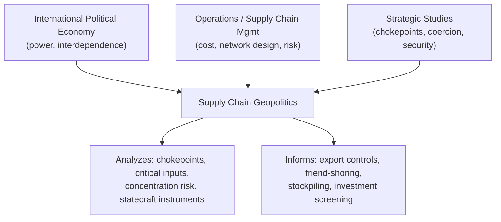

## Defining Supply Chain Geopolitics as a Field of Study

### Definition

Supply chain geopolitics is the interdisciplinary field studying how state power, interstate rivalry, and geopolitical strategy shape — and are shaped by — the design, routing, and control of global production and logistics networks. It sits at the intersection of international political economy (IPE), strategic studies, economic security policy, and operations/supply chain management (SCM).

**Key Points**

- Unit of analysis: the supply chain (a multi-node, multi-jurisdictional system), not the firm or the state alone
- Treats chokepoints, critical inputs, and logistics infrastructure as objects of strategic competition
- Bridges a traditionally *economic/operational* discipline (SCM, focused on cost, speed, reliability) with a traditionally *political/strategic* discipline (geopolitics, focused on power, security, sovereignty)
- Emerged as a distinct, named field largely post-2018 (US-China trade war) and accelerated sharply after 2020 (COVID-19) and 2022 (Russia's invasion of Ukraine, semiconductor export controls)

### Core Premise

Classical supply chain management optimizes for cost minimization and efficiency (just-in-time inventory, lowest-cost sourcing, lean logistics) under an implicit assumption of a stable, rules-based international order. Supply chain geopolitics rejects that assumption as the default operating condition. Instead, it models supply chains as embedded in — and vulnerable to — a system of competing sovereign states that can and do use trade, investment, and logistics dependencies as instruments of coercion or leverage.

$$\text{Efficiency-optimized SC} \xrightarrow{\text{geopolitical shock}} \text{Resilience-optimized SC}$$

This premise reframes supply chain design decisions (where to source, where to manufacture, which routes to use) as decisions with strategic — not merely commercial — consequences.

### Disciplinary Parentage

Supply chain geopolitics did not emerge from a single parent discipline. It draws on:

- **International Political Economy (IPE)**: theories of interdependence, economic statecraft, and power asymmetry (e.g., Hirschman's work on trade as a tool of national power; Keohane and Nye's "complex interdependence")
- **Strategic/security studies**: chokepoint theory, resource security, critical infrastructure protection
- **Operations and Supply Chain Management**: network design, risk management, sourcing strategy, inventory theory
- **Economic geography**: spatial distribution of production, agglomeration economies, trade corridors
- **Political science / comparative politics**: industrial policy, sanctions regimes, export control law

**Example**

A single case — the 2021 Suez Canal blockage by the *Ever Given* — illustrates the field's interdisciplinary lens: an SCM analyst asks "how do we reroute cargo and absorb delay costs?" while a supply chain geopolitics analyst asks "why does 12% of global trade transit a single 193-km waterway controlled by one state, and what does that concentration mean for the states and firms dependent on it?"

### Distinguishing Supply Chain Geopolitics from Adjacent Fields

| Field | Primary Unit of Analysis | Primary Optimization Goal | Time Horizon |
| --- | --- | --- | --- |
| Traditional SCM / Logistics | Firm, network node | Cost, speed, service level | Operational (weeks–quarters) |
| International Trade Economics | Nation-state, trade flow | Comparative advantage, welfare | Structural (years) |
| Geopolitics (classical) | State, alliance, territory | Power, security, influence | Strategic (years–decades) |
| **Supply Chain Geopolitics** | **Supply chain as a strategic system** | **Resilience, sovereignty, leverage** | **Operational-to-strategic (integrated)** |
| Economic Security Policy | National economy, sector | Strategic autonomy, deterrence | Policy cycle (years) |

**Key Points**

- SCM asks "how do we move goods efficiently?"; geopolitics asks "who has power over whom?"; supply chain geopolitics asks "how does the *structure of goods movement itself* become a vector of power?"
- The field is explicitly normative-adjacent: it informs policy (export controls, friend-shoring, stockpiling mandates) as much as it describes phenomena

### Core Analytical Objects

1. **Chokepoints**: geographically or infrastructurally narrow points through which disproportionate trade volume must pass (Strait of Malacca, Strait of Hormuz, Suez Canal, Panama Canal, Taiwan Strait for semiconductor shipping)
2. **Critical and dual-use inputs**: rare earth elements, advanced semiconductors, lithium, cobalt, specialized machine tools (e.g., EUV lithography)
3. **Concentration risk**: single-source or single-region dependency (e.g., >90% of advanced logic chip fabrication historically concentrated in Taiwan)
4. **Corridors and infrastructure**: shipping lanes, rail corridors (Belt and Road Initiative), pipelines, submarine cables, port ownership
5. **Instruments of statecraft applied to supply chains**: export controls, sanctions, tariffs, investment screening (CFIUS-type mechanisms), forced localization requirements, stockpiling/strategic reserves

### Methodological Approaches

Supply chain geopolitics as a field employs a mixed-method toolkit rather than a single dominant methodology:

- **Network analysis**: mapping supply chain topology to identify structural vulnerabilities (single points of failure, betweenness centrality of nodes/chokepoints)
- **Scenario planning and war-gaming**: modeling the cascading effects of a chokepoint closure, export ban, or conflict
- **Dependency mapping / criticality scoring**: quantifying which inputs are both economically important and difficult to substitute (a framework popularized by the EU's Critical Raw Materials Act and similar frameworks)
- **Case study and historical analysis**: precedent-based reasoning from events such as the 1973 oil embargo, 2010 China rare earth embargo on Japan, 2020–22 semiconductor shortage, 2022 energy weaponization by Russia
- **Trade flow and customs data analysis**: quantitative tracking of sourcing shifts (e.g., "connector country" trade rerouting through Vietnam or Mexico to obscure origin)

### Framework: The Criticality-Vulnerability Matrix (svg_diagram)

A widely used conceptual tool in the field plots inputs or nodes along two axes: economic/strategic importance and substitutability/supply risk.

<svg xmlns="http://www.w3.org/2000/svg" viewBox="0 0 640 460" font-family="Helvetica, Arial, sans-serif">
<title>Criticality-Vulnerability Matrix (svg_diagram)</title>
<rect x="0" y="0" width="640" height="460" fill="#ffffff" />
<text x="320" y="28" font-size="16" font-weight="bold" text-anchor="middle" fill="#1a1a1a">Criticality–Vulnerability Matrix (svg_diagram)</text>

<line x1="100" y1="380" x2="580" y2="380" stroke="#333333" stroke-width="2" />
<line x1="100" y1="380" x2="100" y2="60" stroke="#333333" stroke-width="2" />

<text x="340" y="415" font-size="13" text-anchor="middle" fill="`#333333`">Supply Risk / Low Substitutability →</text>

<text x="40" y="220" font-size="13" text-anchor="middle" fill="`#333333`" transform="rotate(-90 40 220)">Strategic Importance →</text>

<line x1="340" y1="60" x2="340" y2="380" stroke="#cccccc" stroke-width="1" stroke-dasharray="4,4" />
<line x1="100" y1="220" x2="580" y2="220" stroke="#cccccc" stroke-width="1" stroke-dasharray="4,4" />

<text x="180" y="140" font-size="12" fill="`#666666`" text-anchor="middle">Low Importance</text>

<text x="180" y="156" font-size="12" fill="`#666666`" text-anchor="middle">Low Risk</text>

<text x="180" y="172" font-size="11" fill="`#999999`" text-anchor="middle">(routine sourcing)</text>

<text x="460" y="140" font-size="12" fill="`#b30000`" font-weight="bold" text-anchor="middle">STRATEGIC</text>

<text x="460" y="156" font-size="12" fill="`#b30000`" font-weight="bold" text-anchor="middle">VULNERABILITY</text>

<text x="460" y="172" font-size="11" fill="`#666666`" text-anchor="middle">(e.g., advanced chips,</text>

<text x="460" y="186" font-size="11" fill="`#666666`" text-anchor="middle">rare earths)</text>

<text x="180" y="310" font-size="12" fill="`#666666`" text-anchor="middle">Low Importance</text>

<text x="180" y="326" font-size="12" fill="`#666666`" text-anchor="middle">High Risk</text>

<text x="180" y="342" font-size="11" fill="`#999999`" text-anchor="middle">(monitor)</text>

<text x="460" y="310" font-size="12" fill="`#cc7a00`" font-weight="bold" text-anchor="middle">HIGH IMPORTANCE</text>

<text x="460" y="326" font-size="12" fill="`#cc7a00`" font-weight="bold" text-anchor="middle">DIVERSIFIED SUPPLY</text>

<text x="460" y="342" font-size="11" fill="`#666666`" text-anchor="middle">(e.g., crude oil — many suppliers)</text>

<circle cx="480" cy="100" r="6" fill="#b30000" />
<text x="490" y="104" font-size="11" fill="#1a1a1a">Advanced logic chips (Taiwan)</text>
<circle cx="500" cy="130" r="6" fill="#b30000" />
<text x="510" y="134" font-size="11" fill="#1a1a1a">Rare earth elements (China)</text>
<circle cx="420" cy="300" r="6" fill="#cc7a00" />
<text x="430" y="304" font-size="11" fill="#1a1a1a">Crude oil (OPEC+ / diversified)</text>
<circle cx="180" cy="250" r="6" fill="#666666" />
<text x="190" y="254" font-size="11" fill="#1a1a1a">Commodity plastics</text>

<text x="90" y="392" font-size="10" text-anchor="end" fill="`#666666`">Low</text>

<text x="575" y="392" font-size="10" text-anchor="end" fill="`#666666`">High</text>

</svg>

Items falling in the upper-right quadrant (high strategic importance, high supply risk/low substitutability) are the primary subject matter of the field — these are the inputs and nodes around which export controls, stockpiling, and friend-shoring policy are built.

### Historical Emergence as a Named Field

| Period | Development |
| --- | --- |
| Pre-2008 | Supply chain risk treated primarily as operational (natural disasters, supplier bankruptcy); geopolitics largely absent from SCM curricula |
| 2008–2017 | Growing awareness post-2011 Japan earthquake/tsunami (Fukushima) and 2011 Thailand floods; risk framed as "business continuity," not geopolitics |
| 2018–2019 | US-China trade war (Section 301 tariffs) triggers first wave of "geopolitical" reframing of sourcing decisions; "decoupling" enters mainstream vocabulary |
| 2020–2021 | COVID-19 pandemic exposes fragility of globally dispersed, JIT-optimized supply chains; PPE and semiconductor shortages become policy-salient |
| 2022–present | Russia's invasion of Ukraine (energy weaponization), US CHIPS Act and semiconductor export controls, EU Critical Raw Materials Act, "friend-shoring" and "de-risking" (vs. "decoupling") become formal policy vocabulary; field consolidates in academic programs (e.g., Johns Hopkins SAIS, Georgetown, RAND, CSIS programs explicitly naming "supply chain geopolitics" or "economic security") |

**Key Points**

- The field's consolidation into named university courses, think-tank practice areas, and corporate "geopolitical risk" functions is itself [Unverified] a post-2020 phenomenon in most institutions, though precursor concepts (economic statecraft, resource security) are decades older
- Vocabulary has shifted from "decoupling" (full separation) to "de-risking" (selective diversification) as the dominant policy framing by 2023, reflecting a maturing rather than static field

### Why the Field Matters: Structural Argument

The field's core justification rests on three linked claims:

1. **Concentration has increased**: decades of cost-driven optimization produced historically unprecedented geographic concentration in critical nodes (e.g., single-country dominance in chip fabrication, battery materials refining)
2. **Interdependence is asymmetric, not mutual**: Hirschman's classical insight — that trade interdependence confers *power* on the less-dependent party — applies directly to modern supply chains; a state that supplies a critical input to many, while depending on few, holds coercive leverage
3. **The line between "economic" and "security" policy has blurred**: decisions once made by corporate procurement teams (where to source lithium, where to fabricate chips) now carry national security implications, and are increasingly co-determined or overridden by state policy (export controls, subsidies, investment screening)

### Illustrative Mini Case

**Example**

China's 2010 restriction of rare earth element exports to Japan, following a maritime dispute near the Senkaku/Diaoyu Islands, is frequently cited as an early, formative case for the field. It demonstrated concretely that a state controlling a concentrated share of a critical input (China held roughly 95% of global rare earth processing capacity at the time) could use that position as coercive leverage in an unrelated territorial dispute — collapsing the previously separate categories of "trade policy" and "security policy" into a single decision space. This case is commonly taught as the conceptual trigger that later informed post-2018 US and EU critical minerals strategy. [Unverified: exact export volumes and embargo mechanics are disputed in secondary literature; the general pattern and its influence on policy discourse is well documented.]

### Boundaries and Debates Within the Field

- **Scope debate**: some scholars restrict "supply chain geopolitics" to state-level coercion and chokepoint control; others extend it to include climate-driven supply disruption, pandemic risk, and cyber risk to logistics infrastructure — a broader "supply chain resilience" framing
- **Normative debate**: whether the field's proper role is *descriptive* (mapping vulnerability) or *prescriptive* (recommending reshoring/friend-shoring policy) — this is a live methodological tension, not a settled matter
- **Efficiency-resilience tradeoff**: a recurring theoretical debate over whether resilience-oriented supply chain redesign is a rational hedge against low-probability, high-impact events, or an overcorrection that imposes permanent cost penalties for diminishing marginal security gain [Inference: this tradeoff is widely discussed in both academic and practitioner literature, but there is no field-wide consensus on the optimal balance point]

### Mermaid Diagram: Conceptual Position of the Field

**Related Topics**

- Economic statecraft and the weaponization of interdependence (Hirschman, Farrell & Newman's "weaponized interdependence")
- Chokepoint theory and maritime strategic geography
- Criticality and vulnerability assessment frameworks (EU CRM Act, US DOE critical minerals lists)
- Friend-shoring, nearshoring, and de-risking as distinct policy strategies
- Export control regimes and dual-use technology governance (Wassenaar Arrangement, US EAR/ITAR)
- The historical evolution from "just-in-case" to "just-in-time" to "resilience-oriented" supply chain paradigms
- Case study: Taiwan and semiconductor supply chain concentration
- Case study: Russia's energy exports as geopolitical leverage (2022–present)