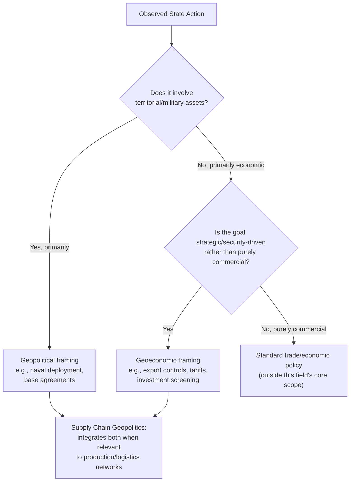

## Geopolitics Versus Geoeconomics as Distinct Concepts

### Core Definitions

**Geopolitics** is the study of how geography — territory, terrain, borders, resources, maritime access — shapes and constrains state power, strategy, and interstate rivalry. Its classical toolkit includes military capability, alliance structures, territorial control, and spheres of influence.

**Geoeconomics** is the use of economic instruments — trade, investment, finance, technology, sanctions, currency — to achieve geopolitical objectives, or conversely, the study of how geopolitical rivalry manifests through economic channels rather than (or alongside) military ones.

**Key Points**

- Geopolitics answers: "who controls territory, and what does that control confer strategically?"
- Geoeconomics answers: "how is economic leverage substituted for, or combined with, military/territorial leverage to achieve the same strategic ends?"
- Geoeconomics is not a replacement for geopolitics; it is best understood as a *subset of instruments* through which geopolitical goals are pursued in an era where direct military conflict between major powers carries prohibitive costs

### Etymology and Intellectual Lineage

The term "geoeconomics" is most commonly attributed to Edward Luttwak's 1990 essay "From Geopolitics to Geo-Economics," which argued that in the post-Cold War order, states would increasingly pursue the *logic of conflict* (strategic competition, zero-sum thinking about relative gains) using the *grammar of commerce* (tariffs, investment, subsidies) rather than the grammar of warfare. Luttwak's framing — logic of war, grammar of commerce — remains the field's most cited definitional anchor. [Unverified: exact phrasing varies across secondary citations; the core argument is well documented in IPE literature]

Geopolitics as a formal discipline predates this by roughly a century, rooted in late-19th and early-20th century thinkers such as Halford Mackinder (the "Heartland Theory," 1904) and Alfred Thayer Mahan (sea power theory), both of whom theorized how physical geography determined which powers could achieve global or regional dominance.

### Comparative Framework

| Dimension | Geopolitics | Geoeconomics |
| --- | --- | --- |
| Primary instruments | Military force, alliances, territorial control | Trade policy, sanctions, investment screening, currency, technology export controls |
| Core unit of leverage | Land, sea lanes, strategic chokepoints | Market access, capital flows, critical inputs, financial infrastructure (e.g., SWIFT) |
| Classical theorists | Mackinder, Mahan, Spykman | Luttwak, Hirschman (precursor), Blackwill & Harris |
| Typical time horizon | Long-run structural (decades) | Can be rapid and reversible (months–years) |
| Escalation ceiling | Military conflict | Economic decoupling, but generally below armed conflict |
| Supply chain relevance | Explains *why* certain nodes/routes are strategically prized (chokepoints, buffer states) | Explains *how* states weaponize dependencies within supply chains (export bans, tariffs, sanctions) |

### The Overlap: Why Supply Chains Sit at the Intersection

Supply chains are geographically embedded (a geopolitical fact — factories, ports, and mines exist in physical, sovereign territory) *and* they are economic systems susceptible to policy manipulation (a geoeconomic fact — market access, tariffs, and export licenses govern what flows through them). This dual nature is precisely why "supply chain geopolitics" as a field draws on both traditions simultaneously rather than choosing one.

**Example**

China's control over the Strait of Malacca chokepoint risk (roughly 80% of its crude oil imports transit this strait) is a *geopolitical* vulnerability rooted in geography. China's use of rare earth export restrictions against Japan in 2010, or its economic coercion against Australia (2020–2021 tariffs on barley, wine, coal following disputes over COVID-19 origin investigations and other issues), is a *geoeconomic* instrument — leverage exercised through trade policy rather than territorial or military means.

### Blackwill and Harris Framework (Formal Academic Definition)

Robert Blackwill and Jennifer Harris, in *War by Other Means: Geoeconomics and Statecraft* (2016), offer one of the most cited formal definitions: geoeconomics is the use of economic instruments to promote and defend national interests, and to produce beneficial geopolitical results; and the effects of other nations' economic actions on a country's geopolitical goals. This definition is deliberately bidirectional — it captures both a state's *offensive* use of economic tools and its *defensive* need to respond to others' economic statecraft.

Their book further argues that the United States has been reluctant to use geoeconomic instruments compared to other major powers like China and Russia, a claim that shaped much of the subsequent US policy debate on economic statecraft through the late 2010s and 2020s.

**Key Points**

- The Blackwill-Harris framework treats geoeconomics as an instrument set available to *any* state, not a strategy unique to authoritarian regimes, though empirical usage has varied significantly by country and political system [Inference: relative usage patterns are discussed extensively in the comparative statecraft literature, but precise quantitative comparisons across states are contested]

### Diagram: Instrument Spectrum from Geopolitics to Geoeconomics (svg_diagram)

<svg xmlns="http://www.w3.org/2000/svg" viewBox="0 0 640 300" font-family="Helvetica, Arial, sans-serif">
<title>Instrument Spectrum: Geopolitics to Geoeconomics (svg_diagram)</title>
<rect x="0" y="0" width="640" height="300" fill="#ffffff" />
<text x="320" y="28" font-size="16" font-weight="bold" text-anchor="middle" fill="#1a1a1a">Instrument Spectrum: Geopolitics ↔ Geoeconomics (svg_diagram)</text>

<line x1="70" y1="150" x2="570" y2="150" stroke="#333333" stroke-width="3" />
<polygon points="570,150 558,144 558,156" fill="#333333" />
<polygon points="70,150 82,144 82,156" fill="#333333" />

<text x="70" y="180" font-size="12" font-weight="bold" text-anchor="start" fill="`#1a1a1a`">Pure Geopolitics</text>

<text x="570" y="180" font-size="12" font-weight="bold" text-anchor="end" fill="`#1a1a1a`">Pure Geoeconomics</text>

<circle cx="110" cy="150" r="7" fill="#b30000" />
<text x="110" y="120" font-size="11" text-anchor="middle" fill="#1a1a1a">Military</text>
<text x="110" y="134" font-size="11" text-anchor="middle" fill="#1a1a1a">basing/force</text>
<circle cx="230" cy="150" r="7" fill="#cc5500" />
<text x="230" y="120" font-size="11" text-anchor="middle" fill="#1a1a1a">Chokepoint</text>
<text x="230" y="134" font-size="11" text-anchor="middle" fill="#1a1a1a">control (Hormuz)</text>
<circle cx="350" cy="150" r="7" fill="#cc9900" />
<text x="350" y="120" font-size="11" text-anchor="middle" fill="#1a1a1a">Export</text>
<text x="350" y="134" font-size="11" text-anchor="middle" fill="#1a1a1a">controls</text>
<circle cx="470" cy="150" r="7" fill="#4d8000" />
<text x="470" y="120" font-size="11" text-anchor="middle" fill="#1a1a1a">Tariffs &amp;</text>
<text x="470" y="134" font-size="11" text-anchor="middle" fill="#1a1a1a">trade policy</text>
<circle cx="560" cy="150" r="7" fill="#006633" />
<text x="560" y="120" font-size="11" text-anchor="middle" fill="#1a1a1a">Financial</text>
<text x="560" y="134" font-size="11" text-anchor="middle" fill="#1a1a1a">sanctions</text>

<text x="320" y="220" font-size="12" text-anchor="middle" fill="`#666666`">Supply chain geopolitics draws instruments from across the full spectrum</text>

</svg>

### Historical Alternation: Which Frame Dominates When

| Era | Dominant Frame | Illustrative Evidence |
| --- | --- | --- |
| Cold War (1947–1991) | Geopolitics (military/territorial) | NATO/Warsaw Pact alliance structures, proxy wars, nuclear deterrence |
| Post-Cold War unipolar moment (1991–2008) | Neither dominant; "end of history" liberal economic integration narrative | WTO accession expansion, globalization consensus, minimal supply chain security concern |
| Post-2008 financial crisis (2008–2018) | Geoeconomics ascending | Sanctions regimes against Iran and Russia (post-2014 Crimea), currency and financial statecraft |
| 2018–present | Both frames fused in supply chain/tech competition | US-China tariffs, semiconductor export controls, Taiwan Strait tension, chip fabrication reshoring |

**Key Points**

- The field's current phase (2018–present) is distinctive precisely because it does not allow analysts to cleanly separate geopolitics from geoeconomics — a Taiwan Strait contingency, for example, is simultaneously a classic geopolitical/territorial flashpoint *and* a geoeconomic catastrophe scenario given Taiwan's concentration of advanced chip fabrication

### Common Analytical Errors When Conflating the Two Terms

1. **Treating tariffs as purely economic policy**: analysts who ignore the geopolitical intent behind tariff schedules (e.g., Section 301 tariffs targeting technologically sensitive Chinese sectors specifically) misread the policy's actual objective
2. **Treating chokepoint control as purely military**: naval presence near the Strait of Malacca or South China Sea has direct geoeconomic consequences for trade flow even absent conflict
3. **Assuming geoeconomic tools are "lower-stakes" than geopolitical ones**: sanctions, export bans, and investment restrictions can produce economic damage comparable to — or exceeding — limited military engagements, and often provoke escalatory retaliation cycles (tariff-for-tariff, export-ban-for-export-ban) [Inference: escalation dynamics are documented in trade war case studies, though the comparative severity of economic versus military escalation is a matter of ongoing scholarly debate]

### Mermaid Diagram: Decision Logic — Which Frame Explains a Given Event

### Practical Application for Supply Chain Analysis

When assessing a supply chain risk, practitioners in the field typically decompose the risk into its geopolitical and geoeconomic components separately, since each implies different mitigation strategies:

- **Geopolitical risk mitigation**: physical route diversification, avoiding single-chokepoint dependency, buffer stock near contested regions
- **Geoeconomic risk mitigation**: sourcing diversification across jurisdictions with differing sanctions exposure, contractual hedges against tariff volatility, compliance infrastructure for export control regimes

**Example**

A firm dependent on Taiwanese semiconductor fabrication faces a *geopolitical* risk (a Taiwan Strait military contingency disrupting production entirely) that is distinct from, but related to, a *geoeconomic* risk (US or Chinese export controls restricting which firms can legally purchase or transfer specific chip technologies). Mitigating the first requires geographic diversification of fabrication capacity; mitigating the second requires legal/compliance diversification across jurisdictions and customer bases — different levers for structurally related but analytically distinct risks.

**Related Topics**

- Edward Luttwak's "logic of conflict, grammar of commerce" framework in depth
- Blackwill and Harris's typology of geoeconomic instruments (trade policy, investment policy, economic sanctions, cyber, aid, monetary policy, energy/commodities)
- Mackinder's Heartland Theory and its modern application to Eurasian supply corridors
- Weaponized interdependence (Farrell & Newman) as a bridging theory between geopolitics and geoeconomics
- Sanctions regimes as a geoeconomic instrument: design, evasion, and effectiveness debates
- The Taiwan Strait as a case study combining both frames simultaneously