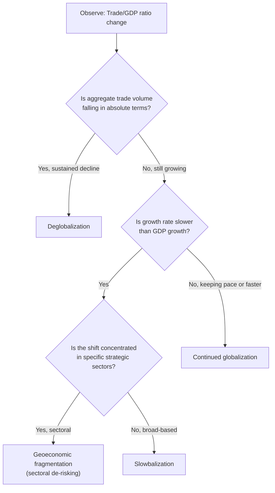

## Globalization, Deglobalization, and Slowbalization

### Definitions

**Globalization** refers to the increasing integration of national economies through trade, capital flows, technology transfer, and labor mobility, producing progressively deeper cross-border interdependence in production and consumption.

**Deglobalization** refers to a sustained reversal of that integration — a measurable decline in cross-border trade, investment, and production interdependence relative to domestic economic activity, often driven by policy choices (tariffs, capital controls, localization mandates) rather than purely market forces.

**Slowbalization** — a term popularized by *The Economist* in 2019 — describes a distinct third pattern: not reversal, but deceleration. Global trade and investment continue to grow in absolute terms, but at a materially slower rate than GDP growth, and the *composition* of globalization shifts (e.g., toward regional rather than global integration, toward services rather than goods, toward "friend-shored" rather than lowest-cost sourcing).

**Key Points**

- These three terms describe a *rate of change*, not a binary state — the empirical debate in the field centers on which term best fits 2018–present data, and the honest answer is that measures diverge: gross trade volumes have been resilient while trade *intensity* (trade as a share of world GDP) has plateaued or modestly declined since roughly 2008
- "Deglobalization" is the most commonly *misused* term in popular commentary — global trade in absolute dollar/volume terms has generally continued to grow post-2020, which weakens strict deglobalization claims and lends more empirical support to "slowbalization" as the more precise descriptor [Unverified: this characterization depends heavily on which metric, time window, and data source is used; serious disagreement exists among trade economists on the correct framing]

### Historical Periodization of Globalization

| Wave | Period | Primary Driver | Supply Chain Characteristic |
| --- | --- | --- | --- |
| First wave | ~1870–1914 | Steamship/rail transport, gold standard, colonial trade networks | Commodity-focused; collapsed with WWI |
| Interwar retrenchment | 1914–1945 | Two world wars, Great Depression, Smoot-Hawley tariffs | Sharp deglobalization; often cited as the field's clearest historical deglobalization precedent |
| Second wave (Bretton Woods) | 1945–1971 | GATT, fixed exchange rates, postwar reconstruction | Regional integration (Europe, transatlantic) |
| Hyperglobalization | ~1990–2008 | WTO/China accession (2001), containerization maturity, IT-enabled coordination, end of Cold War bloc division | Peak fragmentation of production into global value chains (GVCs); "just-in-time," lowest-cost sourcing dominant |
| Plateau / slowbalization | 2008–2018 | Global financial crisis, rising protectionism, GVC "reshoring" cost-benefit reassessment | Trade-to-GDP ratio flattens; FDI growth slows |
| Fragmentation era | 2018–present | US-China trade war, COVID-19, Russia-Ukraine war, semiconductor export controls | Explicit policy-driven reconfiguration: friend-shoring, de-risking, "connector country" rerouting |

**Key Points**

- The interwar period (1914–1945) remains the field's primary historical analogy for genuine deglobalization, since trade-to-GDP ratios fell sharply and durably — a benchmark against which post-2018 trends are frequently, and often loosely, compared
- Peak trade-to-world-GDP ratio occurred around 2008, after which the ratio plateaued rather than continuing its prior upward trajectory — this inflection point is the empirical anchor for the "slowbalization" thesis [Unverified: precise peak year and ratio vary slightly by data source, e.g., World Bank vs. WTO series]

### The Economist's Slowbalization Framework

The Economist's 2019 cover story argued that globalization had entered a new phase characterized by four features: slower growth in trade relative to GDP, a shift from goods trade toward services and digital flows, a decline in cross-border capital flows relative to their pre-2008 peak, and increasing regionalization of supply chains (production networks concentrating within regional blocs like North America, the EU, and East Asia rather than spanning the globe uniformly). [Unverified: exact list of defining features as characterized by secondary summaries of the original argument; the core thesis is well documented]

### Comparative Framework

| Dimension | Globalization | Deglobalization | Slowbalization |
| --- | --- | --- | --- |
| Trade/GDP trend | Rising | Falling | Flat or slowly rising |
| FDI flows | Rising | Falling sharply | Flat, redirected regionally |
| Supply chain span | Expanding globally | Contracting toward domestic/bloc | Regionalizing, not fully reversing |
| Policy driver | Trade liberalization (GATT/WTO rounds) | Protectionism, autarky-seeking policy | Selective "de-risking," not full decoupling |
| Historical exemplar | 1990–2008 hyperglobalization | 1914–1945 interwar collapse | 2008–present (contested) |

### Metrics Used to Distinguish the Three Patterns

Practitioners in the field typically triangulate across several indicators rather than relying on a single measure, since different metrics can support different narratives simultaneously:

1. **World trade-to-GDP ratio** (WTO/World Bank data): the single most cited aggregate indicator; plateaued post-2008
2. **Foreign direct investment (FDI) flows**: fell substantially from pre-2008 peaks and have not fully recovered in relative terms
3. **Global value chain (GVC) participation rate**: measures how much of exported value crosses multiple borders before final consumption; some studies show this metric declining even where gross trade volumes hold steady, suggesting supply chains are shortening even as total trade persists
4. **Trade concentration and "friend-shoring" indices**: newer metrics (e.g., IMF and academic work post-2022) tracking whether trade is reallocating toward geopolitically aligned partners rather than lowest-cost partners
5. **"Connector country" trade growth**: a specific indicator the field watches closely — growth in trade through intermediary countries (Vietnam, Mexico, Morocco) that both the US and China trade heavily with, used to detect indirect rerouting around tariffs and export controls rather than genuine reshoring

**Example**

Following the 2018–2019 US Section 301 tariffs on Chinese goods, US imports directly from China as a share of total US imports declined, but US imports from Vietnam and Mexico rose sharply over the same period, while Chinese exports to Vietnam and Mexico also rose — a pattern widely interpreted in the trade literature as partial rerouting (goods substantially processed in China being re-exported via a third country) rather than pure reshoring of production capability. [Unverified: the precise magnitude of rerouting versus genuine production relocation is actively debated and difficult to measure directly from customs data alone]

### Diagram: Three Trajectories of Trade Intensity Over Time (svg_diagram)

<svg xmlns="http://www.w3.org/2000/svg" viewBox="0 0 640 360" font-family="Helvetica, Arial, sans-serif">
<title>Trade Intensity Trajectories: Globalization vs Deglobalization vs Slowbalization (svg_diagram)</title>
<rect x="0" y="0" width="640" height="360" fill="#ffffff" />
<text x="320" y="26" font-size="15" font-weight="bold" text-anchor="middle" fill="#1a1a1a">Trade Intensity Trajectories (svg_diagram)</text>

<line x1="80" y1="310" x2="590" y2="310" stroke="#333333" stroke-width="2" />
<line x1="80" y1="310" x2="80" y2="50" stroke="#333333" stroke-width="2" />
<text x="335" y="340" font-size="12" text-anchor="middle" fill="#333333">Time (1990 → present)</text>
<text x="30" y="180" font-size="12" text-anchor="middle" fill="#333333" transform="rotate(-90 30 180)">Trade / GDP Ratio</text>

<polyline points="80,280 200,200 320,140 440,90 560,60" fill="none" stroke="#4d8000" stroke-width="2.5" stroke-dasharray="5,3" />
<text x="565" y="55" font-size="11" fill="#4d8000" font-weight="bold">Continued globalization (counterfactual)</text>

<polyline points="80,280 200,200 320,140 440,120 560,110" fill="none" stroke="#cc9900" stroke-width="3" />
<text x="565" y="115" font-size="11" fill="#cc9900" font-weight="bold">Slowbalization (plateau)</text>

<polyline points="80,280 200,200 320,140 440,180 560,240" fill="none" stroke="#b30000" stroke-width="2.5" />
<text x="565" y="245" font-size="11" fill="#b30000" font-weight="bold">Deglobalization (reversal)</text>

<line x1="320" y1="50" x2="320" y2="310" stroke="#999999" stroke-width="1" stroke-dasharray="2,2" />
<text x="320" y="45" font-size="10" text-anchor="middle" fill="#666666">~2008 inflection</text>
</svg>

### Fragmentation vs. Full Reversal: The Current Consensus Debate

A central methodological debate in the field concerns whether post-2018 developments constitute genuine deglobalization or a more limited "fragmentation" — selective decoupling in strategically sensitive sectors (semiconductors, critical minerals, some defense-adjacent technology) combined with continued or even deepening integration elsewhere (bulk commodities, many consumer goods, most services trade).

- **IMF research** (2023) has used the term "geoeconomic fragmentation" specifically to distinguish this selective pattern from wholesale deglobalization, tracking trade reallocation along geopolitical bloc lines rather than aggregate trade decline. [Unverified: specific IMF findings should be verified against the current published research given the fast-moving nature of this data]
- The term **"decoupling"** (full bilateral separation, primarily associated with early US-China trade war rhetoric, 2018–2020) has been substantially superseded in official policy vocabulary by **"de-risking"** (selective, targeted reduction of dependency in critical sectors while maintaining broader economic engagement) — a shift explicitly articulated in EU and G7 communications from 2023 onward

**Key Points**

- "De-risking, not decoupling" became a deliberate policy phrase (notably associated with European Commission President Ursula von der Leyen's 2023 framing of EU-China policy) precisely to signal that fragmentation would be targeted and sectoral rather than comprehensive [Unverified: attribution and exact phrasing should be checked against primary EU policy statements]

### Implications for Supply Chain Design

| Scenario | Strategic Implication for Firms |
| --- | --- |
| True deglobalization | Wholesale reshoring/nearshoring becomes rational even at significant cost premium; global sourcing strategy fundamentally obsolete |
| Slowbalization (regionalization) | "China+1" or regional hub strategies (e.g., separate supply chains serving North America, EU, and Asia-Pacific blocs) become dominant; full reshoring often unnecessary |
| Sectoral fragmentation only | Diversification concentrated specifically in flagged critical sectors (semiconductors, critical minerals, some pharma); bulk of supply chain remains globally optimized |

**Example**

The "China+1" strategy — diversifying manufacturing capacity to at least one additional country (commonly Vietnam, India, or Mexico) alongside continued China-based production — is the practical corporate expression of the slowbalization/fragmentation thesis: firms are not exiting China wholesale, but are hedging concentration risk while retaining scale efficiencies where geopolitical risk is judged lower.

### Mermaid Diagram: Decision Framework for Classifying an Observed Trend

**Related Topics**

- Global value chain (GVC) participation metrics and how they diverge from gross trade statistics
- Friend-shoring, nearshoring, and "China+1" as corporate strategic responses
- The interwar deglobalization (1914–1945) as historical precedent and its limits as an analogy
- IMF "geoeconomic fragmentation" research program and bloc-based trade reallocation
- "Connector country" trade rerouting: measurement challenges and case evidence (Vietnam, Mexico)
- De-risking vs. decoupling as competing policy vocabularies (EU, G7, US framing differences)