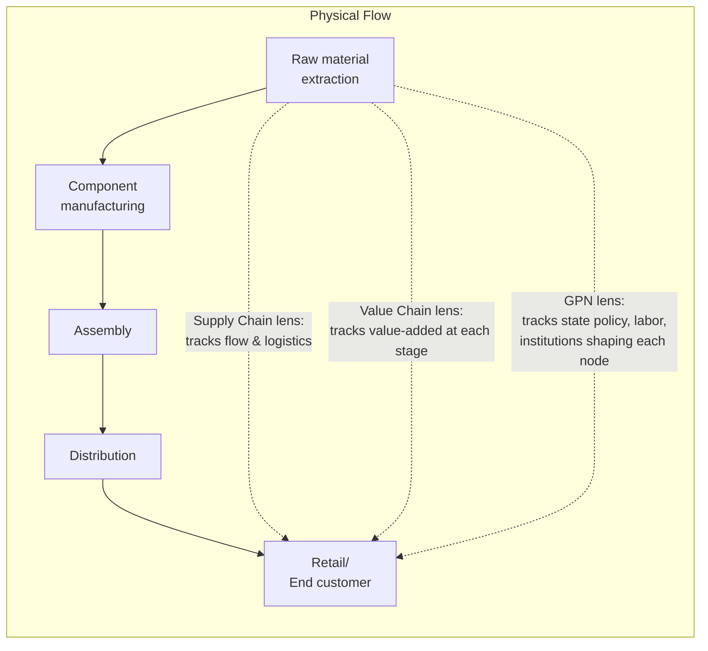

## Supply Chains, Value Chains, and Production Networks

### Definitions

**Supply chain**: the sequential set of organizations, activities, resources, and flows (materials, information, finance) involved in moving a product from raw input to end customer. The term emphasizes the *logistical and operational* dimension — sourcing, transformation, transportation, delivery.

**Value chain**: the full set of activities a firm or industry performs to bring a product from concept to end use, emphasizing where *economic value is added* at each stage rather than merely where physical goods move. Popularized by Michael Porter's 1985 firm-level value chain model, later extended to inter-firm and international contexts as the **Global Value Chain (GVC)** concept.

**Production network** (also "global production network," GPN): a broader analytical concept from economic geography describing the full web of firms, institutions, and governance relationships — including non-firm actors like states, labor organizations, and regulators — that shape how and where production occurs, not merely the transactional flow of goods.

**Key Points**

- These three terms are frequently used interchangeably in casual usage, but each carries a distinct analytical emphasis: supply chain = *flow and logistics*; value chain = *value capture and distribution*; production network = *governance and power relations among all embedded actors*
- Supply chain geopolitics draws most heavily on the value chain and production network traditions precisely because they foreground *where value and control are concentrated* — the central concern of a geopolitical/strategic analysis — rather than only *where goods physically move*, which is the narrower supply chain/logistics framing

### Porter's Value Chain (Firm-Level Origin)

Michael Porter's original 1985 framework decomposed a firm's activities into primary activities (inbound logistics, operations, outbound logistics, marketing/sales, service) and support activities (firm infrastructure, HR management, technology development, procurement), arguing that competitive advantage arises from how a firm configures and links these activities relative to competitors.

**Key Points**

- Porter's model was originally intra-firm and domestic in scope; its extension to a global, multi-firm, multi-country context is what produced the Global Value Chain (GVC) literature of the 1990s–2000s

### Global Value Chains (GVC): The Gereffi Framework

Gary Gereffi and collaborators (notably Gereffi, Humphrey, and Sturgeon's influential 2005 paper "The Governance of Global Value Chains") extended value chain analysis to the international level, introducing the concept of **governance patterns** — the mechanisms by which lead firms coordinate and control geographically dispersed production. Their typology identifies five governance modes along a spectrum of increasing explicit coordination and power asymmetry: market (arm's-length transactions), modular (suppliers provide capability to broad specifications), relational (complex, mutually dependent supplier relationships), captive (small suppliers highly dependent on and directed by a dominant buyer), and hierarchy (vertical integration within a single firm).

| Governance Mode | Coordination Level | Power Asymmetry | Example |
| --- | --- | --- | --- |
| Market | Low | Low | Commodity trading (agricultural goods) |
| Modular | Moderate | Moderate | Contract electronics manufacturing (Foxconn-type) |
| Relational | High (mutual) | Moderate-high | Complex automotive supplier relationships |
| Captive | High (buyer-directed) | High | Apparel manufacturing under strict buyer specification |
| Hierarchy | Full (ownership) | Full | Vertically integrated firm subsidiaries |

**Key Points**

- This governance typology matters directly for supply chain geopolitics: a **captive** or **hierarchy** governance structure concentrates decision-making power (and thus geopolitical leverage) in the lead firm's home jurisdiction, while **market**-mode chains distribute that leverage more widely and are typically easier to reroute under geopolitical pressure

### "Smile Curve": Where Value Concentrates in a GVC

A widely used visualization in GVC analysis — commonly attributed to Acer founder Stan Shih (1992) — plots value-added against stage of production, typically showing high value capture at both the upstream (R&D, design, IP) and downstream (branding, marketing, after-sales service) ends of a value chain, with comparatively low value capture at the midstream manufacturing/assembly stage.

### Diagram: The Smile Curve (svg_diagram)

<svg xmlns="http://www.w3.org/2000/svg" viewBox="0 0 640 340" font-family="Helvetica, Arial, sans-serif">
<title>Smile Curve: Value Distribution Across a GVC (svg_diagram)</title>
<rect x="0" y="0" width="640" height="340" fill="#ffffff" />
<text x="320" y="26" font-size="15" font-weight="bold" text-anchor="middle" fill="#1a1a1a">Smile Curve: Value Distribution (svg_diagram)</text>
<line x1="70" y1="290" x2="590" y2="290" stroke="#333333" stroke-width="2" />
<line x1="70" y1="290" x2="70" y2="50" stroke="#333333" stroke-width="2" />
<text x="330" y="320" font-size="12" text-anchor="middle" fill="#333333">Production Stage →</text>
<text x="30" y="170" font-size="12" text-anchor="middle" fill="#333333" transform="rotate(-90 30 170)">Value Added</text>

<path d="M 110 100 Q 250 260 330 250 Q 410 260 550 90" fill="none" stroke="#4d6699" stroke-width="3" />
<circle cx="110" cy="100" r="6" fill="#006633" />
<text x="110" y="80" font-size="11" text-anchor="middle" fill="#1a1a1a">R&amp;D / Design / IP</text>
<text x="110" y="65" font-size="10" text-anchor="middle" fill="#666666">(high value)</text>
<circle cx="330" cy="250" r="6" fill="#b30000" />
<text x="330" y="240" font-size="11" text-anchor="middle" fill="#1a1a1a">Manufacturing / Assembly</text>
<text x="330" y="280" font-size="10" text-anchor="middle" fill="#666666">(low value)</text>
<circle cx="550" cy="90" r="6" fill="#006633" />
<text x="550" y="70" font-size="11" text-anchor="middle" fill="#1a1a1a">Branding / Marketing /</text>
<text x="550" y="55" font-size="10" text-anchor="middle" fill="#1a1a1a">After-sales Service</text>
<text x="550" y="105" font-size="10" text-anchor="middle" fill="#666666">(high value)</text>
</svg>

**Key Points**

- The smile curve carries direct geopolitical significance: states seeking to move "up the value chain" (e.g., China's explicit industrial policy shift from low-value assembly toward high-value R&D and branding, articulated in strategies such as "Made in China 2025") are pursuing a value-capture strategy, not merely a manufacturing-capacity strategy
- A state or firm dominating the *low-value* midstream manufacturing stage can still hold significant geopolitical leverage if that stage is difficult to relocate or substitute (e.g., rare earth processing, battery cell assembly) — value-added and strategic criticality are related but distinct dimensions, and conflating them is a common analytical error [Inference: this distinction is a standard caution in GVC and critical minerals literature]

### Global Production Networks (GPN): The Broader Institutional Lens

The GPN framework, developed primarily by economic geographers (notably Neil Coe, Peter Dicken, and Martin Hess, building on earlier work from the "Manchester School"), differs from GVC analysis by explicitly incorporating non-firm actors and territorial embeddedness: labor markets and regulations, state industrial policy, regional development institutions, and civil society/labor organizations, arguing these shape production location and structure as much as firm-level strategic decisions do.

| Dimension | GVC (Gereffi tradition) | GPN (Coe/Dicken/Henderson tradition) |
| --- | --- | --- |
| Primary actors analyzed | Lead firms and suppliers | Firms, states, labor, regulators, civil society |
| Core question | How is the chain governed by lead firms? | How is production embedded in and shaped by territorial institutions? |
| Geographic framing | Chain (largely linear, sequential) | Network (non-linear, multiple embedded relationships) |
| Typical unit of study | An industry's value chain (e.g., apparel GVC) | A region's insertion into global production (e.g., how Malaysian state policy shaped electronics GPN participation) |

**Key Points**

- Supply chain geopolitics leans more heavily on the GPN tradition's inclusion of the *state* as an active shaping actor than the firm-centric GVC tradition, since state industrial policy, export controls, and subsidies are central objects of geopolitical analysis rather than background conditions

### Terminology Reconciliation Table

| Term | Emphasis | Typical Discipline of Origin | Relevance to Supply Chain Geopolitics |
| --- | --- | --- | --- |
| Supply chain | Physical/logistical flow | Operations management | Identifies chokepoints, routing, physical vulnerability |
| Value chain | Value-added distribution | Strategic management (Porter) | Identifies where economic leverage and profit concentrate |
| Global Value Chain (GVC) | Inter-firm governance across borders | International economics/business | Identifies power asymmetry between lead firms and suppliers, and thus coercive leverage points |
| Global Production Network (GPN) | Territorial embeddedness, multi-actor governance | Economic geography | Identifies how state policy and regional institutions shape production location — most directly relevant to policy analysis |

### Mermaid Diagram: Same Physical Chain, Three Analytical Lenses

### Application: Analyzing a Single Product Through All Three Lenses

**Example**

Consider a smartphone's supply chain: lithium is mined in Australia or Chile; refined into battery-grade material largely in China; assembled into battery cells in China or South Korea; combined with a semiconductor fabricated in Taiwan (designed by a US firm, using Dutch lithography equipment); assembled into a finished device in China, Vietnam, or India; and sold globally under a US or South Korean brand.

- **Supply chain lens** asks: what is the physical routing, lead time, and logistics risk at each handoff (e.g., shipping lithium from Australia to China, chips from Taiwan to the assembly site)?
- **Value chain lens** asks: where is value captured (heavily concentrated in chip design/IP and brand/software, per the smile curve), and what governance mode links the brand owner to its component suppliers (typically captive or relational for critical components)?
- **GPN/production network lens** asks: how have state industrial policies (Taiwan's semiconductor strategy, China's battery material dominance, US CHIPS Act incentives, EU critical raw materials policy) shaped *why* production is distributed this way, and what regulatory or labor conditions at each node create additional risk or leverage?

A geopolitical risk event — for instance, export controls on advanced lithography equipment — is best fully understood only by combining all three lenses: it disrupts a *physical flow* (supply chain), threatens a high-value node in the *value distribution* (value chain), and reflects deliberate *state policy intervention* in the network's structure (GPN/production network).

**Related Topics**

- Gereffi's five governance modes in depth: market, modular, relational, captive, hierarchy
- The smile curve and industrial policy strategies to "climb" the value chain (case: China's Made in China 2025)
- Global Production Network theory and the "strategic coupling" concept (how regions insert themselves into GPNs)
- Value-added trade statistics (OECD TiVA database) as a measurement tool distinct from gross trade statistics
- Captive governance chains and buyer power in apparel/electronics manufacturing
- Case study: the smartphone supply chain as a multi-jurisdictional GVC/GPN