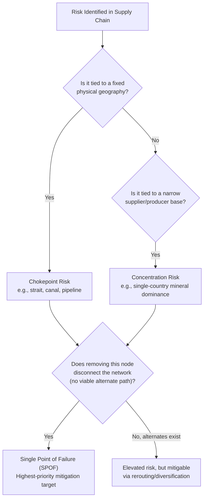

## Chokepoints, Concentration Risk, and Single Points of Failure

### Definitions

**Chokepoint**: a geographically fixed, physically narrow passage — maritime strait, canal, land corridor, or infrastructure node — through which a disproportionate share of global or regional trade flow must transit, such that closure or disruption imposes outsized costs relative to the point's physical size.

**Concentration risk**: the exposure created when a critical input, production capability, or logistics function depends heavily or exclusively on a single supplier, region, or jurisdiction, such that disruption at that single source cannot be readily absorbed through substitution.

**Single point of failure (SPOF)**: a systems-engineering term (borrowed into supply chain analysis) denoting any single node, facility, or link whose failure would disable or severely degrade the entire system, because no redundant alternative exists.

**Key Points**

- Chokepoints are a *geographic/physical* category (a place); concentration risk is a *market-structure* category (a supplier or capability); single point of failure is a *systems* category (a node in a network graph) — the three concepts overlap heavily in practice but are analytically distinct and require different mitigation strategies
- A chokepoint is not automatically a concentration risk (a strait with many viable alternative routes, even if inconvenient, is a lesser risk) — criticality depends on the *absence of substitutes*, not physical narrowness alone

### Maritime Chokepoints: The Classical Case

| Chokepoint | Approx. Share of Global Trade/Oil Transit | Strategic Significance |
| --- | --- | --- |
| Strait of Hormuz | ~20% of global petroleum liquids consumption transits here [Unverified: figure fluctuates year to year; verify against current EIA data] | Sole maritime outlet for Persian Gulf oil exporters (Saudi Arabia, Iran, Iraq, UAE, Kuwait, Qatar) |
| Strait of Malacca | ~25–30% of global seaborne trade, majority of China's crude oil imports [Unverified: cited ranges vary by source] | Primary sea route between Indian Ocean and Pacific/East Asia; China's "Malacca Dilemma" |
| Suez Canal | ~12% of global trade by volume [Unverified: figure varies by year and measurement] | Shortest sea route between Europe/Mediterranean and Asia, avoiding the Cape of Good Hope detour |
| Panama Canal | Significant share of US intercoastal and Asia-US East Coast trade | Alternative to circumnavigating South America; increasingly affected by drought-driven draft restrictions |
| Bab-el-Mandeb Strait | Connects Red Sea (Suez approach) to Gulf of Aden/Indian Ocean | Chokepoint for traffic feeding into the Suez Canal; exposed to Yemen-adjacent conflict risk |
| Taiwan Strait | Not primarily an oil chokepoint but a critical shipping lane and semiconductor-adjacent flashpoint | Combines maritime chokepoint and critical-industry concentration risk in a single geography |

**Key Points**

- "Chokepoint" analysis originated largely in energy security literature (tracking oil and gas transit routes) before being generalized to container shipping, critical minerals, and semiconductor logistics in the post-2018 supply chain geopolitics literature
- China's own strategic vocabulary explicitly names the **"Malacca Dilemma"** (马六甲困局) — the recognition, attributed to statements associated with Chinese leadership in the mid-2000s, that Chinese energy security is structurally exposed to a strait it does not control, which has directly motivated Belt and Road Initiative overland corridor investments as a mitigation strategy [Unverified: precise attribution and original phrasing require primary-source verification]

### Diagram: Major Maritime Chokepoints (svg_diagram)

<svg xmlns="http://www.w3.org/2000/svg" viewBox="0 0 640 320" font-family="Helvetica, Arial, sans-serif">
<title>Major Global Maritime Chokepoints (svg_diagram)</title>
<rect x="0" y="0" width="640" height="320" fill="#f5f5f5" />
<text x="320" y="26" font-size="15" font-weight="bold" text-anchor="middle" fill="#1a1a1a">Major Maritime Chokepoints (svg_diagram)</text>

<rect x="20" y="60" width="600" height="220" fill="#dceaf7" stroke="#aac4d8" stroke-width="1" />

<circle cx="150" cy="150" r="9" fill="#b30000" />
<text x="150" y="135" font-size="11" text-anchor="middle" fill="#1a1a1a">Panama Canal</text>
<circle cx="290" cy="130" r="9" fill="#b30000" />
<text x="290" y="115" font-size="11" text-anchor="middle" fill="#1a1a1a">Suez Canal</text>
<circle cx="330" cy="180" r="9" fill="#b30000" />
<text x="330" y="200" font-size="11" text-anchor="middle" fill="#1a1a1a">Bab-el-Mandeb</text>
<circle cx="380" cy="160" r="9" fill="#b30000" />
<text x="380" y="145" font-size="11" text-anchor="middle" fill="#1a1a1a">Strait of Hormuz</text>
<circle cx="470" cy="190" r="9" fill="#b30000" />
<text x="470" y="210" font-size="11" text-anchor="middle" fill="#1a1a1a">Strait of Malacca</text>
<circle cx="530" cy="140" r="9" fill="#cc5500" />
<text x="530" y="125" font-size="11" text-anchor="middle" fill="#1a1a1a">Taiwan Strait</text>

<text x="320" y="305" font-size="10" text-anchor="middle" fill="`#666666`">(Schematic positions — not to scale or precise geographic projection)</text>

</svg>

### Non-Maritime Chokepoints and Nodes

Chokepoint analysis extends well beyond shipping lanes:

- **Land corridors**: the Suwałki Gap (the narrow Polish-Lithuanian border corridor between Belarus and Kaliningrad, the sole NATO land link to the Baltic states); overland rail corridors through Central Asia connecting China to Europe
- **Energy pipelines**: Nord Stream 1/2 (Russia-Germany gas), Druzhba pipeline (Russia-Europe oil) — infrastructure chokepoints whose disruption (deliberate sabotage, in the Nord Stream case in 2022, or policy decision) produces energy-market-wide effects
- **Digital infrastructure**: submarine fiber-optic cables (an estimated ~95–99% of intercontinental internet traffic transits submarine cables) [Unverified: commonly cited range varies slightly by source]; concentrated cable landing stations create physical chokepoints for digital, not just physical, trade
- **Financial infrastructure**: SWIFT messaging system as a chokepoint for international financial transactions, weaponizable through exclusion (as applied to certain Russian banks following the 2022 invasion of Ukraine)
- **Single-facility production chokepoints**: TSMC's most advanced fabrication capacity concentrated in a small number of Taiwanese facilities; ASML as the sole global manufacturer of extreme ultraviolet (EUV) lithography machines required for leading-edge semiconductor fabrication

**Key Points**

- The ASML case is frequently cited in the field as the purest modern example of concentration risk approaching a true single point of failure at a *global* (not merely national) scale: as of the mid-2020s, ASML remained the sole commercial supplier of EUV lithography systems, meaning virtually the entire world's most advanced chip production depends on output from one company headquartered in one jurisdiction (Netherlands), which correspondingly makes ASML export licensing a central lever in US-aligned semiconductor export control policy toward China [Unverified: competitive landscape for EUV lithography should be verified against current industry data, as it can change]

### Distinguishing Concentration Risk from Chokepoint Risk: A Framework

| Risk Type | Defining Question | Mitigation Strategy | Example |
| --- | --- | --- | --- |
| Pure chokepoint risk | Is there a narrow physical passage with few/no alternate routes? | Route diversification, alternate corridor investment, strategic reserves near the chokepoint | Suez Canal closure → Cape of Good Hope rerouting (costly, slower, but feasible) |
| Pure concentration risk | Is there a narrow *supplier base* regardless of geography? | Supplier diversification, qualification of alternate sources, stockpiling | Rare earth processing concentrated in China despite geographically dispersed raw ore deposits |
| Compound risk (chokepoint + concentration) | Does a single geography combine both physical bottleneck AND irreplaceable production capability? | Requires both physical and supplier diversification; hardest risk category to mitigate | Taiwan: combines Taiwan Strait as a shipping/military chokepoint with irreplaceable advanced chip fabrication capacity |

**Key Points**

- Compound risk cases (Taiwan being the paradigm example in current literature) are treated as the highest-priority category in supply chain geopolitics precisely because no single mitigation lever (rerouting *or* diversification alone) sufficiently addresses the exposure — this is why policy responses to Taiwan-related risk combine multiple simultaneous tracks: onshoring subsidies (US CHIPS Act, EU Chips Act), allied capacity expansion (Japan, South Korea), and continued diplomatic/military deterrence

### Quantifying Concentration: The Herfindahl-Hirschman Index (HHI) Applied to Supply

A standard economic tool for market concentration, the HHI, is frequently adapted in supply chain risk literature to quantify supplier or source-country concentration:

$$HHI = \sum_{i=1}^{n} s_i^2$$

where $s_i$ is the market share (as a percentage or fraction) of supplier or source country $i$. An HHI approaching $10{,}000$ (using percentage points, where shares sum to 100) indicates near-total concentration in a single source; conventional competition-policy thresholds (originally developed for merger review, e.g., by US antitrust agencies) classify markets above roughly $2{,}500$ as "highly concentrated," though supply chain risk practitioners often apply stricter thresholds given the strategic (not merely competitive) stakes involved. [Inference: the specific numeric thresholds are standard antitrust convention; their direct application to supply chain criticality scoring is an adapted, not universally standardized, practice across the field]

**Example**

If a single country supplies 90% of a critical mineral and the remaining 10% is split among three other countries (roughly 3.3% each), the approximate HHI is:

$$HHI \approx 90^2 + 3.3^2 + 3.3^2 + 3.3^2 \approx 8{,}100 + 33 \approx 8{,}133$$

This score sits far above conventional "highly concentrated" thresholds, flagging the mineral as a priority for diversification or stockpiling policy.

### Systems Framing: Network Centrality and SPOF Identification

Borrowing from graph theory and network science, supply chain risk analysts formally identify SPOFs using centrality measures:

- **Betweenness centrality**: identifies nodes that lie on the largest number of shortest paths between other nodes in the network — high-betweenness nodes are chokepoint candidates because rerouting around them is costly
- **Degree centrality**: identifies nodes with the most direct connections — a high-degree supplier node whose failure disconnects many downstream firms simultaneously
- **Cut vertices / articulation points**: a formal graph-theory concept — a node whose removal disconnects the network into separate components; the closest formal mathematical definition of a true single point of failure

**Key Points**

- Applying formal network analysis to real-world, multi-tier supply chains is methodologically difficult in practice because full network visibility rarely extends beyond Tier 1 or Tier 2 suppliers for most firms — a well-documented practical limitation ("supply chain opacity") separate from the theoretical clarity of the graph-theoretic framework [Inference: this limitation is widely discussed in supply chain risk management literature as a persistent, unresolved practical constraint]

### Mermaid Diagram: Chokepoint vs. Concentration Risk vs. SPOF — Overlapping Categories

### Mitigation Strategy Summary

**Key Points**

- **Physical/chokepoint mitigation**: alternate route qualification (even at cost premium), strategic petroleum/material reserves positioned near or beyond the chokepoint, infrastructure investment in bypass corridors (e.g., China's overland Belt and Road corridors as a Malacca Strait hedge)
- **Concentration/supplier mitigation**: supplier base diversification, dual/multi-sourcing qualification, "friend-shoring" toward geopolitically aligned alternate suppliers, strategic stockpiling of the highest-HHI inputs
- **SPOF/systems mitigation**: redundant node investment (subsidizing a second fabrication source, as with CHIPS Act-style incentives), network topology redesign to eliminate cut vertices, improved multi-tier supply chain visibility/mapping to even detect hidden SPOFs in the first place

**Related Topics**

- The "Malacca Dilemma" and China's Belt and Road overland corridor strategy as chokepoint mitigation
- ASML and EUV lithography as a global semiconductor supply chain single point of failure
- Submarine cable infrastructure as a digital-era chokepoint category
- Herfindahl-Hirschman Index (HHI) and its adaptation for supply chain criticality scoring
- Network centrality measures (betweenness, degree, cut vertices) applied to multi-tier supply chain mapping
- Case study: Taiwan Strait as a compound chokepoint-and-concentration risk