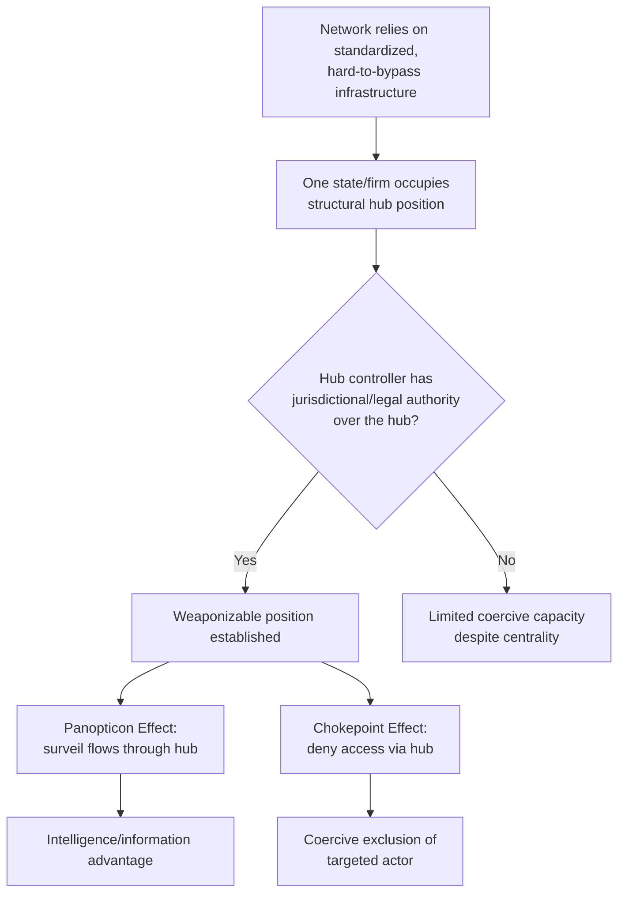

## Weaponized Interdependence and Networked Coercion

### Definition

**Weaponized interdependence** is a theoretical framework describing how states that occupy privileged, hub-like positions within global economic and information networks can exploit that structural position to extract information, deny access, or coerce other states and firms — even absent traditional military or territorial leverage. The term was coined by political scientists Henry Farrell and Abraham Newman in their influential 2019 article "Weaponized Interdependence: How Global Economic Networks Shape State Coercion" (published in *International Security*).

**Key Points**

- The framework's core innovation is shifting the unit of analysis from *bilateral* dependency (the classical Hirschman insight that asymmetric trade dependence confers power) to *network topology* — arguing that power derives specifically from a state's structural position within a network (its centrality, its control over critical nodes), not merely from aggregate trade volume or bilateral asymmetry
- Farrell and Newman developed this concept partly by generalizing observations about US structural power over global financial and communications infrastructure (SWIFT, the dollar clearing system, internet backbone infrastructure) into a portable, general theory applicable to any network with similarly concentrated topology

### The Two Core Mechanisms: Panopticon and Chokepoint Effects

Farrell and Newman's framework identifies two distinct mechanisms through which network centrality confers coercive power:

1. **Panopticon effects**: a state that controls a central information node can surveil the flows passing through that node, gaining intelligence advantages over all other network participants — even those not directly targeted
2. **Chokepoint effects**: a state that controls a central node can restrict or cut off other actors' access to the network entirely, using that access denial as a coercive instrument

| Mechanism | Core Logic | Primary Effect | Illustrative Case |
| --- | --- | --- | --- |
| Panopticon | Central position enables surveillance of flows | Information/intelligence advantage | US intelligence access to global financial transaction data via SWIFT-adjacent monitoring programs |
| Chokepoint | Central position enables access denial | Coercive exclusion, economic damage | SWIFT exclusion of designated Russian banks (2022); US Entity List restrictions cutting firms off from US-origin technology and financial systems |

**Key Points**

- These two mechanisms are not mutually exclusive — a single hub position (e.g., control over global dollar clearing) can simultaneously confer both surveillance capability and exclusionary coercive power, which is part of why the framework treats such positions as unusually potent

### Theoretical Lineage: Building on, and Departing from, Hirschman

Weaponized interdependence explicitly builds on Albert Hirschman's 1945 foundational insight (*National Power and the Structure of Foreign Trade*) that trade relationships are rarely symmetric, and that the less-dependent party in an asymmetric trade relationship gains political leverage over the more-dependent party. Farrell and Newman's contribution is to argue that in a networked global economy — characterized by standardized technical infrastructure (financial messaging, internet routing, technology supply chains) rather than simple bilateral trade flows — power concentrates not merely in asymmetric *bilateral* relationships but in **structural hub positions within the network topology itself**, a distinction with different empirical implications and different policy responses.

$$\text{Hirschman: power} \propto \text{bilateral asymmetry} \quad \longrightarrow \quad \text{Farrell \& Newman: power} \propto \text{network centrality}$$

### Core Case Studies Cited in the Original and Subsequent Literature

**Example**

The most frequently cited empirical case is **SWIFT** (Society for Worldwide Interbank Financial Telecommunication), the messaging network underpinning most international bank transfers. Because SWIFT is headquartered in Belgium but operates under significant US and EU regulatory influence and because the US dollar's centrality in global finance routes an outsized share of international transactions through US-correspondent-banking-adjacent infrastructure, the US and EU have been able to exclude specific states' banks from SWIFT as a coercive instrument — applied against Iran (from 2012) and against designated Russian banks (from 2022, following the invasion of Ukraine) — producing severe disruption to those states' ability to conduct international trade finance. [Unverified: precise institutional governance details of SWIFT and the exact mechanics of exclusion decisions should be verified against current primary sources, as these are subject to policy change]

**Example**

A second frequently cited case is **US export control jurisdiction over semiconductor manufacturing equipment and design software**, particularly the 2022–2023 expansion of Entity List restrictions and the Foreign Direct Product Rule, which leverages the fact that most advanced chip design software (from US firms) and much advanced fabrication equipment either originates in the US or incorporates US-origin technology — allowing the US to restrict Chinese firms' access to advanced chip capability even when the immediate transaction is between two non-US firms (e.g., a Dutch equipment maker selling to a Chinese fab), by asserting jurisdiction over any product built using US-origin technology inputs.

### Networked Coercion: Extending the Framework to Supply Chains

The term **networked coercion** is used in subsequent literature (building on Farrell and Newman, and developed further in related work including Farrell and Newman's follow-on scholarship and adjacent contributions from scholars studying technology supply chains) to describe the specific application of weaponized interdependence logic to physical and technological supply chains rather than purely financial/informational networks. The core argument: just as SWIFT and internet routing infrastructure created hub positions in financial and information networks, standardized, concentrated production processes in high-technology manufacturing (particularly semiconductors) create analogous hub positions — and the state or firms controlling those hubs can exercise coercive leverage over supply chain participants who depend on them, regardless of formal treaty relationships or military capability.

**Key Points**

- The semiconductor supply chain is frequently treated in the field as the paradigmatic contemporary case of networked coercion because chip design (concentrated in the US), lithography equipment (concentrated in the Netherlands via ASML), and advanced fabrication (concentrated in Taiwan via TSMC) each represent a distinct hub position controlled by a different jurisdiction — meaning multiple states simultaneously hold potential chokepoint leverage over the same overall production network [Inference: this multi-hub characterization is a standard framing in semiconductor supply chain policy literature, though the precise distribution of leverage across these hubs is a matter of ongoing analysis]

### Diagram: Hub-and-Spoke Network Structure Underlying Weaponized Interdependence (svg_diagram)

<svg xmlns="http://www.w3.org/2000/svg" viewBox="0 0 640 400" font-family="Helvetica, Arial, sans-serif">
<title>Hub Position and Weaponized Interdependence (svg_diagram)</title>
<rect x="0" y="0" width="640" height="400" fill="#ffffff" />
<text x="320" y="26" font-size="15" font-weight="bold" text-anchor="middle" fill="#1a1a1a">Hub Position and Weaponized Interdependence (svg_diagram)</text>

<circle cx="320" cy="210" r="34" fill="#b30000" />
<text x="320" y="205" font-size="12" font-weight="bold" text-anchor="middle" fill="#ffffff">HUB</text>
<text x="320" y="220" font-size="10" text-anchor="middle" fill="#ffffff">(e.g., SWIFT,</text>
<text x="320" y="232" font-size="10" text-anchor="middle" fill="#ffffff">EUV lithography)</text>

<line x1="320" y1="210" x2="120" y2="90" stroke="#666666" stroke-width="1.5" />
<line x1="320" y1="210" x2="120" y2="330" stroke="#666666" stroke-width="1.5" />
<line x1="320" y1="210" x2="520" y2="90" stroke="#666666" stroke-width="1.5" />
<line x1="320" y1="210" x2="520" y2="330" stroke="#666666" stroke-width="1.5" />
<line x1="320" y1="210" x2="90" y2="210" stroke="#666666" stroke-width="1.5" />
<line x1="320" y1="210" x2="550" y2="210" stroke="#666666" stroke-width="1.5" />
<circle cx="120" cy="90" r="14" fill="#4d6699" />
<text x="120" y="70" font-size="10" text-anchor="middle" fill="#1a1a1a">Bank A</text>
<circle cx="120" cy="330" r="14" fill="#4d6699" />
<text x="120" y="355" font-size="10" text-anchor="middle" fill="#1a1a1a">Bank B</text>
<circle cx="520" cy="90" r="14" fill="#4d6699" />
<text x="520" y="70" font-size="10" text-anchor="middle" fill="#1a1a1a">Bank C</text>
<circle cx="520" cy="330" r="14" fill="#4d6699" />
<text x="520" y="355" font-size="10" text-anchor="middle" fill="#1a1a1a">Bank D</text>
<circle cx="90" cy="210" r="14" fill="#4d6699" />
<text x="90" y="190" font-size="10" text-anchor="middle" fill="#1a1a1a">Bank E</text>
<circle cx="550" cy="210" r="14" fill="#cc0000" />
<text x="550" y="190" font-size="10" text-anchor="middle" fill="#1a1a1a">Bank F</text>
<text x="550" y="243" font-size="9" text-anchor="middle" fill="#b30000">(excluded — chokepoint effect)</text>

<text x="320" y="380" font-size="11" text-anchor="middle" fill="`#666666`">Hub controller can surveil all flows (panopticon) or sever any spoke (chokepoint)</text>

</svg>

### Structural Preconditions for Weaponized Interdependence

The framework specifies particular structural conditions under which network hub positions translate into coercive capability, rather than treating all interdependence as equally weaponizable:

1. **Standardization**: the network relies on common technical standards or protocols, making the hub genuinely difficult to bypass (e.g., near-universal reliance on SWIFT messaging standards, or on a narrow set of advanced lithography techniques)
2. **Legal/regulatory jurisdiction**: the hub-controlling state has effective legal authority (domestic law, extraterritorial jurisdiction claims) over the hub infrastructure or the firms operating it
3. **High switching costs**: alternative networks or standards exist in principle but are costly, slow, or technically inferior to adopt at scale, discouraging exit even under coercive pressure
4. **Asymmetric centrality**: the hub-controlling state's own economy is comparatively less dependent on the specific network relative to the states or firms being coerced

**Key Points**

- These preconditions explain why not every instance of economic interdependence produces weaponizable leverage — a genuinely decentralized or easily substitutable network (many commodity markets, for instance) confers little coercive advantage even to a large supplier, while a standardized, jurisdictionally concentrated, high-switching-cost network (SWIFT, EUV lithography, dollar clearing) confers substantial leverage even to a comparatively small controlling entity (e.g., a single Dutch firm, ASML)

### Responses to Weaponized Interdependence: De-Hubbing and Alternative Network Construction

States subject to (or anticipating) networked coercion have pursued several counter-strategies documented in the subsequent policy and academic literature:

- **Alternative payment systems**: Russia's SPFS and China's CIPS (Cross-Border Interbank Payment System) as partial alternatives to SWIFT-dependent settlement, though adoption outside their sponsor states has remained limited relative to SWIFT's scale [Unverified: comparative adoption figures change over time and should be checked against current data]
- **Domestic capacity building**: China's substantial state investment in indigenous semiconductor fabrication and lithography R&D, explicitly framed as reducing exposure to US/allied chokepoint leverage over chip technology
- **Diversified reserve currency and settlement strategies**: gradual efforts by several states to reduce dollar-denominated trade settlement exposure, though the dollar's network effects (deep liquidity, near-universal counterparty acceptance) have made wholesale displacement difficult to achieve at scale [Inference: this difficulty is widely noted in international monetary literature as a structural feature of currency network effects, not merely a policy choice]
- **Bloc-based parallel infrastructure**: proposals and early efforts toward BRICS-aligned or regionally distinct financial and technology infrastructure intended to reduce dependence on US/allied-controlled hubs

**Key Points**

- The field generally treats these counter-strategies as only partially effective in the near-to-medium term, because network effects (the value of a network increasing with the number of participants) create strong incentives to remain on the incumbent, hub-controlled network even for states actively seeking to reduce their exposure to it — a structural tension the weaponized interdependence framework itself predicts

### Mermaid Diagram: Weaponized Interdependence Causal Logic

### Relevance to Supply Chain Geopolitics as a Field

Weaponized interdependence provides supply chain geopolitics with its principal theoretical bridge between abstract international relations theory and concrete supply chain risk analysis: it explains *why* certain nodes in a physical or technological supply chain (not just financial/information networks) become objects of state coercive strategy, and predicts *which* nodes are most likely to be weaponized — those combining standardization, jurisdictional control, high switching costs, and asymmetric dependence, precisely the same criteria used elsewhere in the field to identify chokepoints and concentration risk.

**Related Topics**

- Farrell and Newman's original 2019 "Weaponized Interdependence" article and subsequent scholarly responses/critiques
- Hirschman's foundational theory of trade and national power as the framework's intellectual precursor
- SWIFT governance, sanctions exclusion mechanics, and alternative payment system development (CIPS, SPFS)
- US export control extraterritoriality: the Foreign Direct Product Rule and Entity List mechanics
- Semiconductor supply chain hub analysis: chip design (US), lithography (Netherlands/ASML), fabrication (Taiwan/TSMC)
- De-dollarization efforts and the structural persistence of dollar network effects