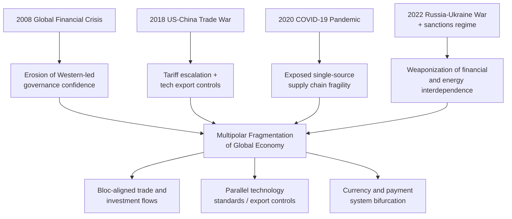

## Multipolarity and the Fragmentation of the Global Economy

### Defining Multipolarity in the Economic Context

**Key Points**

- Multipolarity describes a distribution of power across several roughly comparable centers rather than concentration in one (unipolarity) or two (bipolarity) dominant actors
- In supply chain geopolitics, multipolarity manifests as the emergence of competing economic-technological blocs (the United States and allied democracies, China and its partners, a hedging "middle" bloc including India, the Gulf states, ASEAN, and others) each capable of setting standards, controlling chokepoints, and coercing smaller states
- Economic multipolarity is distinct from but reinforces military/diplomatic multipolarity — control over semiconductor fabrication, rare earth processing, shipping lanes, and payment infrastructure is now treated as a form of hard power

The shift from the post-Cold War unipolar moment (roughly 1991–2008) to today's multipolar economic order is generally dated by scholars to the 2008 Global Financial Crisis, which damaged confidence in Western-led financial governance, and accelerated sharply after 2018 (US-China trade war), 2020 (COVID-19 supply shocks), and 2022 (Russia's invasion of Ukraine and the resulting sanctions regime). [Inference] The precise inflection point is debated among IR scholars, but the convergence of these four shocks is widely cited as the proximate cause of the current fragmentation trend.

### From Globalization to "Slowbalization" and Fragmentation

**Key Points**

- "Slowbalization" (a term popularized by *The Economist* around 2019) describes the plateauing of global trade-to-GDP ratios after decades of steady increase
- "Fragmentation" is the stronger successor concept used by the IMF and World Bank since 2022–2023, describing active geoeconomic bloc formation rather than mere stagnation
- The IMF distinguishes between **friend-shoring** (relocating supply chains to politically aligned countries), **nearshoring** (relocating to geographically proximate countries), and **reshoring** (relocating production back to the home country)

The IMF's *Geoeconomic Fragmentation and the Future of Multilateralism* (2023) modeled scenarios in which the world economy splits into competing blocs, estimating long-run global GDP losses ranging from approximately 0.2% in a limited-fragmentation scenario to as much as 7% of global GDP in a severe decoupling scenario, with some estimates reaching 8–12% for individual economies if technological decoupling is included. [Unverified — figures depend heavily on model assumptions about substitution elasticities and are frequently revised across IMF publications; treat as illustrative orders of magnitude rather than precise forecasts]

### Core Vocabulary

| Term | Definition |
| --- | --- |
| **Chokepoint** | A geographic or infrastructural node (Strait of Malacca, Taiwan Strait, Suez Canal, a specific fab, a specific mine) where disruption imposes disproportionate global cost |
| **Weaponized interdependence** | The use of network centrality (e.g., SWIFT, the US dollar clearing system, ASML's lithography monopoly) to coerce other states, a term coined by Farrell and Newman (2019) |
| **De-risking** | The EU/G7 preferred framing (vs. "decoupling") emphasizing selective reduction of exposure to a rival power in critical sectors while maintaining broader economic ties |
| **Decoupling** | Full separation of two economies' supply chains, technology stacks, or financial systems; rarely pursued in totality, more often sector-specific ("small yard, high fence") |
| **Economic statecraft** | The deliberate use of trade, investment, and financial tools to achieve geopolitical objectives |
| **Bloc formation** | Empirical clustering of trade and investment flows along geopolitical alignment lines, measurable via UN voting pattern correlation with trade data |
| **China+1 / friend-shoring** | Corporate strategy of diversifying manufacturing beyond a single dominant supplier country, typically China, to a politically safer second location |

### Empirical Evidence of Fragmentation

Several IMF and academic studies have used UN General Assembly voting alignment as a proxy for geopolitical distance and cross-referenced it against trade and FDI flows. The consistent finding: FDI and trade flows between geopolitically distant country pairs have declined measurably since 2018, while flows between geopolitically aligned pairs have grown, even when the aligned partner is geographically farther away (contradicting a pure "gravity model" of trade based on distance alone). [Inference] This is interpreted as evidence that alignment, not just cost, increasingly drives sourcing decisions, though isolating geopolitics from concurrent factors like tariffs and COVID-19 disruption remains methodologically difficult.

**Example**

Mexico surpassed China as the top source of US goods imports in 2023, a shift widely attributed in trade press and Treasury commentary to nearshoring/friend-shoring dynamics combined with USMCA preferences, though currency effects and pandemic-era inventory rebuilding are also contributing factors. [Unverified — attribution across these overlapping causes is contested in the trade economics literature]

### Structural Drivers of Fragmentation

### Sectoral Manifestations

**Key Points**

- **Semiconductors**: US CHIPS Act (2022) export controls on advanced-node equipment (ASML DUV/EUV lithography, Nvidia AI accelerators) to China, met by China's domestic fab investment (SMIC) and rare-earth/gallium/germanium export restrictions in retaliation
- **Critical minerals**: China's dominance in rare-earth processing (estimated 85–90% of global refining capacity by various USGS and IEA estimates) [Unverified — exact share fluctuates by mineral and year; figures cited across sources range from roughly 60% to over 90% depending on which stage of the value chain and which specific mineral is measured] has driven Western "critical minerals club" initiatives (Minerals Security Partnership, launched 2022)
- **Payments**: Growth of CIPS (China's cross-border interbank payment system) and bilateral local-currency settlement agreements as partial hedges against dollar-clearing dependency, though the dollar's share of global reserves and trade invoicing remains dominant
- **Shipping and logistics**: Red Sea disruptions (Houthi attacks beginning late 2023) and periodic Panama Canal drought-driven transit restrictions illustrate how climate and regional conflict compound geopolitical fragmentation risk

### Strategic Responses: Firm-Level and State-Level

**Firm-level responses**

- Dual-sourcing and supply base diversification away from single-country concentration
- Inventory buffer increases (shift from pure just-in-time to "just-in-case" logistics), a trend widely reported following COVID-era disruptions [Inference] though some surveys since 2023 suggest partial reversion toward efficiency-focused JIT as acute shortages eased
- Regionalization of production footprints to serve blocs separately rather than a single global supply chain

**State-level responses**

- Industrial policy revival: US CHIPS and Science Act, EU Chips Act, India's Production-Linked Incentive (PLI) schemes
- Export control regimes: US Entity List expansions, Wassenaar Arrangement updates for dual-use technology
- Investment screening: Expansion of CFIUS (Committee on Foreign Investment in the United States) scope and analogous EU/UK/Japan mechanisms
- Friend-shoring diplomatic initiatives: US-led Minerals Security Partnership, EU Global Gateway, Quad supply chain resilience initiative

### The "Middle Powers" and Strategic Hedging

**Key Points**

- Countries such as India, Vietnam, Indonesia, the Gulf states (Saudi Arabia, UAE), and Turkey are frequently characterized in the geopolitical risk literature as pursuing **multi-alignment** rather than bloc allegiance — engaging economically with both US-aligned and China-aligned networks simultaneously
- This hedging behavior creates both opportunity (these states capture diverted trade and investment flows, e.g., Vietnam's electronics assembly growth) and risk (they face pressure from both blocs to choose sides on specific technology or sanctions issues)

### Measuring Fragmentation: Analytical Frameworks

$$\text{Fragmentation Index} = \frac{\sum_{i,j \in \text{aligned}} T_{ij} - \sum_{i,j \in \text{unaligned}} T_{ij}}{\sum_{i,j} T_{ij}}$$

Where $T_{ij}$ represents trade or investment flow between country pair $i,j$, and alignment is typically proxied by UN General Assembly voting correlation or formal alliance membership. [Inference] This is a simplified illustrative formulation; actual IMF and academic indices (e.g., those used in Gopinath et al., 2024, "Changing Global Linkages") employ more elaborate gravity-model regressions with fixed effects for distance, common language, and trade agreements.

### Distinguishing Rhetoric from Measurable Reality

**Key Points**

- Despite fragmentation rhetoric, aggregate global trade-to-GDP ratios have not collapsed; overall goods trade has continued to grow in nominal terms, with the fragmentation effect visible more in *composition and directionality* of flows than in total volume
- "Connector countries" (Vietnam, Mexico, Poland) have absorbed reallocated trade and investment, in some analyses partially offsetting bloc-level bilateral decoupling — this is sometimes termed **"rerouting" rather than genuine fragmentation** [Inference] — a live debate in trade economics as to whether apparent decoupling in bilateral US-China data is masking continued indirect interdependence via third countries

### Related Topics / Next Steps

- **Weaponized Interdependence and Chokepoint Theory**
- **Export Controls and Entity Lists as Instruments of Statecraft**
- **The Semiconductor Supply Chain and the Taiwan Strait Risk Premium**
- **Critical Minerals Geopolitics and the Rare Earth Value Chain**
- **De-Dollarization Debates and Alternative Payment Systems (CIPS, mBridge)**
- **Friend-Shoring vs. Reshoring: Empirical Case Studies**
- **Middle Power Hedging Strategies (India, Gulf States, ASEAN)**
- **Industrial Policy Revival: CHIPS Act, EU Chips Act, and PLI Schemes**