## Why Supply Chains Became a National Security Concern

### The Conceptual Shift: From Efficiency to Resilience

**Key Points**

- For roughly three decades following the end of the Cold War, supply chain design was governed almost exclusively by cost-minimization logic — the discipline of operations management optimized for just-in-time inventory, single-source procurement, and offshoring to lowest-cost jurisdictions
- National security framing of supply chains is a comparatively recent phenomenon in policy discourse, gaining formal institutional traction roughly between 2018 and 2022, though precedents exist in Cold War-era strategic stockpiling and export control regimes (COCOM)
- The core conceptual shift: supply chains came to be understood not merely as economic arrangements but as **strategic dependencies** that can be exploited by rival states as instruments of coercion, or that can fail catastrophically under geopolitical stress

This reframing did not emerge from a single event but from the cumulative effect of several shocks that each exposed a different vulnerability in globally distributed, efficiency-optimized production networks.

### Chronology of the Shift

```mermaid
flowchart LR
    A[Pre-2008:<br/>Efficiency paradigm<br/>dominant] --> B[2008 GFC:<br/>First cracks in<br/>governance confidence]
    B --> C[2010 China rare-earth<br/>embargo vs Japan]
    C --> D[2017-18 US-China<br/>trade war begins]
    D --> E[2020 COVID-19:<br/>PPE, semiconductor,<br/>pharma shortages]
    E --> F[2021 Suez Canal<br/>blockage - Ever Given]
    F --> G[2022 Russia-Ukraine war:<br/>energy weaponization]
    G --> H[2023-24 Red Sea attacks,<br/>Taiwan Strait tension]
    H --> I[Supply chains formally<br/>treated as national<br/>security domain]
```

### Driver 1: Demonstrated Willingness to Weaponize Trade Dependencies

**Key Points**

- The 2010 Senkaku/Diaoyu Islands incident, in which China reportedly restricted rare-earth exports to Japan following a maritime dispute, is widely cited in the policy literature as an early proof-of-concept for weaponized supply chain dependency [Unverified — Chinese officials denied a formal embargo at the time, and the episode is disputed in some historical accounts, but it is consistently referenced in subsequent US and EU policy documents as the precipitating case for critical minerals concern]
- The concept of **weaponized interdependence**, formalized academically by Farrell and Newman (2019), argues that states controlling key nodes in global networks (financial clearing, technology standards, critical inputs) can leverage that "hub" position for coercive advantage over "peripheral" states dependent on the network
- Subsequent cases reinforced this concern: China's 2023 export restrictions on gallium and germanium (inputs to semiconductors and defense systems), announced in response to US chip export controls, and periodic restrictions on rare-earth magnet exports affecting global automakers in 2025 [Unverified — specific restriction scope and enforcement have varied and been subject to negotiated exemptions]

### Driver 2: COVID-19 as a Systemic Stress Test

**Key Points**

- The pandemic exposed that globally optimized "just-in-time" supply chains, while efficient under normal conditions, had minimal redundancy to absorb simultaneous demand and supply shocks
- Three sectors became emblematic case studies in security discourse: **personal protective equipment** (PPE shortages revealed dependency on a small number of manufacturing hubs, primarily in China), **semiconductors** (automotive and consumer electronics production halted globally due to chip shortages, exposing concentration of advanced fabrication in Taiwan), and **pharmaceuticals/active pharmaceutical ingredients** (API production concentration in China and India raised concern in the US and EU about medicine supply security)
- The semiconductor shortage in particular is credited in most policy accounts as the direct catalyst for the US CHIPS and Science Act (2022) and the EU Chips Act (2023), both framed explicitly using national security and "strategic autonomy" language rather than purely economic competitiveness arguments

**Example**

Automakers including Ford and GM idled plants in 2021 due to semiconductor shortages traced back to concentrated fabrication capacity at TSMC in Taiwan, illustrating how a chokepoint several tiers deep in the value chain (chip fabs, not car assembly) could halt an entire downstream industry. [Inference — the causal chain from fab capacity to plant idling is well documented in industry reporting, though the precise magnitude of losses attributed to this single cause versus compounding factors like logistics delays varies by source]

### Driver 3: Geographic Concentration and Single-Point-of-Failure Risk

**Key Points**

- Security analysts distinguish between **diversified vulnerability** (many possible failure points, each individually low-impact) and **concentrated vulnerability** (a small number of nodes whose failure has systemic global consequences)
- The semiconductor industry is the canonical example: as of the early 2020s, TSMC alone was estimated to produce roughly 90% or more of the world's most advanced-node (sub-7nm) logic chips [Unverified — precise market share figures vary by source and by node generation, and TSMC's share has been a frequently cited but methodologically inconsistent figure across industry analyst reports], concentrating an outsized share of global technological capability in a single company located in a single geopolitically contested territory
- This concentration transforms an ordinary business risk (a single supplier's factory fire or bankruptcy) into a matter of state-level strategic concern, because the geography in question — the Taiwan Strait — is itself a site of active military tension between the US, China, and Taiwan

### Driver 4: Dual-Use Technology and the Erosion of Civil-Military Separation

**Key Points**

- Historically, export control regimes (such as the Cold War-era COCOM, and its successor the Wassenaar Arrangement) focused on explicitly military hardware
- Contemporary supply chain security concern extends this logic to **dual-use** and even ostensibly civilian technologies — advanced semiconductors, AI training hardware, quantum computing components, and certain biotechnology tools — on the grounds that civilian-origin technology can be rapidly repurposed for military or intelligence applications
- This logic underpins the expansion of the US Commerce Department's Entity List and the October 2022 and October 2023 semiconductor export control actions restricting sales of advanced AI chips (e.g., certain Nvidia processors) to China, justified explicitly in national security rather than trade-competitiveness terms

### Driver 5: Financial and Monetary Infrastructure as Supply Chain

**Key Points**

- The concept of supply chain security has expanded beyond physical goods to include **financial infrastructure** — payment clearing systems (SWIFT), correspondent banking relationships, and reserve currency status are increasingly analyzed using the same chokepoint/dependency framework as physical goods
- Russia's exclusion from SWIFT and freezing of an estimated $300 billion in central bank reserves following the 2022 invasion of Ukraine demonstrated that financial "supply chains" (the infrastructure enabling cross-border payment and reserve holding) are equally subject to weaponization, accelerating interest among non-aligned and China-aligned states in alternative payment rails (CIPS, mBridge, bilateral local-currency settlement)

### Institutional and Policy Responses

| Mechanism | Jurisdiction | Primary Function |
| --- | --- | --- |
| CFIUS (Committee on Foreign Investment in the US) | United States | Screens inbound foreign investment for national security risk, expanded scope post-2018 (FIRRMA) |
| CHIPS and Science Act | United States | Subsidizes domestic semiconductor fabrication capacity |
| EU Chips Act | European Union | Analogous EU-level semiconductor capacity and resilience funding |
| Entity List / Export Administration Regulations | United States | Restricts export of dual-use and advanced technology to designated foreign entities |
| Minerals Security Partnership | US-led, multilateral | Coordinates allied investment in non-China critical mineral supply chains |
| National Defense Stockpile | United States | Cold War-era strategic materials reserve, being modernized for critical minerals |

### Analytical Framework: Assessing Supply Chain Security Risk

Security and supply chain analysts commonly assess a given input or product against four dimensions, sometimes summarized as a **concentration-criticality matrix**:

1. **Criticality** — how essential is this input to defense, critical infrastructure, or economic function with no near-term substitute
2. **Concentration** — how few suppliers or geographic locations produce it (a Herfindahl-Hirschman Index approach is sometimes applied to supplier market share)
3. **Substitutability** — how readily can demand shift to alternative inputs, suppliers, or technologies, and over what time horizon
4. **Geopolitical alignment of the dominant supplier** — whether that concentrated supply sits with an allied, neutral, or rival state

$$\text{Risk Score} \propto \text{Criticality} \times \text{Concentration} \times (1 - \text{Alignment Reliability})$$

[Inference] This is an illustrative simplification of the qualitative frameworks used in practice (e.g., the US Department of Commerce's Section 232 investigations, or the EU's Critical Raw Materials Act criticality assessments); actual government methodologies use structured qualitative scoring rather than a single formula, and weightings are not publicly standardized across agencies.

### From "Just-in-Time" to "Just-in-Case"

**Key Points**

- The operations management literature increasingly frames the post-2020 period as a shift in corporate and state logistics philosophy from **just-in-time (JIT)**, which minimizes inventory carrying cost by synchronizing delivery precisely with production need, to **just-in-case (JIC)**, which deliberately maintains buffer inventory, redundant suppliers, and diversified geographic sourcing at higher cost in exchange for resilience
- This is not a uniform or permanent shift — [Inference] several industry surveys conducted after 2023 suggest a partial reversion toward JIT efficiency as acute pandemic-era shortages eased, indicating the JIT-to-JIC transition is better understood as a spectrum firms move along based on perceived risk, not a one-directional structural change

### Related Topics / Next Steps

- **Weaponized Interdependence and Chokepoint Theory**
- **The Semiconductor Value Chain and Taiwan Strait Risk**
- **Critical Minerals Geopolitics and Supply Concentration**
- **Export Control Regimes: From COCOM to the Wassenaar Arrangement to the Entity List**
- **De-Dollarization and Financial Infrastructure as Strategic Terrain**
- **Just-in-Time vs. Just-in-Case Inventory Philosophy**
- **CFIUS and Investment Screening Mechanisms**
- **Case Study: The 2021 Suez Canal (Ever Given) Blockage**