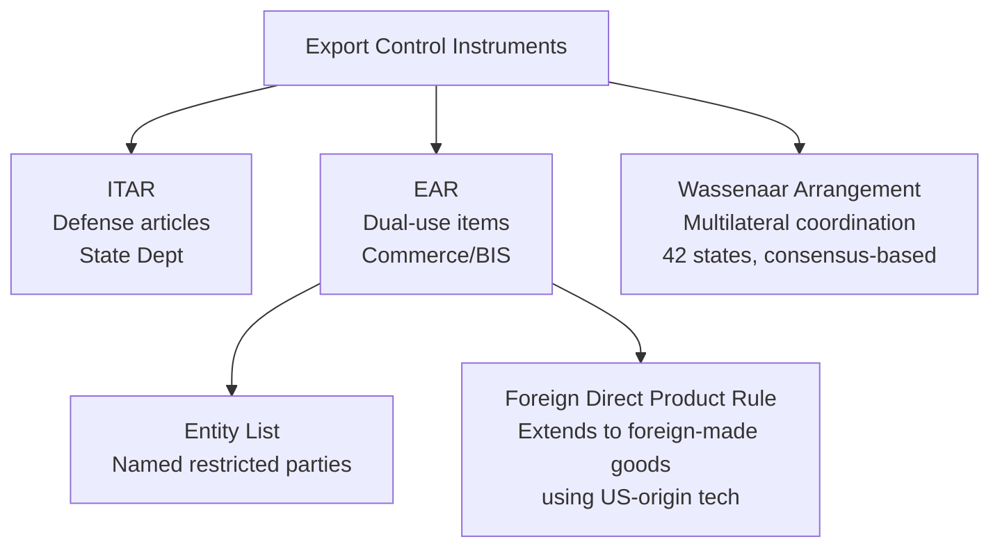

## Core Vocabulary Overview: Tariffs, Sanctions, Export Controls, and Industrial Policy

### Framing: Four Distinct Instruments of Economic Statecraft

**Key Points**

- Tariffs, sanctions, export controls, and industrial policy are frequently discussed together in supply chain geopolitics but are legally and functionally distinct instruments, each with different objectives, legal bases, and mechanisms of action
- The distinguishing question for each instrument: **does it tax, does it prohibit, does it restrict specific goods/technology, or does it subsidize domestic capacity?**
- These instruments are increasingly used in combination — a "layered" approach — rather than individually, which is a defining feature of contemporary economic statecraft compared to earlier eras

### Tariffs

**Key Points**

- A tariff is a tax imposed on imported (or, less commonly, exported) goods, collected by the importing country's customs authority
- Legally distinguished by function: **revenue tariffs** (primarily to raise government income, historically dominant before income taxation), **protective tariffs** (to raise the price of imports relative to domestic goods, shielding domestic industry), and **retaliatory tariffs** (imposed in response to another state's trade action, often WTO-sanctioned countermeasures or unilateral escalation)
- In US law, tariffs are typically imposed under specific statutory authorities: **Section 301** of the Trade Act of 1974 (unfair trade practices, used extensively against China from 2018 onward), **Section 232** of the Trade Expansion Act of 1962 (national security grounds, used for steel and aluminum tariffs), and **Section 201** (safeguard tariffs against import surges)
- The World Trade Organization's **Most Favored Nation (MFN)** principle generally requires WTO members to apply the same tariff rate to all other members absent a free trade agreement, though national security and safeguard exceptions (GATT Article XXI) provide legal cover for deviation

**Example**

The Section 301 tariffs imposed by the US on approximately $370 billion of Chinese imports beginning in 2018, spanning multiple tariff lists (List 1 through List 4), remained largely in place and were selectively expanded through subsequent administrations, illustrating how tariff regimes justified initially as trade-practice remedies persist and evolve as durable geopolitical instruments. [Inference — the exact dollar figure and product scope have been revised multiple times since 2018 and vary by source]

**Mechanism**

$$P_{domestic} = P_{world} \times (1 + t)$$

Where $t$ is the ad valorem tariff rate, raising the effective domestic price of the imported good and creating a wedge that benefits domestic producers and government revenue at the expense of consumers and importers, with the efficiency loss known in trade economics as **deadweight loss**.

### Sanctions

**Key Points**

- Sanctions are coercive economic measures imposed to change the behavior of a target state, entity, or individual, distinguished from tariffs by their **punitive/coercive intent** rather than revenue or protection intent, and distinguished from export controls by targeting broad economic activity rather than specific goods
- Major categories: **comprehensive sanctions** (near-total economic embargo of a country, e.g., historical US sanctions on Cuba, North Korea, and post-2022 sanctions on Russia's financial sector), **targeted/"smart" sanctions** (asset freezes and transaction bans against specific individuals or entities, designed to minimize humanitarian impact on general populations — a post-1990s evolution following criticism of the humanitarian effects of comprehensive Iraq sanctions), and **sectoral sanctions** (restricting specific sectors, e.g., US sanctions on Russian energy, defense, and financial sectors)
- Legal architecture in the US centers on the **International Emergency Economic Powers Act (IEEPA)** of 1977, administered primarily through the Treasury Department's **Office of Foreign Assets Control (OFAC)**, which maintains the **Specially Designated Nationals (SDN) List**
- The EU imposes sanctions through Council Regulations requiring unanimous member-state agreement, a structural feature that makes EU sanctions policy generally slower but, once adopted, binding across all member states
- **Secondary sanctions** extend the reach of a sanctioning state's measures to third-country entities that transact with sanctioned parties, a controversial and legally contested extraterritorial application most associated with US sanctions practice

### Export Controls

**Key Points**

- Export controls restrict the transfer of specific goods, software, or technology — distinguished from sanctions by their focus on **particular items** (often dual-use or military-relevant) rather than broad economic activity with a target country
- US export controls are administered primarily through two parallel regimes: the **International Traffic in Arms Regulations (ITAR)**, covering defense articles and administered by the State Department, and the **Export Administration Regulations (EAR)**, covering dual-use items and administered by the Commerce Department's **Bureau of Industry and Security (BIS)**
- The **Entity List** (maintained under the EAR) designates specific foreign companies, research institutions, or individuals subject to licensing requirements or outright prohibition on receiving US-origin technology — Huawei's 2019 Entity List designation is a frequently cited landmark case
- The **Foreign Direct Product Rule (FDPR)**, significantly expanded in the October 2022 and October 2023 semiconductor control actions, extends US jurisdiction to foreign-made products that use US-origin technology, software, or equipment in their production — this is the mechanism by which the US restricted non-US companies like the Dutch firm ASML from selling certain lithography equipment to China, despite ASML being a non-US company
- The multilateral **Wassenaar Arrangement** (1996, successor to the Cold War-era COCOM) coordinates export control lists among 42 participating states for conventional arms and dual-use goods, though it operates by consensus and lacks binding enforcement, limiting its effectiveness against determined evasion

### Industrial Policy

**Key Points**

- Industrial policy refers to deliberate government action to shape the sectoral composition of an economy — historically associated with import-substitution strategies in developing economies and East Asian "developmental state" models (Japan's MITI, South Korea's chaebol-support policies), but experiencing a marked revival in advanced economies since approximately 2020–2022
- Contemporary Western industrial policy is distinguished from historical protectionism by its explicit **national security framing** and focus on specific "strategic" sectors — semiconductors, batteries, critical minerals, and clean energy technology — rather than broad-based protection of domestic industry
- Principal instruments: **direct subsidies and grants** (e.g., CHIPS Act's $52.7 billion in semiconductor incentives), **tax credits** (the US Inflation Reduction Act's clean energy and battery production tax credits, structured partly around domestic content and "foreign entity of concern" restrictions), **local content requirements** (mandating a minimum percentage of domestic value-add to qualify for incentives or market access), and **state-directed investment/procurement** (government as a preferential buyer of domestically produced strategic goods)
- The **"foreign entity of concern" (FEOC)** restrictions embedded in IRA battery tax credit eligibility rules represent a notable convergence point where industrial policy and export-control-style logic merge — subsidies are conditioned on supply chains excluding specified adversary-linked entities

### Comparative Summary Table

| Instrument | Primary Legal Mechanism (US) | Target | Core Function |
| --- | --- | --- | --- |
| Tariff | Section 301, 232, 201 (Trade Act/Trade Expansion Act) | Imported goods, broad categories | Tax to alter relative price/protect domestic producers |
| Sanctions | IEEPA, OFAC/SDN List | States, entities, individuals | Coerce behavior change via economic isolation |
| Export Control | EAR/ITAR, BIS Entity List, FDPR | Specific goods, software, technology | Prevent adversary access to sensitive capability |
| Industrial Policy | CHIPS Act, IRA, PLI-type schemes | Domestic firms/sectors | Build domestic capacity and resilience via subsidy |

### How the Instruments Interact: A Layered Case Study

**Example**

US semiconductor policy toward China since 2018 illustrates the layering of all four instruments: Section 301 tariffs on a range of Chinese electronics and components; Entity List designations of specific Chinese firms (e.g., SMIC, added in 2020) restricting their access to US-origin equipment; the Foreign Direct Product Rule extending that restriction to foreign-made equipment (like ASML lithography systems) incorporating US technology; and simultaneously, the CHIPS Act subsidizing domestic and allied fabrication capacity as the industrial-policy complement to the restrictive measures. [Inference] This layered pattern — restrict adversary access while subsidizing domestic/allied capacity — is characteristic of what some analysts term "small yard, high fence" strategy, though the precise boundary of the "yard" (which technologies are restricted) has been a subject of ongoing internal US policy debate and incremental expansion.

### Distinguishing Terms Often Confused

- **Decoupling vs. de-risking**: decoupling implies full separation of two economies' supply chains; de-risking (the EU/G7 preferred term since 2023) implies selective, sector-specific reduction of exposure while preserving broader economic engagement
- **Sanctions vs. export controls**: sanctions generally restrict *transactions* with a target (financial, trade, or otherwise); export controls generally restrict *specific items* regardless of the counterparty's broader economic relationship with the sanctioning state
- **Tariff vs. quota**: a tariff is a price-based restriction (tax); a quota is a quantity-based restriction (a hard cap on volume), historically more common but largely disfavored under WTO rules relative to tariffs

### Related Topics / Next Steps

- **Section 301 vs. Section 232: Legal Bases for US Tariff Action**
- **OFAC, the SDN List, and Secondary Sanctions Mechanics**
- **The Foreign Direct Product Rule and Its Extraterritorial Reach**
- **The Wassenaar Arrangement and Multilateral Export Control Coordination**
- **CHIPS Act and IRA: Comparative Industrial Policy Design**
- **Case Study: Huawei's Entity List Designation and Its Aftermath**
- **WTO Dispute Mechanisms and the National Security Exception (GATT Article XXI)**
- **"Foreign Entity of Concern" Rules and the Fusion of Industrial Policy with Export Control Logic**