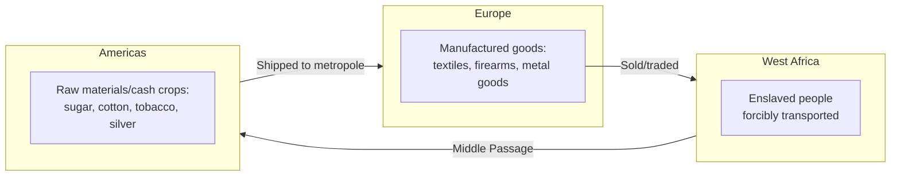

## Mercantilism and Colonial Trade Networks

### Defining Mercantilism

**Key Points**

- Mercantilism is the dominant economic doctrine of early modern Europe (roughly 16th to late 18th century), holding that a nation's wealth and power are measured primarily by its accumulated stock of precious metals (bullion) and that global trade is fundamentally a **zero-sum competition** among states
- Core mercantilist premise: a favorable **balance of trade** (exports exceeding imports) is the mechanism by which a nation accumulates bullion, since trade surpluses were settled in gold and silver under the prevailing specie-based monetary systems of the era
- Mercantilism is not a single codified theory but a family of related policies pursued with varying emphasis across England, France, Spain, Portugal, and the Dutch Republic, unified by the belief that state power and economic policy were inseparable — economic activity existed to serve national strategic strength, particularly naval and military capacity

This zero-sum, state-power-centric logic is frequently cited by contemporary geoeconomics scholars as the conceptual ancestor of today's economic statecraft, industrial policy, and strategic competition framing — the explicit linkage of trade policy to national power is a continuous thread from mercantilist doctrine through to 21st-century supply chain security discourse. [Inference] The degree of direct intellectual lineage versus independent convergent emergence is debated among historians and IR theorists, but the structural parallel (trade as an instrument of state power rather than pure welfare maximization) is widely drawn in the geoeconomics literature.

### Core Policy Instruments of Mercantilism

| Instrument | Function |
| --- | --- |
| **Tariffs and prohibitive duties** | Restrict imports of finished goods to protect domestic manufacturing and preserve bullion |
| **Navigation Acts** | Require trade with colonies to be carried on national-flag vessels, ensuring shipping industry and trade profits accrue to the home nation |
| **Chartered monopoly companies** | State-sanctioned exclusive trading rights granted to entities such as the English/British East India Company (1600) and the Dutch East India Company (VOC, 1602) |
| **Colonial exclusivity (pacte colonial)** | Colonies permitted to trade only with the parent state, ensuring raw material extraction flows to and finished goods flow from the metropole |
| **Export subsidies (bounties)** | Payments to domestic producers to encourage export of finished manufactured goods |
| **Bullion export prohibitions** | Legal restrictions on exporting gold and silver, reflecting the doctrine's direct equation of bullion with wealth |

### The Triangular and Colonial Trade Architecture

**Key Points**

- Colonial trade networks were structured to maximize the metropole's accumulation of bullion and manufacturing advantage, typically organized around extracting raw materials (sugar, tobacco, cotton, furs, precious metals) from colonies and exporting finished manufactured goods back to colonial markets, with colonies legally barred from developing competing manufacturing capacity or trading with rival powers
- The **Atlantic triangular trade** is the most extensively documented example: manufactured goods (textiles, firearms, metal goods) shipped from Europe to West Africa; enslaved people forcibly transported from West Africa to the Americas (the Middle Passage); and raw materials and cash crops (sugar, cotton, tobacco) shipped from the Americas back to Europe
- Spanish colonial policy centered on bullion extraction from Mexican and Peruvian silver mines (notably Potosí), with the **Casa de Contratación** (House of Trade, established 1503) enforcing a state monopoly over colonial trade and the **flota system** of convoyed treasure fleets protecting shipments from piracy
- Portuguese trade networks centered on the **Estado da Índia**, controlling spice trade routes around the Cape of Good Hope and establishing fortified trading posts (feitorias) rather than extensive territorial colonization in much of Asia

### Chartered Companies as Quasi-Sovereign Instruments

**Key Points**

- Chartered monopoly companies functioned as hybrid public-private instruments of state power, granted not only exclusive trading rights but often sovereign-like powers: the VOC could wage war, negotiate treaties, mint currency, and administer territory under its 1602 charter from the Dutch States-General
- The English East India Company evolved from a trading monopoly into a territorial ruling power in the Indian subcontinent following the 1757 Battle of Plassey, exercising direct governance (including tax collection and a private army) until the British Crown assumed direct control after the 1857 rebellion
- [Inference] These companies are frequently analyzed by economic historians as an early institutional template for the fusion of commercial and state power — a structural precedent occasionally invoked in contemporary discussions of state-linked enterprises (e.g., Chinese state-owned enterprises operating in strategic sectors abroad), though the direct comparability is contested given vastly different legal, military, and political contexts

### Mercantilism's Zero-Sum Logic vs. Later Trade Theory

**Key Points**

- Mercantilist doctrine held that global trade volume was essentially fixed, meaning one nation's export surplus necessarily corresponded to another's deficit — wealth was won at a rival's expense
- This premise was directly challenged by classical economists: Adam Smith's *Wealth of Nations* (1776) critiqued mercantilist bullion-hoarding as confusing money with wealth, arguing that trade based on **absolute advantage** in production could generate mutual gains; David Ricardo's theory of **comparative advantage** (1817) extended this into the framework underlying subsequent free-trade doctrine
- [Inference] The historical arc from mercantilism to classical free-trade theory to 20th-century multilateral trade liberalization (GATT/WTO) to the 21st-century re-emergence of security-driven, quasi-mercantilist industrial policy is often presented in the geoeconomics literature as a cyclical pattern rather than a linear progression — some scholars explicitly describe contemporary friend-shoring and industrial policy trends as "neo-mercantilist," though this characterization is contested by those who emphasize the distinct security rationale (versus pure bullion/wealth accumulation) driving current policy

### Colonial Trade Networks and Enduring Supply Chain Geography

**Key Points**

- Many contemporary global supply chain geographies retain structural imprints of colonial-era resource extraction patterns — the concentration of certain raw material production in former colonial territories (cobalt in the Democratic Republic of Congo, historically linked to Belgian colonial extraction infrastructure; cotton and textile production patterns in South Asia) is noted by economic historians as a partial legacy of infrastructure and trade relationships established under colonial administration
- [Inference] The degree to which contemporary supply chain vulnerabilities and critical mineral geography can be causally traced to specific colonial-era policy choices versus later 20th-century industrial and geological factors is a matter of ongoing scholarly debate, and should not be treated as a settled or fully quantified causal claim

### Comparative Snapshot: Mercantilist Powers

| Power | Primary Instrument | Key Institution | Core Commodity Focus |
| --- | --- | --- | --- |
| Spain | Bullion extraction, state trade monopoly | Casa de Contratación, flota system | Silver (Potosí), gold |
| Portugal | Fortified trading post network | Estado da Índia | Spices, later Brazilian sugar/gold |
| Dutch Republic | Chartered company with sovereign powers | VOC (East Indies), WIC (Atlantic) | Spices, textiles |
| England/Britain | Navigation Acts, colonial exclusivity, chartered monopoly | East India Company, Navigation Acts (1651 onward) | Textiles, tea, later Indian territorial revenue |
| France | Colonial exclusivity (pacte colonial), state-directed manufacturing (Colbertism) | Compagnie des Indes | Sugar (Caribbean), furs (North America) |

### Related Topics / Next Steps

- **Adam Smith, Ricardo, and the Classical Critique of Mercantilism**
- **The Navigation Acts and Anglo-Dutch Trade Rivalry**
- **Chartered Companies as Precedents for State-Linked Enterprise**
- **The Atlantic Slave Trade and Its Role in Colonial Supply Chains**
- **Bullion Flows, the Price Revolution, and Early Modern Monetary Economics**
- **From Colonial Extraction to Post-Colonial Trade Dependency Patterns**
- **"Neo-Mercantilism" Debates in Contemporary Industrial Policy**