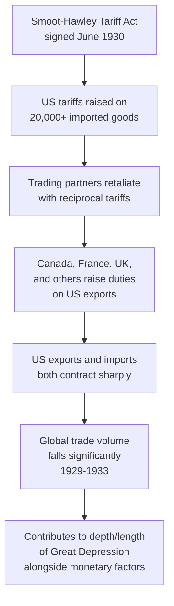

## The Smoot-Hawley Tariff and Interwar Protectionism as a Cautionary Precedent

### Legislative Origins and Provisions

**Key Points**

- The **Smoot-Hawley Tariff Act** (formally the United States Tariff Act of 1930), sponsored by Senator Reed Smoot and Representative Willis Hawley, was signed into law by President Herbert Hoover on June 17, 1930
- The Act raised US tariff rates on over 20,000 imported goods, pushing average tariff rates on dutiable imports to an estimated 45–50%, among the highest levels in US history [Unverified — precise average rate figures vary by source depending on methodology (dutiable imports only vs. all imports) and are frequently cited inconsistently across historical summaries, though the general magnitude of the increase is well documented]
- The legislation originated as a narrower proposal to raise agricultural tariffs to aid farmers suffering from falling commodity prices in the late 1920s, but expanded substantially during the congressional legislative process as industrial interests sought and secured protection for their own sectors — a frequently cited example of **legislative logrolling** in tariff policy

### The Economists' Warning

**Key Points**

- Over 1,000 American economists signed a public petition, organized and delivered to Congress and President Hoover in May 1930, urging rejection of the bill on the grounds that it would raise costs to consumers, harm export industries reliant on reciprocal trade, and invite retaliation from trading partners
- Henry Ford reportedly spent an evening personally lobbying Hoover against signing the bill, and J.P. Morgan chairman Thomas Lamont later described pleading with Hoover "almost with tears in my eyes" [Unverified — this specific anecdote is widely repeated in popular historical accounts of the period but its precise sourcing and verbatim accuracy are not independently confirmed here]
- Hoover signed the bill despite these objections, reportedly under pressure from his own party and business interests seeking sector-specific protection, a decision retrospectively treated in economic history as illustrative of how concentrated sectoral lobbying interests can override diffuse expert and public-welfare objections in trade legislation

### Mechanism of Harm: Retaliation and Trade Contraction

- At least 25 trading partner countries are documented to have retaliated with new or increased tariffs on US goods within roughly two years of Smoot-Hawley's enactment, with Canada (the largest US trading partner at the time), France, and several other European states among the prominent retaliators [Unverified — the precise count of retaliating countries and the exact sequencing of retaliatory measures varies across historical economic analyses]
- US imports fell from approximately $4.4 billion in 1929 to approximately $1.5 billion by 1933, and US exports fell from approximately $5.4 billion to approximately $1.7 billion over the same period, though the overwhelming majority of mainstream economic historians attribute this collapse primarily to the broader deflationary and monetary contraction of the Great Depression, with Smoot-Hawley acting as a contributing rather than primary cause [Unverified — precise dollar figures for period trade volumes vary modestly by source and by whether nominal or real terms are used]

### The Contested Causal Role in the Great Depression

**Key Points**

- A significant, longstanding debate exists among economic historians regarding the magnitude of Smoot-Hawley's causal contribution to the Great Depression's severity, as distinct from its role as a contributing factor
- The now-dominant view among most economic historians (reflected in the work of scholars such as Barry Eichengreen and Douglas Irwin) is that Smoot-Hawley was **not the primary cause** of the Great Depression, which is more commonly attributed to monetary policy failures, the gold standard's deflationary transmission mechanism, and banking system collapse — but that the tariff nonetheless meaningfully worsened the depth of the trade collapse and contributed to a broader breakdown in international economic cooperation
- [Inference] This distinction — "contributing factor that worsened an already-underway crisis" versus "primary cause" — is important because popular retellings and political rhetoric sometimes overstate Smoot-Hawley's causal centrality relative to the more nuanced consensus found in specialized economic history scholarship

### Interwar Protectionism as a Broader Pattern

**Key Points**

- Smoot-Hawley was not an isolated US policy but occurred within a broader interwar pattern of rising protectionism, competitive currency devaluations, and the fragmentation of the international gold standard system, as major economies sought unilateral responses to the deflationary crisis rather than coordinated multilateral solutions
- Imperial trading blocs emerged as a related interwar phenomenon: the British Commonwealth's **Ottawa Agreements** (1932) established **imperial preference**, a system of reduced tariffs among Commonwealth members combined with tariffs against non-Commonwealth trade, representing a shift toward regional/bloc-based trade organization in response to the breakdown of open multilateral trade
- This interwar collapse of trade cooperation into competing blocs and beggar-thy-neighbor tariff and currency policy is frequently cited in the geoeconomics literature as a historical precedent illustrating the risks of uncoordinated, retaliation-prone economic nationalism — a parallel explicitly drawn by IMF and WTO officials in contemporary warnings about 21st-century fragmentation trends

### Institutional Legacy: Post-War Multilateral Trade Architecture

**Key Points**

- The interwar protectionist experience directly informed the design of the post-World War II international economic order, particularly the **General Agreement on Tariffs and Trade (GATT)**, established in 1947, which embedded the **Most Favored Nation (MFN)** principle and progressive multilateral tariff reduction specifically to prevent recurrence of interwar-style unilateral tariff escalation and retaliatory spirals
- The US Congress's own institutional response came earlier, via the **Reciprocal Trade Agreements Act of 1934**, which delegated tariff-negotiation authority from Congress to the executive branch — a structural reform explicitly designed to reduce the susceptibility of trade policy to the kind of concentrated sectoral logrolling that produced Smoot-Hawley, by removing individual tariff line-items from direct congressional amendment
- [Inference] This institutional shift — delegating trade authority to the executive to insulate it from legislative logrolling — is frequently cited by trade policy scholars as one of the most durable lessons drawn from the Smoot-Hawley episode, and remains structurally relevant to understanding why contemporary US tariff actions (e.g., Section 301, Section 232) are typically executed via executive authority rather than standalone congressional tariff legislation

### Why Smoot-Hawley Functions as a Cautionary Precedent Today

**Key Points**

- In contemporary supply chain geopolitics discourse, Smoot-Hawley is most commonly invoked as a cautionary reference point in debates over the risk of **retaliatory escalation spirals** — the concern that unilateral tariff or trade-restrictive action, even if narrowly targeted or well-intentioned, can trigger reciprocal measures that produce net-negative outcomes for all parties
- The precedent is regularly cited (by the IMF, WTO officials, and financial press) in discussions of 21st-century tariff escalation, including the 2018–2019 US-China trade war and various national security-justified tariff actions, as a historical warning about the difficulty of controlling escalation dynamics once retaliatory tariff cycles begin
- [Inference] Contemporary commentators drawing this parallel generally acknowledge an important structural difference: Smoot-Hawley was a broad-based, largely protectionist tariff not tied to explicit national security or strategic-decoupling logic, whereas much contemporary tariff and export control activity is framed around specific security objectives (e.g., semiconductor export controls) — meaning the applicability of the Smoot-Hawley "retaliation spiral" caution to narrowly targeted security-driven measures, versus broad-based protectionism, is itself a matter of ongoing policy debate rather than a direct one-to-one analogy

### Related Topics / Next Steps

- **The Gold Standard's Deflationary Transmission Mechanism in the Great Depression**
- **The Reciprocal Trade Agreements Act of 1934 and Executive Trade Authority**
- **GATT's Founding Principles: MFN, National Treatment, and Tariff Binding**
- **Imperial Preference and the Ottawa Agreements**
- **Comparing Smoot-Hawley to the 2018-2019 US-China Trade War**
- **Retaliation Dynamics and Escalation Spirals in Modern Trade Disputes**
- **The WTO Dispute Settlement System as a Post-War Escalation Circuit-Breaker**