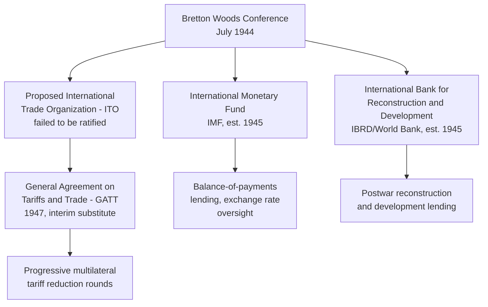

## Bretton Woods and the Postwar Liberal Trade Order

### Origins: Designing a System to Prevent Interwar Recurrence

**Key Points**

- The **Bretton Woods Conference** (formally the United Nations Monetary and Financial Conference) convened at the Mount Washington Hotel in Bretton Woods, New Hampshire, from July 1–22, 1944, bringing together delegates from 44 Allied nations to design the postwar international monetary and economic architecture
- The conference was explicitly designed as a corrective response to the interwar economic collapse — competitive currency devaluations, the breakdown of the gold standard, beggar-thy-neighbor tariff escalation (Smoot-Hawley and its retaliatory aftermath), and the absence of any institutional mechanism for international economic policy coordination
- The two dominant intellectual architects were **John Maynard Keynes** (leading the British delegation) and **Harry Dexter White** (leading the US delegation), whose competing proposals — Keynes's plan for a global reserve currency ("bancor") issued by an international clearing union versus White's more US-dollar-centric plan — were reconciled largely in favor of White's framework, reflecting the United States' dominant postwar economic and creditor position

### The Bretton Woods Monetary System

**Key Points**

- The system established a **fixed but adjustable exchange rate regime**: member currencies were pegged to the US dollar within narrow bands, and the US dollar itself was pegged to gold at a fixed rate of $35 per ounce, with the US Treasury committing to convert dollars to gold on demand for foreign monetary authorities
- This structure made the US dollar the de facto global reserve and reference currency, a role sometimes termed **"exorbitant privilege"** (a phrase later attributed to French Finance Minister Valéry Giscard d'Estaing in the 1960s), since the US could run external deficits financed in its own currency without the balance-of-payments discipline faced by other states
- The system permitted periodic exchange rate adjustments (devaluations or revaluations) under IMF oversight when a country faced "fundamental disequilibrium," distinguishing it from both the rigid pre-war gold standard and later purely floating exchange rate regimes

$$\text{Fixed Rate Constraint}: \quad \text{Currency}_i \leftrightarrow \text{USD} \leftrightarrow \text{Gold (\$35/oz)}$$

### Institutional Architecture: The Bretton Woods Twins

- The **International Monetary Fund (IMF)**, established at Bretton Woods and operational from 1945/1946, was designed to provide short-term balance-of-payments financing to member states facing currency pressure, and to oversee the fixed exchange rate system's stability
- The **International Bank for Reconstruction and Development (IBRD)**, the founding institution of what became the **World Bank Group**, was initially focused on financing European postwar reconstruction before its mandate expanded toward development lending in poorer nations
- A third institution, the **International Trade Organization (ITO)**, was negotiated as a comprehensive trade and employment charter (the Havana Charter, 1948) but failed to achieve US Senate ratification, leaving the **General Agreement on Tariffs and Trade (GATT)**, originally intended as a narrower interim tariff-reduction agreement signed in 1947, to serve as the de facto multilateral trade governance framework for nearly five decades until the WTO's creation

### GATT and the Architecture of Trade Liberalization

**Key Points**

- GATT's core organizing principles included **Most Favored Nation (MFN) treatment** (a tariff concession granted to one member must be extended to all members, absent a qualifying exception such as a free trade area), **national treatment** (imported goods, once past the border, must be treated no less favorably than domestically produced goods for internal taxation and regulation), and **reciprocity** (tariff reductions negotiated as mutual concessions rather than unilateral gestures)
- GATT operated through successive multilateral negotiating rounds, progressively lowering average tariff levels among participating economies — from the Geneva Round (1947) through the **Kennedy Round** (1964–1967), the **Tokyo Round** (1973–1979), and culminating in the **Uruguay Round** (1986–1994), which produced the agreement establishing the **World Trade Organization (WTO)** in 1995
- This gradualist, negotiated-reciprocity approach stands in explicit contrast to the interwar pattern of unilateral tariff escalation, and is generally credited by trade economists with the substantial expansion of global trade volume and average tariff reduction across the postwar decades, though the precise magnitude of GATT/WTO's causal contribution relative to technological change (containerization, falling transport costs) and other liberalizing factors is a subject of ongoing empirical debate among trade economists [Inference]

### The Collapse of the Fixed Exchange Rate Pillar

**Key Points**

- The monetary component of Bretton Woods came under sustained strain through the 1960s as US balance-of-payments deficits grew (driven partly by Vietnam War spending and domestic fiscal expansion), leading to a persistent gap between the volume of dollars held abroad and the US gold reserves nominally backing dollar convertibility — a tension analyzed in the mid-20th century as the **Triffin Dilemma**: the reserve-currency issuer must run persistent deficits to supply the world with reserve liquidity, but doing so undermines confidence in the currency's convertibility
- President Richard Nixon's August 15, 1971 announcement suspending the dollar's convertibility into gold — an event subsequently termed the **"Nixon Shock"** — effectively ended the gold-convertibility pillar of the system
- The **Smithsonian Agreement** (December 1971) attempted a managed realignment of exchange rates and a modest dollar devaluation to preserve a fixed-rate framework, but this arrangement proved unsustainable, and by March 1973 major currencies had transitioned to a system of **floating exchange rates**, formally ratified in the IMF's Second Amendment of the Articles of Agreement (1976, the **Jamaica Accords**)

### Distinguishing the Monetary and Trade Legacies

**Key Points**

- It is analytically important to distinguish the two components of the "Bretton Woods system": the **fixed exchange rate/gold-dollar monetary regime**, which formally collapsed by 1973, and the **liberal multilateral trade order** (GATT, and its institutional evolution into the WTO), which persisted and substantially deepened for decades after the monetary system's end
- The phrase "Bretton Woods institutions" is commonly used today to refer to the IMF and World Bank specifically, both of which continued operating (with evolved mandates — the IMF shifting from fixed-rate oversight toward broader crisis lending and surveillance, the World Bank shifting from European reconstruction toward global development finance) well beyond the end of the original fixed exchange rate arrangement
- [Inference] This distinction matters for supply chain geopolitics discourse because contemporary references to "the postwar liberal order" or "Bretton Woods order" typically invoke the trade-liberalization and multilateral-institution legacy broadly, rather than the specific fixed exchange rate mechanics, which is a common source of imprecision in political commentary on the topic

### Relevance to Contemporary Supply Chain Geopolitics

**Key Points**

- The postwar liberal trade order — GATT/WTO's MFN principle, progressive tariff liberalization, and the general presumption against unilateral trade restriction — constitutes the institutional and normative baseline against which contemporary fragmentation, friend-shoring, and industrial policy trends are typically measured and against which they represent a partial departure
- Contemporary economic statecraft instruments (Section 232 national security tariffs, Entity List export controls, industrial policy subsidies) frequently rely on **exceptions carved into the original GATT framework** itself — most notably GATT **Article XXI**, the national security exception, which permits members to deviate from MFN and other obligations for security reasons — meaning the current fragmentation trend operates substantially through invoking dormant flexibilities within the Bretton Woods-descended trade architecture rather than through wholesale abandonment of it
- [Inference] Some scholars characterize the current period as a stress test of whether the postwar multilateral trade system's exception mechanisms (designed to be narrow safety valves) can accommodate the scale of contemporary security-driven trade restriction without triggering the kind of broader institutional breakdown the system was originally designed to prevent — this remains a live and unresolved question rather than settled historical assessment, given the system's continued evolution

### Related Topics / Next Steps

- **The Triffin Dilemma and Reserve Currency Structural Tensions**
- **The Nixon Shock and the Transition to Floating Exchange Rates**
- **GATT's Evolution into the WTO: The Uruguay Round and Marrakesh Agreement**
- **GATT Article XXI and the National Security Exception in Contemporary Trade Policy**
- **The IMF's Evolving Mandate: From Exchange Rate Oversight to Crisis Lending**
- **Comparative Design: Keynes's Bancor Proposal vs. the Dollar-Centric System Adopted**
- **De-Dollarization Debates in the Context of Bretton Woods' Legacy**