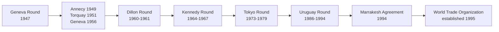

## GATT, the Uruguay Round, and the Founding of the WTO

### GATT's Institutional Character and Limitations

**Key Points**

- The **General Agreement on Tariffs and Trade (GATT)**, signed in 1947 as an interim measure after the failure of the more comprehensive International Trade Organization (ITO) to achieve ratification, functioned for nearly five decades as a provisional, treaty-based framework rather than a formal international organization with independent legal personality
- This provisional legal status had practical consequences: GATT lacked a robust, binding dispute settlement mechanism for most of its history, relying instead on a **diplomatic, consensus-based panel process** where a losing party could effectively block adoption of an unfavorable ruling — a structural weakness frequently cited as a key motivation for the WTO's later creation
- GATT's scope was also substantively limited: it primarily governed trade in **goods**, with only partial and increasingly inadequate coverage as the global economy's composition shifted toward **services**, **intellectual property**, and **agriculture** (the latter subject to extensive carve-outs and exemptions negotiated by major agricultural powers, particularly the US and the EU's predecessor institutions)

### The Sequence of GATT Negotiating Rounds

- Each successive round progressively expanded both the ambition and the scope of multilateral trade negotiation: early rounds (Geneva through Dillon) focused narrowly on **tariff-line-by-tariff-line reductions**; the **Kennedy Round** (1964–1967) introduced broader across-the-board percentage tariff cuts and began addressing non-tariff barriers, including early anti-dumping rules; the **Tokyo Round** (1973–1979) substantially expanded into non-tariff barriers through a series of plurilateral "codes" (covering subsidies, technical barriers to trade, customs valuation, and government procurement) that were not binding on all GATT members, creating a fragmented "GATT à la carte" structure

### The Uruguay Round: Scope and Ambition

**Key Points**

- The **Uruguay Round**, launched at Punta del Este, Uruguay in September 1986 and concluded in Marrakesh, Morocco in April 1994, was by far the most ambitious and lengthy GATT negotiating round, involving 123 participating countries and addressing a substantially broader agenda than any prior round
- Key substantive achievements included bringing **agriculture** into binding multilateral discipline for the first time in a meaningful way (via the Agreement on Agriculture, addressing market access, export subsidies, and domestic support); bringing **textiles and clothing** trade (previously governed by the restrictive quota-based Multi-Fibre Arrangement) into mainstream GATT discipline for phased liberalization; creating the **General Agreement on Trade in Services (GATS)**, extending multilateral trade discipline to services for the first time; and creating the **Agreement on Trade-Related Aspects of Intellectual Property Rights (TRIPS)**, establishing binding minimum standards for patent, copyright, and trademark protection across member states
- The round also produced the **Agreement on Subsidies and Countervailing Measures (SCM Agreement)**, creating more precise disciplines distinguishing prohibited subsidies (e.g., export subsidies, import-substitution subsidies) from actionable and non-actionable categories — a framework directly relevant to contemporary disputes over industrial policy subsidies such as those under the US CHIPS Act and IRA

### The Single Undertaking Principle

**Key Points**

- A defining structural innovation of the Uruguay Round was the **single undertaking** principle: unlike the Tokyo Round's fragmented plurilateral codes (which individual members could selectively join), the Uruguay Round's full package of agreements was negotiated as an indivisible whole — member states had to accept essentially the entire agreement package to join the resulting WTO, with very limited exceptions (a small number of plurilateral agreements, such as on government procurement, remained optional)
- [Inference] This "take it all or leave it" design is generally understood by trade policy scholars as a deliberate mechanism to prevent the kind of selective, fragmented adherence that had undermined the coherence of the Tokyo Round codes, though it also raised the negotiating stakes and contributed to the round's unusually long eight-year duration

### Establishing the World Trade Organization

**Key Points**

- The **Marrakesh Agreement Establishing the World Trade Organization**, signed April 15, 1994, created the WTO as a formal international organization with legal personality, headquartered in Geneva, which began operation on January 1, 1995
- The WTO absorbed and updated GATT (now technically "GATT 1994," distinguished from the original 1947 text) as one of several annexed agreements, alongside GATS, TRIPS, the Dispute Settlement Understanding (DSU), and the Trade Policy Review Mechanism
- Structurally, the WTO's creation resolved GATT's core institutional weaknesses: it provided a permanent organizational home (versus GATT's provisional legal status), a unified rulebook spanning goods, services, and intellectual property (versus GATT's goods-only, fragmented-code structure), and critically, a substantially strengthened dispute settlement system

### The Dispute Settlement Understanding: The WTO's Structural Innovation

**Key Points**

- The WTO's **Dispute Settlement Understanding (DSU)** replaced GATT's consensus-blockable panel process with a system of **"negative" or "reverse" consensus**: a panel ruling (and subsequent Appellate Body ruling, if appealed) is automatically adopted unless there is a consensus *against* adoption — meaning the losing party alone cannot block a ruling, a fundamental reversal of GATT's practical veto dynamic
- This created, for the first time in multilateral trade governance history, a quasi-judicial mechanism with binding authority (backed by the possibility of WTO-authorized retaliatory trade measures for non-compliance) — widely regarded by trade law scholars as the most significant institutional advance of the Uruguay Round
- [Inference] The relevance of this dispute settlement architecture to contemporary supply chain geopolitics is significant but complicated: the WTO's Appellate Body has been non-functional since December 2019 due to the US blocking new judge appointments (a dispute concerning perceived overreach in Appellate Body interpretations), meaning that as of the mid-2020s, WTO dispute rulings can be appealed "into the void," substantially weakening the binding enforcement mechanism that distinguished the WTO from GATT — a structural degradation directly relevant to the reduced multilateral constraint on contemporary unilateral tariff and export control actions

### GATT/WTO Principles Most Relevant to Supply Chain Geopolitics

| Principle | GATT/WTO Provision | Relevance to Contemporary Fragmentation |
| --- | --- | --- |
| Most Favored Nation | GATT Article I | Baseline non-discrimination norm that friend-shoring/bloc-based trade policy departs from |
| National Security Exception | GATT Article XXI | Legal basis invoked for Section 232 tariffs and similar security-justified trade restriction |
| General Exceptions | GATT Article XX | Covers exceptions for public morals, health, conservation — occasionally invoked alongside security rationales |
| Subsidies Discipline | SCM Agreement (Uruguay Round) | Framework against which contemporary industrial policy subsidies (CHIPS Act, IRA) are analyzed for WTO-consistency |
| Dispute Settlement | DSU (Uruguay Round) | Currently impaired due to non-functional Appellate Body since 2019 |

### The WTO's Subsequent Trajectory and Contemporary Strain

**Key Points**

- Since the Uruguay Round, efforts to conclude a comparably ambitious further round have largely stalled — the **Doha Development Round**, launched in 2001 with a particular focus on development-oriented issues and further agricultural liberalization, has not been concluded as a comprehensive package, with negotiations effectively deadlocked over agricultural market access and special/differential treatment for developing countries since the mid-2000s
- This multilateral negotiating stagnation is widely cited by trade scholars as a contributing factor in the proliferation of **preferential/regional trade agreements** (bilateral and plurilateral FTAs) since the early 2000s, as states pursued liberalization outside the stalled multilateral track
- [Inference] The combination of stalled multilateral rulemaking (no major new WTO agreement since 1994 covering emerging issues like digital trade or state-owned enterprise disciplines) and impaired dispute settlement (post-2019 Appellate Body paralysis) is frequently characterized in contemporary trade policy commentary as leaving the WTO increasingly unable to constrain or adjudicate the security-driven trade measures central to current supply chain fragmentation, though the organization continues to function for routine trade administration, transparency, and non-contentious dispute resolution

### Related Topics / Next Steps

- **The Non-Functional WTO Appellate Body and Its Implications for Trade Enforcement**
- **GATT Article XXI and the National Security Exception in Practice**
- **The SCM Agreement and Contemporary Industrial Policy Disputes**
- **TRIPS and Intellectual Property as a Supply Chain Geopolitics Flashpoint**
- **The Stalled Doha Round and the Rise of Preferential Trade Agreements**
- **China's 2001 WTO Accession and Its Long-Term Geopolitical Consequences**
- **Plurilateral Alternatives: The Information Technology Agreement and E-Commerce Negotiations**