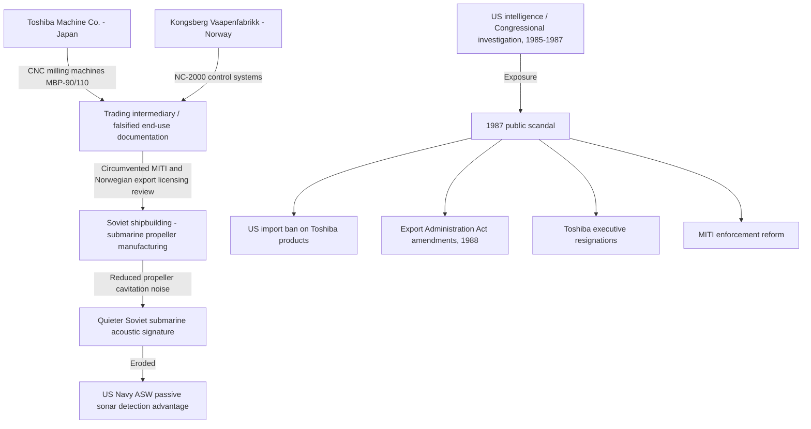

## Cold War Trade Controls, COCOM, and the Toshiba-Kongsberg Incident

### Overview

The Cold War trade control regime represented the first comprehensive, multilateral system for restricting strategic goods and technology transfer to a geopolitical adversary bloc. It established institutional and legal templates that persist in contemporary export control frameworks (e.g., the Wassenaar Arrangement, U.S. Export Administration Regulations, and current semiconductor controls on China). The Toshiba-Kongsberg incident of 1987 stands as the paradigmatic enforcement failure case study, illustrating the tension between commercial incentives, alliance management, and strategic denial objectives.

### Origins of Strategic Trade Control

**Key Points**

- Trade controls emerged from the recognition that dual-use technology (civilian and military applications) could strengthen adversary military-industrial capacity even absent direct arms sales.
- The U.S. Export Control Act of 1949 provided the domestic legal foundation, authorizing peacetime export restrictions for national security purposes for the first time.
- Allied coordination was necessary because unilateral U.S. controls could simply redirect Soviet bloc procurement to European or Japanese suppliers, a phenomenon later termed "leakage" or "foreign availability."

The core strategic logic followed a containment-adjacent doctrine: denying the USSR and its satellites access to Western technology would slow Soviet military modernization and preserve the West's qualitative military-technical edge, compensating for numerical disadvantages in conventional forces.

### COCOM: Structure and Mechanics

The Coordinating Committee for Multilateral Export Controls (COCOM) was established in 1949–1950, headquartered informally in Paris, with no formal treaty basis — it operated as a voluntary, informal international agreement among the United States, its NATO allies (excluding Iceland), and Japan (joined 1952) and Australia (joined later).

**Key Points**

- **Legal Status**: COCOM was not a treaty organization; it had no legal personality, no formal charter subject to ratification, and no enforcement mechanism binding on member states beyond mutual political commitment. This informality was deliberate, allowing flexibility but also creating persistent compliance gaps.
- **Control Lists**: COCOM maintained three primary lists:
  - **International Munitions List (IML)** — direct military hardware
  - **International Atomic Energy List (IAEL)** — nuclear-related materials and technology
  - **International List (IL)**, later the **Industrial List** — dual-use industrial and commercial goods, the largest and most contentious category
- **Decision Rule**: Unanimity was required for list changes and for exceptions, giving any single member effective veto power. This produced chronic negotiation gridlock, particularly as European members grew more commercially dependent on East-West trade through the 1970s détente period.
- **Exception Process**: Members could request case-by-case exceptions for specific transactions ("exceptions procedure"), which became a major channel of controlled leakage as commercial pressure mounted.

**Enforcement Weaknesses** [Inference: characterization synthesized from documented institutional design, not a single canonical source]

- COCOM had no independent inspectorate, no subpoena power, and no sanctions authority. Compliance monitoring depended entirely on national export licensing agencies (e.g., the U.S. Department of Commerce, Japan's Ministry of International Trade and Industry/MITI) and voluntary member self-reporting.
- This created a structural asymmetry: the U.S., as the most security-hawkish member, frequently pushed for stricter lists and enforcement, while European members and Japan — more commercially exposed to Eastern bloc markets — favored narrower lists and looser enforcement.

### The Toshiba-Kongsberg Incident (1983–1987)

**Background**

In the early 1980s, Toshiba Machine Co. (a subsidiary of Toshiba Corporation) and the Norwegian state-owned firm Kongsberg Vaapenfabrikk conspired to sell the Soviet Union advanced computer-numerically-controlled (CNC) milling machines, specifically large multi-axis milling equipment capable of machining precision propeller shapes.

**Technical Substance of the Violation**

The controlled technology consisted of:

- **Toshiba's MBP-110 and MBP-90 nine-axis CNC milling machines**, capable of simultaneously controlling multiple cutting axes to produce complex, large-scale curved surfaces with high precision.
- **Kongsberg's NC-2000 computer control systems**, the software/control component that directed the milling machines' cutting paths.

This combination allowed the Soviet navy to machine submarine propellers with far smoother, more precisely contoured blades than previously achievable with Soviet domestic manufacturing capability.

**Strategic Consequence** [Inference: causal magnitude attributed by U.S. defense assessments of the period; precise quantitative impact is disputed among analysts]

Submarine propeller noise is a primary detection vector for anti-submarine warfare (ASW), particularly through passive sonar. Cavitation and blade-passage noise scale with manufacturing precision — poorly machined blades create turbulence and cavitation at lower speeds, generating detectable acoustic signatures. U.S. and allied intelligence assessed that the improved propeller manufacturing capability significantly quieted Soviet submarines (particularly Akula-class and later Soviet nuclear submarines), narrowing the acoustic detection advantage the U.S. Navy had relied upon since the 1960s.

**Discovery and Exposure**

- The transactions occurred 1982–1984, routed through a Norwegian intermediary and structured to obscure the ultimate end-user and end-use from export licensing review.
- A Norwegian engineer, Hitoshi Kobayashi Berg (details of internal whistleblowing vary across accounts) [Unverified: specific whistleblower narrative differs across secondary sources], and later Congressional and intelligence investigation, surfaced the sale.
- The scandal became public in 1987, triggering a major diplomatic and political crisis between the United States and Japan.

**Political and Economic Fallout**

**Key Points**

- The incident occurred amid pre-existing U.S.-Japan trade friction (semiconductor dumping disputes, automotive trade imbalances), amplifying its political salience.
- U.S. Congress reacted with high symbolic intensity: members of Congress publicly destroyed a Toshiba boombox with sledgehammers on the Capitol lawn in a televised protest.
- The U.S. imposed a **two-to-five-year ban** on Toshiba Corporation and Toshiba Machine imports into the United States (the exact scope was narrowed through negotiation), alongside broader legislative action.
- The **Export Administration Act amendments of 1988** significantly tightened U.S. extraterritorial enforcement authority and increased penalties for violations by foreign subsidiaries of controlled technology.
- Japan implemented internal reforms to MITI's export licensing enforcement and increased its own penalties for violations, partly to preserve the broader U.S.-Japan alliance relationship and avoid harsher unilateral U.S. sanctions.
- Toshiba's chairman and president resigned in a formal accountability gesture consistent with Japanese corporate governance norms of the period.

### Structural Lessons and the COCOM Decline

**Key Points**

- The incident exposed COCOM's core vulnerability: multilateral control lists mean nothing without robust *national* enforcement, and enforcement incentives vary with each member's commercial exposure.
- It demonstrated that dual-use industrial equipment (a milling machine, ostensibly a manufacturing tool) could carry as much strategic weight as direct weapons transfers — a lesson directly informing later dual-use control frameworks.
- Extraterritorial reach became a defining feature of post-1987 U.S. export control policy: penalizing the parent corporation for subsidiary conduct, and asserting jurisdiction over foreign-flagged transactions involving U.S.-origin technology or components (the conceptual ancestor of the modern **Foreign Direct Product Rule** used in U.S. semiconductor export controls today).
- COCOM itself entered terminal decline with the end of the Cold War, formally dissolving in **1994**, superseded in 1996 by the **Wassenaar Arrangement**, a looser, non-binding successor with an even weaker enforcement mandate (explicitly excluding any single-adversary targeting, since the Soviet bloc no longer existed as an organizing rationale).

### Comparative Framework: COCOM vs. Contemporary Export Controls

| Dimension | COCOM (1949–1994) | Contemporary U.S. Controls (post-2018) |
| --- | --- | --- |
| Legal basis | Informal multilateral agreement | Formal statutory authority (ECRA 2018, IEEPA) |
| Target | Single bloc (USSR/Warsaw Pact + China) | Primarily China, Russia (post-2022), entity-specific |
| Decision rule | Unanimity among ~17 members | Unilateral U.S. action, allied "plurilateral" alignment sought after |
| Extraterritorial reach | Limited, politically negotiated | Formalized Foreign Direct Product Rule |
| Enforcement | National self-policing, no penalties from COCOM itself | Bureau of Industry and Security (BIS) civil/criminal penalties, denial orders |

### Process Flow: How the Violation Occurred

### Illustrative Diagram: COCOM Institutional Structure

<svg xmlns="http://www.w3.org/2000/svg" viewBox="0 0 780 460">
<text x="390" y="28" font-family="sans-serif" font-size="18" font-weight="bold" text-anchor="middle" fill="#1a1a1a">COCOM Institutional Structure (svg_diagram)</text>
<rect x="290" y="50" width="200" height="50" rx="6" fill="#2c5f8a" />
<text x="390" y="80" font-family="sans-serif" font-size="14" fill="#ffffff" text-anchor="middle">COCOM (Paris, informal)</text>
<line x1="390" y1="100" x2="150" y2="160" stroke="#666" stroke-width="1.5" />
<line x1="390" y1="100" x2="390" y2="160" stroke="#666" stroke-width="1.5" />
<line x1="390" y1="100" x2="630" y2="160" stroke="#666" stroke-width="1.5" />
<rect x="60" y="160" width="180" height="45" rx="6" fill="#4a7fa8" />
<text x="150" y="188" font-family="sans-serif" font-size="12" fill="#ffffff" text-anchor="middle">International Munitions List (IML)</text>
<rect x="300" y="160" width="180" height="45" rx="6" fill="#4a7fa8" />
<text x="390" y="182" font-family="sans-serif" font-size="12" fill="#ffffff" text-anchor="middle">International Atomic</text>
<text x="390" y="197" font-family="sans-serif" font-size="12" fill="#ffffff" text-anchor="middle">Energy List (IAEL)</text>
<rect x="540" y="160" width="180" height="45" rx="6" fill="#4a7fa8" />
<text x="630" y="182" font-family="sans-serif" font-size="12" fill="#ffffff" text-anchor="middle">Industrial List (IL)</text>
<text x="630" y="197" font-family="sans-serif" font-size="12" fill="#ffffff" text-anchor="middle">— dual-use goods</text>
<line x1="390" y1="100" x2="390" y2="240" stroke="#999" stroke-width="1" stroke-dasharray="4,3" />
<text x="410" y="235" font-family="sans-serif" font-size="11" fill="#555">unanimity required</text>
<rect x="290" y="245" width="200" height="45" rx="6" fill="#8a4a4a" />
<text x="390" y="273" font-family="sans-serif" font-size="12" fill="#ffffff" text-anchor="middle">Member National Agencies</text>
<line x1="150" y1="290" x2="150" y2="330" stroke="#666" stroke-width="1.5" />
<line x1="390" y1="290" x2="390" y2="330" stroke="#666" stroke-width="1.5" />
<line x1="630" y1="290" x2="630" y2="330" stroke="#666" stroke-width="1.5" />
<line x1="150" y1="290" x2="630" y2="290" stroke="#666" stroke-width="1.5" />
<rect x="60" y="330" width="180" height="50" rx="6" fill="#5a8a5a" />
<text x="150" y="352" font-family="sans-serif" font-size="12" fill="#ffffff" text-anchor="middle">US Dept. of Commerce</text>
<text x="150" y="368" font-family="sans-serif" font-size="11" fill="#ffffff" text-anchor="middle">(strict enforcement)</text>
<rect x="300" y="330" width="180" height="50" rx="6" fill="#a08a4a" />
<text x="390" y="352" font-family="sans-serif" font-size="12" fill="#ffffff" text-anchor="middle">Japan MITI</text>
<text x="390" y="368" font-family="sans-serif" font-size="11" fill="#ffffff" text-anchor="middle">(pre-1987, lax licensing)</text>
<rect x="540" y="330" width="180" height="50" rx="6" fill="#a08a4a" />
<text x="630" y="352" font-family="sans-serif" font-size="12" fill="#ffffff" text-anchor="middle">Norway licensing body</text>
<text x="630" y="368" font-family="sans-serif" font-size="11" fill="#ffffff" text-anchor="middle">(pre-1987, lax licensing)</text>

<text x="390" y="420" font-family="sans-serif" font-size="12" fill="#333" text-anchor="middle">No supranational enforcement body — compliance depends entirely on national agency rigor,</text>

<text x="390" y="438" font-family="sans-serif" font-size="12" fill="#333" text-anchor="middle">creating the exploitable gap the Toshiba-Kongsberg transaction passed through.</text>

</svg>

### Worked Example: Applying the Detection-Signature Logic

A simplified relationship illustrating why manufacturing precision matters for acoustic detection: propeller-induced noise power roughly scales with surface irregularity and rotational speed. A common simplified proxy relationship used in ASW literature is:

$$N \propto k \cdot \sigma^{2} \cdot v^{n}$$

where $N$ is radiated noise power, $\sigma$ represents blade surface irregularity (a function of machining precision), $v$ is propeller rotational velocity, $k$ is a hull/design-dependent constant, and $n$ is an empirically derived exponent (commonly cited in the $3$–$6$ range depending on cavitation regime) [Inference: illustrative simplified model, not a precise engineering formula — actual acoustic signature modeling involves complex fluid dynamics, cavitation inception thresholds, and hull-specific factors].

Reducing $\sigma$ through higher-precision nine-axis CNC milling — the direct effect of the Toshiba/Kongsberg equipment — lowers $N$ for a given speed $v$, meaning the submarine can travel faster before crossing into a detectable noise threshold. This is the mechanistic basis for why a manufacturing-tool transfer, not a weapons transfer, was assessed as strategically significant.

### Conclusion

**Conclusion**

The Cold War trade control regime, embodied in COCOM, demonstrated both the necessity and the fragility of multilateral technology denial strategies. Its unanimity rule and lack of independent enforcement made it structurally dependent on member-state political will, a dependency exposed catastrophically by the Toshiba-Kongsberg incident. That case reshaped export control doctrine by establishing that (1) dual-use manufacturing equipment can carry strategic weight equivalent to weapons systems, (2) extraterritorial enforcement against parent corporations is necessary to close subsidiary-level compliance gaps, and (3) alliance-level trade control cooperation requires continuously renegotiated enforcement credibility, not just agreed-upon lists. These lessons directly inform the architecture of 21st-century semiconductor and advanced-technology export controls.

**Related Topics**

- Wassenaar Arrangement and the post-Cold War export control gap (1994–present)
- U.S. Export Administration Act and the Export Control Reform Act of 2018
- Foreign Direct Product Rule and its application to semiconductor supply chains (2020–present)
- CoCom's China differential: the "China differential" list and Tiananmen-era sanctions
- Submarine acoustic signature reduction and anti-submarine warfare technology races
- Entity List mechanics and denial orders under contemporary BIS enforcement
- Dual-use technology classification frameworks (ECCN system)
- Case comparison: ASML/EUV lithography export restrictions to China (2019–present)