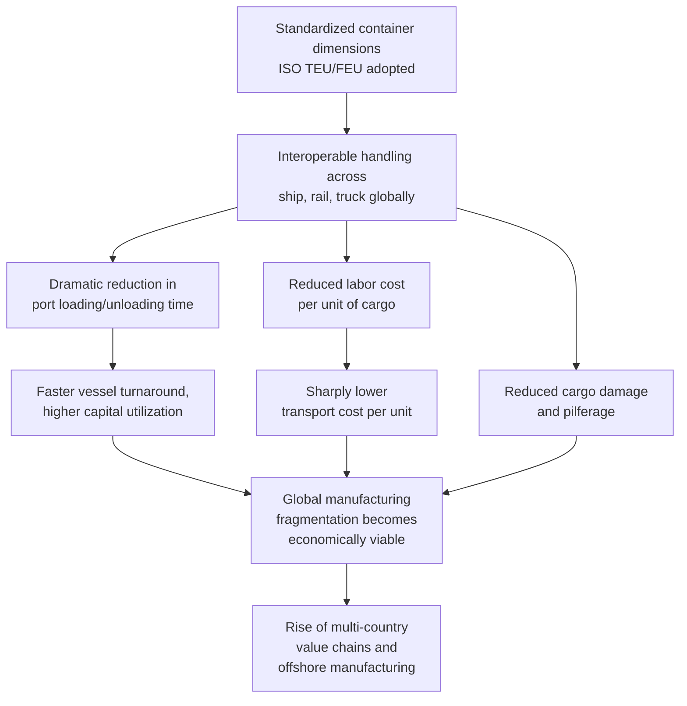

## The Container Revolution and the Rise of Just-in-Time Logistics

### Pre-Containerization Break-Bulk Shipping

**Key Points**

- Prior to standardized containerization, ocean freight was handled predominantly through **break-bulk cargo** methods: individual crates, sacks, barrels, and irregularly shaped items were loaded and unloaded piece by piece by longshoremen, a labor-intensive process requiring extended port dwell times
- This break-bulk system imposed substantial structural costs on international trade: high labor costs for loading/unloading, significant cargo damage and theft rates (pilferage from open break-bulk cargo was a chronic and costly problem), and slow port turnaround times that kept vessels — the most capital-intensive asset in the shipping chain — idle rather than earning revenue at sea
- [Inference] These structural costs are generally understood by economic historians as a major factor limiting the depth of global manufacturing trade integration prior to containerization, since transport cost and time uncertainty made geographically dispersed, precisely coordinated production networks economically impractical

### Malcom McLean and the Origins of Containerization

**Key Points**

- The standardized shipping container is most closely associated with American trucking entrepreneur **Malcom McLean**, who pursued the concept of transferring entire truck trailers (and later, standardized detachable containers) directly onto ships without unpacking, eliminating the break-bulk handling step entirely
- McLean's converted tanker vessel, the **Ideal-X**, completed the first commercially significant container shipment in April 1956, sailing from Newark, New Jersey to Houston, Texas carrying 58 containers
- The subsequent standardization of container dimensions — codified through **ISO standard container sizes** (most prominently the 20-foot and 40-foot **TEU/FEU** — twenty-foot equivalent unit / forty-foot equivalent unit — standard) during the 1960s and 1970s, was critical to realizing containerization's full efficiency potential, since standardized dimensions enabled interoperability across ships, trucks, rail cars, ports, and cranes globally regardless of carrier or country of origin

### Mechanism: How Containerization Restructured Trade Economics

- Containerization's core economic effect was a dramatic reduction in the **transaction cost of distance** — by cutting port handling time, labor cost per unit of cargo, and cargo loss/damage rates, it lowered the effective cost of shipping a good across oceans by a substantial margin, though precise historical percentage estimates of the shipping cost reduction attributable specifically to containerization (as distinct from broader 20th-century transport and communication technology improvements) vary across economic history studies [Unverified — figures commonly cited in popular accounts, such as claims that containerization reduced shipping costs by 90% or more, should be treated as directionally indicative rather than precisely established, given methodological difficulty isolating containerization's specific contribution from concurrent trends like larger vessel sizes and improved port infrastructure]
- Economic historian Marc Levinson's influential account (*The Box*, 2006) is widely cited in trade and logistics literature as establishing containerization's role in enabling the geographic fragmentation of manufacturing — the shift from vertically integrated, single-location production toward globally dispersed **value chains**, where components are manufactured in different countries and assembled elsewhere, became economically rational only once transport cost and time reliability improved sufficiently to make multi-country coordination viable

### The Rise of Just-in-Time (JIT) Manufacturing Logistics

**Key Points**

- **Just-in-time (JIT)** manufacturing philosophy originated in Japanese industrial practice, most closely associated with the **Toyota Production System (TPS)**, developed principally by Taiichi Ohno at Toyota from the 1950s through the 1970s, emphasizing minimal inventory holding, production synchronized precisely to downstream demand, and the elimination of waste (muda) in all forms including excess inventory
- JIT's core principle — components and materials arrive precisely when needed in the production process rather than being stockpiled in advance — required a supporting logistics infrastructure capable of reliable, predictable, and frequent delivery; containerized shipping, combined with advances in trucking logistics and later computerized inventory and demand-forecasting systems, provided that infrastructure at increasing geographic scale
- JIT principles diffused globally from Japanese manufacturing (particularly automotive) into Western manufacturing practice substantially during the 1980s, as US and European automakers studied and adopted elements of Toyota's production system in response to competitive pressure from Japanese manufacturers' quality and cost advantages
- The container revolution and JIT diffusion are best understood as **mutually reinforcing rather than strictly sequential** developments: containerization provided the reliable, low-cost, globally scalable transport infrastructure that made extending JIT principles across international (rather than purely domestic/regional) supply chains economically viable, while growing JIT adoption in turn increased demand for the predictable, frequent, standardized shipping containerization offered

### Convergence: Containerization Enables Global JIT and "Lean" Supply Chains

**Key Points**

- The combination of containerized shipping and JIT inventory philosophy, layered atop late-20th-century advances in telecommunications, computerized logistics tracking, and later the internet and enterprise resource planning (ERP) systems, enabled the emergence of globally extended **lean supply chains** — production networks minimizing inventory buffers at every stage, from raw material through component manufacture to final assembly, coordinated across multiple countries and time zones
- This globally extended, minimal-buffer model became the dominant paradigm for manufacturing supply chain design across most industries from roughly the 1990s through the late 2010s, prized for its cost efficiency (minimizing capital tied up in idle inventory) but increasingly recognized — particularly following the COVID-19 pandemic's supply disruptions — as carrying limited resilience to unexpected shocks, since minimal buffers leave little slack to absorb disruption at any single node in a long, geographically dispersed chain
- [Inference] This tension — between JIT/lean efficiency and supply chain resilience — is directly continuous with the "why supply chains became a national security concern" and "just-in-time vs. just-in-case" themes central to contemporary supply chain geopolitics discourse, positioning the container revolution and JIT diffusion as the foundational infrastructure and philosophy whose efficiency-maximizing logic is now being partially reassessed and rebalanced against resilience considerations in the current fragmentation era

### Quantitative Scale of Containerized Trade Growth

**Key Points**

- Global containerized trade volume, measured in TEUs handled by world ports, grew from a negligible base in the 1960s to become the dominant mode for manufactured goods trade by the early 21st century, with major container ports (Shanghai, Singapore, Shenzhen, Ningbo-Zhoushan, and others) each handling tens of millions of TEUs annually in the 2020s [Unverified — precise current-year TEU throughput rankings and figures fluctuate year to year and are best verified against current port authority or UNCTAD reporting rather than treated as fixed figures]
- [Inference] The scale and speed of this growth is generally cited by trade economists as one of the most significant infrastructure-driven contributors to the broader post-1980s wave of economic globalization, alongside trade liberalization (GATT/WTO rounds) and telecommunications/internet advances — though disentangling the precise relative contribution of each factor to aggregate trade growth remains a subject of ongoing empirical research rather than settled consensus

### Related Topics / Next Steps

- **Toyota Production System and the Diffusion of Lean Manufacturing**
- **Marc Levinson's "The Box" and the Economic History of Containerization**
- **Port Infrastructure and Chokepoints: Suez, Panama, and Major Container Hubs**
- **From Just-in-Time to Just-in-Case: The Post-COVID Inventory Philosophy Shift**
- **Global Value Chains and the Fragmentation of Manufacturing Production**
- **Vessel Gigantism: Ultra-Large Container Ships and Chokepoint Vulnerability**
- **ERP Systems and the Digitalization of Global Supply Chain Coordination**