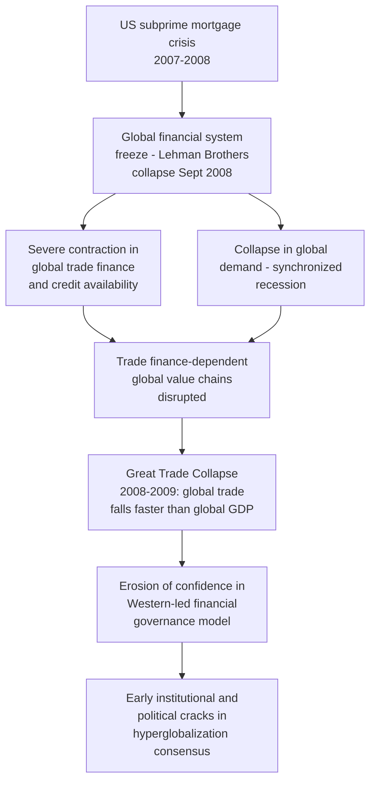

## The 2008 Financial Crisis and Early Cracks in Hyperglobalization

### Defining "Hyperglobalization"

**Key Points**

- **Hyperglobalization** is a term used in trade economics (notably by economist Dani Rodrik) to describe the unusually rapid and deep acceleration of global economic integration — measured by world trade-to-GDP ratios, cross-border capital flows, and global value chain complexity — that occurred roughly from the early 1990s through 2008, substantially outpacing the rate of integration seen in earlier globalization eras (including the pre-World War I "first globalization" of the late 19th century)
- Drivers of this period included the post-Cold War expansion of market economies into former Soviet bloc states, China's WTO accession (2001) and associated offshoring boom, the maturation of containerized shipping and just-in-time logistics infrastructure, the completion of the Uruguay Round and WTO's founding (1995), and rapid advances in telecommunications and information technology enabling more complex, geographically dispersed value chain coordination
- World trade as a share of global GDP rose substantially over this period, reaching a historical peak around 2008 before the crisis interrupted the trend [Unverified — precise trade-to-GDP ratio figures and peak-year determination vary modestly depending on data source (World Bank, WTO, UNCTAD) and methodology, though the general pattern of a pre-2008 peak followed by plateau is consistently documented across sources]

### The Crisis Mechanism and Its Trade Transmission

- The 2008 crisis transmitted to global trade through two principal channels: a collapse in aggregate demand across major economies (a synchronized global recession reducing import demand broadly) and a severe contraction in **trade finance** — the letters of credit, export credit insurance, and short-term financing instruments that underpin the large majority of cross-border commercial transactions — as banks facing their own balance sheet stress sharply curtailed lending
- The resulting **"Great Trade Collapse"** of late 2008 through 2009 saw global trade volumes fall considerably faster, proportionally, than global GDP itself — a pattern widely noted in the trade economics literature as reflecting the amplifying effect of globally fragmented, multi-country value chains, where a single final good may cross international borders multiple times during production, meaning a given reduction in final demand translates into a disproportionately larger reduction in measured cross-border trade volume [Inference] This "trade collapses faster than GDP" phenomenon during the crisis is treated in the literature as informative evidence of how deeply value chains had fragmented across borders by 2008, since more fragmented chains mechanically amplify the trade-to-GDP transmission of any given demand shock

### Why 2008 Is Treated as an Inflection Point Rather Than Simply a Recession

**Key Points**

- Unlike prior post-war recessions, from which global trade-to-GDP ratios had typically recovered and resumed their prior growth trajectory, the trade-to-GDP ratio following the 2008–2009 crisis did **not** return to its pre-crisis growth trend, instead plateauing at a roughly stable or only slowly growing level through the 2010s — a pattern subsequently termed **"slowbalization"** by trade economists and popularized in *The Economist*'s coverage around 2019
- [Inference] Economists differ on how much of this plateau reflects a genuine structural shift (a "natural maturation" of global value chains, where the easiest and most profitable opportunities for further fragmentation had already been exploited by 2008) versus a durable erosion of confidence and appetite for further integration attributable to the crisis's political and institutional aftershocks — this remains a debated point rather than a settled empirical conclusion, and both factors are generally treated as contributing rather than mutually exclusive explanations

### Erosion of Confidence in Western-Led Economic Governance

**Key Points**

- The crisis's origin in the US and European financial systems — economies whose regulatory and governance models had been widely promoted (including through the "Washington Consensus" policy framework advanced by the IMF and World Bank in prior decades) as templates for other economies to emulate — is frequently cited by geoeconomics and IR scholars as producing a significant, durable erosion of confidence in Western-led economic governance among emerging and developing economies
- This erosion of confidence is commonly cited as a contributing factor (among several) in the subsequent increased interest among emerging economies, particularly China, in developing alternative or parallel international financial institutions and arrangements — including the 2009 elevation of the **G20** (rather than the previously dominant G7/G8) as the primary forum for coordinating global economic crisis response, and later developments such as the 2014 establishment of the **BRICS New Development Bank** and the 2015 establishment of the **Asian Infrastructure Investment Bank (AIIB)**
- [Inference] The precise causal weight of 2008-crisis-driven confidence erosion, relative to other contemporaneous factors (China's growing economic weight and corresponding desire for institutional influence commensurate with that weight, longstanding developing-country criticism of IMF/World Bank governance structures predating 2008), in explaining the subsequent rise of parallel institutions is a matter of ongoing scholarly interpretation rather than a single precisely quantified causal claim

### Early Political and Policy Cracks

**Key Points**

- The crisis coincided with and is widely credited as a contributing factor to a broader political backlash against economic globalization in advanced economies, as job losses, housing market collapse, and subsequent austerity policies in several European economies fueled political movements skeptical of continued economic integration and open trade
- The **G20's 2009 pledge to avoid protectionist measures** in response to the crisis is frequently cited as reflecting policymakers' explicit awareness of the Smoot-Hawley/interwar precedent and a deliberate effort to prevent the crisis from triggering a comparable retaliatory tariff spiral — a effort generally regarded by trade economists as substantially, though not perfectly, successful, since overt across-the-board tariff escalation was largely avoided in the immediate crisis aftermath even as more targeted protectionist measures (anti-dumping actions, "buy national" provisions in stimulus packages) increased
- [Inference] While large-scale Smoot-Hawley-style protectionism was avoided, the crisis period is nonetheless treated by many trade and political economy scholars as having planted or accelerated several seeds that bore fruit in the subsequent decade: increased political skepticism toward globalization's distributional consequences, growing interest among emerging economies in institutional alternatives to Western-led governance, and a general questioning of the hyperglobalization-era assumption that ever-deeper economic integration was both inevitable and unambiguously beneficial — themes that would become more explicitly load-bearing in the post-2018 trade war and post-2020 pandemic phases of supply chain geopolitics

### 2008 as Precursor Rather Than Sole Cause

**Key Points**

- It is analytically important not to overstate 2008's direct causal role in the specific security-driven supply chain fragmentation that characterizes the 2018–present period — the crisis is best understood as having eroded confidence and plateaued the trade-to-GDP growth trend, creating a less dynamically expanding baseline of integration, rather than as directly causing the subsequent tariff wars, export control escalation, or industrial policy revival, which are more proximately attributable to the later 2018 US-China trade war, 2020 COVID-19 disruption, and 2022 Russia-Ukraine war
- [Inference] The relationship between 2008 and the current fragmentation era is most accurately characterized as **preconditioning rather than direct causation**: 2008 weakened the political, institutional, and economic momentum sustaining hyperglobalization's continued deepening, making the global trade system more susceptible to the subsequent, more directly causal shocks of 2018–2022, a framing consistent with treating 2008 as the first entry in the broader chronology of drivers underlying contemporary multipolar economic fragmentation

### Related Topics / Next Steps

- **The Great Trade Collapse: Empirical Patterns in the 2008-2009 Trade Contraction**
- **"Slowbalization": Measuring the Post-2008 Trade-to-GDP Plateau**
- **The Washington Consensus and Its Post-2008 Reassessment**
- **The Rise of the G20 and Parallel Institutions (NDB, AIIB) as Governance Alternatives**
- **Trade Finance Mechanics and Its Role in Global Value Chain Vulnerability**
- **Dani Rodrik's "Globalization Paradox" and the Hyperglobalization Framework**
- **From 2008 to 2018: Tracing the Chronology of Fragmentation Drivers**