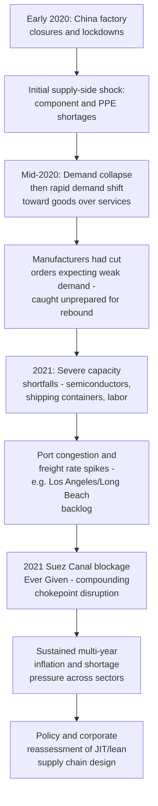

## COVID-19 as a Supply Chain Inflection Point

### From Localized Shock to Global Cascade

**Key Points**

- The COVID-19 pandemic, emerging in late 2019 and escalating into a global crisis through the first half of 2020, is widely treated in supply chain geopolitics literature as the single most consequential real-world stress test of the globally extended, just-in-time, minimal-buffer manufacturing model that had matured over the preceding three decades
- Unlike prior localized disruptions (a single factory fire, a regional natural disaster), COVID-19 was distinctive in producing **simultaneous, multi-nodal disruption** across nearly every stage of global supply chains at once — factory closures, port congestion, labor shortages, demand volatility, and transportation bottlenecks occurred concurrently across multiple countries and industries rather than being confined to a single point of failure that redundancy elsewhere could absorb
- [Inference] This simultaneity is central to why COVID-19 functioned as a conceptual inflection point rather than merely a large-scale disruption: it revealed that minimal-buffer JIT systems, designed on the assumption that disruptions are typically localized and temporary, had limited structural capacity to absorb correlated, global-scale, multi-month shocks

### Chronological Phases of Pandemic Supply Chain Disruption

- An important and somewhat counterintuitive dynamic: the initial 2020 shock led many manufacturers to **cut orders and production capacity commitments** in anticipation of a prolonged demand collapse, but consumer demand for physical goods (as opposed to services, which remained constrained by pandemic restrictions) rebounded far more quickly and strongly than anticipated, particularly for electronics, home goods, and vehicles — leaving supply chains caught underprepared for a demand surge they had structured themselves to avoid, a mismatch widely cited as a key driver of the severe 2021 shortage and inflation dynamics

### Case Study: The Global Semiconductor Shortage

**Key Points**

- The 2020–2022 global semiconductor shortage is among the most consequential and frequently cited case studies in COVID-era supply chain disruption, arising from a combination of automotive manufacturers cutting chip orders early in the pandemic (anticipating reduced vehicle demand), consumer electronics demand simultaneously surging (remote work and increased home electronics purchases), and semiconductor fabrication capacity being highly concentrated and difficult to rapidly reallocate between automotive-grade and consumer-grade chip production
- The shortage forced extended production halts and reduced output across the global automotive industry through 2021–2022, and is widely credited in policy retrospectives as the most direct and immediate catalyst for the semiconductor-focused industrial policy response that followed, including the US CHIPS and Science Act (2022) and the EU Chips Act (2023), both explicitly citing supply chain resilience and reduced dependency on concentrated foreign (particularly Taiwan-based) fabrication capacity as core justifications

### Case Study: The Ever Given and the Suez Canal Blockage

**Key Points**

- The container ship **Ever Given** ran aground in the Suez Canal in March 2021, blocking the waterway for approximately six days and disrupting an estimated significant volume of global trade transiting one of the world's most critical shipping chokepoints, with knock-on congestion effects at major ports persisting for weeks afterward [Unverified — precise dollar-value estimates of trade disrupted per day during the blockage vary across contemporaneous reporting and should be treated as rough orders of magnitude]
- While not itself caused by the pandemic, the Ever Given incident occurred amid already severely strained pandemic-era shipping capacity and port congestion, and is frequently cited alongside COVID-19 disruption as jointly illustrating the acute vulnerability created by concentrating global maritime trade through a small number of geographic chokepoints (Suez, Panama, the Strait of Malacca, the Strait of Hormuz)

### PPE and Pharmaceutical Supply Concentration

**Key Points**

- Early pandemic shortages of **personal protective equipment (PPE)** — masks, gloves, gowns — exposed that a large share of global PPE manufacturing capacity was concentrated in a small number of countries, principally China, creating acute shortages in the US, EU, and elsewhere precisely when domestic demand for such equipment spiked simultaneously with the exporting country's own domestic pandemic response needs
- This episode is widely cited in health security and supply chain policy literature as extending the "concentration risk" framework beyond high-technology goods (semiconductors) to basic manufactured medical goods and pharmaceutical active ingredients (APIs), broadening the political and policy coalition supportive of supply chain diversification and domestic/allied reshoring initiatives beyond purely technology-focused constituencies

### Shift in Corporate and Policy Philosophy: JIT to JIC

**Key Points**

- The pandemic experience is widely credited with substantially accelerating corporate and policy interest in shifting supply chain design philosophy from pure **just-in-time (JIT)** efficiency optimization toward **just-in-case (JIC)** resilience — deliberately holding larger inventory buffers, diversifying supplier bases across multiple countries rather than relying on single-source suppliers, and building in redundant capacity even at higher carrying cost
- Corporate surveys conducted during and immediately after the acute pandemic disruption period (2021–2022) frequently reported strong stated intent among manufacturing and retail executives to pursue supply chain diversification, reshoring, or "friend-shoring" strategies, though [Inference] subsequent survey and trade-flow data from 2023 onward suggest this shift has been genuine but partial and uneven across industries, with some reversion toward efficiency-focused practices as acute pandemic-era shortages eased — the JIT-to-JIC transition is better characterized as a spectrum of adjustment calibrated to each firm's specific risk exposure rather than a uniform, permanent, economy-wide structural transformation

### COVID-19's Place in the Broader Fragmentation Chronology

**Key Points**

- COVID-19 is generally positioned in the supply chain geopolitics chronology as the driver that converted an already-emerging trend (the 2018 US-China trade war had begun raising tariff and technology-access barriers) into a broader, more publicly and politically salient concern about supply chain resilience extending well beyond the technology sector specifically targeted by the trade war
- [Inference] Whereas the 2018 trade war primarily elevated concern among policymakers and firms directly exposed to US-China technology trade, COVID-19's disruption of everyday consumer goods, medical supplies, and automobiles made supply chain vulnerability a broadly salient public and political issue, substantially widening the domestic political coalition supportive of the subsequent industrial policy and diversification agenda — a shift from a relatively narrow technology-policy concern to a mainstream economic and political priority

### Related Topics / Next Steps

- **The Global Semiconductor Shortage: Causes, Consequences, and Policy Response**
- **The Ever Given and Suez Canal Chokepoint Vulnerability**
- **PPE and Pharmaceutical Supply Chain Concentration and API Sourcing**
- **The CHIPS Act and EU Chips Act as Direct Policy Responses to Pandemic Shortages**
- **Corporate Reshoring and Friend-Shoring Survey Evidence Since 2020**
- **Shipping Freight Rate Volatility and Port Congestion, 2020-2022**
- **Comparing COVID-19 and the 2008 Financial Crisis as Supply Chain Stress Tests**