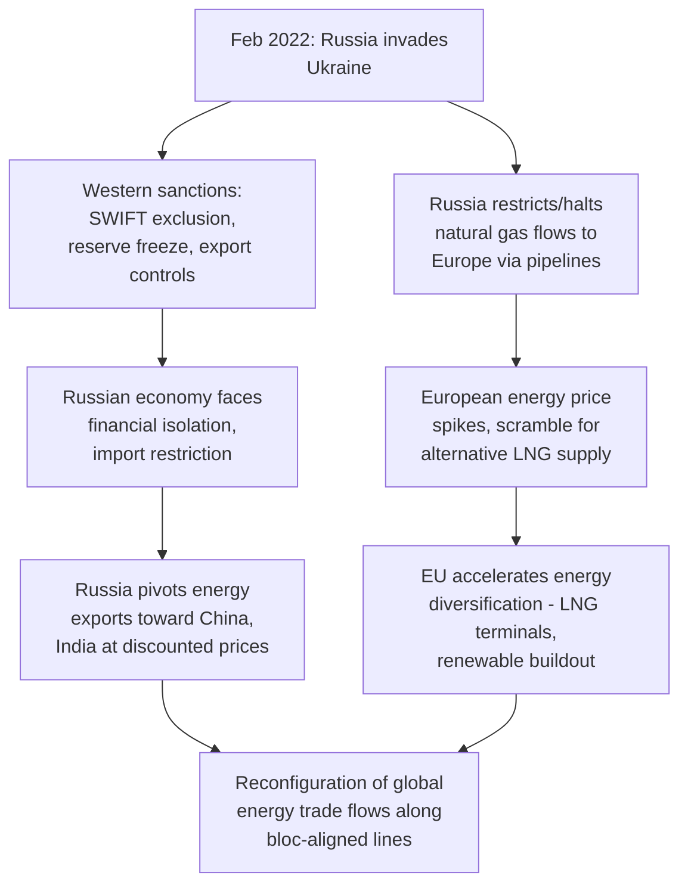

## Russia's Invasion of Ukraine and the Weaponization of Trade

### The Invasion as a Trade-Weaponization Case Study

**Key Points**

- Russia's full-scale invasion of Ukraine, launched February 24, 2022, triggered the most extensive coordinated Western sanctions and export control response directed at a major economy since the Cold War, and is widely treated in supply chain geopolitics literature as the clearest and most consequential demonstration to date of **weaponized economic interdependence** operating in both directions — the West weaponizing financial and trade interdependence against Russia, and Russia weaponizing energy interdependence against Europe
- The episode is distinguished from prior sanctions cases (Iran, North Korea) by the scale of the targeted economy — Russia was, prior to 2022, deeply integrated into global energy markets, financial systems, and commodity trade as a top-tier supplier — making the sanctions response both more consequential globally and more legally and logistically complex than sanctions regimes targeting smaller, less globally integrated economies

### Financial Weaponization: SWIFT Exclusion and Reserve Freezing

**Key Points**

- Major Western governments coordinated to exclude a substantial number of Russian banks from **SWIFT** (the Society for Worldwide Interbank Financial Telecommunication, the dominant global messaging system for cross-border interbank payment instructions), significantly complicating Russian banks' ability to conduct international financial transactions, though SWIFT exclusion was not applied universally to all Russian banks (notably, some banks involved in energy payment processing initially retained access, reflecting European reliance on continued Russian energy imports in the near term)
- The US, EU, UK, and allied governments froze an estimated approximately $300 billion of Russian central bank foreign exchange reserves held in Western jurisdictions, an action widely regarded as historically unprecedented in scale against a G20 economy's sovereign reserves [Unverified — the precise dollar figure has been cited with some variation across sources and has evolved as additional assets were identified and frozen over time]
- This reserve freeze subsequently became the subject of extended policy debate regarding whether frozen assets (or profits generated from them) could be legally transferred to support Ukraine, with the **G7's 2024 agreement to provide Ukraine loans backed by profits generated from frozen Russian assets** representing a notable, legally novel development in this area [Unverified — the precise legal mechanism and evolving details of this arrangement should be verified against current reporting given the complexity and ongoing evolution of the policy]

### Energy Weaponization: The Reverse Vector

- In response to Western sanctions, Russia significantly curtailed natural gas flows to Europe through major pipeline infrastructure (including the Nord Stream system, portions of which were subsequently damaged in September 2022 sabotage incidents whose responsible party remains formally unattributed in most official accounts) [Unverified — attribution for the Nord Stream pipeline sabotage remains contested and formally unresolved as of the available reporting, with various investigations and allegations pointing in different directions]
- This energy supply disruption drove a severe European energy price crisis through 2022, forcing a rapid European scramble to diversify natural gas supply, principally through increased liquefied natural gas (LNG) imports (notably from the United States and Qatar) and accelerated investment in renewable energy and LNG import infrastructure
- This dynamic illustrates the **reverse-direction weaponization** dimension of the conflict: while Western sanctions targeted Russian financial and technology access, Russia simultaneously leveraged Europe's pre-existing energy import dependency as a countervailing coercive instrument, directly exemplifying the "weaponized interdependence" framework's core insight that network dependencies can be leveraged by whichever party controls the critical node — in this case, Russia's position as a dominant gas supplier rather than the West's position as dominant in the global financial system

### Export Controls and Technology Denial

**Key Points**

- The US and allied governments imposed extensive export controls on Russia covering semiconductors, advanced electronics, and dual-use technology with potential military application, employing mechanisms including expanded Entity List designations and application of the **Foreign Direct Product Rule** to restrict not only direct US exports but foreign-made goods incorporating US-origin technology from reaching Russia
- These controls are widely credited (alongside battlefield attrition) with contributing to reported Russian military equipment shortages of certain electronic components, with numerous reports documenting Russian forces and weapons systems using Western-origin semiconductors sourced through third-country intermediaries and gray-market channels, illustrating the persistent enforcement and evasion challenge inherent to export control regimes — directly continuous with the enforcement vulnerabilities illustrated historically by the Toshiba-Kongsberg incident
- [Inference] The Russia case has become a significant real-world stress test of contemporary export control enforcement capacity, particularly regarding **transshipment through third countries** (goods routed through intermediary states not party to the sanctions regime) as an evasion channel, prompting expanded Western diplomatic and enforcement pressure on countries identified as significant transshipment points

### Commodity Market Disruption: Grain, Fertilizer, and Food Security

**Key Points**

- Russia and Ukraine together historically accounted for a substantial share of global wheat, corn, sunflower oil, and fertilizer exports prior to the invasion, and the conflict's disruption of Ukrainian Black Sea port access created significant global food security concern, particularly for import-dependent economies in the Middle East, North Africa, and parts of Asia
- The **Black Sea Grain Initiative**, brokered by Turkey and the UN in July 2022, established a mechanism for continued Ukrainian grain exports via the Black Sea under safe-passage arrangements, though Russia suspended its participation in July 2023, and the durability and effectiveness of subsequent arrangements has continued to evolve [Unverified — the precise current operational status of Black Sea grain export arrangements should be verified against current reporting given the fluidity of the situation]
- This episode is widely cited in supply chain geopolitics literature as extending the "weaponization" framework beyond financial and technology domains into **agricultural commodity and food security** terrain, illustrating that conflict-driven disruption of a small number of geographically concentrated commodity exporters can generate significant global humanitarian and economic effects far beyond the immediate conflict zone

### Reconfiguration of Global Trade Flows

**Key Points**

- The sanctions and countersanctions dynamic accelerated a broader reconfiguration of global trade patterns along geopolitical alignment lines — Russia substantially increased energy and commodity exports to China and India (often at discounted prices reflecting reduced access to traditional Western buyers), while Europe accelerated diversification of energy imports away from Russia toward alternative suppliers
- [Inference] This reconfiguration is frequently cited by IMF and academic researchers studying geoeconomic fragmentation as empirical evidence supporting the broader "bloc formation" thesis — trade and investment flows increasingly correlating with geopolitical alignment rather than pure cost/distance optimization — with the Russia case functioning as a particularly stark and rapid illustration of the phenomenon given the scale and speed of the trade reconfiguration involved

### Broader Lessons for Supply Chain Geopolitics

**Key Points**

- The conflict substantially elevated European and allied policy attention to **energy security** as a distinct but related dimension of the broader supply chain security agenda, reinforcing pre-existing concern (from COVID-19 and the semiconductor shortage) about single-source and single-supplier dependency across sectors beyond manufacturing narrowly defined
- The episode is frequently invoked as reinforcing the "weaponized interdependence" and critical minerals/chokepoint frameworks central to contemporary supply chain geopolitics discourse, providing a large-scale, real-time case study of both offensive (sanctions, export controls, reserve freezing) and defensive/retaliatory (energy supply curtailment) applications of trade weaponization occurring simultaneously between major economic powers
- [Inference] Some analysts draw a direct connective link between the Russia case and heightened Western concern regarding potential future scenarios involving China and Taiwan, on the reasoning that a comparable large-scale sanctions and export control response against a far more globally integrated and larger economy (China) would carry substantially greater global economic disruption risk — this parallel is frequently invoked in policy commentary but represents an analytical inference and scenario-planning exercise rather than a demonstrated historical precedent, since no comparable action against China has occurred

### Related Topics / Next Steps

- **SWIFT, Correspondent Banking, and the Mechanics of Financial Sanctions**
- **The Frozen Russian Reserves Debate and G7 Asset-Backed Loan Mechanisms**
- **European Energy Diversification and the LNG Infrastructure Buildout Post-2022**
- **Export Control Evasion via Transshipment: Enforcement Challenges**
- **The Black Sea Grain Initiative and Global Food Security**
- **Comparing Russia Sanctions to a Hypothetical China-Taiwan Sanctions Scenario**
- **Weaponized Interdependence Theory Applied: Financial vs. Energy Vectors**