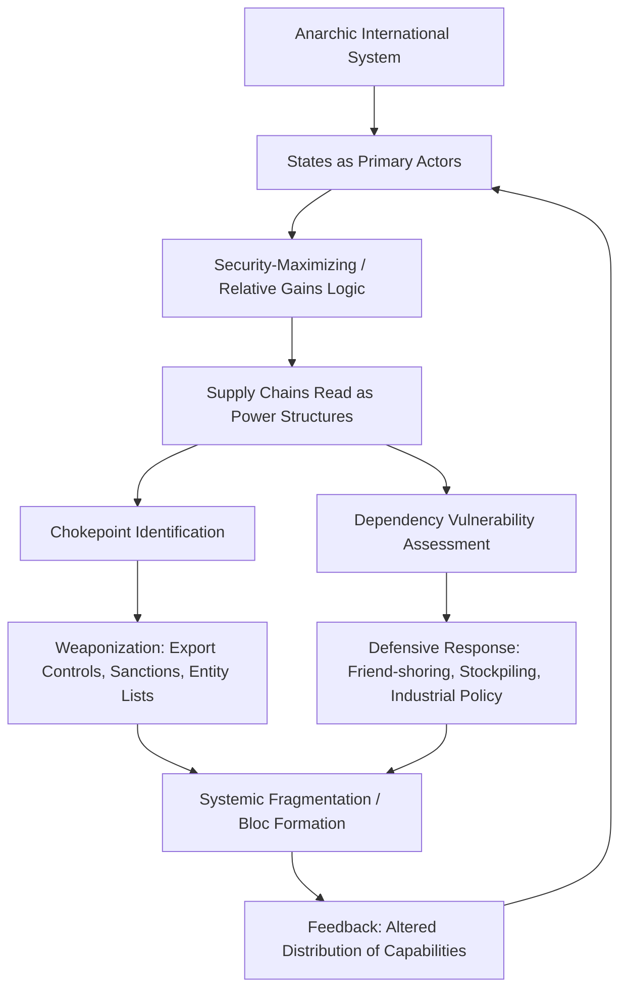

## Realism and the Primacy of State Power in Trade Relations

### Overview

Realism is the theoretical tradition in international relations (IR) that treats states as the principal actors in the global system, operating under conditions of anarchy — the absence of a central authority above the state capable of enforcing rules or guaranteeing security. When applied to supply chain geopolitics, realism reframes trade and production networks not as neutral, efficiency-maximizing arrangements but as extensions of state power, vulnerable to coercion, and instrumentalized in the pursuit of relative gains, security, and survival.

Where liberal and institutionalist frameworks tend to view supply chains through the lens of mutual gains from specialization (absolute gains), realism insists that states evaluate economic relationships by asking: **who gains more relative to whom**, and **does this dependency create exploitable leverage**. This single reframing — from absolute gains to relative gains and vulnerability — is the analytical core that realist scholars and policymakers apply to globalized production.

### Core Theoretical Premises

**Anarchy and Self-Help**

Realism assumes there is no supranational enforcer of contracts, property rights, or trade agreements that cannot ultimately be overridden by a sufficiently powerful or determined state. The WTO, bilateral trade treaties, and investment agreements function only insofar as states find it in their interest to comply. Under conditions of anarchy, states must engage in self-help: they cannot outsource their security or economic survival to institutions or to the goodwill of trading partners.

**Relative Gains over Absolute Gains**

Classical liberal trade theory (Ricardian comparative advantage) asks whether both parties benefit from an exchange. Realism asks whether the *distribution* of benefits shifts the balance of power. A state may reject a mutually profitable trade or investment arrangement if it disproportionately strengthens a rival's economic or military capacity — even if the state itself would be better off in absolute terms than under autarky.

**Security Externalities of Economic Exchange**

Realists (following the security-externality tradition associated with scholars like Jonathan Kirshner and, earlier, Robert Gilpin) argue that economic transactions are never purely economic when they touch on capabilities convertible into military or strategic power — semiconductors, energy, rare earth elements, shipping lanes, dual-use technologies. Trade in these goods generates security externalities that states must internalize even at an efficiency cost.

**Power as the Unit of Analysis**

Where neoliberal institutionalists analyze supply chains through transaction costs, efficiency, and regime theory, realists analyze them through the distribution of capabilities: who controls chokepoints, who has substitutes, who can weaponize interdependence, and who is structurally dependent without recourse.

### Key Realist Sub-Schools and Their Application to Trade

**Classical Realism (Morgenthau, Carr)**

Emphasizes the innate drive of states (and the statesmen who lead them) to maximize power. Trade policy is read as an instrument of statecraft, not a separate technocratic domain. E.H. Carr's critique of interwar economic liberalism — that "free trade" doctrines often served the interests of the dominant power (Britain) — is directly analogous to contemporary critiques of a US-centered trade order.

**Structural (Neo)Realism (Waltz)**

Focuses on the distribution of capabilities across the international system (unipolar, bipolar, multipolar) rather than the internal character of states. Applied to supply chains, structural realism explains why a shift from a unipolar (post-Cold War, US-centered) to a bipolar or multipolar system (US-China competition, EU strategic autonomy, Global South hedging) produces systemic pressure toward "decoupling," "de-risking," and regionalized supply architectures — this is a structural response to changing polarity, not merely a policy preference of individual leaders.

**Offensive Realism (Mearsheimer)**

Argues great powers seek not just security but regional or global hegemony, because in an anarchic system the safest position is the most powerful one. Applied to trade: great powers will seek to prevent rivals from achieving supply chain self-sufficiency in strategic sectors, and will seek to maximize their own share of control over critical nodes (e.g., US export controls on advanced semiconductor manufacturing equipment to China; China's rare-earth export licensing regime).

**Economic Nationalism / Mercantilism (a realist-adjacent tradition, Gilpin, List)**

Directly theorizes trade policy as a tool of national power-building. Friedrich List's 19th-century infant-industry argument and contemporary industrial policy (CHIPS Act, EU Critical Raw Materials Act) reflect the mercantilist strand within realist political economy: the state actively shapes comparative advantage rather than accepting market-given endowments.

**Hegemonic Stability Theory (Kindleberger, Gilpin)**

A realist-institutionalist hybrid holding that open, liberal international trade orders require a dominant hegemon willing and able to provide public goods (reserve currency, security guarantees, open sea lanes, crisis lender of last resort). Its logic predicts that hegemonic decline — real or perceived US relative decline — produces fragmentation of the liberal trade order, regional blocs, and increased use of economic coercion, precisely the pattern observed in the shift from WTO-centered multilateralism to "friend-shoring" and minilateral arrangements (CHIP4, IPEF, Trans-Atlantic Trade and Technology Council).

### The Realist Reading of Interdependence: Weaponized Interdependence

A significant contemporary contribution — Farrell and Newman's concept of "weaponized interdependence" — extends realist logic to networked supply chains specifically. Their argument, though not classical realism, is realist in spirit:

- Global economic networks (financial messaging like SWIFT, semiconductor fabrication, cloud infrastructure, standard-setting bodies) have **hub-and-spoke topologies** rather than flat, symmetric structures.
- States that control critical hubs or "chokepoints" can exploit two mechanisms:
  - **Panopticon effect**: the ability to surveil information/transactions flowing through a controlled node.
  - **Chokepoint effect**: the ability to cut off or restrict access for adversaries.
- This reframes "interdependence" — traditionally seen by liberals as pacifying, since mutual dependence raises the cost of conflict (per Keohane and Nye's *complex interdependence*) — as itself a vector of coercion when dependence is asymmetric.

This is the theoretical foundation for understanding events such as:

- US Entity List restrictions and the Foreign Direct Product Rule extending US jurisdiction over semiconductor equipment made with US-origin technology anywhere in the world.
- Chinese export controls on gallium, germanium, and rare-earth processing.
- SWIFT exclusion of Russian banks following the 2022 invasion of Ukraine.

### Distinguishing Realism from Competing Frameworks

| Framework | Primary Unit of Analysis | View of Supply Chains | Predicted State Behavior |
| --- | --- | --- | --- |
| Realism | State power/capabilities | Extensions of state power; sites of vulnerability and leverage | Diversify away from dependency; weaponize chokepoints; prioritize relative gains |
| Liberal Institutionalism | Institutions, regimes, firms | Efficiency-maximizing, mutually beneficial | Deepen interdependence; strengthen rules-based institutions (WTO, investment treaties) |
| Marxist/World-Systems | Class, core-periphery structure | Instruments of capital accumulation and exploitation | Structural extraction from periphery to core regardless of state intent |
| Constructivism | Norms, identity, ideas | Shaped by shared understandings of legitimacy/threat | Behavior shifts as norms around "acceptable" economic coercion shift |

Realism is distinguished by its rejection of the liberal assumption that economic integration is self-reinforcing or peace-inducing by default; instead, integration creates *dependency structures* that a rational, security-maximizing state will eventually seek to manage or exit if the dependency is asymmetric.

### Empirical Illustrations

**Case: US-China Semiconductor Decoupling**

The 2022 and subsequent expansions of US export controls on advanced logic chips, EUV lithography-adjacent technology, and high-bandwidth memory can be read through a realist lens as an attempt to preserve a relative power gap in a dual-use technology sector, even at direct cost to US firms' revenue (absolute economic loss accepted for relative strategic gain).

**Case: European Gas Dependency on Russia (pre-2022)**

Germany's Nord Stream pipeline strategy is frequently cited in realist critiques (echoing earlier warnings, e.g., from Cold War-era strategists) as a case of a state pursuing economic efficiency (cheap piped gas) while underweighting the security externality of dependence on a potential adversary — a textbook realist "trap" that liberal institutionalist assumptions about interdependence-as-pacifier failed to anticipate.

**Case: China's Rare Earth Export Licensing**

[Inference] China's 2010 rare-earth export restrictions against Japan (following a maritime dispute) and subsequent 2023-2025 licensing controls on gallium, germanium, and rare-earth magnets are widely interpreted by analysts as demonstrations of chokepoint leverage consistent with weaponized interdependence theory, though the Chinese government's official framing emphasizes environmental and domestic industrial policy rationale rather than explicit geopolitical coercion.

### Analytical Framework Diagram

### Critiques of the Realist Framework

**Underspecification of Domestic Politics**

Realism's state-centric unitary actor assumption struggles to explain why firms, sub-national governments, and domestic interest groups often resist or reshape supposedly "national" trade-security strategies (e.g., US semiconductor firms lobbying against export controls that reduce their China revenue).

**Difficulty Explaining Cooperation**

Persistent multilateral cooperation (WTO dispute settlement usage even amid great-power tension, continued FDI flows into geopolitically contested regions) is harder for pure realism to explain without incorporating institutionalist or constructivist supplements.

**Overprediction of Conflict**

[Inference] Critics argue realism's emphasis on relative gains and coercion can overpredict fragmentation and underweight the durable, path-dependent nature of specialized production networks (e.g., the difficulty of fully "decoupling" from Chinese manufacturing capacity given decades of accumulated infrastructure and know-how), since actual state behavior often reflects a hedged mix of continued engagement and selective restriction rather than wholesale exit.

**Endogeneity of Power to Markets**

Some scholars argue realism treats "state power" as exogenous to markets, when in practice a state's capacity to weaponize supply chains is itself produced by prior market-driven concentration (e.g., Taiwan's semiconductor dominance emerged from decades of market competition, not state fiat) — a critique associated with more Gramscian and world-systems accounts.

### Practical Application: How Analysts Use This Framework

**Key Points**

- Map chokepoints: identify which nodes in a given supply chain have few substitutes and concentrated control (geographic, corporate, technological).
- Assess asymmetry of dependency: which party has more to lose from disruption, and does the dependent party have viable diversification pathways within a realistic time horizon.
- Distinguish "high politics" goods (dual-use, military-relevant, foundational technologies) from "low politics" goods (consumer goods with abundant substitutes) — realism predicts states intervene disproportionately in the former.
- Track relative-gains framing in official rhetoric and policy documents (national security strategies, export control justifications, industrial policy white papers) as a signal of realist logic operating in practice.

**Example**

An analyst using this framework to assess a proposed cross-border investment (e.g., a foreign state-linked firm acquiring a domestic advanced-battery manufacturer) would ask: Does this transaction transfer capabilities with security externalities? Does it increase the acquiring state's relative capability more than it benefits the target state? Would rejection or approval shift the long-run distribution of power in a strategically salient sector? This is the operational logic behind CFIUS (Committee on Foreign Investment in the United States) reviews and equivalent European FDI-screening mechanisms.

**Next Steps**

- **Related Topics**: Liberal institutionalism and interdependence theory in trade; weaponized interdependence (Farrell & Newman) in depth; hegemonic stability theory and the liberal international order's decline; mercantilism and economic nationalism as policy traditions; the security-economy nexus in dual-use technology controls; constructivist critiques of realist trade analysis; Marxist/world-systems theory applied to global value chains; game-theoretic models of trade coercion and retaliation; case study — US-China technology decoupling as an empirical test of offensive realism; case study — European strategic autonomy as a hedging strategy under structural realism.