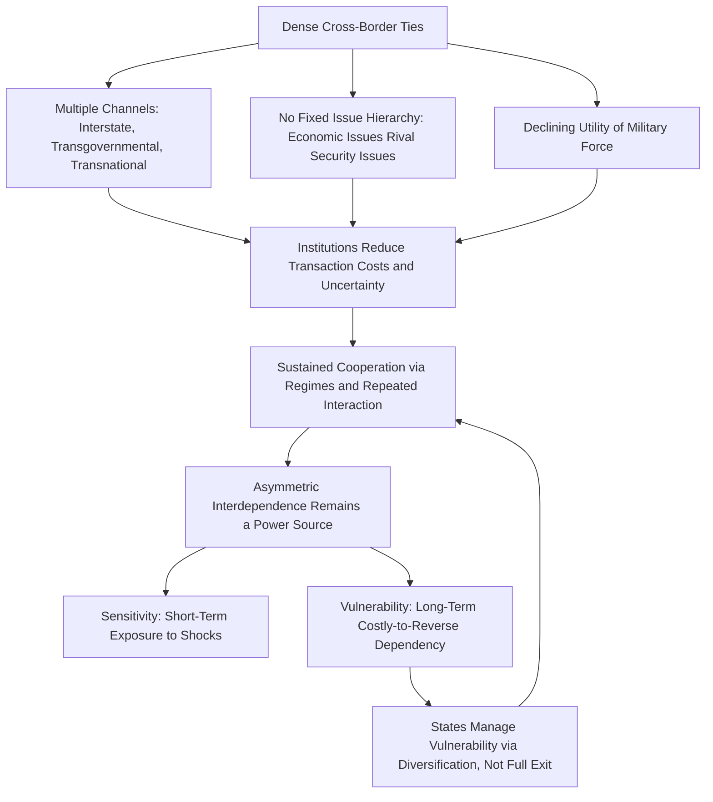

## Liberal Institutionalism and the Theory of Complex Interdependence

### Overview

Liberal institutionalism is the theoretical tradition in international relations holding that international institutions, regimes, and dense patterns of cross-border interdependence can mitigate the effects of anarchy, enable durable cooperation among self-interested states, and generate mutual gains that make conflict increasingly costly and irrational. Applied to supply chain geopolitics, liberal institutionalism provides the primary theoretical counterweight to realism: where realism reads globalized production networks as sites of vulnerability and coercive leverage, liberal institutionalism reads them as mechanisms that bind states together, raise the cost of disruption for all parties, and create incentives for rule-based cooperation rather than unilateral coercion.

The centerpiece of this tradition applied specifically to economic and security relations is Robert Keohane and Joseph Nye's **theory of complex interdependence**, first articulated systematically in *Power and Interdependence* (1977). It remains the foundational liberal framework for analyzing how deep economic entanglement — of the kind produced by globalized supply chains — reshapes state behavior relative to the realist baseline.

### Core Theoretical Premises

**Institutions as Mitigators of Anarchy**

Liberal institutionalism does not deny that the international system is anarchic (it shares this starting assumption with realism), but it argues anarchy's effects can be substantially moderated by institutions: formal organizations (WTO, IMF, World Bank), legal regimes (trade agreements, investment treaties, dispute settlement mechanisms), and informal norms and repeated interactions. Institutions reduce transaction costs, increase transparency, provide information that reduces uncertainty about others' intentions, and create mechanisms for enforcing reciprocity.

**Absolute Gains over Relative Gains**

Where realists ask "who gains more," liberal institutionalists (following the rationalist tradition associated with Keohane's *After Hegemony*) argue states are primarily concerned with whether they themselves are better off in absolute terms, not whether a trading partner gains proportionally more. This makes cooperative, positive-sum arrangements sustainable even under significant power asymmetry, provided the weaker party still gains in absolute terms.

**Iteration and the Shadow of the Future**

Drawing on game-theoretic reasoning (repeated Prisoner's Dilemma logic), liberal institutionalists argue that when states expect to interact repeatedly over an indefinite time horizon, the "shadow of the future" incentivizes cooperation and reciprocity over short-term defection, since reputational costs and retaliation in future rounds outweigh one-time gains from cheating.

**Regime Theory**

International regimes — defined by Stephen Krasner as sets of implicit or explicit principles, norms, rules, and decision-making procedures around which actor expectations converge in a given issue area — allow states to coordinate behavior even without a central enforcer, by creating focal points, monitoring mechanisms, and graduated sanctions for defection.

### Complex Interdependence: The Core Framework

Keohane and Nye developed complex interdependence as an explicit alternative to the realist model of world politics, built around three defining characteristics that stand in direct contrast to realist assumptions:

**1. Multiple Channels of Contact**

Realism assumes states interact primarily through a single channel: formal interstate diplomacy and, at the limit, military force. Complex interdependence posits multiple channels connecting societies: interstate (government-to-government), transgovernmental (agency-to-agency, e.g., central bank cooperation, regulatory bodies), and transnational (firm-to-firm, NGO-to-NGO, individual-to-individual). Global supply chains are a paradigm case of transnational and transgovernmental channels operating alongside, and sometimes independently of, formal state diplomacy — multinational firms coordinate production, logistics, and standards-setting through channels realism's state-centric model does not fully capture.

**2. Absence of Hierarchy Among Issues**

Realism assumes military security is always the "high politics" issue that dominates the agenda, with economic and other matters subordinated as "low politics." Complex interdependence argues that in a densely interconnected world, this hierarchy breaks down: economic, environmental, and technological issues can rival or exceed traditional security concerns in salience. Contemporary supply chain geopolitics — where semiconductor export controls or rare-earth licensing decisions dominate national security strategy documents — is frequently cited as vindicating this claim: what was once purely "economic" (chip manufacturing) has become inseparable from "high politics."

**3. Minor Role of Military Force**

Among actors bound by complex interdependence, military force becomes a less usable and less relevant policy instrument for resolving disputes, since the parties are economically enmeshed and use of force would be self-damaging (destroying the very economic relationship generating mutual value). States instead rely on economic statecraft, negotiation, linkage strategies, and institutional bargaining.

### Asymmetric Interdependence as a Source of Power

Critically, Keohane and Nye did not argue that interdependence eliminates power politics — they argued it changes its *form*. Their concept of **asymmetric interdependence** holds that power derives not from interdependence itself but from its *asymmetry*: the less dependent actor in a relationship has a bargaining advantage over the more dependent one. This is analyzed through two dimensions:

- **Sensitivity**: how quickly and costly it is for a state to be affected by changes originating elsewhere in the system before policy adjustments are made (e.g., how fast a chip shortage abroad raises domestic prices).
- **Vulnerability**: how costly it remains for a state to adjust to those changes even after implementing alternative policies (e.g., whether a state can actually build alternative semiconductor fabrication capacity, and at what cost and time horizon).

This sensitivity/vulnerability distinction is the direct conceptual ancestor of contemporary "de-risking" and "friend-shoring" strategies: a state seeks to reduce its *vulnerability* (structural, hard-to-reverse dependency) even if it accepts continued *sensitivity* (short-term exposure to price or supply shocks) because vulnerability, not sensitivity, is what converts economic interdependence into exploitable political leverage — a point of convergence between liberal and realist analysis, since Keohane and Nye's own framework already anticipates the "weaponization" logic that later realist-adjacent scholars (Farrell and Newman) would formalize.

### Distinguishing Liberal Institutionalism from Other Frameworks

| Framework | Primary Unit of Analysis | View of Supply Chains | Predicted State Behavior |
| --- | --- | --- | --- |
| Liberal Institutionalism | Institutions, regimes, transnational actors | Mechanisms of mutual gain that bind states and raise costs of conflict | Deepen institutionalized cooperation; use regimes to manage disputes; pursue absolute gains |
| Realism | State power/capabilities | Extensions of state power; sites of vulnerability and leverage | Diversify from dependency; weaponize chokepoints; prioritize relative gains |
| Marxist/World-Systems | Class, core-periphery structure | Instruments of capital accumulation and exploitation | Structural extraction regardless of institutional design |
| Constructivism | Norms, identity, ideas | Shaped by shared understandings of legitimacy | Behavior shifts as norms around cooperation/coercion evolve |

Liberal institutionalism differs from naive economic liberalism (pure market-based interdependence-as-pacifier arguments, associated with Norman Angell's pre-WWI *The Great Illusion*) by explicitly retaining a role for institutions and strategic calculation, rather than assuming economic ties alone prevent conflict.

### Institutional Architecture Relevant to Supply Chains

**Formal Multilateral Institutions**

- **World Trade Organization (WTO)**: Dispute Settlement Understanding (DSU), most-favored-nation (MFN) principle, national treatment, and binding tariff schedules reduce uncertainty and provide adjudication mechanisms for supply-chain-relevant disputes (subsidies, dumping, safeguard measures).
- **World Customs Organization (WCO)**: Harmonized System (HS) codes standardizing product classification across borders, reducing transaction costs in cross-border logistics.
- **International Maritime Organization (IMO)**: Regulatory regime governing shipping, a critical supply chain backbone.

**Plurilateral and Regional Regimes**

- Regional trade agreements (USMCA, RCEP, CPTPP) functioning as "regimes" that lock in rules-of-origin, tariff schedules, and dispute mechanisms among subsets of states, consistent with liberal institutionalist predictions that cooperation deepens incrementally even absent full multilateral consensus.

**Transgovernmental and Standard-Setting Bodies**

- Bodies such as the International Organization for Standardization (ISO), Basel Committee on Banking Supervision, and Financial Action Task Force (FATF) exemplify Keohane and Nye's "transgovernmental" channel: technical regulators cooperating directly, often below the radar of high-level diplomacy, to harmonize standards that make supply chains function (product safety, financial clearing, anti-money-laundering compliance).

### Analytical Framework Diagram

### Empirical Illustrations

**Case: WTO Dispute Settlement Persistence Amid Great-Power Tension**

[Inference] Despite the US-China trade conflict since 2018 and the effective paralysis of the WTO Appellate Body (due to sustained US blocking of judicial appointments beginning under the Obama administration and continuing thereafter), states have largely continued filing disputes and using WTO panels for initial rulings, suggesting institutional path dependency and continued perceived value in rules-based adjudication even amid strategic rivalry — a pattern more consistent with liberal institutionalist predictions of institutional "stickiness" than with a purely realist expectation of institutional abandonment.

**Case: Semiconductor Supply Chains and Transgovernmental Coordination**

The US-EU Trade and Technology Council (TTC) and the "Chip 4" alliance (US, Japan, South Korea, Taiwan) illustrate transgovernmental coordination among like-minded states to harmonize export control policy and coordinate investment — a liberal institutionalist mechanism (regime-building among aligned states) being used to pursue what is substantively a realist objective (containing a rival's capabilities), demonstrating that the two frameworks are not always mutually exclusive in practice.

**Case: Just-in-Time Logistics and Institutional Standardization**

The global efficiency of container shipping and just-in-time inventory systems depends on institutionalized standardization (ISO container dimensions, WCO customs harmonization, IMO shipping regulations) that would be impossible to sustain through purely bilateral, ad hoc state-to-state bargaining — a direct illustration of how institutions lower transaction costs at a scale realism's state-centric bargaining model does not naturally explain.

### Critiques of the Liberal Institutionalist Framework

**Underestimates Coercive Potential of Asymmetric Dependence**

Realist and weaponized-interdependence critiques argue that liberal institutionalism, in its optimistic strands, underweights how readily asymmetric interdependence converts into coercive leverage — the 2010 China-Japan rare-earth dispute and 2022 Russian gas cutoffs to Europe are cited as cases where deep economic integration did not prevent, and arguably enabled, coercive economic statecraft.

**Institutions as Products of Power, Not Independent Constraints**

Realists argue institutions largely reflect the interests of the states (especially the hegemon) that created them, and persist only as long as they serve dominant-state interests — a critique that questions whether institutions independently constrain state behavior or merely codify existing power relationships (a debate directly engaging hegemonic stability theory).

**Difficulty Explaining Rapid Institutional Breakdown**

[Inference] The speed and scope of WTO Appellate Body paralysis, the proliferation of unilateral export controls outside WTO review, and the rise of "minilateral" (small-group, exclusionary) arrangements since roughly 2018 are seen by some scholars as challenging liberal institutionalist predictions of institutional resilience, though institutionalists respond that this reflects institutional adaptation (shift to minilateralism) rather than institutional failure per se.

**Normative Bias Toward Liberal Order Preservation**

Critics from constructivist and critical IR traditions argue liberal institutionalism implicitly treats the existing US-led liberal international economic order as a natural or optimal baseline, which can obscure how that order was itself constructed to favor particular (Western, developed-economy) interests — a critique resonant with world-systems and dependency theory perspectives on global value chains.

### Practical Application: How Analysts Use This Framework

**Key Points**

- Assess institutional density in a given supply chain relationship: how many overlapping regimes, agreements, and monitoring mechanisms govern it, and how much reputational or legal cost would a disruption incur.
- Distinguish sensitivity interdependence (short-term price/supply shocks) from vulnerability interdependence (structural, hard-to-reverse dependency) when evaluating a state's true exposure.
- Track "regime complexity" — the overlapping, sometimes competing set of institutions governing a single issue area (e.g., trade law, investment law, and sector-specific export control regimes simultaneously governing semiconductor trade) as a variable shaping which venue a state chooses for dispute resolution.
- Identify transgovernmental and transnational channels (regulator-to-regulator, firm-to-firm) that may drive supply chain outcomes independent of, or ahead of, formal head-of-state diplomacy.

**Example**

An analyst assessing the durability of a regional semiconductor supply arrangement (e.g., US-Japan-South Korea-Taiwan coordination) would ask: What institutional mechanisms exist beyond informal political alignment (formal agreements, standing working groups, information-sharing protocols)? Is dependency symmetric or asymmetric among the parties, and along which dimension (sensitivity vs. vulnerability)? Does repeated interaction and reputational concern create a credible expectation of continued cooperation even through leadership transitions in member states? This is the operational logic behind assessing whether "friend-shoring" arrangements will prove durable institutions or merely temporary alignments of convenience.

**Next Steps**

- **Related Topics**: Realism and the primacy of state power in trade relations (comparative counterpart); Keohane's *After Hegemony* and regime theory in depth; hegemonic stability theory and institutional persistence after hegemonic decline; the WTO Appellate Body crisis and its implications for rules-based trade governance; weaponized interdependence as a synthesis of realist and network-structural analysis; sensitivity versus vulnerability as an analytical tool for supply chain risk assessment; minilateralism and regime complexity in contemporary trade governance; transgovernmental regulatory networks (Basel Committee, FATF, ISO) as supply chain infrastructure; constructivist critiques of liberal institutionalism's normative assumptions; case study — Trade and Technology Council and Chip 4 as hybrid liberal-realist institution-building.